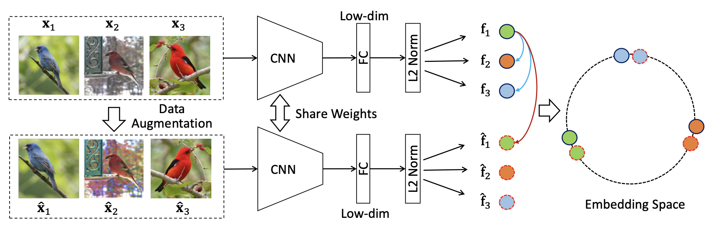
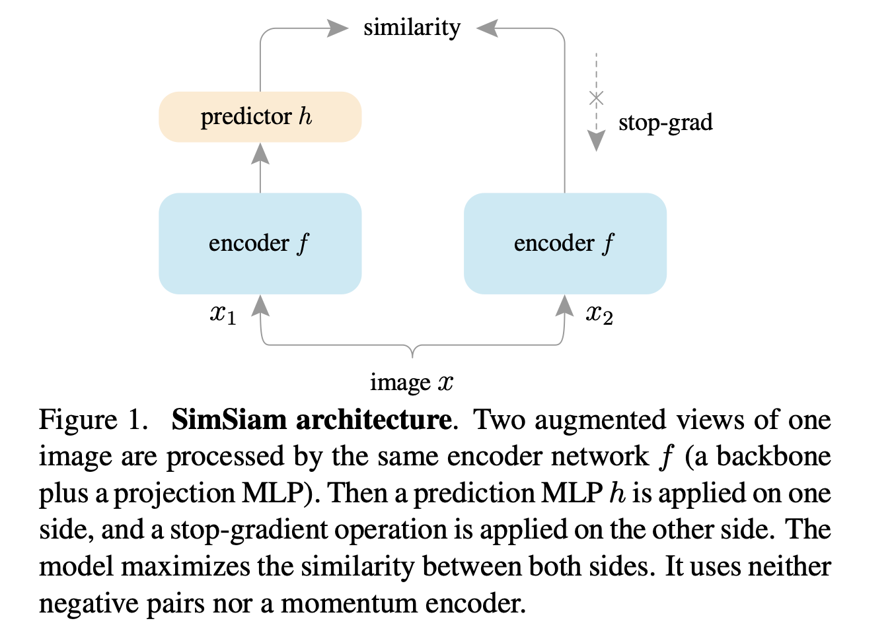
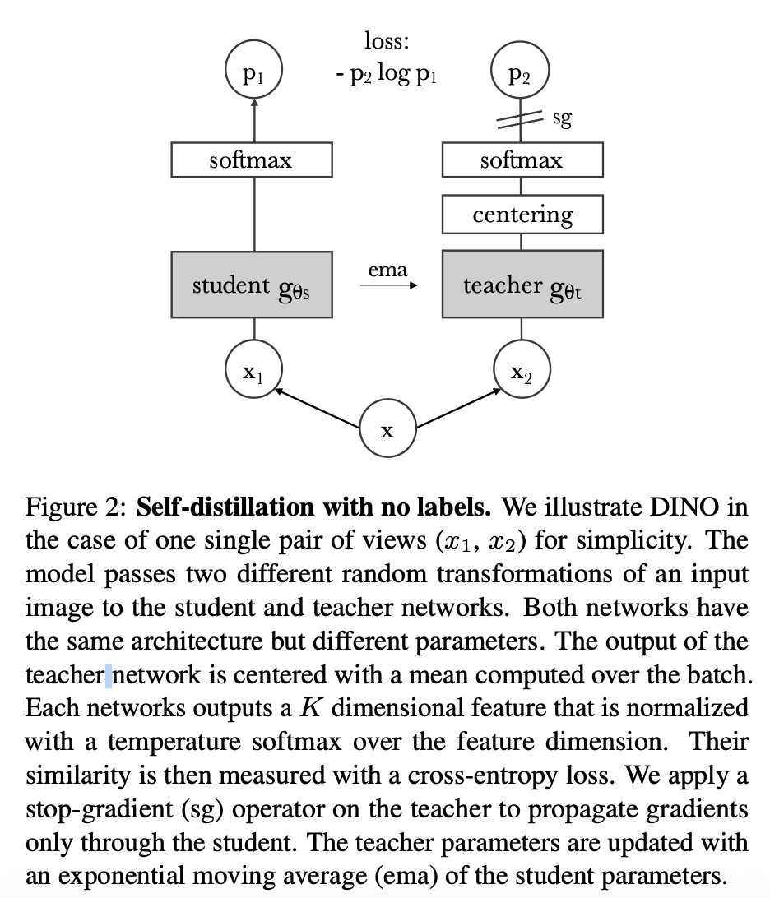

 

# 对比学习在计算机视觉领域的发展

## 百花齐放阶段

### Inst Disc

Unsupervised Feature Learning via Non-Parametric Instance Discrimination

- 任务
  - 提出了个体判别任务
  - 把每张图片看作一个类别，目标是学一个特征，从而能把每个图片都区分开
- 方法
  - 总结：用一个卷积神经网络，把所有图片编码成特征，希望这些特征在这些特征空间里尽可能的分开
  - 使用对比学习训练卷积神经网络，正样本就是图片本身，负样本就是数据集里其他的图片。所有图片特征存在memory bank中
  - NCE loss

### Inva Spread

Unsupervised Embedding Learning via Invariant and Spreading Instance Feature

- 任务
  - 个体判别
  - 想法：同样的图片经过编码器后特征应该很类似，而不同的图片特征应该不类似，即相似物体特征应该保持不变性，不同物体的特征应该分散开
- 方法
  - 如图，若batch_size为256，即256个图片，那么正样本为增强后的图片-256个，负样本为其余所有图片，有$(256-1)*2$个
  - 使用一个编码器就能进行端到端的训练
  - 正负样本都在同一个mini batch
  - 字典必须足够大，对比学习中负样本最好足够多，所以结果没有那么好，但是可以理解为SimCLR的前身

### CPC

Representation Learning with Contrastive Predictive Coding

- 任务
  - 预测型生成任务
- 方法
  - 之前时刻的输入扔给编码器，返回特征，然后把特征给自回归模型（RNN/LSTM等），每个输出为context representation，代表上下文的特征表示，如果这个特征表示足够好，那么就能做出合理的预测
  - 预测为query，正样本就是输入未来时刻通过编码器得到的特征输出，负样本为任意输入到编码器得到的特征输出

### CMC

Contrastive Multiview Coding

- 方法
  - 一个物体的很多个视角都可以当作正样本，其余图片为负样本
  - 他们之后还做过一个蒸馏的工作：不论用什么网络，只要输入是一张图片，得到的特征就应该尽可能相似，即让teacher模型的输出和student模型的输出尽可能相似，通过这个方式把teacher模型和student模型作为一个正样本对来进行对比学习

## CV双雄

### MoCo

Momentum Contrast for Unsupervised Visual Representation Learning

- 主要贡献
  - 把之前对比学习的方法归纳总结为一个字典查询的问题
  - 队列、动量编码器
    - 队列取代memory bank，存储负样本
    - 动量编码器取代了loss里的约束项，达到动量更新编码器的目的

### SimCLR

A Simple Framework for Contrastive Learning of Visual Representations

- 方法
  - 对每个图片做两个不同的数据增强，同一个图片得到的两个图片就是正样本，mini-batch中剩余的图片为负样本
  - 对样本进行编码f得到特征表示h
  - 重大创新：在h后添加了一个projector（就是一个MLP层，即一个全连接层+一个relu激活函数）
  - normalized temperature-scaled的交叉熵函数来衡量正样本直接是否有最大的一致性
  - 在训练中加了这个projection，但是做下游任务的时候直接用h做

### MoCo v2

Improved Baselines with Momentum Contrastive Learning

- 改进
  - 加了一个MLP层
  - 用了更多的数据增强
  - 训练的时候用了cosine learning rate schedule
  - epoch从200变到了800

### SimCLR v2

Big Self-Supervised Models are Strong Semi-Supervised Learners

主要在讲非常大的自监督训练出来的模型非常适合做半监督学习

- 文章内容
  - 自监督的对比学习得到一个大的模型
  - 用一小部分有标签的数据对其做有监督的微调，得到一个teacher模型
  - 用teacher模型生成很多伪标签，就可以在更多无标签数据上做自学习
- SimCLR v2
  - 换了更大的模型：152层的残差网络、用了selective kernels
  - MLP层变成了两层
  - 使用了动量编码器

### SwAu

Unsupervised Learning of Visual Features by Contrasting Cluster Assignments

给定同样一张图片，如果去生成不同的视角，希望可以从一个视角的特征去预测另外一个视角的特征，因为同一图片不同视角的特征按理应该是比较接近的

- 方法
  - 把对比学习和聚类的方法结合
  - 和聚类的中心比，Q1和Q2互相查询
  - multi-crop：从图片里多crop几个物体，把crop变小点
    - 以前：2x224
    - 现在：2x160+4x96

## 不用负样本

### BYOL

Bootstrap your own latent: A new approach to self-supervised Learning

- 方法
  - 把匹配问题转化为了和预测问题，从一个视角的特征来预测另外一个视角的特征
  - 预测的结果q与z尽可能相似
  - 目标函数-MSE loss
  - 没有用负样本，用自己预测自己的方式学习

### SimSam

Exploring Simple Siamese Representation Learning

- 方法
  - 不用负样本、不用大的batch、不用动量编码器
  - 方法和BYOL类似，也是用一个特征预测另一个特征，然后计算MSE loss，区别是没用动量编码器

## 基于Transformer

### MoCo v3

An Empirical Study of Training Self-Supervised Vision Transformers

- MoCo v2与SimSam结合
- 卷积神经网络换为ViT，但是ViT训练不稳定
  - 解决方法：把patch projection冻住

### DINO

Emerging Properties in Self-Supervised Vision Transformers

- 发现
  - Vision Transformer在自监督训练情况下，把自注意力图拿出来发现它能非常准确的抓住每个物体的轮廓
- 方法
  - 用p1预测p2
  - centering防止模型坍塌

