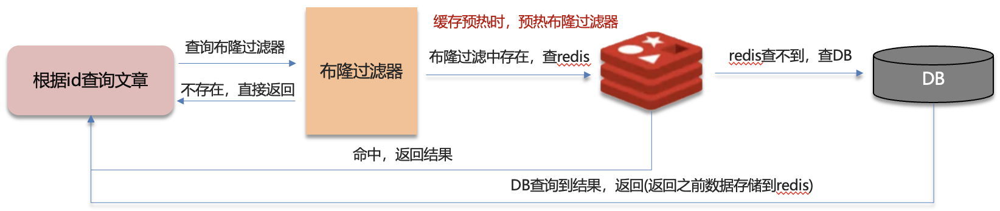
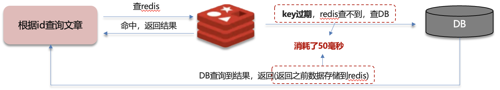
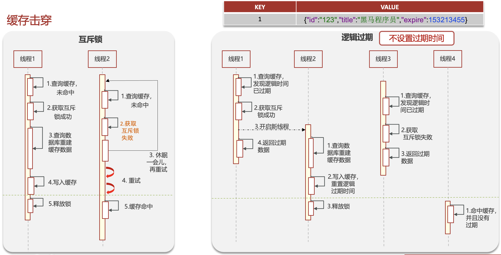

# Redis

## Redis的使用场景

根据自己简历上的业务回答

缓存：穿透、击穿、雪崩、双写一致、持久化、数据过期、淘汰策略

分布式锁：setnx、redisson

消息队列、延迟队列

等

### 缓存

#### 缓存穿透

缓存穿透：查询一个**不存在**的数据，mysql查询不到数据也不会直接写入缓存，就会导致每次请求都查数据库

解决方案：

- 一：缓存空数据，查询返回的数据为空，仍把这个空结果进行缓存
  - 优点：简单
  - 缺点：消耗内存，可能会发生不一致的问题
- 二：布隆过滤器
  - 位图 bitmap：相当于是一个以位bit为单位的数组，数组中每个单元只能存储二进制数0或1
  - 布隆过滤器的作用：可以用于检索一个元素是否在一个集合中
    - 存储数据时：如id为1的数据，通过多个hash函数获取hash值，根据hash计算数组对应位置改为1
    - 查询数据时：使用相同的hash函数获取hash值，判断对应位置是否都为1
    - 误判率：数组越小误判率越大，数组越大误判率越小，但同时带来了更多的内存消耗
  - 实现方案：Redisson和Guava，可以手动设置误判率，一般设置在5%以内

#### 缓存击穿

缓存击穿：给某一个key设置了过期时间，当key过期时，恰好这个时间点对这个key有大量的并发请求过来，这些并发的请求可能会瞬间把DB压垮

解决方案

- 互斥锁
  - 可以保证数据的强一致性，性能较差

- 逻辑过期
  - 可以保证高可用，性能较优，不能保证数据绝对一致

#### 缓存雪崩

缓存雪崩是指同一时段大量的缓存key同时失效或者Redis服务宕机，导致大量请求到达数据库，带来巨大压力

解决方案：

- 给不同的key的TTL添加随机值
- 利用Redis集群提高服务的可用性（如哨兵模式、集群模式）
- 给缓存业务添加降级限流策略（如在nginx或spring cloud gateway中添加策略）（降级可做为系统的保底策略，适用于穿透、击穿、雪崩）
- 给业务添加多级缓存，如Guava或Caffeine做一级缓存，Redis做二级缓存