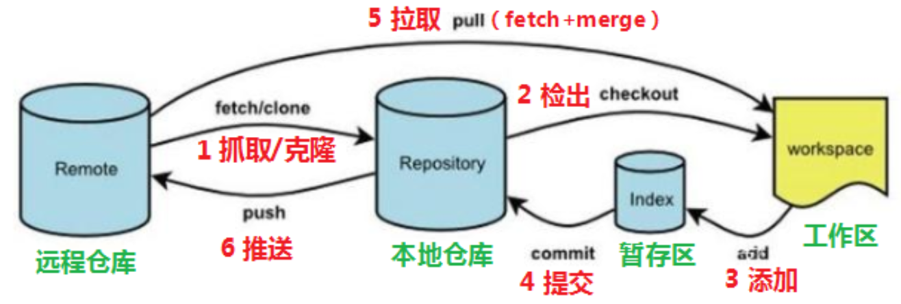
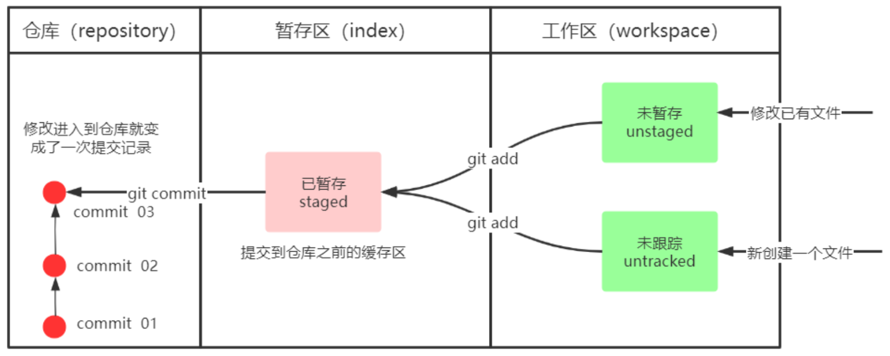
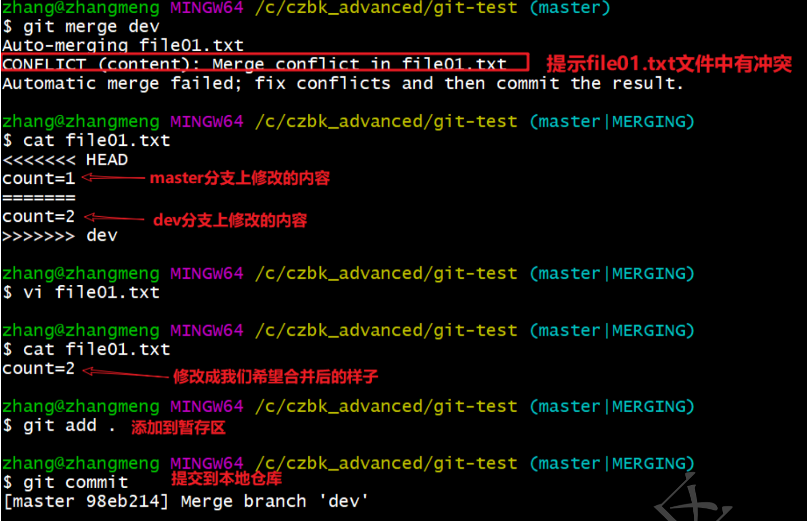
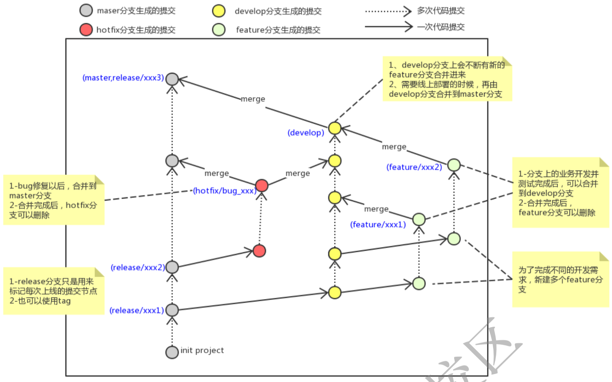

# Git分布式版本控制工具

## 1.概述

开发中的实际场景：

- 备份、代码还原、协同开发、代码追责

版本控制器的方式：

- 集中式版本控制工具
  - 版本库是集中放在中央服务器的，每个人工作时从中央服务器下载代码，必须联网才能工作，局域网或互联网。个人修改后然后提交到中央版本库
  - 如：SVN和CVS
- 分布式版本控制工具
  - 分布式版本控制系统没有中央服务器，每个人的电脑上都是一个完整的版本库，工作时无需联网。多人协作时只需要各自的修改推送给对方，就能互相看到对方的修改
  - 如：Git

Git

- 特点：速度快，简单的设计，对非线性开发模式的强力支持，完全分布式，有能力高效管理类似Linux内核一样的超大规模项目
- 工作流程图
  - clone（克隆）: 从远程仓库中克隆代码到本地仓库
  - checkout （检出）:从本地仓库中检出一个仓库分支然后进行修订
  - add（添加）: 在提交前先将代码提交到暂存区
  - commit（提交）: 提交到本地仓库。本地仓库中保存修改的各个历史版本
  - fetch (抓取) ： 从远程库，抓取到本地仓库，不进行任何的合并动作，一般操作比较少。
  - pull (拉取) ： 从远程库拉到本地库，自动进行合并(merge)，然后放到到工作区，相当于fetch+merge
  - push（推送） : 修改完成后，需要和团队成员共享代码时，将代码推送到远程仓库



## 2.常用命令

### 2.1 基本配置

1. 打开命令行  Git Bash

2. 设置用户信息

   ```bash
   git config --global user.name "xxx"
   git config --global user.email "xxx@xxx.cn"
   ```

3. 查看配置信息

   ```bash
   git config --global user.name 
   git config --global user.email
   ```

4. 为常用指令配置别名

   - `.zshrc`中输入：

   ```bash
   # 用于输出git提交日志
   alias git-log='git log --pretty=oneline --all --graph --abbrev-commit'
   # 用于输出当前目录及所有文件及基本信息
   alias ll='ls -al'
   ```

   - 执行：`source ~/.zshrc`

5. 解决乱码问题，如果不用中文可以不配置（win的配置方法）

   - 打开GitBash执行：

   ```bash
   git config --global core.quotepath false
   ```

   - 在 ${git_home}/etc/bash.bashrc 文件中最后两行加入：

   ```bash
   export LANG="zh_CN.UTF-8"
   export LC_ALL="zh_CN.UTF-8"
   ```

### 2.2 获取本地仓库

要使用GIt对代码进行版本控制，首先要获得本地仓库：

1. 创建一个目录作为本地Git仓库

2. 进入项目中，打开终端

3. 执行 git init

   ```bash
   (base) jingmo@SilenceMacBook-Air git-test % git init
   Initialized empty Git repository in /Users/jingmo/Desktop/projects/ideaProjects/git-test/.git/
   ```

### 2.3 基础操作指令

Git工作目录下对于文件的修改(增加、删除、更新)会存在几个状态，这些修改的状态会随着我们执行Git

的命令而发生变化。



1. git add (工作区 --> 暂存区)
2. git commit (暂存区 --> 本地仓库)

#### 2.3.1 查看修改的状态 status

作用：查看的修改的状态（暂存区、工作区）

命令形式：`git status`

#### 2.3.2 添加工作区到暂存区(add)

作用：添加工作区一个或多个文件的修改到暂存区

命令形式：`git add 单个文件名|通配符`

将所有修改加入暂存区：`git add .`

#### 2.3.3 提交暂存区到本地仓库(commit)

作用：提交暂存区内容到本地仓库的当前分支

命令形式：`git commit -m '注释内容'`

#### 2.3.4 查看提交日志(log)

在2.1中配置的别名 **git**-**log** 就包含了这些参数，所以后续可以直接使用指令 **git**-**log**

作用:查看提交记录

命令形式：`git log [option]`

- options
  - --all 显示所有分支
  - --pretty=oneline 将提交信息显示为一行
  - --abbrev-commit 使得输出的commitId更简短
  - --graph 以图的形式显示

#### 2.3.5 版本回退

作用：版本切换

命令形式：`git reset --hard commitID`

- commitID 可以使用 `git-log`或 `git log`指令查看

如何查看已经删除的记录？

- `git reflog`
- 这个指令可以看到已经删除的提交记录

#### 2.3.6 添加文件至忽略列表

一般我们总会有些文件无需纳入Git 的管理，也不希望它们总出现在未跟踪文件列表。 通常都是些自动

生成的文件，比如日志文件，或者编译过程中创建的临时文件等。 在这种情况下，我们可以在工作目录

中创建一个名为 .gitignore 的文件（文件名称固定），列出要忽略的文件模式。下面是一个示例：

```bash
# no .a files
*
.a
# but do track lib.a, even though you're ignoring .a files above
!lib.a
# only ignore the TODO file in the current directory, not subdir/TODO
/TODO
# ignore all files in the build/ directory
build/
# ignore doc/notes.txt, but not doc/server/arch.txt
doc/*
.txt
# ignore all .pdf files in the doc/ directory
doc/**/*
.pdf
```

### 2.4 分支

几乎所有的版本控制系统都以某种形式支持分支。 使用分支意味着你可以把你的工作从开发主线上分离

开来进行重大的Bug修改、开发新的功能，以免影响开发主线。

#### 2.4.1 查看本地分支

命令：`git branch`

#### 2.4.2 创建本地分支

命令：`git branch 分支名`

#### 2.4.4 *切换分支(checkout)

命令：`git checkout 分支名`

我们还可以直接切换到一个不存在的分支（创建并切换）

命令：`git checkout -b 分支名`

#### 2.4.6 *合并分支(merge)

一个分支上的提交可以合并到另一个分支

命令：`git merge 分支名称`

#### 2.4.7 删除分支

**不能删除当前分支，只能删除其他分支**

`git branch -d b1` 删除分支时，需要做各种检查

`git branch -D b1` 不做任何检查，强制删除

#### 2.4.8 解决冲突

当两个分支上对文件的修改可能会存在冲突，例如同时修改了同一个文件的同一行，这时就需要手动解

决冲突，解决冲突步骤如下：

1. 处理文件中冲突的地方
2. 将解决完冲突的文件加入暂存区(add)
3. 提交到仓库(commit)

冲突部分的内容处理如下所示：



#### 2.4.9 开发中分支使用原则与流程

几乎所有的版本控制系统都以某种形式支持分支。 使用分支意味着你可以把你的工作从开发主线上分离

开来进行重大的Bug修改、开发新的功能，以免影响开发主线。

在开发中，一般有如下分支使用原则与流程：

- master （生产） 分支
  - 线上分支，主分支，中小规模项目作为线上运行的应用对应的分支；
- develop（开发）分支
  - 是从master创建的分支，一般作为开发部门的主要开发分支，如果没有其他并行开发不同期上线要求，都可以在此版本进行开发，阶段开发完成后，需要是合并到master分支,准备上线。
- feature/xxxx分支
  - 从develop创建的分支，一般是同期并行开发，但不同期上线时创建的分支，分支上的研发任务完成后合并到develop分支。
- hotfix/xxxx分支
  - 从master派生的分支，一般作为线上bug修复使用，修复完成后需要合并到master、test、develop分支。
- 还有一些其他分支，在此不再详述，例如test分支（用于代码测试）、pre分支（预上线分支）等等。



