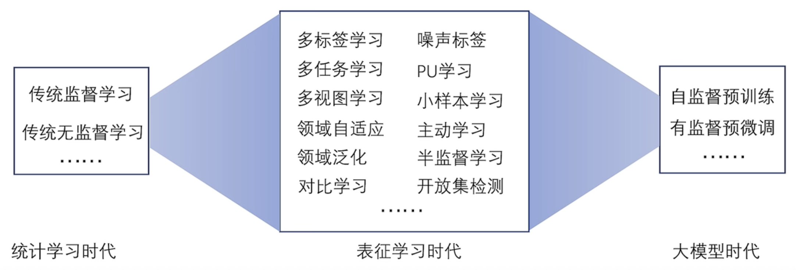

# 语言的建模

1. 将语言建模为一系列词元(token)组成的序列数据。词元是不可再拆分的最小语义单位。

2. 语言模型旨在预测一个词元或词元序列出现的概率。现有模型通常基于规则、统计或学习来构建。

3. 语言模型的概率预测与上下文和语料库有关

4. 条件概率链式法则
   $$
   P(\{w_1, w_2, \ldots, w_N\}) = P(w_1) \cdot P(w_2 | w_1) \cdot P(w_3 | w_1, w_2) \cdots P(w_N | w_1, \ldots, w_{N-2}, w_{N-1})
   $$

5. n-阶马尔科夫假设：当前状态只与前n个状态有关

6. 发展历史：基于规则的年代-->基于统计的年代-->基于学习的年代

# 基于统计的语言模型

最具代表性的是：n-grams语言模型

- n-grams指的是长度为n的此序列
- n-grams语言模型通过依次统计文本中的n-gram及其对应的(n-1)-gram在语料库中出现的相对频率来计算文本$\omega_{1:N}$。出现的概率。计算公式如下所示:
- n代表了拟合语料库的能力与对未知文本的泛化能力之间的权衡。
  - 当n过大时，语料库中难以找到与n-gram一模一样的词序列，可能出现大量“零概率”现象
  - 当n过小时，n-gram难以承载足够的语言信息，不足以反应语料库的特性
  - 因此，在n-grams语言模型中，n的值是影响性能的关键因素
  - 上述的“零概率”现象可以通过平滑(Smoothing)技术进行改善
- n-grams语言模型是在n阶马尔可夫假设下，对语料库中出现的长度为n的词序列出现概率的极大似然估计。

# 基于学习的语言模型

## 学习与统计的区别

- 统计侧重于设计一个模型描摹已知
- 学习侧重找到一个模型利用已知预测未知

## 学习的要素

- 人学习需要：经验知识、学习载体、常识、跟谁学、学习方法、学习目标
- 机器学习需要：训练数据、假设类、归纳偏置、学习范式、学习算法、学习目标
- 机器学习过程：在某种学习范式下，基于训练数据，利用学习算法，从受归纳偏置限制的假设类中选取出可以达到学习目标的假设，该假设可以泛化到未知数据上

## 机器学习要素

1. 训练数据

   - 对于语言模型，可选用公开语料数据

   - 数量多，质量高(多样性、复杂程度、噪声等)

2. 假设类

   - 指所有可能机器学习模型等集合，其中的元素为假设

   - 通常指定候选模型的可能空间为假设类

   - 当前大语言模型主要选用神经网络作为假设空间

3. 归纳偏置

   - 限制对某些假设进行选择

   - 对语言模型，常用的归纳偏置是上下文间存在关联

4. 学习范式

   - 广义的学习范式包括监督学习、无监督学习、强化学习
     - 监督学习：给定样本及其标签完成分类、回归问题
     - 无监督学习：无标签的自组织学习
     - 强化学习：从探索中学习（奖励）

   - 大模型常用自监督学习范式（基于自动构建的标签进行的监督学习）

5. 学习目标
   - 常见的学习目标之一：经验风险最小化，旨在最小化模型在训练集上的错误

6. 损失函数
   - 衡量模型在对应样本上的错误程度
   - 交叉熵损失与0-1损失
7. 学习算法
   - 旨在对损失进行优化
   - 1阶优化(梯度下降)、0阶优化(梯度无法计算时，对梯度估计然后优化模型)
8. 泛化误差
   - 机器学习的目的在于减小泛化误差，即真实误差
   - 泛化误差是一种数学期望，由训练误差和一些其他的因素共同决定
   - PAC理论（概率近似正确）
     - 是其中一个思想
     - 为机器学习方法进行定量分析的理论框架
     - 大概思想：当样本数量符合一定条件时，机器学习模型可以以一定概率达到近似正确
     - 样本复杂度的相关因素：假设类大小、概率大小、误差大小
   - 没有免费午餐定律：没有放之四海皆优的机器学习（总存在场景，让一个机器学习方法表现不佳）

## 机器学习发展历程

统计学习时代(支持向量机) -> 表征学习时代(CNN) -> 大模型时代(端到端、生成式)

假设空间：从百家争鸣到**神经网络**一枝独秀

学习范式：

