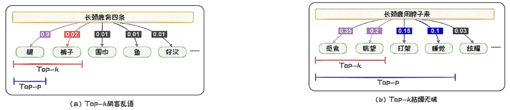

# 语言模型的采样

语言模型每轮预测输出的是一个概率向量。

我们需要根据概率值从词表中选出本轮输出的词元，选择词元的过程称为采样。

# 两类主流方法

## 概率最大化方法

旨在最大化概率

假设生成$M$个词元，概率最大化方法的搜索空间为$M^D$，是NP-Hard问题。

1. 贪心搜索方法
   - 每轮预测中都选择概率最大的词
   - 只顾“眼前利益”，当前概率大的词有可能导致后续的词概率都很小
   - 容易陷入**局部最优**，难以达到全局最优解
2. 波束搜索法
   - 每轮预测中都先保留b个可能性最高的词，在结束搜索时，得到M个集合。找出最优组合使得联合概率最大
   - 每轮预测中考虑了更多的可能性，可以在一定程度上减少陷入局部最优的情况

概率最大的文本通常是最为常见的文本，这些文本会略显平庸，不适合做创意写作等任务。

## 随机采样方法

为增加生成文本的多样性，随机采样的方法在预测时增加了随机性

在每轮预测时，先选出**一组**可能性高的候选词，然后按照其概率分布进行随机采样。

1. Top-K采样方法

   - 在每轮预测中都选取K个概率最高的词作为本轮的候选词集合，然后依照以下概率分别对这些词采样

   $$
   p(w_{i+1}^1, \ldots, w_{i+1}^K) = \left\{ \frac{\exp(o_i[w_{i+1}^1])}{\sum_{j=1}^K \exp(o_i[w_{i+1}^j])}, \ldots, \frac{\exp(o_i[w_{i+1}^K])}{\sum_{j=1}^K \exp(o_i[w_{i+1}^j])} \right\}。 \quad w_{i+1} \sim p(w_{i+1}^1, \ldots, w_{i+1}^K)。
   $$

   - 当候选词的分布的方差较大时，可能会导致本轮预测选到概率较小、不符合常理的词，从而产生“胡言乱语”
   - 当候选词的分布的方差较小时，固定尺寸的候选集中无法容纳更多的具有相近概率的词，导致候选集不够丰富

2. Top-P采样方法

   - Top-P设定阈值p来对候选集进行选取，其候选集可表示为 $S_p = \{w_{i+1}^1, w_{i+1}^2, \ldots, w_{i+1}^{|S_p|}\}$，其中，对$S_p$有，$\sum_{w \in S_p} o_i[w] \geq p$。候选集中元素的分布服从下述分布：
     $$
     p(w_{i+1}^1, \ldots, w_{i+1}^{|S_p|}) = \left\{ \frac{\exp(o_i[w_{i+1}^1])}{\sum_{j=1}^{|S_p|} \exp(o_i[w_{i+1}^j])}, \ldots, \frac{\exp(o_i[w_{i+1}^{|S_p|}])}{\sum_{j=1}^{|S_p|} \exp(o_i[w_{i+1}^j])} \right\}。 \quad w_{i+1} \sim p(w_{i+1}^1, \ldots, w_{i+1}^{|S_p|})。
     $$

   - 可以避免选到概率较小、不符合常理的词；也可以容纳更多的具有相近概率的词

3. Temperature机制

   - Top-K和Top-P采样的随机性由语言模型输出的概率决定，不可自由调整
   - 但在不同场景中，对于随机性的要求可能不同，因此引入了Temperature机制
   - T越大，越倾向于均匀分布，随机性更大；T越小，随机性越小
   - 引入Temperature后，Top-K采样的候选集的分布如下所示：

   $$
   p(w_{i+1}^1, \ldots, w_{i+1}^K) = \left\{ \frac{\exp(\frac{o_i[w_{i+1}^1]}{T})}{\sum_{j=1}^K \exp(\frac{o_i[w_{i+1}^j]}{T})}, \ldots, \frac{\exp(\frac{o_i[w_{i+1}^K]}{T})}{\sum_{j=1}^K \exp(\frac{o_i[w_{i+1}^j]}{T})} \right\}。
   $$

   

   - 引入Temperature后，Top-P采样的候选集的分布如下所示：

   $$
   p(w_{i+1}^1, \ldots, w_{i+1}^{|S_p|}) = \left\{ \frac{\exp(\frac{o_i[w_{i+1}^1]}{T})}{\sum_{j=1}^{|S_p|} \exp(\frac{o_i[w_{i+1}^j]}{T})}, \ldots, \frac{\exp(\frac{o_i[w_{i+1}^{|S_p|}]}{T})}{\sum_{j=1}^{|S_p|} \exp(\frac{o_i[w_{i+1}^j]}{T})} \right\}。
   $$

# 语言模型评测

对生成能力进行评测，以判断优劣

## 内在评测

- 测试文本通常由与预训练中所用的文本独立同分布的文本构成，**不依赖于具体任务**。
- 最常用指标：困惑度
  - 度量了语言模型对测试文本感到困惑的成都
  - 困惑度减小意味着熵减，意味着模型“胡言乱语”的可能性降低

## 外在评测

在外在评测中，测试文本通常包括该任务上的问题和对应的标准答案，**依赖于具体任务**。

通过外在评测，可以评判语言模型处理特定任务的能力。

1. 基于统计指标的评测
   - 构造统计指标来评测
   - 最常用指标：BLEU
     - 最早用于机器翻译任务
     - 计算了多层次n-gram匹配精度的几何平均
2. 基于语言模型的评测
   - 从语义理解层面来判断
   - 基于上下文嵌入的评测方法
     - 在上下文嵌入向量的基础上，计算生成文本和参考文本间的相似度来生成内容进行评测
     - 评测方法：BERTScore
       - 把两个词输入到BERT中，得到两个向量，计算两个向量中的相似度(Embedding相似度)
       - 从精度、召回和F1三个方面对生成文档评测
   - 基于生成模型的评测方法
     - 依赖于大语言模型，直接用能力强大的大模型对生成内容评测，可以不依赖于标准答案
     - 如G-EVAL：利用GPT-4在没有参考文本的情况下打分，通过提示工程引导GPT-4输出评测分数

# 语言模型的应用

- 语言模型的输出值以及中间结果可以直接或间接地解决各类自然语言处理任务

- 直接应用：输出的概率值可直接应用于机器翻译、对话等
- 间接应用：产生的文本嵌入可应用于实体识别、实体对齐、实体检测、文本检索等
