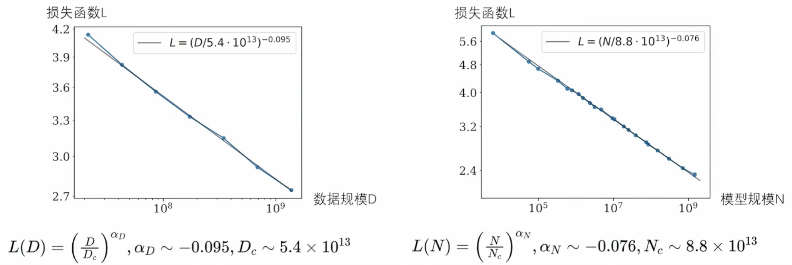
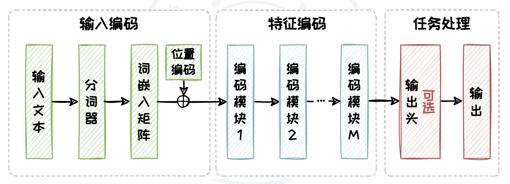
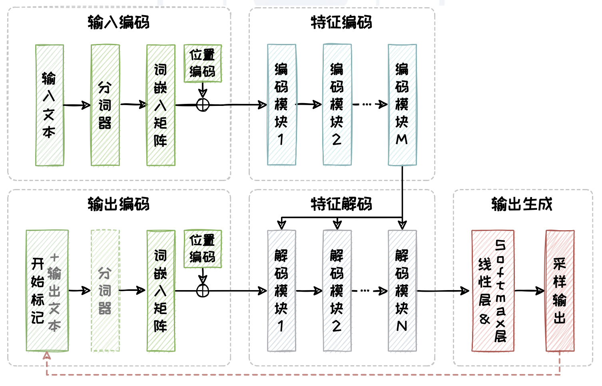
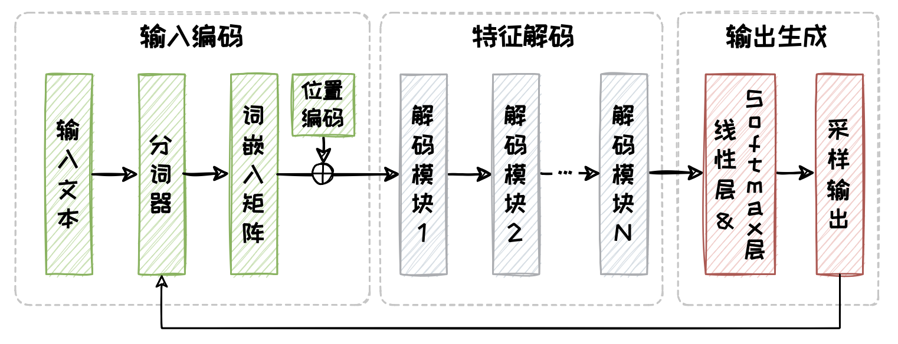
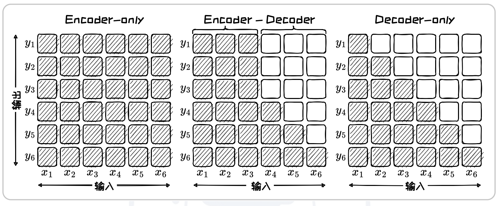

# 一些概念

## 涌现能力

- 实验发现某些新能力随着模型规模提升凭空自然涌现出来，因此成为涌现能力
- 如：**上下文学习**、逻辑推理、常识推理等能力
- 上下文能力：指大模型在某些任务中无需额外的训练，仅通过上下文信息 中的示例或提示即可理解任务并生成输出
- 常识推理：指大模型基于常识知识和逻辑进行推理和判断的能力
- 逻辑推理：指大模型基于给定信息和规则进行合乎逻辑的推理和结论的能力
- 大模型+大数据 -> 新智能
  - 大模型的能力扩展和智能，主要得益于模型规模和数据规模的增长

## 扩展法则

- 大模型的性能提升，有着一系列关于模型能力与参数/数据规模之间的定量关系作为理论支撑，即扩展法则

1. Kaplan-McCandish(OpenAI, 2020)

   - 首次通过实验拟合了神经网络模型的性能L与数据规模D以及模型规模N的函数关系，提出了该法则

   - L与D和N都是高度正相关的

   - 为大模型训练提供了方向，即堆模型、堆数据，其中**模型规模更为重要**

2. Chinchilla(DeepMind, 2022)

   - 进行了更大范围大实验，提出了该法则

   - L与D和N都是高度正相关的

   - 指出模型规模与参数规模**几乎同等重要**

# 基于Transformer的三种架构

Transformer灵活的并行架构为训练数据和参数的扩展提供了模型基础

## Encoder-only架构

- 只选用Transfomer的Encoder部分
- 包含三个部分：输入编码、特征编码、任务处理
- 如BERT、RoBERTa等
- 输入编码：将输入文本转化为向量序列
- 特征编码：为向量序列进一步提取和深化文本特征
- 任务处理：根据任务需求生成文本

## Encoder-Decoder架构

- 同时选用Encoder和Decoder部分，并采用交叉注意力机制来实现两部分的交互
- 如T5、BART等
- 特征编码和特征解码通过交叉注意力机制来实现两者的交互

## Decoder-only架构

- 只选用Decoder部分
- 包含：输入编码、特征解码、输出生成
- 核心特点在于省略了每个解码模块中的交叉注意力子模块
- 根据一个词推断下一个词，所以会遮盖下文的信息
- 如GPT系列、LLaMA系列等
- 输入编码：将输入文本转化为带位置信息的向量序列
- 特征解码：处理向量序列并自回归生成输出序列
- 输出生成：将解码后的向量转换为概率分布，并采样Token输出

## 三种架构对比

1. 在注意力矩阵上有显著区别

   - Encoder-only：呈现出“完全”的注意力，即对于每个Token的理解都依赖于整个输入序列的所有Token（双向注意力机制）
   - Enocder-Decoder：编码器用于生成输入序列的全面上下文表示，呈现出“完全的注意力；解码器的掩码自注意力矩阵则呈现出”下三角“的注意力
   - Decoder-only：注意力来自于掩码自注意力模块，呈现出”下三角“的注意力模式（单向注意力机制）

   

2. 在适用任务也有区别

   - Encoder-only
     - 双向注意力机制允许模型充分考虑序列中的前后文信息，捕捉丰富的语义和依赖关系；但由于缺少解码器组件，无法直接输出序列。
     - 适用于情感识别等判别任务，不太适用于对话问答等生成任务
   - Encoder-Decoder
     - 通过添加解码器来基于编码器输出的上下文表示逐步生成输出序列
     - 但解码器的加入会造成训练和推理成本的增加
     - 判别任务和生成任务都适用
   - Decoder-only
     - 大规模预训练数据使其能够生成高质量、连贯的文本
     - 但缺乏编码器提供的双向上下文信息，使其在理解复杂输入数据时存在一定局限性
     - 适用于生成任务，不适用于判别任务
     - 现在Decoder-only成为主流架构，并且在模型规模和数据规模都增大的情况下，也能处理一定的判别任务