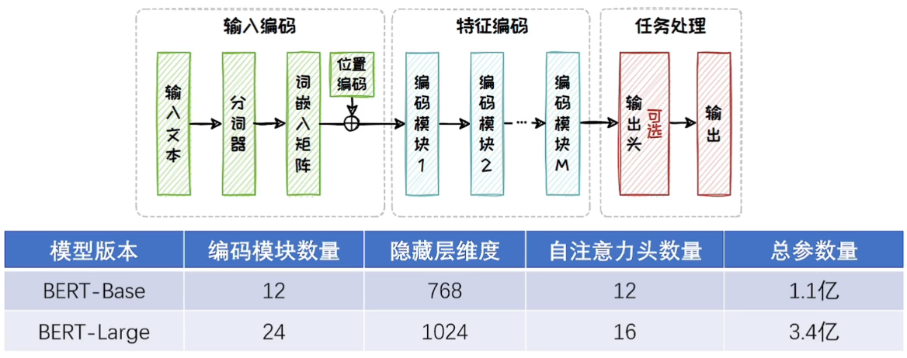
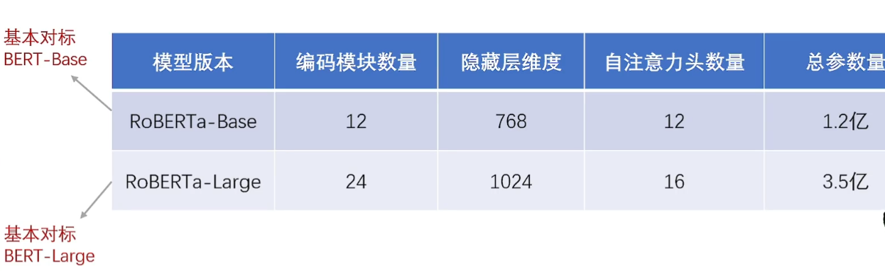
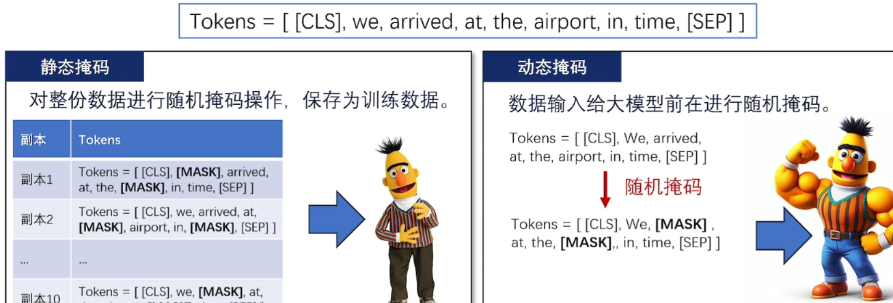
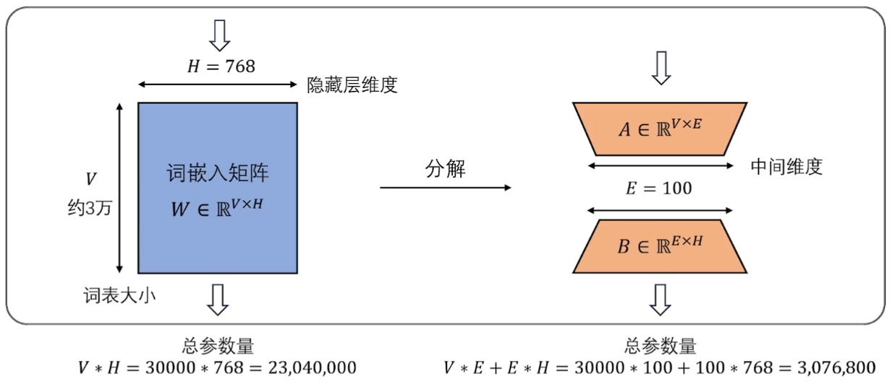
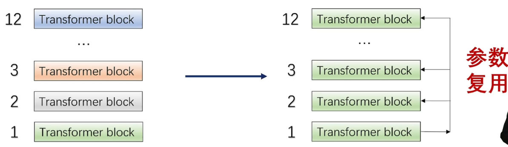

最常用的基于Encoder-only架构的模型是BERT及其变体，如RoBERTa、ALBERT等

# BERT

## 模型架构

- 结构与Transformer中的编码器几乎一致，只是**规模不同**

- 共有BERT-Base和BERT-Large两个版本

## 预训练方式

1. 预训练数据集
   - 使用小说数据集BookCorpus和英语维基百科数据进行预训练，总计约33亿个Token、15GB左右的数据量

2. 预训练任务

   - 使用**掩码语言建模**和**下文预测**两种任务来学习生成上下文嵌入
   - 掩码语言建模MLM：根据前后文完成完形填空（随机掩盖一些Token，让模型去预测这些Token的单词）

   - 下文预测NSP：判断两个句子是否连续

# RoBERTa

为解决BERT训练不充分的问题，RoBERTa在BERT的基础上采用更大的数据集、更长的训练时间、更细致的学习任务和超参数调整，来优化预训练过程

## 模型结构

- 模型结构与BERT基本一致，都是由多个编码模块堆叠而成。同样也分为RoBERT-Base和RoBERT-Large两个版本
- 特点：包含160G的训练数据、动态MSK、移除了NSP任务等等

## 预训练方式

1. 预训练数据集
   - 在BERT基础上添加了新闻数据集CC-News、网页开放数据集OpenWebText、故事数据集Stories，总数据量约160GB

2. 预训练任务

   - 移除了BERT中的下文预测任务

   - 将掩码语言建模任务强化为**动态掩码语言建模**，增加模型训练的多样性

   - BERT采用静态掩码：对整份数据进行随机掩码操作，保存为训练数据

   - RoBERTa采用动态掩码：在数据输入到大模型的时候才进行随机掩码

## 总结

- 在很多自然语言处理任务中都取得了很好的效果，如文本分类、情感分析、问答系统等
- 相比BERT，RoBERTa具有更高的性能和更好的泛化能力
- 但是，RoBERTa也存在一些问题，如模型训练时间长、训练成本高等

# ALBERT

为了提高训练和推理效率，Google提出了更轻量化的ALBERT模型，模型结构基本不变，但其独有的参数因子分解和跨层数共享显著降低了模型参数量

## 模型架构

- Encoder-only模型的参数来源：词嵌入矩阵(20%)和Encoder块(80%)

  

- 对于Embedding模块，ALBERT采用**参数因子分解**的方式减少其参数量（降维）

  

- 对于Attention与FNN模块，ALBERT采用**跨层参数共享**的方式减少参数量

  

## 预训练方式

1. 预训练数据集
   - 采用了和BERT完全相同的数据集
2. 预训练任务
   - 保留了BERT的掩码语言建模任务
   - 将下文预测任务替换为了**句序预测**（判断句子是正序还是倒序）

## 总结

- 模型参数量更小，训练速度块
- 但其在一些人物上的表现不如BERT

# Encoder-only架构总结

- 优点：由于**双向编码模型**中的**全面注意力机制**，基于Encoder-only架构的模型在需要**深度理解**的任务中展现出了卓越的能力（更好地理解文本、上下文信息）
- 缺点：但由于**没有寻求参数量的突破**，且只专注于判别任务， **难以应对生成式任务**，因此在**生成式人工智能**中难以发挥作用