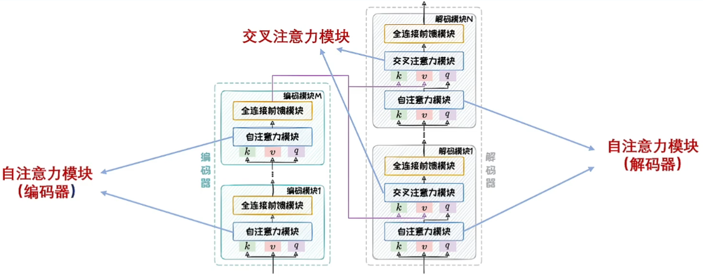
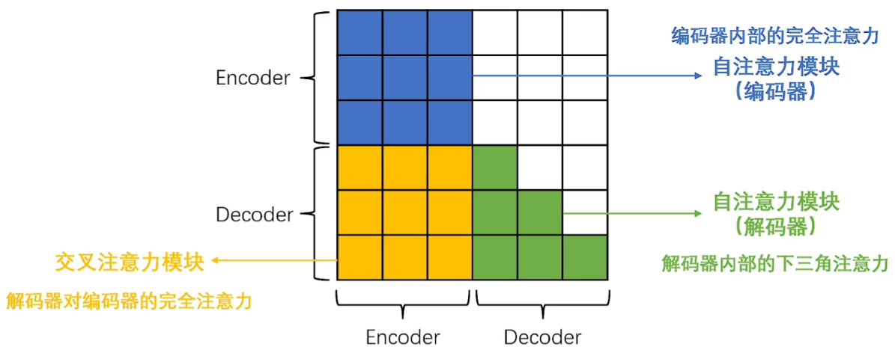
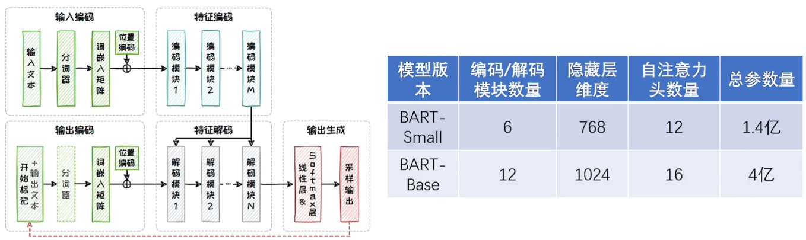
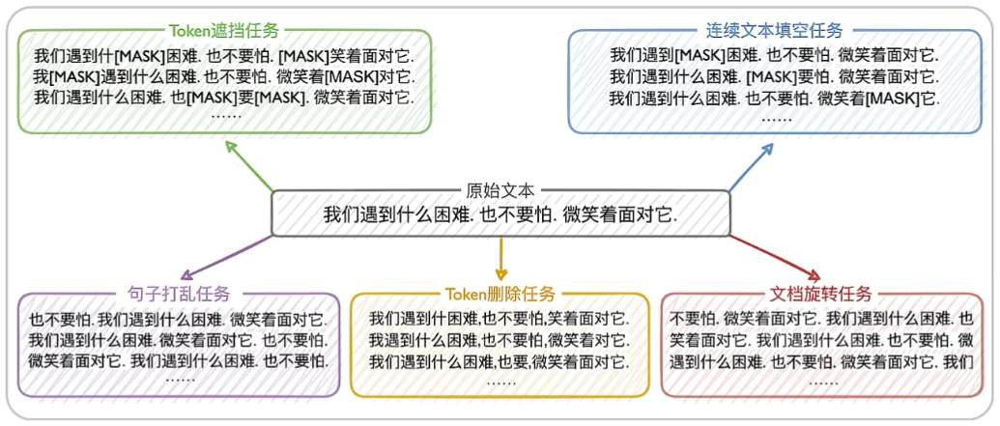
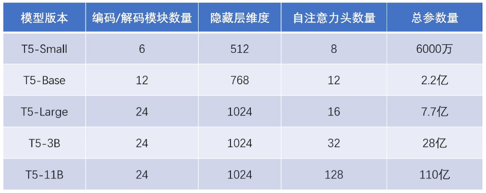
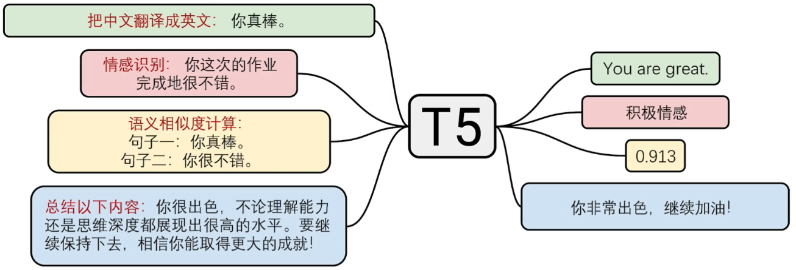

# Encoder-Decoder架构

- Encoder-Decoder在原先Encoder-only架构的基础上添加一个Decoder组件，使其能**生成连贯的输出**，从而缓解Encoder-only架构在生成式任务上的局限性。
- 主要包含编码器和解码器两部分
  - 编码器
    - 由多个编码模块堆叠而成，用于将输入序列转变成固定长度的上个下文向量
    - 包含：自注意力模块、全连接前馈模型
  - 解码器
    - 由多个解码模块堆叠而成，基于上下文向量自回归地生成输出序列
    - 包含：自注意力模块、交叉注意力模块、全连接前馈模型
- 三种注意力模块
  - 编码器-自注意力模块：编码器内部的完全注意力
  - 交叉注意力模块：解码器对编码器的完全注意力
  - 解码器-自注意力模块：解码器内部的下三角注意力（忽略下文）

- Encoder-Decoder架构的代表模型是BART和T5
  - BART：通过**多样化**的语料重建预训练任务帮助模型对**文本结构和语义**进行深入理解
  - T5：通过**多任务**有监督微调模型使得模型理解**任务指令**，实现任务大一统

# BART

Meta在2019年提出，旨在通过**多样化的预训练任务**来提升模型在**文本生成任务**和**文本理解任务**上的表现

## 模型结构

- 与原始的Transformer模型相同，包含由多个编码模块堆叠而成的编码器以及多个解码模块堆叠而成的解码器，共包含两个版本

## 预训练方式

1. 预训练数据集
   - 采用和RoBERTa相同的语料库作为预训练数据
2. 预训练任务
   - 提出了五项破坏文本重建任务来锻炼模型对文本结构和语义的深入理解
   - Token遮挡任务：类似于BERT的MSK
   - 连续文本填空任务：遮盖多个Token
   - 句子打乱任务
   - Token删除任务
   - 文档旋转任务

## 应用

- 通过进一步微调，可将其在预训练阶段学到的语言知识迁移到具体应用场景中
- 针对**不同任务设计不同的微调方式**，BART能够适应各种NLP任务
- 如：分类问题，网络的中间层拿到对应的特征向量，再根据特征向量构建一个分类器来进行分类，所以需要制定定制化的模块和参数来解决其他问题

# T5

同年，谷歌提出了T5范式，通过构造合理的输入前缀，实现了各种NLP任务的大一统，真正的“一模型多用”

## 模型架构

- 同标准的Transformer相同，但模型参数更多

## 预训练方式

1. 预训练数据集
   - 谷歌对大规模网页数据集Common Crawl进行清洗和过滤，生成了大小约750GB的C4数据集
2. 预训练任务
   - Span Corruption：每次选择**连续几个Token**作为小段(Span)进行掩码，让模型以完形填空的形式进行复原
   - Token掩码 VS Span掩码
     - Token-掩盖一个Token
     - Span-能覆盖短语或子句此类有完整意义的语义单元

## 下游任务

- 可在模型架构不改变的情况下，利用Prompt工程技术（增加一个前缀）直接适配到多种下游任务

# Encoder-Decoder架构总结

基于Encoder-Decoder的大语言模型在模型结构和参数规模的双重优势下，不仅体现出了强大的语言理解能力，在生成任务中也展现了良好的性能表现