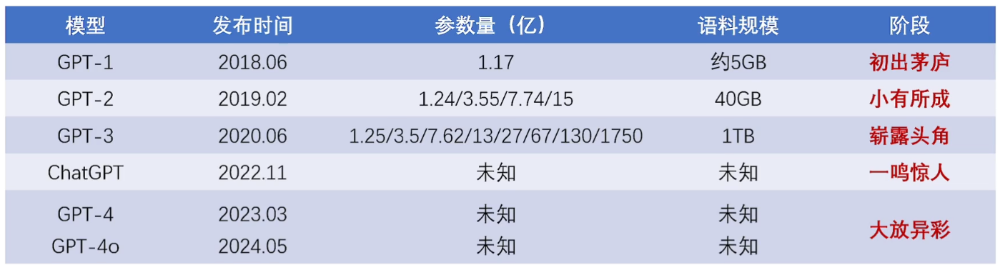
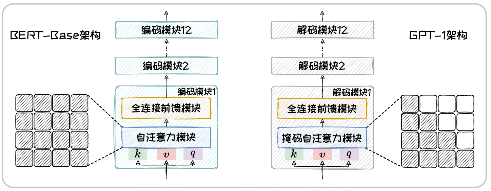
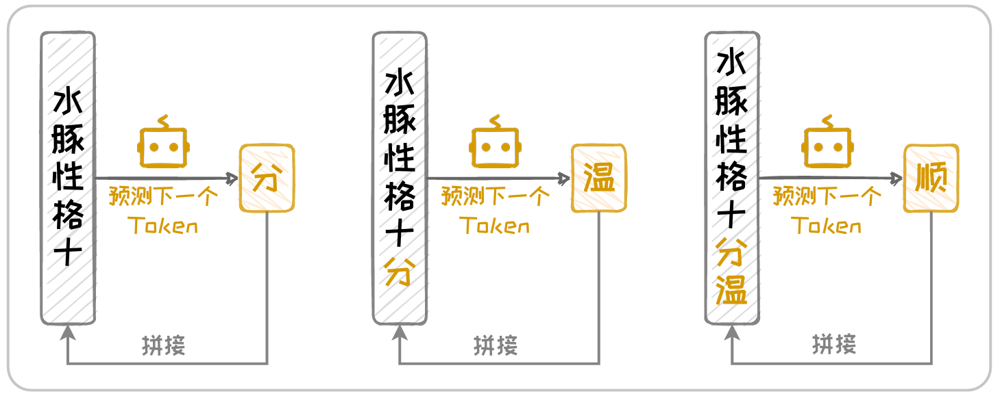
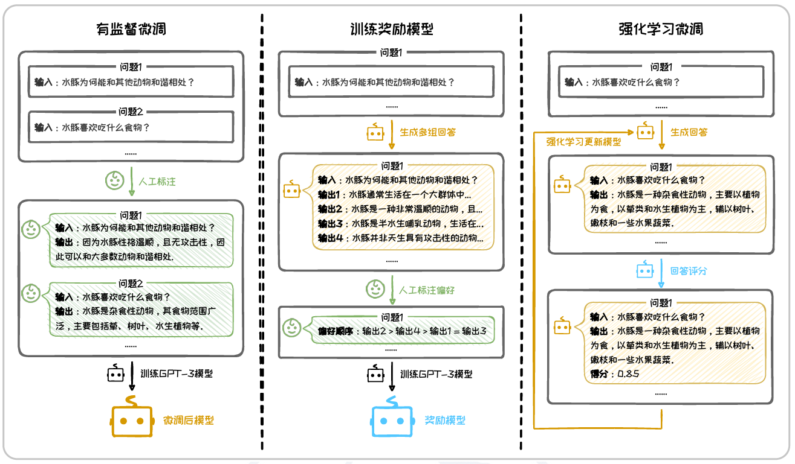
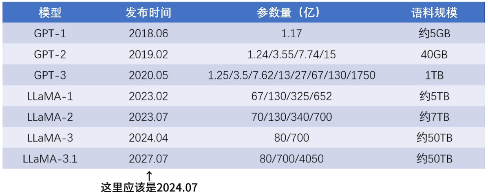

# Decoder-only架构

- 在开放式生成任务中，输入序列通常较简单或不明确，因此不需要像Encoder-Decoder一样维持一个完整的编码器来处理这些输入。
- Encoder占了一般模型的参数，造成了算力资源的大幅消耗，对于一个简单的输入任务，维护编码器的性价比不高，因此去除了Encoder部分
- 其简化的架构设计(模型轻量化)和强大的可扩展性，使得Decoder-only架构被广泛应用于大规模语言模型
- 最流行的是OpenAI提出的GPT系列模型和Meta提出的LLaMA系列模型等
  - GPT：起步最早、逐渐闭源、做大模型
  - LLaMA：起步较晚、坚持开源、提高效率

# GPT系列模型

自2018年问世以来，在规模、预训练范式上不断演进，性能飞跃式地提升，引领了大模型发展的浪潮。

## GPT-1模型

Transformer的出现解决了原先困扰OpenAI团队很久的长距离依赖问题

《Improving Language Understanding by Generative Pre-Training》中提出了GPT-1

### 模型架构

- 与BERT-Base高度类似，本质区别在于BERT-Base中的自注意力模块是**双向的自注意力机制**，而GPT-1则是带有掩码的**单向自注意力机制**

### 预训练方式

1. 预训练数据集
   - 小说数据集BookCorpus
2. 预训练任务
   - 下一词预测任务来预训练（预测下一个Token）
   - 在不需要带标签数据的前提下学习语言“常识“
   - 受限于当时的训练数据量和模型参数量，其任务泛化能力非常有限，通常需要在特定任务下进行进一步的有监督微调

## GPT-2模型

2019年2月发布

### 模型架构

- 仍使用Decoder-only架构

- 在GPT-1的基础上进一步增大了参数数量

### 预训练方式

1. 预训练数据集
   - 提升了预训练数据的数量和质量
   - 采用全新的WebText数据集，包含40GB经过筛选和清晰的网络文本
2. 预训练任务
   - 仍沿用下一词预测任务
   - 完成预训练后，在某些任务可以不进行微调直接推理，大大增加了处理下游任务时的灵活性

## GPT-3模型

2020年6月发布

为进一步提升任务泛化能力，OpenAI进一步提升了模型和预训练预料规模

### 模型架构

- 在前两代的基础上，显著增加了模型规模，参数量最高达到1750亿
- 能够捕获更加细微和复杂的语言模式，显著提升了文本生成能力

### 下游任务

- 涌现出了良好的上下文学习能力，仅通过输入文本中的任务描述和少量示例，便能够快速使用不同的应用场景
- Zero-shot、Few-shot

## InstructGPT模型

在GPT-3的基础上，推出了一系列衍生代码，如专注于代码生成的Codex、能够进行网页检索的WebGPT等，其中最有启发意义的是具有良好指令跟随能力的InstructGPT模型

### 人类反馈强化学习

- Reinforcement Learning from Human Feedback, RLFH
- 该模型通过引入人类反馈强化学习，来提升模型对用户对指令的响应能力

## ChatGPT及GPT-4等模型

- 2022年11月提出ChatGPT，标志着一种新的服务模式**LLMaaS**(LLM as a Service)的出现，模型也开始走向闭源

- 用户可以通过网页端或API轻松调用ChatGPT，无需本地部署
- 相较于ChatGPT，GPT-4能更好地理解复杂语境、生成连贯文本，同时还引入了对图文双模态的支持，扩展了其在图像描述和视觉问答等领域的应用
- 2024年05月提出了GPT-4o，大幅提升了响应速度，显著降低了延迟，还增强了多模态处理能力和多语言支持能力

# LLaMA系列模型

由Meta AI开发的一系列大模型

GPT系列的升级主线聚焦于模型规模与预训练预料的同步提升，而LLaMA则在模型规模上保持稳定、更专注于预训练数据的规模与质量

## LLaMA1模型

在Chinchilla扩展法则**“小模型+大数据"**的指导下，Meta AI于2023年2月推出了第一版本，旨在**以大规模的优质数据训练相对较小的模型**

### 模型架构

- 采用了与GPT-1同样的网络架构
- 但在原始词嵌入模块、注意力模块和全连接前馈模块上进行了优化
  - 词嵌入模块：用旋转位置编码替代了绝对位置编码，提升模型对序列顺序的理解
  - 注意力模块：采用Pre-Norm策略，对自注意力和前馈网络的输入进行正则化
  - 全连接前馈模块：采用SwiGLU替代RELU，更光滑
- 推出了四个版本的模型

## LLaMA2模型

2023年7月，进一步优化和扩充了训练数据，发布了第二代模型

除了数据量的扩充，LLaMA2还引入了RLHF训练范式，并结合了拒绝采样进一步提升模型性能

### 模型架构

- 引入了分组查询注意力来提升计算效率
- 发布了 四个版本的模型

## LLaMA3模型

2024年4月，推出了第三代模型

训练数据规模高达上一代的七倍，且多样性更高，覆盖范围更广

在7月提出了3.1版本，模型规模扩大到4050亿

## LLaMA衍生模型

在LLaMA开源模型的基础上进行的二次创作

- 性能改进类模型：深入微调，提升模型在通用任务上的性能，如Alpaca、Vicuna
- 垂域任务类模型：在特定领域微调，增强垂域应用的能力，如CodeLLaMA、FinLLaMA
- 多模态任务类模型：整合视觉等编码器，将模型扩展到多模态任务上，如LLaVA、MiniGPT4

# Decoder-only架构总结

凭借卓越的生成能力，引领了AIGC的浪潮