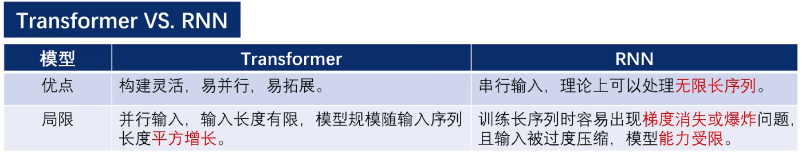
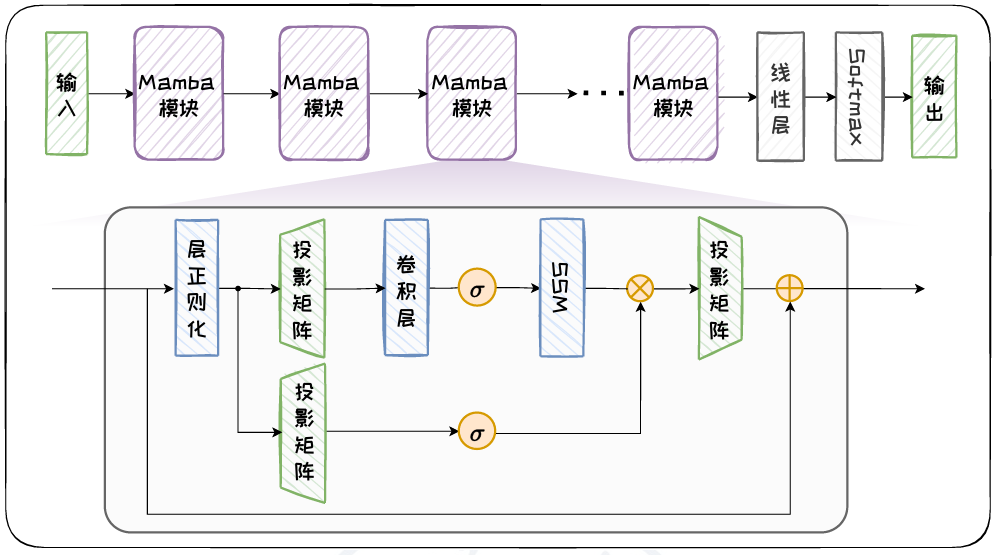

# Transformer的缺点

- Transformer的输入窗口长度有限，且模型规模随输入序列长度平方次增长

- 在处理长序列时，计算成本高

- Transformer VS RNN

  

- 为避免模型规模随序列二次增长，同时克服RNN的局限性，近年来提出了多种RNN变体，其中基于选择状态空间模型(SSSM)的Mamba模型引发了广泛关注

# Mamba

Mamba在**状态空间模型**(SSM)的基础上加入**选择机制**，确保其可高效处理长序列，并且还可以达到Transformer的模型能力

Selective State Space Model

## 状态空间模型SSM

- 将n阶系统用n个1阶等式进行矩阵表达（空间转换形态）

  - 如图 ，SSM 在三个随时间 $t$ 变化的变量和四个可学习的矩阵的基础上构造而成。
  - 三个变量分别为：$x(t) \in \mathbb{C}^n$ 表示 $n$ 个状态变量，$u(t) \in \mathbb{C}^m$ 表示 $m$ 个状态输入，$y(t) \in \mathbb{C}^p$ 表示 $p$ 个输出。
  - 四个矩阵分别为：状态矩阵 $\mathbf{A} \in \mathbb{C}^{n \times n}$，控制矩阵 $\mathbf{B} \in \mathbb{C}^{n \times m}$，输出矩阵 $\mathbf{C} \in \mathbb{C}^{p \times n}$ 和命令矩阵 $\mathbf{D} \in \mathbb{C}^{p \times m}$。
  - SSM 的系统方程为：
    $$
    \begin{align*}
    x'(t) &= \mathbf{A}x(t) + \mathbf{B}u(t) \\
    y(t) &= \mathbf{C}x(t) + \mathbf{D}u(t),
    \end{align*}
    $$
  - 其中，$x'(t) = \mathbf{A}x(t) + \mathbf{B}u(t)$ 为状态方程，描述了系统状态如何基于输入和前一个状态变化，其计算出的是状态关于时间的导数 $x'(t)$，为了得到状态 $x(t)$，还需对其进行积分操作。
  - $y(t) = \mathbf{C}x(t) + \mathbf{D}u(t)$ 为输出方程，描述了系统状态如何转化为输出，其中的 $x(t)$ 是通过状态方程更新且积分后的值。
  - 在深度学习中，$\mathbf{D}u(t)$ 项表示残差连接，可被忽略。

- 离散化：采用Zero-order hold（连续的无法直接用在语言模型中，需要离散化）

  - 离散后的SSM系统方程为：

  $$
  x_k = \bar{\mathbf{A}} x_{k-1} + \bar{\mathbf{B}} u_k\\
  
  y_k = \bar{\mathbf{C}} x_k
  $$

  - 在该方程中，状态方程由前一步的状态和当前输入计算当前状态，体现了递归的思想。
  - 其中，$\bar{\mathbf{A}}, \bar{\mathbf{B}}, \bar{\mathbf{C}}$ 为离散形式下的矩阵，其与连续形式下矩阵 $\mathbf{A}, \mathbf{B}, \mathbf{C}$ 的关系分别表示为：$\bar{\mathbf{A}} = (\mathbf{I} - \frac{\Delta}{2} \mathbf{A})^{-1} (\mathbf{I} + \frac{\Delta}{2} \mathbf{A})$，$\bar{\mathbf{B}} = (\mathbf{I} - \frac{\Delta}{2} \mathbf{A})^{-1} \Delta \mathbf{B}$，$\bar{\mathbf{C}} = \mathbf{C}$，其中 $\Delta = t_{n+1} - t_n$。
- 视频有推导过程：[【浙江大学-大模型原理与技术】2-4 Mamba原理_哔哩哔哩_bilibili](https://www.bilibili.com/video/BV1JCrVYjEPN?spm_id_from=333.788.player.switch&vd_source=03450fd73e8b276aa60665b7c1ab7074)
- B、C均具有**时不变性**(不会随时间变化)，输入也会压缩，不会关注某些词，不合理

## Mamba

- 增加了一个线性层

