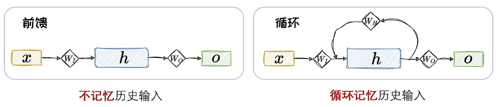
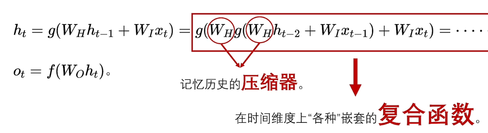
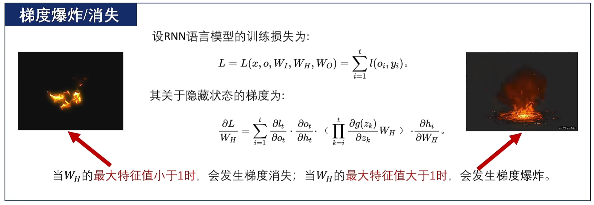
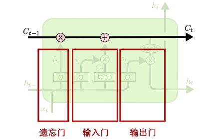
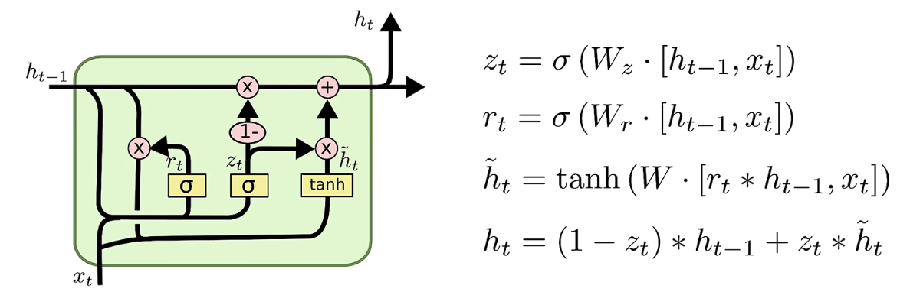
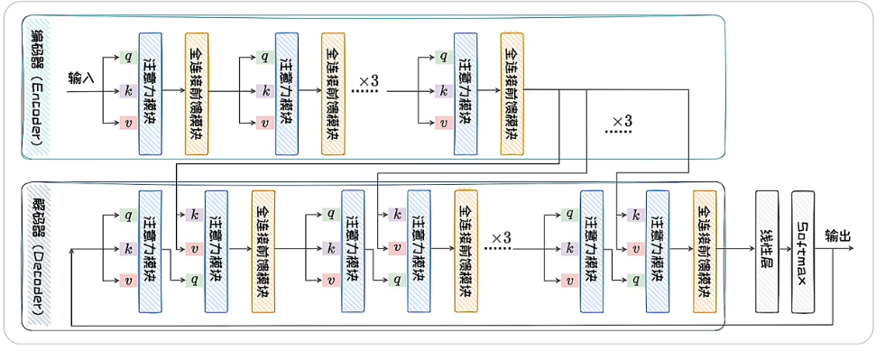
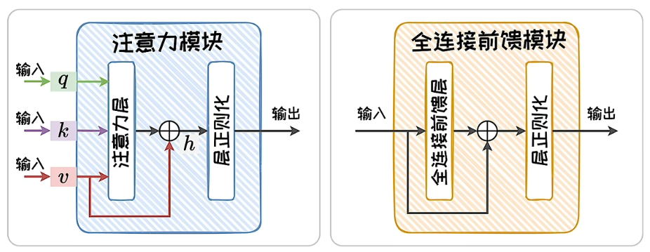
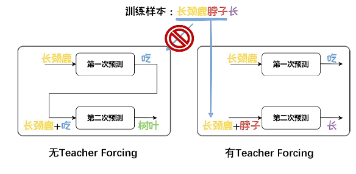

上下文输入语言模型时，可以串行输入(一个字一个字)，也可以并行输入

# RNN

## 介绍

- 典型的串行输入的语言模型
- 循环神经网络，是一类网络连接中包含环路的神经网络的总称

- 串行输入的过程中，前面的元素会被循环编码成隐状态，并叠加到当前的输入上

- RNN可以将历史状态以隐变量的形式循环叠加到当前状态上，对历史信息进行考虑，呈现出螺旋式前进的模式

## 改进

### 梯度爆炸和梯度衰减

在训练RNN时，涉及大量的矩阵连乘操作，容易引发梯度衰减或梯度爆炸问题

### LSTM

- 为解决该问题，提出了带有门控机制的LSTM
- LSTM将经典RNN中的通过复合函数传递隐藏状态的方式，解耦为**状态累加**
- 隐藏状态通过**遗忘门**、**输入门**实现合理的状态累加，通过**输出门**实现合理整合
- 遗忘门：适度忘记“往事”；输入门：对“新闻”选择性聆听
- 将“往事”与“新闻”相加得到当前状态
- 输出门：考虑“人情世故”，将当前状态适度输出

### GRU

为降低LSTM的计算成本，GRU将遗忘门与输入门进行合并

# Transformer

### 介绍

- 支持并行输入的模型
- 是一类基于注意力机制的模块化构建的神经网络结构

- Transformer两种主要模块
  - 注意力模块：负责对上下文进行通盘考虑
  - 全连接前馈模块：占据Transformer近三分之二的参数，掌管模型的记忆

### 注意力模块

- 注意力模块由自注意力层、残差连接和层正则化组成
- 自注意力层：采用加权平均的思想将前文信息叠加到当前状态
- 层正则化：加速神经网络的训练过程并取得更好的泛化性能
- 残差连接：有效解决梯度消失的问题

# 基于RNN/Transformer的语言模型

- 训练过程：在**自监督学习范式**下，基于**训练预料**，利用**学习算法**，从**受归纳偏置**限制的**假设类**中选取出可以达到**预测下一词**的假设，该假设可以**泛化**到语料库以外的数据上。

- 输出：在语言模型一次预测中，输出的是一个**概率向量**。其中的每一维代表了词表中对应词出现的概率。

- 自回归：将输出向量解码为对应单词，然后通过自回归不断生成新的词，最终组成一段文本

  - 第一轮：第一个词输出给RNN/Transformer模型，经过解码，得到一个输出词
  - 第二轮：第一轮输出的词与第一轮输入的词拼接，作为第二轮的输入，经过解码，得到第二轮的输出
  - 以此类推
  - 循环迭代的自回归过程中，不断生成新的词，这些词构成了一段文本
  - 问题：错误级联放大(错误循环输入)和串行效率低(串行预测)

- Teacher Forcing

  - 为解决自回归的两个问题，使用该方法
  - 问题：导致曝光偏差，即训练模型的过程和模型在推理过程存在差异，容易导致模型幻觉问题

  