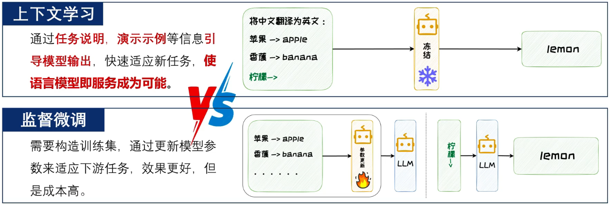
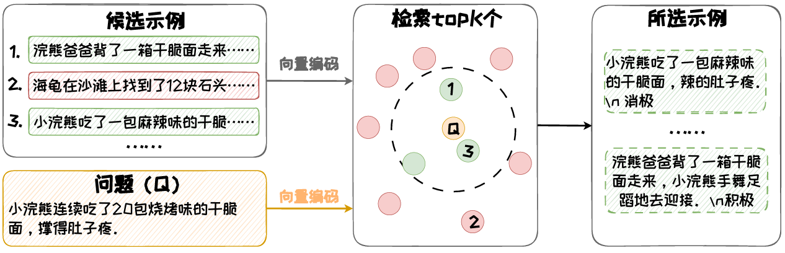
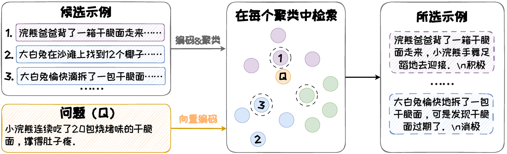
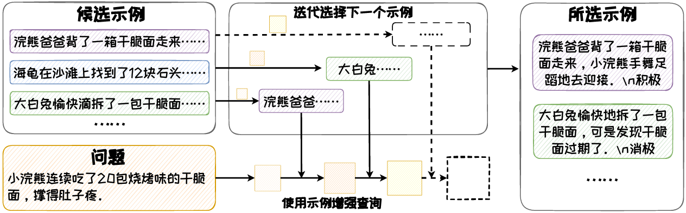

# 上下文学习能力涌现

随着模型参数数量和训练数据规模的持续扩大，大模型涌现出了上下文学习(ICL)能力

# 上下文学习

## 介绍

- 通过构造**特定的Prompt**，来使得语言模型理解并学习下游任务
- 相比于传统的监督微调，其**不需要更新模型参数**，可以快速适应下游任务

## 为什么有效

- 大模型在预训练阶段从大量文本中学习潜在的概念
- 当运用上下文学习进行推理时，其借助任务说明或演示示例来”锚定“其在预训练阶段所习得的相关概念，从而进行上下文学习，并对问题进行预测

## 分类

- 按照示例数量的不同，上下文可分为
  - 零样本(Zero-shot)上下文学习
  - 单样本(One-shot)上下文学习
  - 少样本(Few-shot)上下文学习
- 通常情况下：示例越多，模型的表现越好，即学习性能 少样本>单样本>零样本

## 演示实例的选择

- 主要依据是相似性和多样性

  - 相似性：选出与待解决问题文本最为相近的示例
  - 多样性：所选的示例涵盖尽量广的内容，扩大演示实例对待解决问题的覆盖范围

- 鉴于对选择依据的侧重，现有的示例选择策略主要分为：

  1. 直接检索

     - 目前应用最广泛
     - 在筛选示例时，检索器依据特定的评分标准对示例排序，然后选取排名靠前的K个示例
     - 代表性方法是KATE
     - （把示例都Embedding，计算之间的相似度，选取Top-K）
     - 优点：方便计算，简单有效，比随机选取性能高
     - 缺点：未对多样化考虑，选出的示例可能趋于同质化

     

  2. 聚类检索

     - 把所有示例划分为K个蔟，让相似的示例聚集在一起，然后从每个簇中选取最为相似的示例，最终获得K个示例
     - 代表性方法为Self-Prompting
     - （对样本先聚类，每个簇之间相似性低，体现了多样性；再从每个簇中检索）
     - 优点：有效提升多样性
     - 缺点：可能存在有些簇与问题不相关，导致选择出不相关的示例

     

  3. 迭代检索

     - 检索是迭代的，下一个示例的选择依赖于当前的问题和已选的示例
     - 代表性方法是RetICL
     - （先从示例空间找出一个与问题相似的示例，与问题进行组合，组合之后再去示例空间中找一个和组合相似的示例）
     - 优点：兼顾了相似性和多样性
     - 缺点：在计算上相对复杂，多轮迭代，速度慢，成本高

     

## 性能影响因素

1. 预训练数据
   - 预训练数据是上下文学习能力的来源
   - 主要影响因素包含：
     - 领域丰富度：更稳定的上下文学习能力
     - 任务多样性：任务泛化能力
     - 训练数据的分布特性：数据具有分布特异性时，可增强上下文学习能力
2. 预训练模型
   - 主要因素：模型参数规模
     - 模型参数达到一定规模时，上下文学习能力才得以涌现
     - 一般，模型规模越大，能力越强
3. 演示示例
   - 主要因素：
     - 演示示例的格式：复杂问题可以添加一些中间推理步骤会更好
     - 输入-标签映射
       - 错误的输入-标签映射会降低其能力
       - 并且模型指令跟随能力越强时，对标签错误具有更高的敏感性
     - 示例数量及顺序
       - 数量越多，性能越好
       - 每个模型对顺序的偏好不一样，效果影响不一定