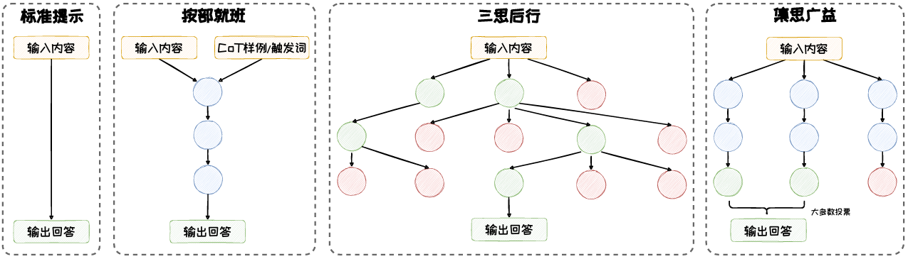

# 人类的思维

在心理学中，System-1任务和System-2任务分别代表两种不同的思维方式所处的任务类型

- System-1任务
  - 其思考过程是快速、自动且无意识的
  - 主要依靠直觉和经验判断，不需要刻意思考，往往在瞬间完成
  - 如常识问答、情感分类、意图识别等
- System-2任务
  - 其思考过程比较缓慢，需要集中注意力和耗费精力，运用逻辑分析、计算和有意识的思考来解决问题
  - 如复杂数学计算、逻辑推理等
- 在大模型中
  - 随模型参数量、算力开销、数据量协同增长，在标准提示下
    - 其在System-1的任务上性能显著增强
    - 而在System-2的任务上，大模型表现出了 “Flat Scaling Curves”的现象，及模型规模增长未带来预期性能提升，甚至停滞不前

# 思维链CoT

## 定义

通过在提示中**嵌入一系列中间推理步骤**，引导大语言模型模拟人类解决问题时的思考过程，以提升模型处理System-2任务的能力

## 分类

按推理方式的不同，归纳为：按部就班、三思后行和集思广益

### 按部就班模式

- 强调逻辑的连贯性和步骤的顺序性，遵循一条预设的路径，每一步都紧密依赖于前一步的结论
- 代表性方法：
  - CoT：通过手工构造一步一步推理回答问题的例子
  - Zero-Shot CoT
    - 通过特定提示，自动化构造推理例子
    - Prompt:  问题+"Let's think step by step"，引导模型自动生成一条推理链
    - 标注成本低，但是效果不如标准的CoT方法
  - Auto CoT
    - 从问题库中检索多个相关的问题，利用Zero-Shot CoT针对每个问题自动化构造推理示例（相当于举一反三）
    - 利用Sentence-Bert对问题库样本进行表征，并使用K-Means算法筛选出与用户提问相关的问题样本
    - 在筛选出的样本上，利用Zero-Shot CoT生成思维链内容，作为示例
    - 以这些示例作为少样本示例，引导大模型生成针对用户问题的推理链和答案
- 适合简单计算问题，但是人类在解决System-2类问题时，会有一个**反复选择以及回溯**的过程，该方法无法模拟该过程，导致其能力受限
  - 局部上，在思维过程中不会探索不同的后续内容，即树的分支
  - 全局上，大模型顺序链式输出，不存在规划、前瞻性思考、自我评估和回溯的过程

### 三思后行模式

- 在决策过程中融入审慎和灵活性
- 思维方式从链式变为树状/网状
- 代表性方法
  - Tree of Thoughts（ToT）
    - 将推理过程构造为一颗思维树
    - 在构造树的过程中，允许模型在遇到困难或不确定性时进行回溯和重新选择
    - 四个角度构造树：
      - 拆解：复杂问题拆解为多个简单子问题
      - 衍生：根据当前子问题生成可能的下一步推理方向，分为样本启发和命令提示
      - 评估：利用模型评估推理节点合理性，采用投票或打分模式
      - 搜索：从一个或多个当前状态出发，搜索通往问题解决方案的路径
  - Graph of Thoughts（GoT）
    - 通过特定提示，自动化构造一步一步推理回答问题的例子

### 集思广益模式

- 强调通过汇集多种不同的观点和方法来优化决策过程
- 模型不仅仅依赖单一的推理路径，而是通过探索多种可能的解决方案，从中选择最优的答案
- 代表性方法
  - Self-Consistency
    - 引入多样性的推理路径，从中提取并选择最一致的答案
    - 不依赖于特定的CoT形式，可以与其他CoT方法兼容，共同作用于模型的推理过程
    - 给出多种答案，基于结果投票，选出最终答案，简单好用
    - 过程
      - 推理路径生成：在**随机采样策略**下，使用CoT或Zero-Shot CoT的方式引导大模型生成一组多样化的推理路径
      - 汇总答案：针对每个推理内容，收集最终的答案，并统计每个答案在所有推理路径中出现的频率
      - 选择答案：选择出现频率最高的答案作为最终的、最一致的答案
    - 无法解决开放性问题（无定量答案）
  - Universal Self-Consistency
    - 利用LLMs自身选择最一致的答案，支持更多种任务，无需答案提取过程
    - 在开放性问题中，如文本摘要等任务，由大模型自身做选择最一致的答案
    - 在多任务中性能良好且输出匹配度高、对顺序鲁棒性

## 应用

- GPT-o1
  - 三种思维链都是作用于模型推理侧，而OpenAI尝试在训练和推理时深度融合思维链技术，提出了GPT-o1
  - 在回答时花更多时间思考，擅长处理科学、编程、数学等领域的复杂问题
  - 随着更多的强化学习(训练的计算)和更多的思考时间(测试的计算)，o1的性能平滑上升
  - 性能提升的关键是从“结果监督”转为“过程监督”
    - 训练时，利用大规模强化学习增强模型生成优质思维片段的能力
    - 测试时，利用大规模搜索采样可能的思维片段，并利用奖励模型指导生成 