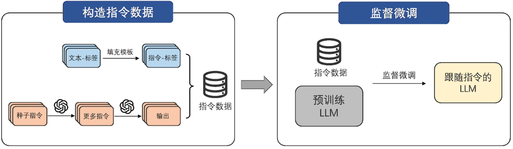
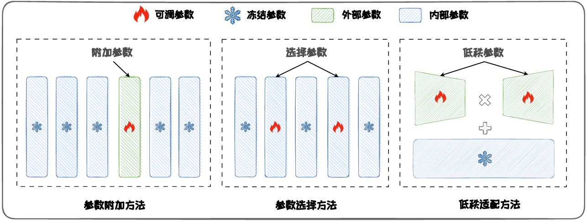

# 下游任务适配

- 通过上下文学习，可以在一定程度上适配到下游任务
- 但其性能有限、人力成本高、推理效率低
- 为保证下游任务性能，语言模型需要定制化调整以完成下游任务适配——指令微调

# 指令微调

- 旨在对模型进行任务指令的学习，使其能更好地理解和执行各种自然语言处理任务的命令
- 指令微调需要先**构建指令数据集**，再在该数据集上进行**监督微调**

## 指令数据

- 指令数据通常包含指令（任务描述）、示例（可选）、问题和回答
- 构造方式：数据集成、大语言模型生成

## 监督微调SFT

- 基于指令数据集，对大模型进行监督微调
- 大模型通常以自回归方式进行训练（计算交叉熵损失+TeacherForcing）
- 全量监督微调：需要更新模型所有参数，会消耗大量存储和计算资源
- 参数高效微调PEFT：
  - 避免更新全部参数，在保证微调性能的同时，减少更新的参数数量和计算开销
  - 优势：计算效率高、存储效率高、适应性强
  - 分类：参数附加方法、参数选择方法、低秩适配方法

