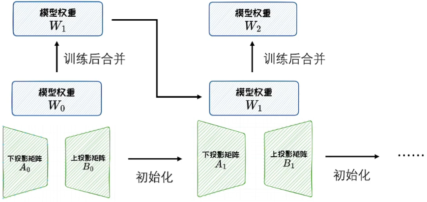

# 下游任务适配

- 通过上下文学习，可以在一定程度上适配到下游任务
- 但其性能有限、人力成本高、推理效率低
- 为保证下游任务性能，语言模型需要定制化调整以完成下游任务适配——指令微调

# 指令微调

- 旨在对模型进行任务指令的学习，使其能更好地理解和执行各种自然语言处理任务的命令
- 指令微调需要先**构建指令数据集**，再在该数据集上进行**监督微调**

## 指令数据

- 指令数据通常包含指令（任务描述）、示例（可选）、问题和回答
- 构造方式：数据集成、大语言模型生成

## 监督微调SFT

- 基于指令数据集，对大模型进行监督微调
- 大模型通常以自回归方式进行训练（计算交叉熵损失+TeacherForcing）
- 全量监督微调：需要更新模型所有参数，会消耗大量存储和计算资源
- 参数高效微调PEFT：
  - 避免更新全部参数，在保证微调性能的同时，减少更新的参数数量和计算开销
  - 优势：计算效率高、存储效率高、适应性强
  - 分类：参数附加方法、参数选择方法、低秩适配方法

# 参数高效微调的应用

## PEFT在预训练中的应用

- 在预训练阶段，PEFT方法可以冻结大部分模型参数从而节省内存和计算的情况下，保持与全量训练相近的性能
- 在继续预训练的情况下有很好的效果
- ReLoRA：
  - 在LoRA基础上，通过多次重启来得到更好的训练效果
  - 多次重启：每隔一定训练步数将低秩矩阵与模型权重合并，并重新初始化生成新的低秩矩阵

## PEFT在连续学习中的应用

- LoRA权重可以以插件形式管理与使用，根据具体任务插入或拔出，天然具备连续学习的优势，具有插件化、任务特定、参数隔离的特点
  - 插件化：PEFT模型权重以插件形式管理使用，可以针对新任务添加或移出插件
  - 任务特定：针对特定任务专门优化PEFT插件，而不会干扰其他任务的学习
  - 参数隔离：PEFT插件的参数是独立的，不会覆盖或者遗忘之前任务的学习成果

## PEFT应用于纯域模型的训练

- 中医药领域：如“神农”大模型，使用中医药指令数据集对中文LlaMa-7b模型进行LoRA微调，使模型在回复中医药相关问题方面获得明显的提升
- 金融领域：如FinGPT使用金融指令数据集对LlaMa2-7b等模型进行LoRA微调，提供金融预测、个性化建议、数据分析等功能
- 法律领域：如ChatLaw使用PEFT等技术，基于Ziya-LLaMA-13B-v1进行微调，训练数据来源包括论坛、新闻、法条、司法解释、法律咨询、法考题、判决文书等