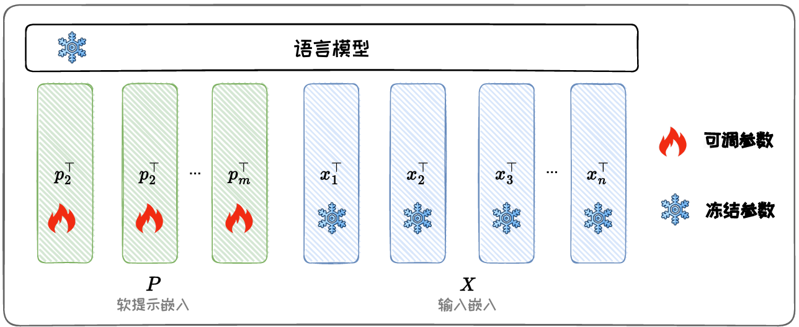
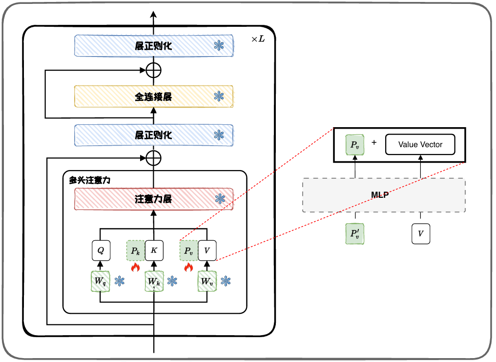
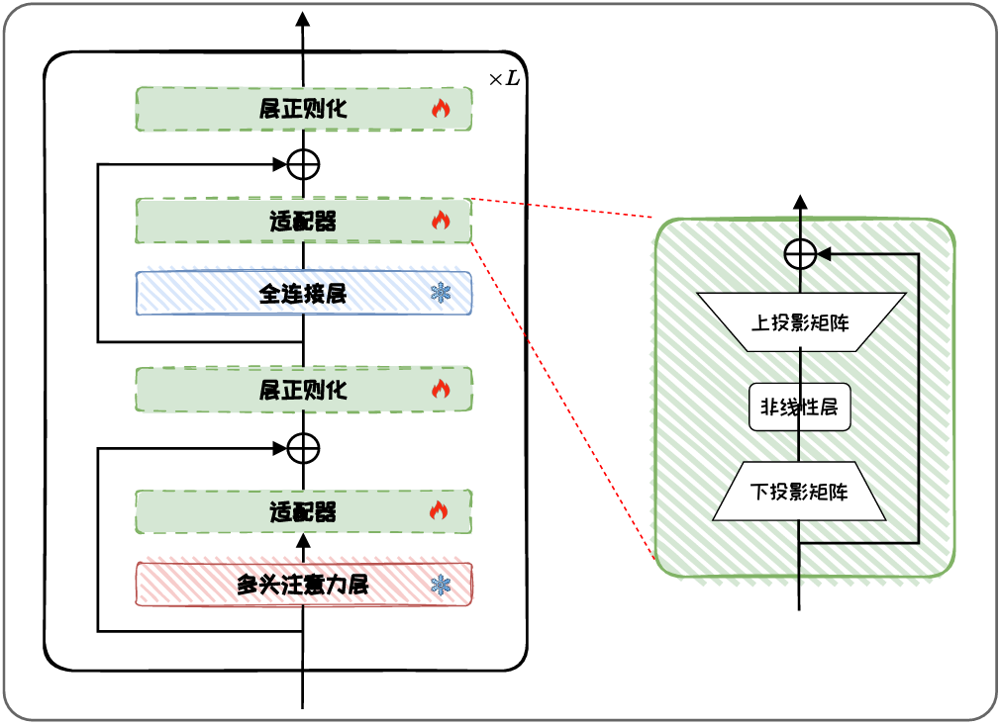
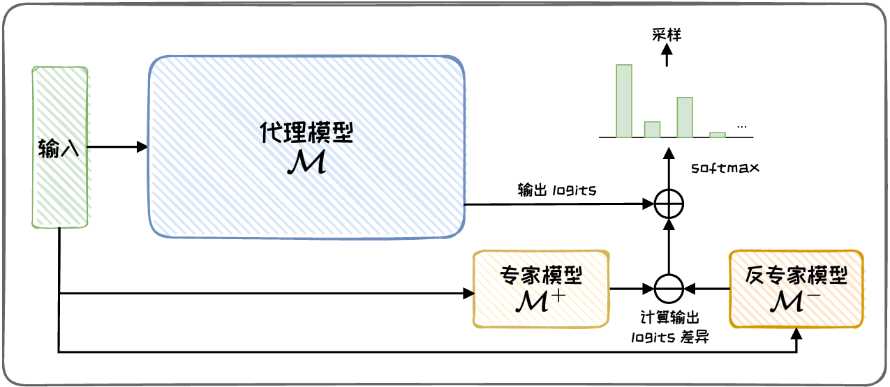

# 参数附加方法

- 通过增加并训练新的附加参数或模块对大语言模型进行微调
- 按附加位置可分为：加在输入、加在模型、加在输出

# 加载输入

- 将额外参数附加到模型的输入嵌入（Embedding）中
- 最经典的方法就是Prompt-tuning
- 软提示Soft Prompt
  - 把额外参数叫做软提示
  - 软提示会在训练过程中被动态调整，本质是可训练的、连续的嵌入
- 优势：内存效率高、多任务能力、缩放特性

## Prompt tuning

- 引入软提示作为模型**输入**的一部分，与实际的文本数据一起送入模型
- 微调过程中，仅软提示的参数会被更新
- 设置合适的软提示长度和合理初始化至关重要

# 加在模型

- 将额外的参数或模型添加到预训练模型的隐藏层中
- 经典的：Prefix-tuning、Adapter-tuning等
- 优势：参数效率高、任务适应性强、保持预训练知识

## Prefix-tuning

- 与Prompt-tuning类似，但对软提示的处理不同
- Prompt-tuning仅将软提示添加到输入嵌入中
- Prefix-tuning将可训练前缀插入到**输入嵌入以及注意力模块**中（叠加到K、V上）
- 提高了参数效率，减少了计算资源的要求

## Adapter-tuning

- 通过在预训练语言模型的每个多头注意力层和全连接层后插入新的可学习神经网络模块（称为适配器-Adapter）
- 适配器模块常采用瓶颈(Bottomneck)结构，包括一个上投影层、一个非线性映射和一个下投影层组成的全连接模块
  - 特征压缩：下头影层将输入的d维特征压缩到低维r，再用上头影矩阵投影回d维，即每层的总参数量为 2dr+d+r
  - 参数量设置：r<<d
  - 适配器定制：可以使用多个投影层，或不同的激活函数和参数初始化策略
- 固定原始模型参数，仅对适配器、层正则化以及最后的分类层参数进行微调， 可大幅缩减微调参数量和计算量

# 加在输出

- 微调模型时，通常会面临一些问题：大规模模型微调困难、黑盒模型；此时可以使用加在输出的方法
- 优势：一定程度上解决大规模语言模型微调和黑盒模型微调这两个问题

## 代理微调Proxy-tuning

- 只需要微调较小的专家模型，且只需要访问大规模语言模型的输出词汇表预测分布，来实现 对大模型的定制化调整

- 给定待微调的代理模型M以及较小的反专家模型M-，这两个模型需要有相同的词汇表。对M-进行微调，得到微调后的专家模型M+，然后用两个模型的logits影响大模型的输出

- 在每一个自回归生成的时间步中，代理微调首先计算专家模型M+和反专家模型M-之间的logits分布差异，然后将其加到代理模型M下一个词预测的logits分布中

- 步骤

  - 针对每一个时间步 $t$ 的输入序列 $x_{<t}$，从代理模型 $M$、专家模型 $M^+$ 和反专家模型 $M^-$ 中获取相应的输出分数 $s_M$、$s_{M^+}$、$s_{M^-}$。通过下式调整目标模型的输出分数 $\tilde{s}$。

  $$
  \tilde{s} = s_M + s_{M^+} - s_{M^-}
  $$

  - 然后，使用 $softmax(\cdot)$ 对其进行归一化，得到输出概率分布。最后，在该分布中采样得到下一个词的预测分布。

  $$
  p_{\tilde{M}}(X_t | x_{<t}) = softmax(\tilde{s})
  $$

# 比较

1. 加在输入
   - 通过在输入序列中添加可学习的张量，对模型本身的结构修改较小
   - 灵活性较好
2. 加在模型
   - 保持了原始预训练模型的参数
   - 在泛化能力上表现更好
3. 加在输出
   - 能以更小的代价驱动更大参数量的黑盒模型
   - 在模型不可知的情况下有更实际的应用前景