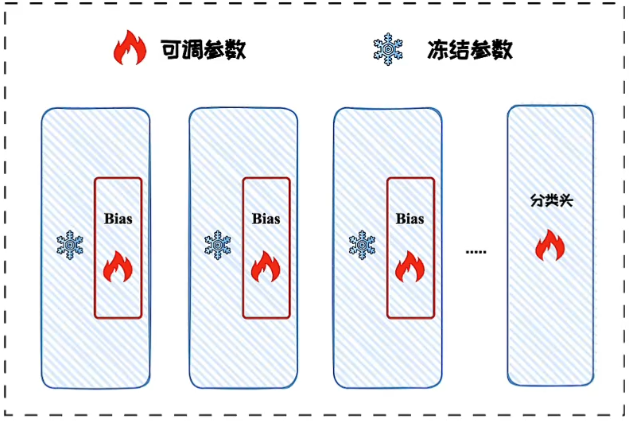
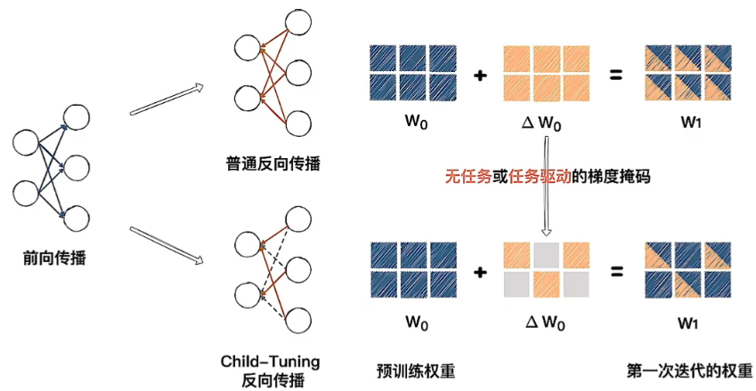

# 参数选择方法

- 选择模型中的部分参数进行微调
- 主要分为：基于规则的方法和基于学习的方法
- 大模型不常用，之前如BERT等小模型常用
- 优点：微调成本低、适应性较好
- 缺点：选多少难抉择

# 基于规则的方法

- 根据**领域专家的知识和经验**来指导模型的调整过程，通过分析任务的特点和数据集的特性，来确定模型中的哪些部分需要更多的关注或优化
- 如：
  - BitFit方法
  - 还有一些仅微调特定的Transformer层来提高参数效率，如仅调后四分之一层等

## BitFit方法

- 通过仅优化神经网络中的每一层的偏置项(Biases)以及任务特定的分类头来实现参数高效微调
- 仅在小模型(如BERT、RoBERT等)上验证过性能，在更大规模模型上的性能表现未知
- 参数效率高、性能表现较好、过程较稳定

# 基于选择的方法

- 利用算法**自动识别和选择**在训练过程中应该被更新的参数子集，而不是依赖于预先设定的规则或专家的判断
- 如Child-tuning、Fish-Dip、LT-SET、SAM等

## Child-tuning

- 通过**梯度掩码矩阵**策略实现仅对选中的子网络进行梯度更新，而屏蔽子网络梯度以外的梯度，从而实现对微调策略的选择

