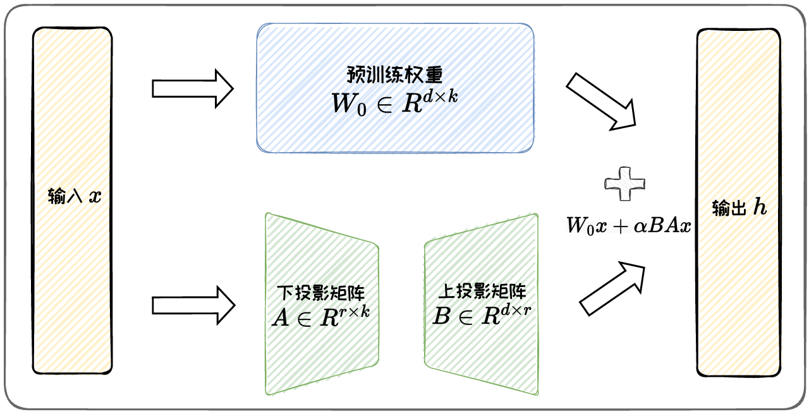
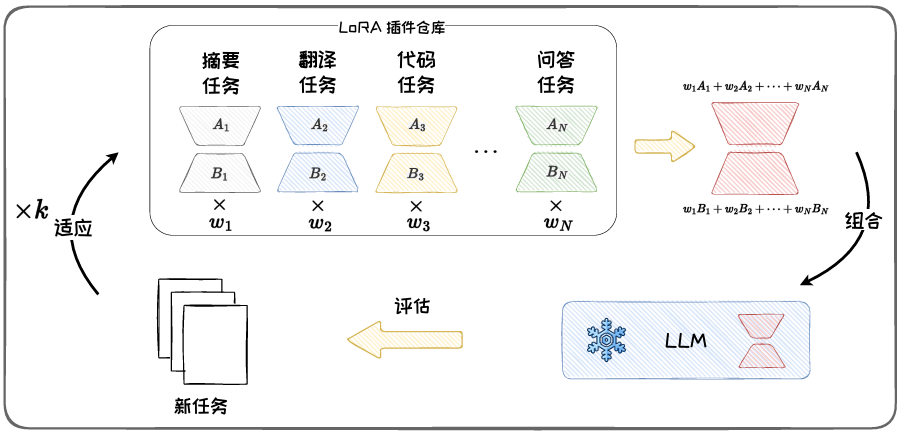
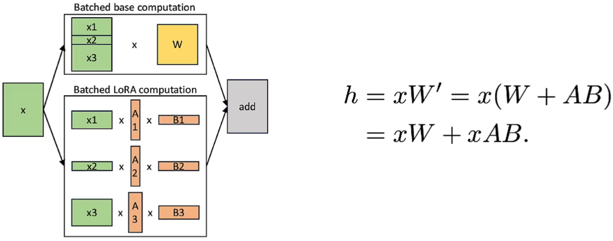

# 低秩适配方法

- 目前应用最为广泛的方法
- 通过低秩矩阵近似原始权重更新矩阵，并仅微调低秩矩阵，以大幅降低模型参数量

# 本征维度假设

- 在预训练语言模型微调时，仅在一个低维子空间中进行参数更新，也能实现与完整参数更新类似的性能
- 本征维度：可以使模型达到预期效果的最小参数子空间的维度
- 本征维度计算方法：通过逐渐增加子空间的维度，并确定模型性能达到预设阈值（如达到基线性能的90%）时的维度，来测量这一数值
- 数据或任务通常位于一个低维的流形上，模型只需要关注于任务相关的特征，而不是整个高维空间

# 应用最广泛：LoRA

## LoRA

- 将$d×k$参数更新矩阵低秩分解为一个$r×k$的矩阵和一个$d×r$的矩阵（$r<<min(d,k)$），冻结原模型参数，仅微调这两个小矩阵
- LoRA学习两个低秩矩阵B和A，近似原始参数更新矩阵
- LoRA通常施加在Attention或FFN层的投影矩阵上
- 在推理阶段，LoRA可以直接合并回原模型，不增加额外代价
- LoRA使用更少的参数量达到匹配甚至超过全量微调的性能

## 性能影响因素

1. 权重初始化方式
   - 有较大影响
   - 通常将**投影矩阵B用0**初始化：保证ΔW=BA初始状态为0，保持在微调开始时原始模型的状态
   - 将**A用高斯分布**初始化：保证A的值不会太大或存在偏移，提高训练稳定性
2. LoRA的秩r
   - 简单任务中，LoRA使用较低的秩就能保持不错的性能
   - 在跨领域迁移或复杂任务时，较高的秩往往表现更好
3. 施加位置
   - 施加在不同位置的权重矩阵上会带来不同的影响
   - 在只微调一种权重矩阵时，放在FFN层效果更好
   - 保持微调总参数量不变，微调矩阵的种类越多，效果越好（Q、K、V、FNN全放效果更好，但是参数量要求更高）

## 优势

- 参数效率高
  - 仅微调部分低秩参数
- 插件化特性
  - 体外训练的插件，可以独立保存，使用时直接叠加在原模型上
- 跨任务泛化
  - 有多个任务的LoRA插件时，可以将插件组合，以获得良好的跨任务泛化性能

## 相关变体

- 四个角度改进：性能改进、任务泛化、训练改进、推理改进

### 性能改进-AdaLoRA

- 实验发现：不同模块和层中的权重矩阵的重要性不同，但LoRA通常均匀地分配增量更新的预算，忽略了差异性
  - 微调FFN层的权重比微调Attention得到的性能更好
  - 顶层的权重矩阵比底层的更重要
- AdaLoRA将参数更新矩阵参数化为**奇异值分解**(SVD)的形式，再通过奇异值剪枝动态调整不同模块中LoRA的秩，秩越大代表该模块参数越重要

### 任务泛化-LoRAHub

- 可以通过组合在不同任务上训练的LoRA模块来提高模型对未见任务的适应性
- 提供了一个可用的多LoRA组合的方法框架
- 该方法将已有任务上学习到的LoRA插件进行组合，从而获得解决新任务的能力
- LoRAHub包括组合和适应

### 训练改进-QLoRA

- 模型量化是将模型参数从高精度表示（如16位浮点数）转换为低精度表示（如4位整数)
- 大模型量化结合LoRA技术可以显著减少存储和计算成本，同时保持模型性能，提高部署效率
- 反量化：是量化的逆过程，训练过程中有时候需要将低精度还原为高精度表示进行计算
- 不同量化方法主要取决于使用不同的分位数quantified，QLoRA提供了一种新的分位数方法
- QLoRA
  - 将原始模型权重从16-bit量化转化位4-bit来存储，只将LoRA参数保持为16-bit，从而节省了权重内存
  - 在前向和反向传播中，为了保持性能，动态地将模型参数反量化为16-bit参与计算，计算后将其释放

### 推理改进-SLoRA

- 将输入与LLM和LoRA参数的运算分离，两者分别计算完成之后再求和得到最终结果
- 使得不同LoRA的请求可以放在同一个batch中，从而增加了请求执行的并行度，提高了GPU的效率
- 要求：只能在线性计算中使用（只支持attention的LoRA，FFN层的不支持）
- 将KVCache扩展到LoRA参数，使用一个统一的内存池对KVCache和LoRA进行管理，内部采用页为存储的基本单位
- S-LoRA在运行当前batch时会预测下一个batch会用到的LoRA并进行预取，从而将计算和数据传输重叠
- 对于参数更多、需要放在多块GPU上的语言模型，S-LoRA对张量并行进一步优化，将预训练模型的all-reduce通信和LoRA的all-gather通信进行融合，降低了通信开销

# 微调时内存占用

- 微调时，内存占用包括权重、激活、梯度、优化器四个方面
  - 权重内存：用于存储模型权重所需的内存
  - 激活内存：前向传播内存时中间激活带来的显存占用
  - 梯度内存：在反向传播期间需要用来保存梯度的内存
  - 优化器内存：用于保存优化器状态的内部存在
- LoRA在梯度内存和优化器内存上进行了优化，微调时有较高的参数效率