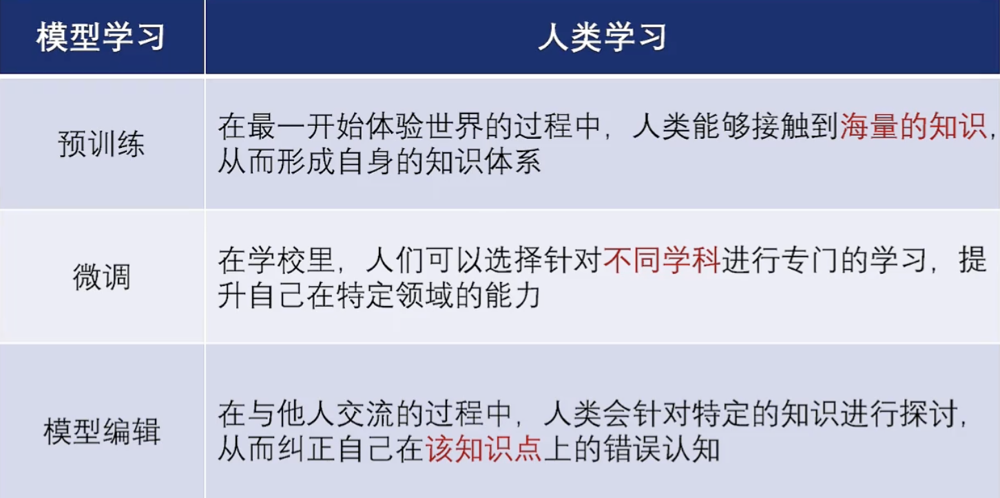
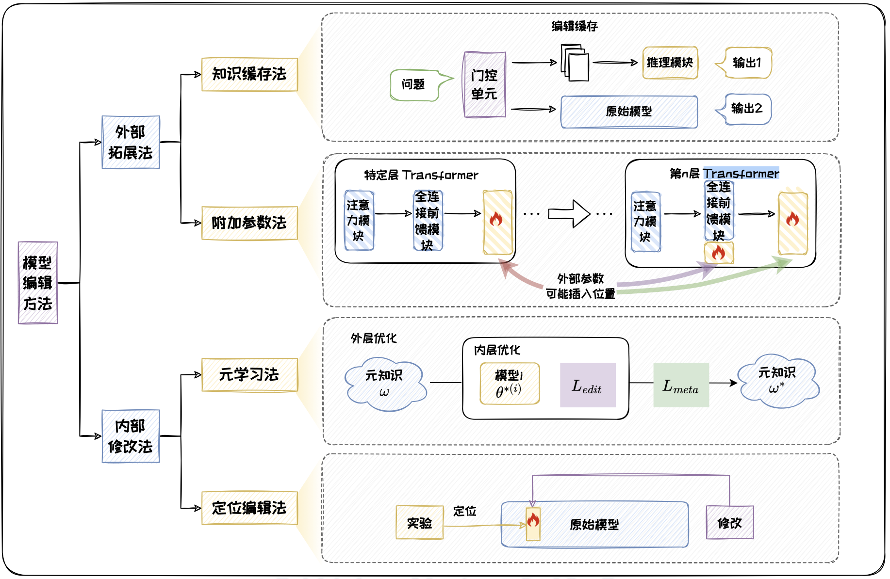
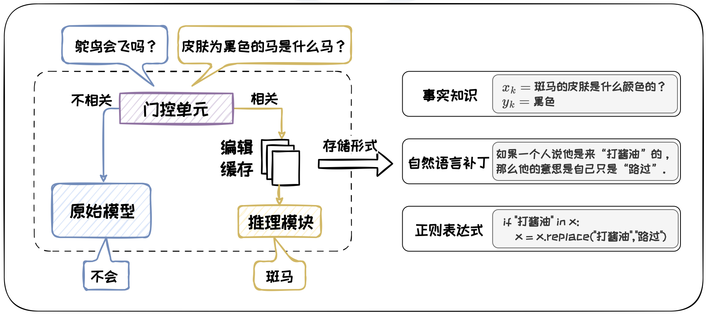
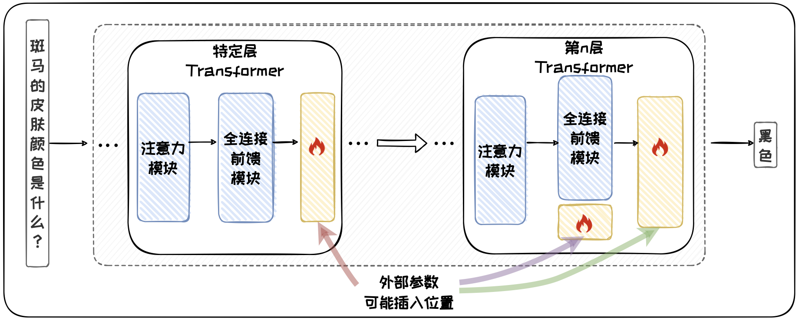
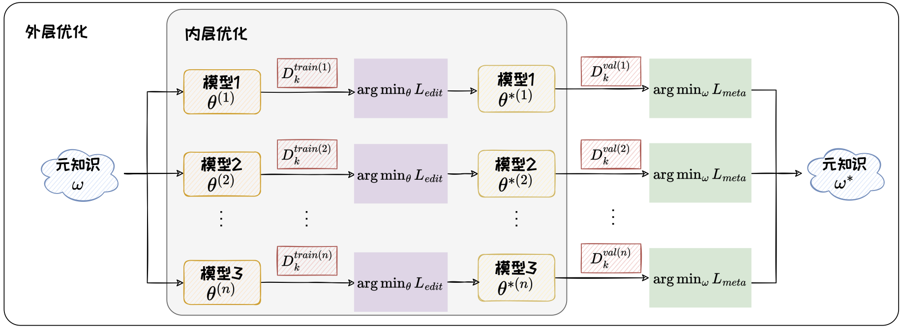
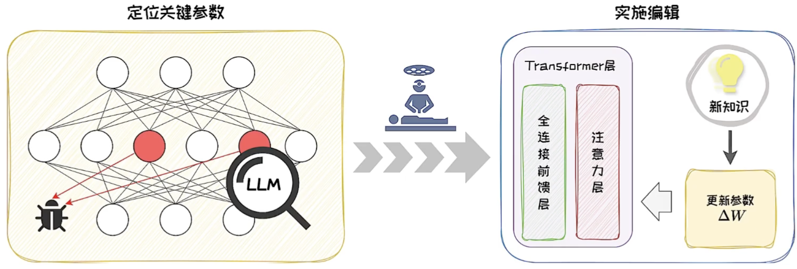
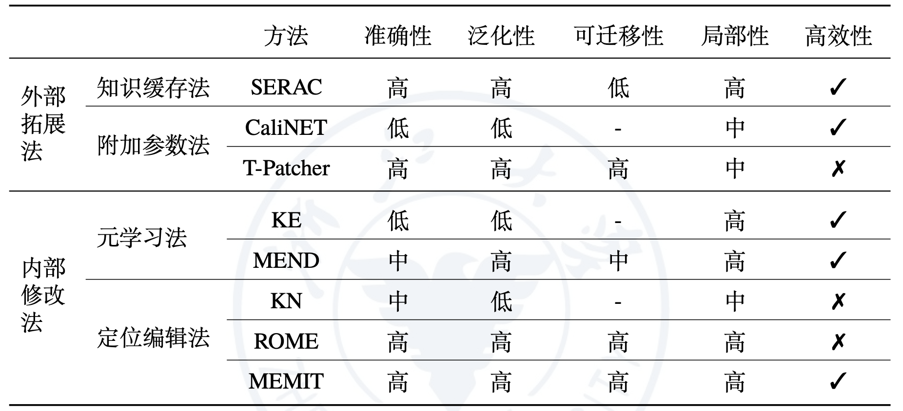

# 大模型中存在混乱信息

预训练大语言模型中可能存在大量混杂信息，包括偏见、毒性和知识错误等问题

## 偏见

- 偏见是指模型生成的内容中包含刻板印象和社会偏见等不公正的观点
- 如：大模型可能对特定职业具有固定性别偏见
- 直接输出偏见、嵌入空间偏见

## 毒性

- 毒性是指模型生成的内容中包含有害成分

## 知识错误

- 知识错误是指模型提供的信息与事实不符

## 可能的解决方案

- 重新预训练
  - 用清洗过的数据重新进行预训练
  - 但是成本过高
- 微调
  - 利用微调技术向大模型注入新知识
  - 容易导致过拟合和灾难性遗忘
- **模型编辑**
  - 更好的方法
  - 模型编辑技术针对特定知识点对模型进行编辑，其旨在修正大模型使其输出期望结果，同时不影响其他无关输出

# 模型编辑

模型编辑技术针对特定知识点对模型进行编辑，其旨在修正大模型使其输出期望结果，同时不影响其他无关输出

## 定义

> 将编辑前模型定义为 $M$，编辑后模型定义为 $M^*$。
>
> 每一次编辑都修改模型的一个知识点$k$，知识点 $k$ 由问题 $x_k$ 及其对应的答案 $y_k$组成。那么，模型编辑的目标可以表示如下：
>
> $$
> M^*(x) = 
>   \begin{cases} 
>    y_k, & \text{若 } x = x_k \text{ 或 } x \text{ 与 } x_k \text{ 相关}, \\
>    M(x), & \text{若 } x \text{ 与 } x_k \text{ 无关}。
>   \end{cases}
> $$

## 思想类比

## 挑战

- 不可错误编辑：要将指定知识编辑正确
- 不可只顾自己：相同知识点的不同表达也要编辑
- 不可顾此失彼：相关知识点也要编辑（知识要有迁移性）
- 不可伤及无辜：无关知识点不可编辑（编辑要有局部性）

## 模型编辑关键性质

1. 准确性
   - 衡量对某个知识点的直接修改是否有效
2. 泛化性
   - 用来衡量编辑后模型能否适应目标问题的其他表达形式，即判断模型在面对与目标问题具有语义相似性的问题时，能否给出统一的目标答案。
   - 除了衡量标准，还需要数据
3. 可迁移性
   - 编辑后模型将特定知识点迁移到其他相关问题上的能力
   - 可迁移性数据集--知识点相关但答案不同的问题
4. 局部性
   - 要求编辑后的模型不影响其他不相关问题的输出
   - 局部性数据集--知识点无关的问题
5. 高效性
   - 主要考虑模型编辑的时间成本和资源消耗，直接影响到模型编辑的可行性和实用性

## 常用数据集

zsRE（知识关联）、COUNTERFACT（知识关联）、Hallucination（幻觉）、ConvSent（情感分析）

## 模型编辑方法

可分为：

- 外部拓展法（通过设计特定的外置知识体，通过知识体的知识控制模型作答）

- 内部修改法（通过调整模型内部特定层或神经元，来实现对模型输出的精确控制）

### 外部拓展法

核心思想是将新知识存储在附加的外部参数或外部知识库中，将其与原始模型一起作为编辑后模型

1. 知识缓存法

   - 需要时查阅获取特定知识
   - 三个组件：编辑缓存、门控单元和推理模块
   - 编辑缓存充当一个知识存储库，用于保存需要修改的知识。
   - 首先，门控单元检查输入问题是否与编辑缓存中的知识点匹配，若匹配，将知识点与输入一同送入推理模块，得出答案；若不匹配，使用原始模型进行推理得到答案
   - 如：SERAC
     - 将新知识点保存在编辑缓存模块，对于输入的问题，首先通过范围分类器（门控单元）判断是否与某个新知识点有关，如果有关，则利用反事实模型（推理模块）预测输入的问题在新知识点下的输出结果，否则，利用原始模型进行推理

   

2. 附加参数法

   - 将外部参数插入到模型的特点位置，冻结原始模型，只训练新引入的参数以修正模型输出
   - 如：CALINET
     - 首先通过一种对比知识评估方法找出原始模型的知识错误，然后在模型最后一个全连接前馈模块添加一个新的参数矩阵，将其称为校准FFN，在不同的输入问题下，训练同一个校准FFN来纠正输出的next token，从而纠正模型的错误
     - 编辑多个问题的多个答案，一对多
   - 如：T-Patcher
     - 在模型最后一个Transformer的全连接前馈层中添加一堆键值向量组成的额外参数，在不同问题下，训练相应的补丁进行激活，来纠正输出答案中的每个token
     - T-Patcher中的每个补丁独立训练，更适合连续编辑的场景。
     - 一对一

   

### 内部修改法

核心思想是通过更新原始模型的内部参数来为模型注入新知识，在不增加物理存储负担的情况下直接优化自身，提高其在特定任务上的表现

1. 元学习法

   - 指的是模型“学习如何学习”的过程
   - 元学习通过多个任务上的学习积累经验，也被称为“元知识”，从而知道模型更高效地学习新任务
   - 元学习通过双层优化的过程得到元知识（包括模型初始化参数、优化器参数、超网络架构等）
   - 如：KE
     - KE将超网络作为元知识，学习的是“如何更新模型的参数以修改特定知识“的能力
     - 在KE中，训练好的超网络根据输入问题生成模型的参数更新值，使模型能够在特定输入下输出期望的结果，同时保持其他预测不变
   - 如：MEND
     - 同样将超网络作为元知识，通过低秩分解的方法来优化超网络辅助模型参数更新的过程，进一步增强了超网络对于大型语言模型的普适性

   

2. 定位编辑法

   - 对原始模型的局部参数进行编辑，先定位到需要修改的参数的位置，然后修改关键参数
   - 如：KN知识神经元
     - KN将全连接前馈模块的每个中间激活值定义为一个知识神经元，认为知识神经元的激活与相应知识点的表达密切相关，通过定位知识神经元并尝试修改其对应的键向量来进行编辑
   - 如：ROME
     - 通过因果跟踪实验来定位与编辑知识最相关的一个全连接前馈层，然后求解一个带约束的最小二乘问题，得到其中的下投影矩阵的变化量，从而实现编辑
   - 如：MEMIT
     - 通过因果跟踪实验定位出多个关键的全连接前馈层，将批量的知识更新分布在多个全连接前馈层的参数矩阵上，减小参数变化幅度，提高批量编辑的鲁棒性

   

### 比较方法

# 模型编辑应用

- 精准模型更新
- 祛除毒性：有针对地引导模型输出更积极的内容，更高效的方案
- 减弱偏见
- 保护隐私信息：机器遗忘（梯度上升法、知识蒸馏法、PEM操作、上下文遗忘法等）与模型编辑