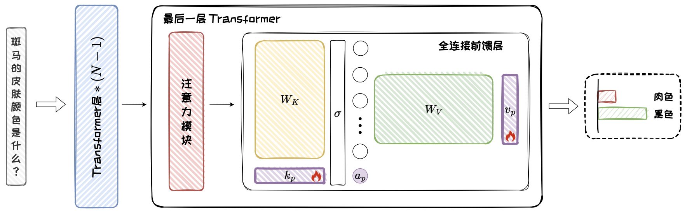
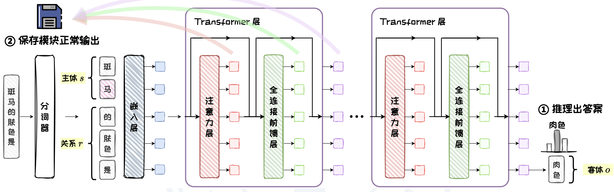
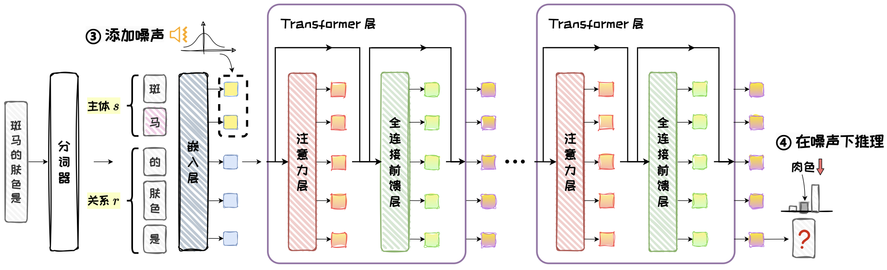
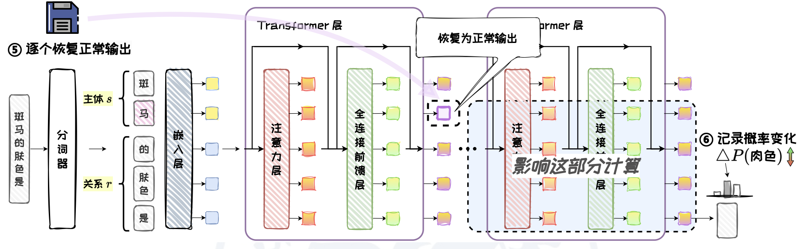
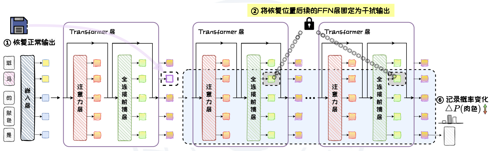
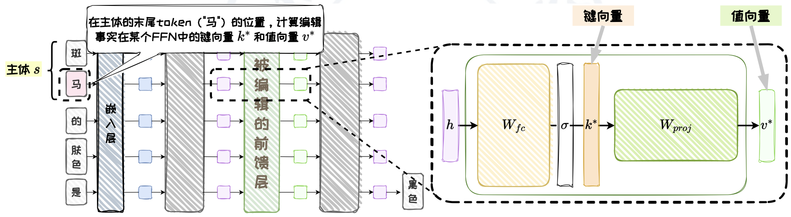
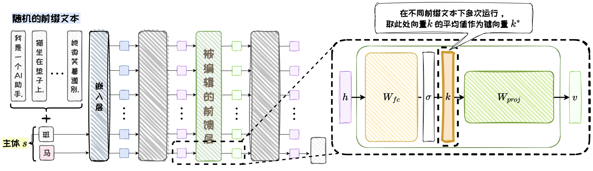
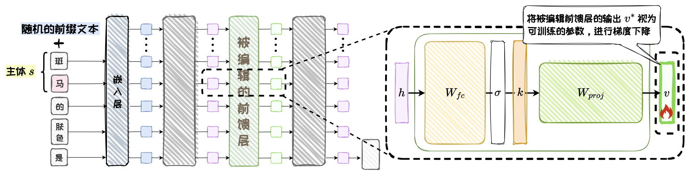
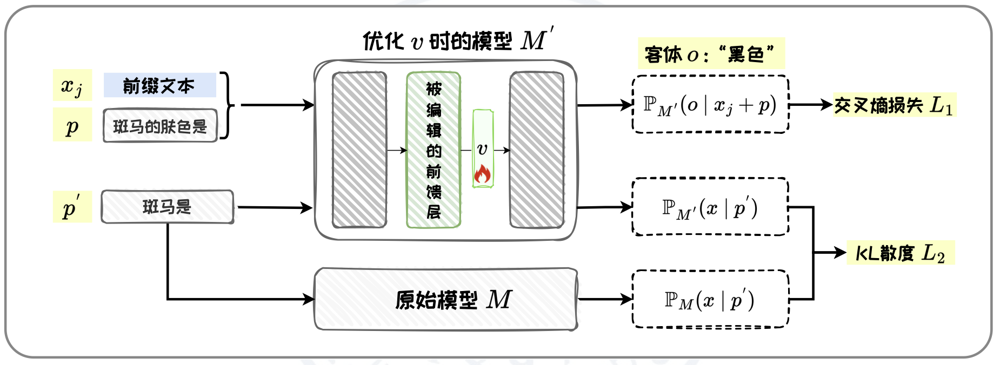
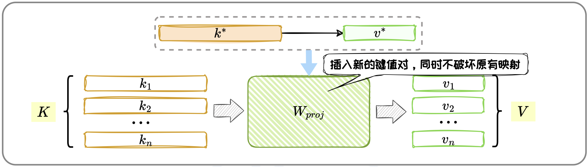

# 附加参数法：T-Patcher

在不改变原始模型整体架构的情况下，通过在模型最后一个Transformer层的全连接前馈层中添加额外参数（成为“补丁”），并对这些补丁进行训练来完成特定知识的编辑

## 补丁的位置

- 模型不同位置添加补丁会影响编辑效果
- 有研究发现全连接前馈层可被视为键值存储体，是存储知识的关键模块
- T-Patcher通过在最后一个Transformer层的全连接前馈层中添加补丁并精确控制其激活，能针对特定输入进行修正
- 每个补丁的参数包括一个键向量$k_p$、一个值向量$v_p$和一个偏置项$b_p$
- 补丁就像一个很小的修正器，只会被相关的输入查询激活

## 补丁的实现

- T-Patcher为每个需要编辑的Token都添加一个补丁，从编辑的准确性和局部性两个角度设计损失函数，训练补丁调整输出

- 损失函数：准确性损失+局部性损失
  $$
  L_p=L_{Acc}+\beta \cdot L_m
  $$
  

  - 准确性损失：

    - (3)：激活损失，确保补丁在目标输入下可以被激活
    - (4)：编辑损失，确保补丁能够调整模型输出以符合预期的结果

    $$
    L_{Acc} = l_a(\boldsymbol{k}_p, b_p) + \alpha l_e(\boldsymbol{k}_p, \boldsymbol{v}_p, b_p)
    $$

    $$
    l_a(\boldsymbol{k}_p, b_p) = \exp(-\boldsymbol{q}_e \cdot \boldsymbol{k}_p - b_p)
    $$

    $$
    l_e(\boldsymbol{k}_p, \boldsymbol{v}_p, b_p) = CE(y_e, p_e)
    $$

    

  - 局部性损失：

    - (6)：确保补丁不会对无关的输入进行激活
    - (7)：放大补丁对目标查询向量$q_e$和无关查询向量$q_i$的激活值差距

    $$
    L_m = l_{m1}(\boldsymbol{k}_p, b_p) + l_{m2}(\boldsymbol{k}_p, b_p, \boldsymbol{q}_e)
    $$

    $$
    l_{m1}(\boldsymbol{k}_p, b_p) = \frac{1}{|D_M|} \sum_{i=1}^{|D_M|} (\boldsymbol{q}_i \cdot \boldsymbol{k}_p + b_p - \beta)
    $$

    $$
    l_{m2}(\boldsymbol{k}_p, b_p) = \frac{1}{|D_M|} \sum_{i=1}^{|D_M|} ((\boldsymbol{q}_i - \boldsymbol{q}_e) \cdot \boldsymbol{k}_p + b_p - \gamma)
    $$

- 

# 定位编辑法-ROME

- 由于大模型的内部状态是可见的，因此可以自由地设计对照试验，从而确定模型内部知识存储的位置。ROME通过因果跟踪实验和阻断实验定位知识所在，以此为基础实现更有效的编辑。

## 因果跟踪实验

- 采用控制变量的策略，探究模型中不同结构与特定知识在推理过程中的相关性，即因果效应，从而确定知识在模型中的具体位置
- 包括三个步骤：正常推理、干扰推理、恢复推理
- 根据实验结果，ROME认为模型中间层的全连接前馈层可能是存储知识的关键位置，知识回忆则与Last Subject Token（主体的最后一个token）有关

### 正常推理

- 将问题输入语言模型 $q=(s, r) $，让模型预测出客体 $o$
- 在此过程中，保存模型内部的所有模块的正常输出，用于后续恢复操作

### 干扰推理

- 向主体s的嵌入层输出添加噪声，破坏其向量表示
- 在这种破坏输入的情况下，让模型进行推理，在其内部形成被干扰的混乱状态

### 恢复推理

- 在干扰状态下，将模型内部所有的隐藏状态分别独立地恢复为正常状态，再进行推理，记录恢复前后模型输出正确答案的概率增量，即因果效应

### 阻断实验

- 为进一步区分全连接前馈层和注意力层在Last Subject Token处的因果效应中所起的作用，ROME对两种结构分别进行了阻断实验
- 阻断实验的结果确认了Last Subject Token在中间层的因果效应来自全连接前馈层

## 知识存储假设

- 键值存储体：全连接前馈层可被看作键值存储体，用以存储知识
- 注意力头移动信息：自注意力机制具有信息复制的作用，从一个Token的残差流中读取信息，并将其写入另一个Token的残差流
- Transformer层可交换：在Transformer架构中，不同层的位置可以互换，但模型的性能和输出结果不会显著变化
- ROME推测知识以键值映射的形式等价地存储在任何一个中间层的全连接前馈层中，并对语言模型中的知识存储作出了假设

## 精准知识编辑

- ROME通过因果跟踪实验先定位出一个因果效应较强的全连接前馈层，然后对其进行编辑
- 编辑过程包括：确定键向量、优化值向量、插入知识

### 确定键向量

- 首先确定键向量$k^*$，它应该编码着主体s
- 根据知识存储假设，ROME直接读取Last Subject Token在全连接前馈层激活函数之后的向量表示作为键向量
- 为确保$k^*$泛化性，在s前拼接随机的前缀文本进行多次推理，取平均结果
- k(x)是输入Prompt x时，Last Subject Token在全连接前馈层激活函数之后的输出

$$
k^* = \frac{1}{N} \sum_{j=1}^{N} k(x_j + s)
$$

### 优化值向量

- 确定值向量$v^*$，它应该将待编辑知识的$(r, o)$编码为$s$的属性
- 值向量是$W_{proj}$与$v^*$运算后的期望结果，即编辑后全连接前馈层处理Last Subject Token的输出

- ROME通过设计损失函数来优化值向量，确保编辑的准确性和局部性

  - (10)：最大化正确答案的概率，交叉熵损失，确保准确性
  - (11)：在特定Prompt下最小化编辑前后模型输出的KL散度，KL散度损失，确保局部性

  $$
  \mathcal{L}(v) = \mathcal{L}_1(v) + \mathcal{L}_2(v)
  $$

  $$
  \mathcal{L}_1(v) = \frac{1}{N} \sum_{j=1}^{N} -\log \mathbb{P}_{M'}(o \mid x_j + p)
  $$

  $$
  \mathcal{L}_2(v) = D_{KL}(\mathbb{P}_{M'}(x \mid p') \| \mathbb{P}_{M}(x \mid p'))
  $$

### 插入新知识

- ROME将$W_{proj}$视为一个线性的键值存储体，其目标是向$W_{proj}$添加新的键值对$(k^*, v^*)$，同时不破坏原有的映射关系

- 将新知识的插入过程建模为一个最小二乘问题，并通过求解这个问题来确定的最优变化量

  - K-键向量矩阵，包含原有的键向量；V-值向量矩阵，包含原有的值向量
  - $\hat{W}$-推导出闭式解

  $$
  min \|\hat{W}K - V\| \\
  \text{s.t. } \hat{W}k^* = v^*。
  $$

  $$
  \hat{W} = W + \Lambda(C^{-1}k^*)^T
  $$

