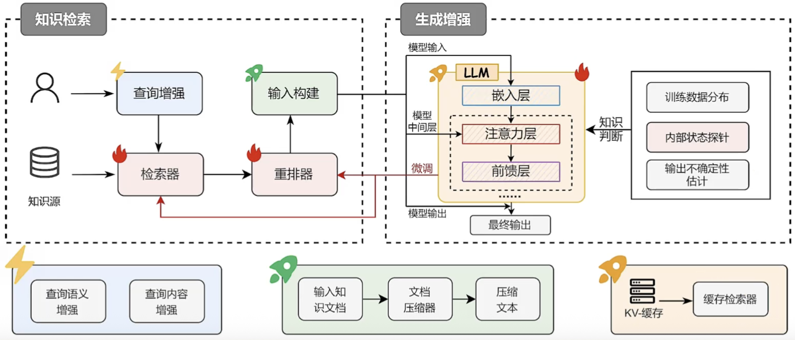
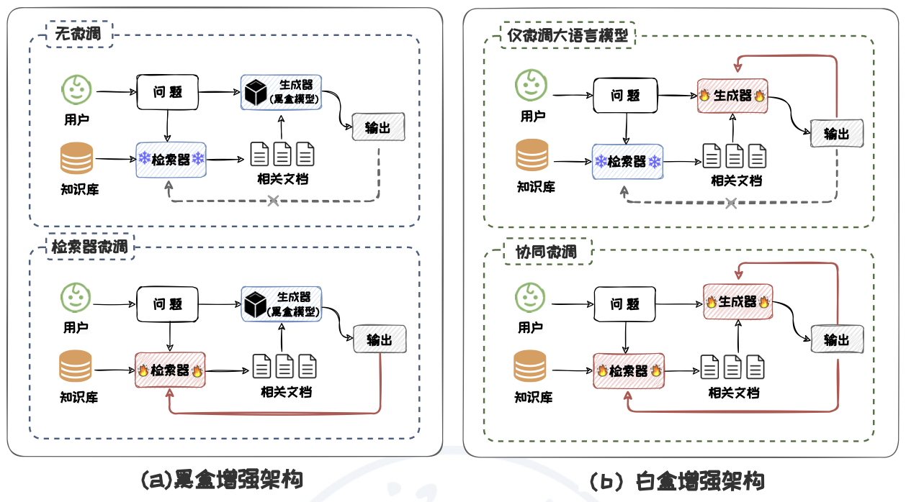
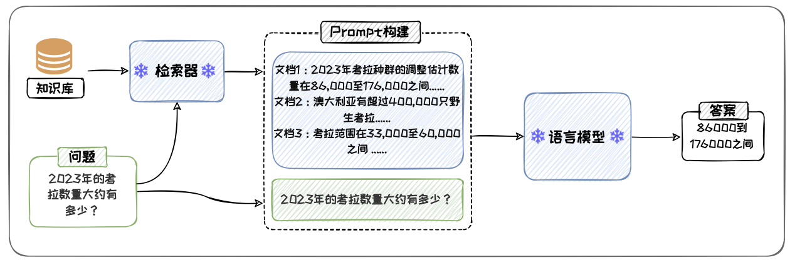
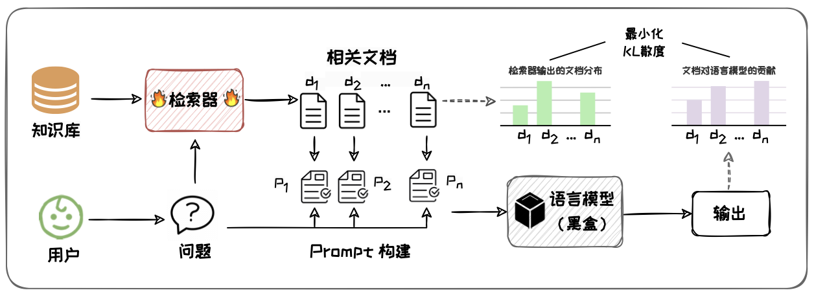
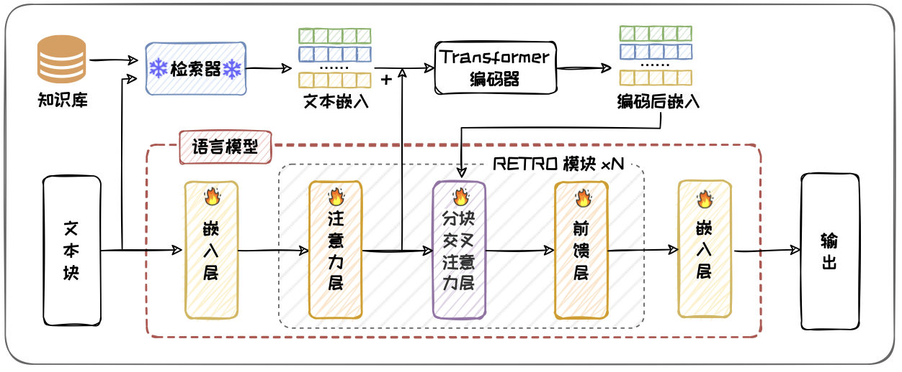
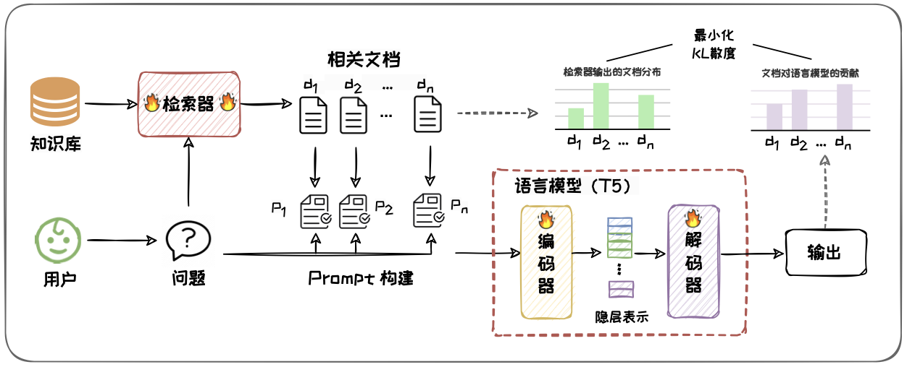
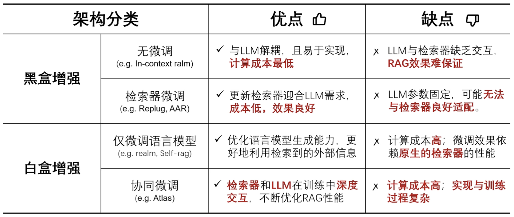

# 幻觉现象

- 大语言模型LLM生成的内容可能存在“幻觉”现象：生成内容看似合理但实际上逻辑混乱或与事实相悖
- 可能直接来源于训练数据中的知识错误，也可能源于训练出的模型本身对知识的掌握不足

## 幻觉现象-训练数据

- 知识过时：由于训练数据中的时间滞后，其中的知识可能在模型训练后又发生了更新，导致模型内部知识过时
- 知识边界：由于训练数据的有限性，无法覆盖所有范围，且知识在训练数据采集完成后仍会不断新增
- 知识偏差：训练数据中可能包含不实与偏见信息
- 对齐不当：在模型与人类偏好对齐阶段中，偏好数据标注不当可能引入了不良偏好

## 幻觉现象-模型本身

- 知识长尾：训练数据中部分信息的出现频率较低，导致模型对这些知识的学习程度较低
- 曝光偏差：由于模型训练与推理任务存在差异，导致模型在实际推理时存在偏差
  - 模型训练过程采用Teacher Forcing，推理过程会出现错误累积
- 解码偏差：模型解码策略中的随机因素可能影响输出的准确性

# RAG

对于大模型，可以通过检索与问题相关的信息进行辅助，从而有效缓解“幻觉”现象，大幅提升模型的生成质量，这便是检索增强生成RAG的核心思想

## 概念与组成

- RAG（Retrieval- Augmented Generation），即检索增强生成，是一种从外部数据库中检索相关信息来辅助改善大模型生成质量的系统
- 一个基本的RAG框架主要包含知识检索和生成增强两大模块
  - 知识检索：对输入问题进行编码，从大规模的知识库中高校检索出与问题相关的文档。常用的检索方法包括基于关键词匹配的稀疏检索算法与基于神经网络的稠密检索算法
  - 生成增强：利用检索文档和输入问题，生成最终的输出序列，一般采用预训练语言模型，如LlaMA等。生成器利用外部知识的最常见的方式便是通过Prompt的形式

## RAG架构分类

大模型根据参数进行感知和调节可以分为黑盒模型和白盒模型

其中，闭源模型视为黑盒模型，而开源模型根据是否对参数微调即可视作白盒模型也可视作黑盒模型

- 从是否对大模型进行参数更新的角度出发，RAG架构可分为：黑盒增强架构和白盒增强架构
  - 黑盒增强架构可根据是否对检索器进行微调分为两类：无微调和检索器微调
  - 白盒增强架构也可根据是否对检索器进行微调分为两类：仅微调大语言模型和检索器与大语言模型协同微调（简称协同微调）

### 黑盒增强架构-无微调

- 检索器和大模型在RAG过程中参数不更新，二者直接组合使用来完成任务
- 代表方法：In-Context RALM
  - 其直接将检索器检索到的文档前置到输入问题前作为上下文
  - 优点：与大模型解耦，易于实现，计算成本最低，相比于无检索提升性能
  - 缺点：该方法大模型与检索器缺乏交互，完全依赖大模型的指令跟随能力，RAG整体效果难保证
  - 需要一个高阶的大模型

### 黑盒增强架构-检索器微调

- 大模型参数固定，检索器参数根据大模型的输出进行更新，使检索器能更好地适应大模型的需求
- 代表方法：REPLUG
  - 其使用语言模型的困惑度作为监督信号来训练检索器，以检索出能够显著降低语言模型困惑度的文档
  - 优点：更新检索器以迎合大模型的需求，无需更新LLM，成本低，效果良好
  - 缺点：LLM参数固定，可能无法与检索器良好适配

### 白盒增强架构-仅微调语言模型

- 检索器作为一个预先训练好的组件其参数保持不变，大模型根据检索器输出对自身参数进行更新
- 代表方法：RETRO
  - 其检索结果抽成向量，通过交叉编码，将检索信息动态地融合到大模型的隐藏状态中
  - 优点：该方法能优化语言模型生成能力，使其能够更好地利用检索到的外部信息
  - 缺点：微调资源需求高，微调效果依赖原生的检索器的性能

### 白盒增强架构-协同微调

- 检索器和语言模型的参数更新同步进行
- 代表方法：ATLAS
  - 其使用KL散度损失函数来联合训练检索器和语言模型，以确保检索器输出的文档相关性分布与文档对语言模型的贡献分布相一致
  - 优点：检索器和语言模型能够在训练过程中深度交互，不断优化RAG性能
  - 缺点：资源需求高，实现与训练过程复杂

### 对比与分析

# RAG的应用

- 多模态
  - 如医疗领域
- Agent
  - Agent运行过程中，需要检索并整合多样化的信息资源，需要用RAG技术
  - 记忆模块：RAG辅助记忆检索与更新
  - 计划模块：RAG利用信息辅助规划任务
  - 行动模块：RAG检索信息辅助决策与行动执行
- 企业落地
  - RAG技术对下一代AI产品开发至关重要
  - 如谷歌-DataGemma、阿里云、腾讯云等提出RAG解决方案
  - RAG可解决AI产品三个最大的痛点问题：准确性、数据安全性、幻觉
