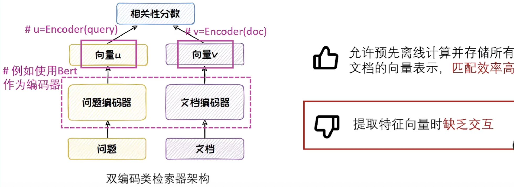

# 知识检索

如何检索出相关信息来辅助改善大模型生成质量的系统

知识检索通常包括知识库构建、查询构建、文本检索和检索结果重排

## 知识库构建

1. 数据采集与预处理：数据采集与预处理为构建知识库提供“原材料”
   - 数据预处理：数据清洗和文本分块（固定大小分块和基于内容的分块）
2. 知识库增强：通过改进和丰富知识库的内容和结构，为查询提供“抓手”，包括伪查询生成与标题生成两种方法
   - 伪查询生成：利用大模型生成与知识库的文档内容紧密相连的伪查询，作为相关文档的键
   - 标题生成：利用大模型为没有标题的文档生成合适的标题，可快速理解文档内容，并更准确定位相关信息

## 查询构建

- 旨在通过查询增强的方式，扩展和丰富用户查询的语义和内容，提高检索结果的准确性和全面性，“钩”出相应内容
- 分为语义增强和内容增强

### 查询语义增强

- 同义改写：通过将原始查询改写成相同语义下不同的表达方式，来解决用户查询单一的表达形式可能无法全面覆盖到知识库中多样化表达的知识点问题
- 多视角分解：采用分而治之的方法处理复杂查询，将复杂查询分解为不同视角的字查询，以检索到查询相关的不同角度的信息，从而生成更为全面的答案

### 查询内容增强

- 背景文档生成：旨在利用大模型在原始查询的基础上，生成与查询内容相关的背景文档，从而丰富查询的广度与深度

## 文本检索

给定知识库的用户查询，文本检索旨在找到知识库中与用户查询相关的知识文本，检索效率增强旨在解决检索时的性能瓶颈问题

优化检索过程，提升检索的质量和效率，对改善RAG的性能具有重要意义

常见的文本检索器分为三类：判别式检索器、生成式检索器和图检索器

### 判别式检索器

对问题和文档进行特征向量提取，以得到问题和文档的相关性分数

1. 稀疏检索器：其使用稀疏表示法来匹配文本，TF-IDF是典型的方法

  - TF-IDF基于词频TF和逆文档频率IDF来衡量词语在语料库中的重要性，然后用此重要性对文本进行编码
  - 对语义理解不足

  

2. 稠密检索器：把文档利用预训练编码器(如BERT)向量化

  - 双编码检索器：首先将查询和文档首先各自通过独立的编码器生成各自的向量表示，再对这两个向量之间的相似度进行计算，以评估他们的相关性

  

  - CoIBERT：为解决双编码器检索器查询与文档在提取特征向量时缺乏交互的问题，CoIBERT以查询和文档间的Token级的相似度为度量，通过对比学习时双编码器进行微调

  

  - 交叉编码检索器（强交互）：”端到端“的给出查询与文档的相似度。该类检索器将查询和文档结合后直接输入到模型中，最终模型输出一个介于0到1之间的数值，用以表示查询与文档之间的相似性

  

3. 判别式检索效率增强

   - 海量文本的向量编码存储在向量数据库中，对其中编码进行注意检索缓慢而低效，高效的向量索引方法可以提高检索效率

   - 索引方法：向量数据库通过优化相似度索引算法来提高检索效率
     - 现有方法：基于量化的向量索引方法、基于哈希的向量索引方法、基于树的向量索引方法、基于图的向量索引方法

### 生成式检索器

- 直接将知识库中的文档信息记忆在模型参数中。然后，在接收到查询请求时，能够直接生成相关文档的标识符Doc ID，以完成检索
- 训练方式：包括索引任务与检索任务，两个任务以多任务的形式端到端直接优化
  - 索引任务：模型学习文档的内容与其对应的文档ID之间的映射关系
  - 检索任务：模型学习为输入查询返回一个潜在相关的候选文档的排名列表
- 优点
  - 内存效率高：仅存储文档标识符和模型参数
  - 生成速度快：仅需生成轻量的文档标识符
- 生成式检索效率增强
  - 提升文档标识符的构建效率
    - 平衡DocID的精度和效率
    - 采用分层的标识符生成策略
  - 加速增量更新过程
    - 构建动态记忆模块
  - 优化推理环节
    - 根据任务特点选择合适采样方式
    - 结合量化策略，减少计算开销

### 图检索器

- 需捕捉结构化关系、需解决信息冗余问题、需全面获取全局信息等场景时，传统的检索器性能不佳，可以考虑使用图检索器
- 图检索器的知识库为图数据库，包括开放知识图谱和自建图两种，它们一般由<主体，谓词，课题>三元组构成。这样不仅可以捕捉概念间的语义关系，还允许人类和机器可以共同对知识进行理解与推理
- 过程：图索引构建、图检索、生成三个阶段
- 图检索效率增强
  - 索引构建优化
    - 索引数据优化，如层次化数据组织
    - 索引方法选择，如混合检索，，结合图索引和向量索引
  - 检索优化
    - 检索算法优化，采用多阶段检索策略，如先利用大模型规划路径对大图进行剪枝，再从子图中提取满足条件的路径
    - 检索缓存优化，如使用缓存技术将查询结果缓存起来，减少对数据库的访问次数

## 检索结果重排

- 检索阶段为保证检索速度通常会损失一定的性能，可能检索到质量较低的文档

- 重排的目的是对检索到的段落进行进一步的排序精选

- 重排可分为基于交叉编码的方法和基于上下文学习的方法

- 基于交叉编码的方法

  - 利用交叉编码器来评估文档与查询之间的语义相关性
  - 双编码器架构在提取查询和文档特征向量时为浅交互，而交叉编码类模型能够实现查询与文档的深度交互，所以常用于重排阶段
  - 常见：Sentence-Transformer系列、BGE系列

- 基于上下文学习的方法

  - 通过设计精巧的Prompt，使用大模型来执行重排任务
  - 常见：RankGPT

  
