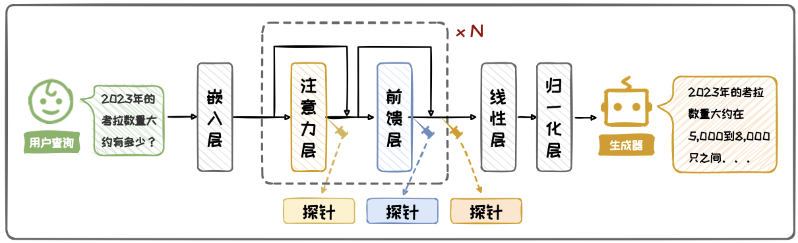
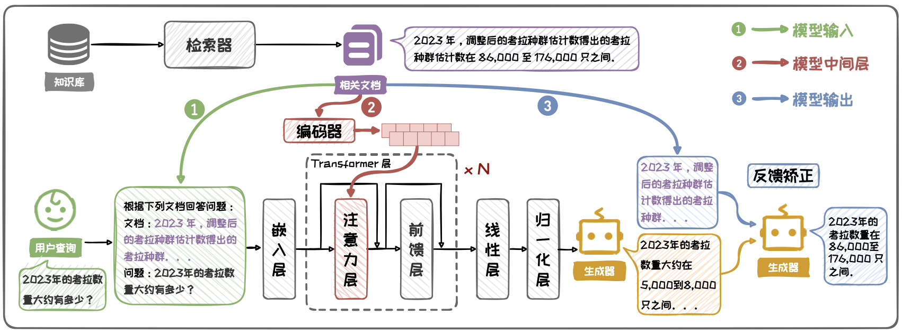
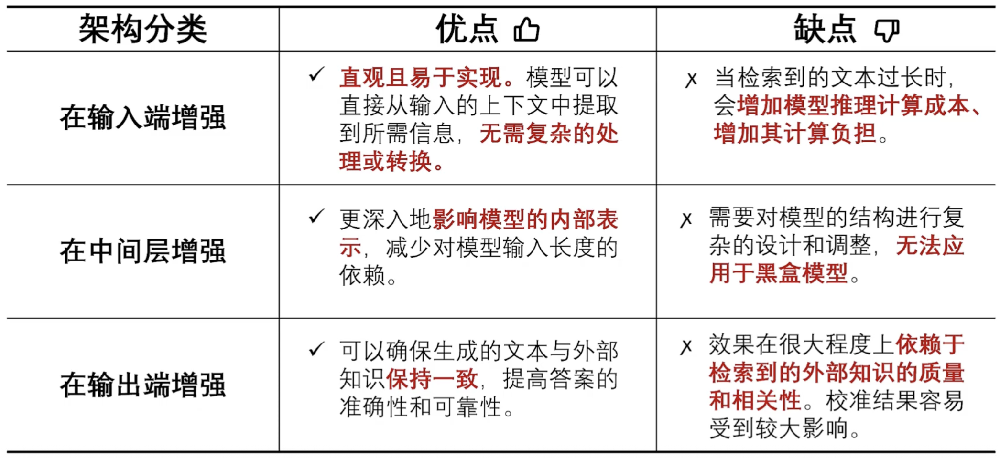

# 生成增强

- 检索器得到相关信息后，需要将其传递给大模型以增强模型的生成能力】
- 何时增强、何处增强、多次增强

## 何时增强

确保非必要不增强

判断是否需要增强的核心在于判断大模型是否具有内部知识。对于内部知识可以解决的问题，不对该问题增强

1. 外部观测法

   - 观测大模型的训练数据以及输出，类似于面试
   - 通过Prompt直接询问
     - 设计Prompt直接询问，根据模型的回答情况判断
     - 局限性：模型过度自信
   - 观察训练数据
     - 根据知识在训练数据中的出现频率估计模型的学习情况
     - 局限性：部分模型无法获取训练数据
   - 构造伪训练数据统计量
     - 无法观察训练数据时，可以通过构造伪训练数据来拟合训练数据的相关情况
     - 流行度：指实体或知识在特定环境中被广泛关注或使用的频率
     - 由于模型对低频的知识掌握不足，而对更“流行”的知识掌握更好，因此流行度可作为伪训练数据统计量
     - 通过设定流行度阈值来判断模型是否具备相应的内部知识

2. 内部观测法

   - 观测模型内部的隐藏状态来评估，类似于对人体内部进行脑电波判断
   - 在处理包含或不包含内部知识的不同问题时，模型的中间层（注意力层、MLP层等）会展现出不同的动态变化。基于这一特性，可以训练分类器进行判别，这种方法叫做探针
   - 对于输入问题，利用**训练好的探针**，即线性分类器，根据问题所对应的内部表示预测该问题是否属于模型已知还是未知

   

## 何处增强

确定在模型的何处融入检索到的知识以最大化效用

1. 输入端
   - 将问题和检索到的外部知识拼接在Prompt中，然后输入给大模型
   - 当前主流的增强方法
   - 缺点：输入Token成本高
2. 中间层
   - 采用交叉注意力将外部知识直接编码到模型的隐藏状态中
   - 先将检索到的外部知识转化为向量表示，然后将这些向量插入通过交叉注意力融合到模型的隐藏状态中
   - 代表方法：RETRO
   - 缺点：网络结构应已知，且训练有成本
3. 输出端
   - 利用外部知识对生成的文本进行后矫正

## 多次增强

对复杂查询与模糊查询进行多次迭代增强，以提升RAG在困难问题上的效果

1. 分解式增强
   - 在复杂问题的检索增强中，通常无法仅通过一次检索增强就得到满意的答案
   - 可采用分解式增强，将复杂问题化为多个子问题，在子问题间进行迭代检索增强
2. 细化式增强
   - 在模糊问题中，问题主体通常指代不明，容易引发歧义
   - 可通过细化式检索引导大模型探索模糊问题的多种细化路径