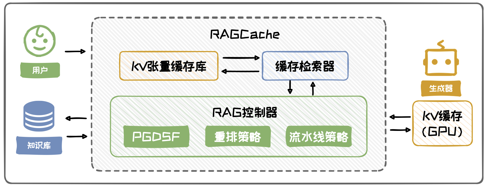

# 降本增效

检索出的外部知识通常包含大量原始文本，如果不加处理，会增加大模型的推理计算成本

可从去除冗余文本与复用计算结果两个角度进行解决

可以综合两种方法，提升效率

## 去除冗余文本

通过对检索出的原始文本的词句进行过滤，从中选择出部分有益于增强生成的部分

1. Token级别的方法
   - 每个Token过滤，把冗余的删掉
2. 全文本级别的方法
   - 直接从整个文档中抽取出重要信息，以去掉冗余信息
3. 子文本级别的方法
   - 通过对文档分割后对子文本打分，删除不必要的子文本
   - 代表方法：FIT-RAG
     - 高效低资源的通用检索增强生成框架
     - 集检索文档打分精排、内部知识检测、检索文档压缩和输入提升设计为一体
     - 通过将文档划分为子文档，并利用预先构建的打分器对子文本进行打分，筛选出既包含事实信息又符合大模型偏好的少量子文本组合

## 复用计算结果

对计算必须对中间结果进行复用，以优化RAG效率

- 为避免每次生成新Token时重复计算之前的Key和Value，可以将它们缓存起来（即KV-cache），在需要时直接调用缓存结果，从而减少计算

- 经典方法：RAGCache
  - 设计了一种RAG系统专用的多级动态缓存机制
  - 三个核心部分：KV张量缓存库、缓存检索器、RAG控制器

