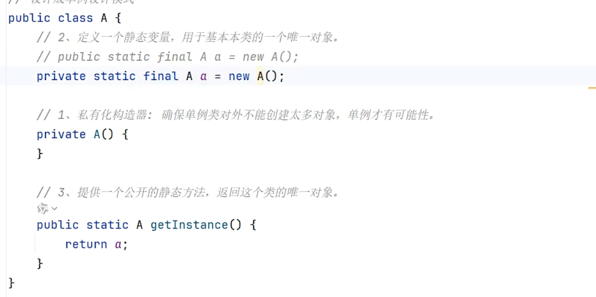
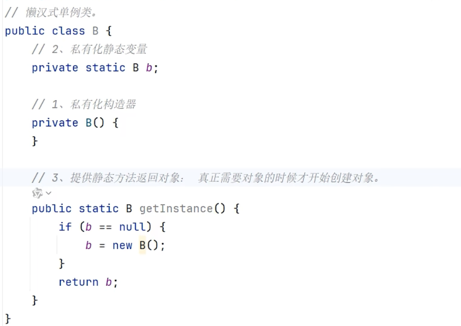

# 设计模式

## 单例类

- 作用：确保某个类只能创建一个对象

- 写法/实现步骤：

  - 把类的构造器私有
  - 定义一个类变量记住类的一个对象
  - 定义一个类方法，返回对象

- 形式

  - 饿汉式单例：拿对象时，对象早已创建好

    

  - 懒汉式单例：拿对象时，才开始创建对象

    - 把类的构造器私有；定义一个静态变量用于存储对象；提供一个静态方法，保证返回的是一个对象

    

##  模板方法

- 提供一个方法作为完成某类功能的模板，模板方法封装了每个实现步骤，但允许子类提供特定步骤的实现
- 模板方法设计模式可以：提高代码复用、并简化子类设计
- 建议使用final修饰模板方法
  - 模板方法是给子类直接使用的，不能被子类重写
  - 一旦子类重写了模板方法，模板方法就失效了

