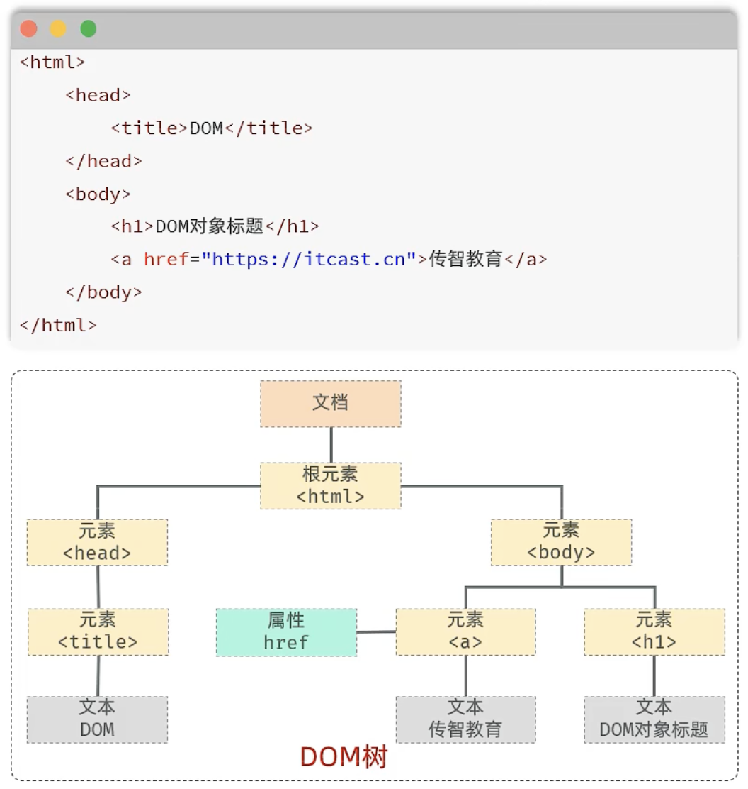
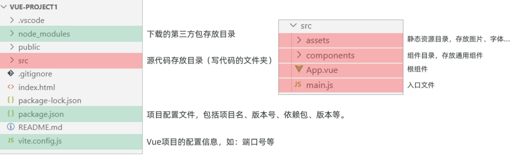
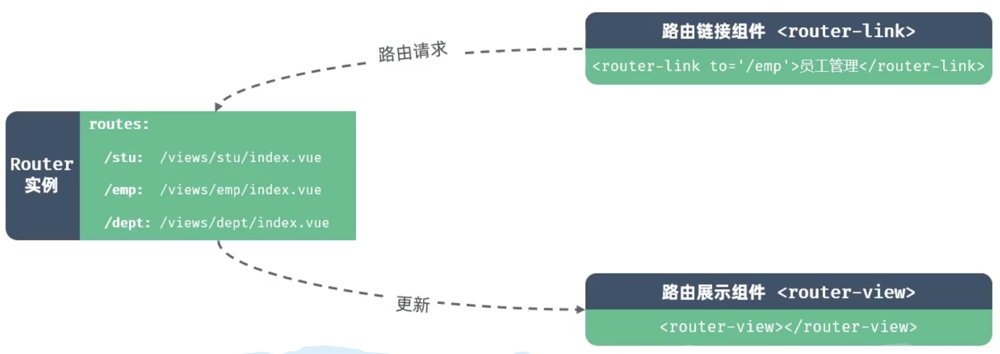

# Web标准

- 也称网页标准，由一系列标准组成，大部分由W3C负责制定
- 三个组成部分：
  - HTML：负责网页的结构（页面元素和内容）
  - CSS：负责网页的表现（外观、位置等页面样式）
  - JS：负责网页的行为（交互效果）

# HTML+CSS+JS

## 概念

- HTML：超文本标记语言
  - 标记语言：由标签构成的语言
    - HTML标签都是预定义好的
    - HTML代码直接在浏览器中运行，由浏览器解析
- CSS：层叠样式表
- MDN--文档

## CSS

### CSS引入方式

- 行内样式：写在标签的style属性中，配合JS使用
- 内部样式：写在style标签中，通常写在head中
- 外部样式：写在一个单独的.css文件中，需要通过link标签在网页中引入

### 颜色表示形式

- 关键字：red、green等
- rgb表示法：rgb(r, g, b)   0-255
- rgba表示法：rgba(r, g, b, a)  a表示透明度（取值0-1）
- 十六进制表示法：#rrggbb

### CSS选择器

| 选择器         | 写法                        | 示例                     | 示例说明                                |
| -------------- | --------------------------- | ------------------------ | --------------------------------------- |
| **元素选择器** | 元素名称 {...}              | h1 {...}                 | 选择页面上所有的`<h1>`标签              |
| **类选择器**   | .class属性值 {...}          | .cls {...}               | 选择页面上所有class属性为cls的标签      |
| **id选择器**   | #id属性值 {...}             | #hid {...}               | 选择页面上id属性为hid的标签             |
| 分组选择器     | 选择器1,选择器2 {...}       | h1,h2 {...}              | 选择页面上所有的`<h1>`和`<h2>`标签      |
| 属性选择器     | 元素名称[属性] {...}        | input[type] {...}        | 选择页面上有type属性的`<input>`标签     |
|                | 元素名称[属性名="值"] {...} | input[type="text"] {...} | 选择页面上type属性为text的`<input>`标签 |
| 后代选择器     | 元素1 元素2 {...}           | form input {...}         | 选择`<form>`标签内的所有`<input>`标签   |

优先级：id选择器>类选择器>元素选择器

### 盒子模型

- 盒子：页面中所有元素都可看作一个盒子，由盒子将元素包含在一个矩形区域，通过盒子的视角更方便的进行页面布局
- 组成：内容区域content、内边距区域padding、边框区域border、外边距区域margin
- 布局标签：div和span
  - \<div>
    - 一行只显示一个
    - 宽度默认是父元素的宽度，高度默认由内容撑开
    - 可以设置宽高width、height
    - 常见属性：width、height、background-color、padding、border、margin（上右下左-顺时针）
  - \<span>
    - 一行可以显示多个
    - 宽度和高度默认由内容撑开
    - 不可以设置宽高

### flex布局

- flexible box：弹性布局，是一维的布局模型，为元素提供空间分布和对齐能力
- 通过父容器添加flex的相关属性，来控制子元素的位置和排列方式

| 属性                         | 取值          | 含义                              |
| ---------------------------- | ------------- | --------------------------------- |
| display                      | flex          | 使用flex布局                      |
| flex-direction               | row           | 主轴方向为x轴，水平向右。（默认） |
| （设置主轴）                 | column        | 主轴方向为y轴，垂直向下。         |
| justify-content              | flex-start    | 从头开始排列                      |
| （子元素在主轴上的对齐方式） | flex-end      | 从尾部开始排列                    |
|                              | center        | 在主轴居中对齐                    |
|                              | space-around  | 平分剩余空间                      |
|                              | space-between | 先两边贴边，再平分剩余空间        |

### 表单标签

- 表单：负责数据采集功能

- 标签：\<form>

- 表单项：

  - \<input>：定义表单项，通过type属性控制输入方式（text/password/....）

  | type取值                 | 描述                                 |
  | ------------------------ | ------------------------------------ |
  | text                     | 默认值，定义单行的输入字段           |
  | password                 | 定义密码字段                         |
  | radio                    | 定义单选按钮                         |
  | checkbox                 | 定义复选框                           |
  | file                     | 定义文件上传按钮                     |
  | date/time/datetime-local | 定义日期/时间/日期时间               |
  | hidden                   | 定义隐藏域                           |
  | submit / reset / button  | 定义提交按钮 / 重置按钮 / 可点击按钮 |

  - \<select>：定义下拉列表，\<option>定义列表项
  - \<textarea>：定义文本域

- 属性：

  - action：规定当提交表单时向何处发送表单数据，URL
  - method：规定用于发送表单数据的方式，GET/POST

- 注意：

  - 表单项必须设置name

## JS

- JavaScript是一门跨平台、面向对象的脚本语言，是用来控制网页行为，实现页面的交互效果
- 组成：
  - ECMAScript：规定了JS基础语法核心知识，包含变量、数据类型、流程控制、函数、对象等
  - BOM：浏览器对象模型，用于操作浏览器本身，如页面弹窗、地址栏操作、关闭窗口等
  - DOM：文档对象模型，用于操作HTML文档，如改变标签内的内容、改变字体样式等

### JS核心语法

#### 引入方式

- 内部脚本：将JS代码定义在HTML页面中
  - 位于`<script> </script>`之间
  - 一般会置于\<body>元素的底部，可改善显示速度（浏览器从上向下解析）
- 外部脚本：定义在外部JS文件中，然后引入到HTML中

#### 基础语法

1. 变量&常量

   - 用let关键字声明变量
   - 用const关键字声明常量（一旦赋值就不能改变）

2. 数据类型

   - 基本数据类型
     - number：数字（整数、小数，NaN）
     - boolean
     - null：对象为空
     - undefined：声明的变量未初始化时，变量默认值为undefined
     - string：字符串，单引号、双引号、反引号皆可，推挤使用单引号
       - 模版字符串：使用反引号定义的字符串，在内容拼接变量时，可以使用`${}`包住变量
     - 使用typeof运算符可以获取数据类型
   - 引用数据类型（对象）

3. 函数

   - 函数function：用来执行特定任务的代码块

   - 具名函数

     - 定义：使用function关键字定义

       > function  functionName(参数1, 参数2, ....){
       >
       > ​	// 要执行的代码
       >
       > }

     - 调用函数：函数名称（实际参数列表）

     - 注意

       - JS是弱类型语言，形参和返回值都不需要指定类型
       - 调用函数时，实参个数与形参个数可以不一致，但是建议一致

   - 匿名函数：没有名称的函数

     - 定义方式：函数表达式和箭头函数

     ```js
     // 函数表达式
     let sum2 = function(a, b) {
         return a + b;
     }
     
     // 箭头函数
     let sum3 = (a, b) => {
         return a + b;
     }
     // 调用
     console.log(sum3(50, 60));
     ```

4. 自定义对象

   - 定义格式

   - 调用

     ```js
     // 定义
     let 对象名 = {
     	属性名1: 属性值1,
     	属性名2: 属性值2,
     	...
     	方法名: function(形参列表){ }
       // :function 可省略
       // 若使用箭头函数，则不能用this得到该对象，得到的是上一级对象，所以不建议用箭头函数
     }
     // 调用
     对象名.属性名;
     对象名.方法名();
     ```

5. Json

   - JacaScript Object Notation
   - JS对象标记法书写的文本，本质是字符串
   - 现多用于作为数据载体，在网络中进行数据传输
   - JS提供JSON对象来操作Json格式的文本
     - `JSON.stringfy()`：将js中的对象转化为json格式的字符串
     - `JSON.parse()`：将json格式的文本转化为js中的对象

### DOM

- 概念：Document Object Model 文档对象模型
- 将标记语言的各个组成部分封装为对应的对象
  - Document：整个文档对象
  - Element：元素对象
  - Attribute：属性对象
  - Text：文本对象
  - Comment：注释对象
- JS通过DOM，就能对HTML进行操作：
  - 改变HTML元素的内容
  - 改变HTML元素的样式
  - 对HTML DOM事件作出响应
  - 添加和删除HTML事件
- DOM操作
  - 核心思想：将网页中所有的元素当作对象来处理（标签的所有属性在该对象都可以找到）
  - 操作步骤：
    - 获取要操作的DOM元素对象
    - 操作DOM对象的属性或方法(w3school)
  - 获取DOM对象
    - 根据CSS选择器来获取DOM元素，获取匹配到的第一个元素：`document.querySelector('选择器')`
    - 根据CSS选择器来获取DOM元素，获取匹配到的所有元素：`document.querySelectorAll('选择器')`（得到的是一个NodeList节点集合，是一个伪数组-有长度有索引的数组）



### 事件监听

1. 概念
   - 事件：HTML事件是发生在HTML元素上的事情，如按钮被点击、鼠标移到元素上等
   - 事件监听：JS可以在事件触发时，就立即调用一个函数做出响应，也称为事件绑定或注册事件
2. 语法
   - `事件源.addEventListener('事件类型', 事件触发执行的函数)`
     - 可以多次绑定同一事件
   - 早期版本语法：`事件源.on事件 = function() { ... }`
     - 如果多次绑定同一事件，会被覆盖
3. 事件监听三要素
   - 事件源：获取dom元素
   - 事件类型：什么方式触发
   - 事件触发执行的函数：要做什么事
4. 常见事件
   - 鼠标事件
     - click鼠标点击，mouseenter鼠标移入，mouseleave鼠标移开
   - 键盘事件
     - keydown键盘按下触发，keyup键盘抬起触发
   - 焦点事件
     - focus获得焦点触发，blur失去焦点触发
   - 表单事件
     - input用户输入时触发，submit表单提交时触发

# Vue

用于**构建用户界面**的**渐进式**JavaScript框架

## 快速入门

- 准备
  - 引入Vue模块
  - 创建Vue程序的应用实例，控制视图的元素
  - 准备元素，被Vue控制
- 数据驱动视图
  - 准备数据
  - 通过插值表达式渲染页面

## 常用指令

| 指令                  | 作用                                                |
| --------------------- | --------------------------------------------------- |
| v-for                 | 列表渲染，遍历容器的元素或者对象的属性              |
| v-bind                | 为HTML标签绑定属性值，如设置 href，css样式等        |
| v-if/v-else-if/v-else | 条件性的渲染某元素，判定为true时渲染，否则不渲染    |
| v-show                | 根据条件展示某元素，区别在于切换的是display属性的值 |
| v-model               | 在表单元素上创建双向数据绑定                        |
| v-on                  | 为HTML标签绑定事件                                  |

1. v-for
   - 作用：列表渲染，遍历容器的元素或者对象的属性
   - 语法：`<tr v-for="(item, index) in items" :key="item.id"> {{item}} </tr>`
   - key
     - 为元素添加的唯一标识，便于vue进行列表项的正确排序复用，提升渲染性能
     - 推荐使用id作为key（唯一），不推荐使用index作为key（会变化，不对应）
   - 注意
     - 遍历的数组必须在data中定义
     - 要让哪个标签循环展示，就加在哪个标签上
2. v-bind
   - 作用：动态为HTML标签绑定属性值，如设置href、src、style等
   - 语法：`v-bind:属性名="属性值"`
   - 简化：`:属性名="属性值 "` 
   - 注意
     - 动态为标签等属性绑定值不能使用插值表达式，得使用v-bind指令
     - 绑定的数据必须在data中定义
3. v-if/v-show
   - 作用：用来控制元素的现实与隐藏
   - v-if
     - 语法：`v-if="表达式"`，表达式值为true，显示
     - 原理：基于条件判断，来控制创建或移除元素节点（条件渲染）
     - 场景：要么显示，要么不显示，不频繁切换的场景
     - 可配合v-else-if、v-else使用
   - v-show
     - 语法：`v-show="表达式"`，表达式值为true，显示
     - 原理：基于CSS样式display来控制显示与隐藏
     - 场景：频繁切换显示隐藏的场景
4. v-model
   - 作用：在表单元素上使用，双向数据绑定。可以方便的获取或设置表单项数据
   - 语法：`v-model="变量名"`
   - 注意：v-model中绑定的变量必须在data中定义
5. v-on
   - 作用：为html标签绑定事件（添加事件监听）
   - 语法：`v-on:事件名="方法名"`
   - 简写：`@事件名="方法名"`
   - 在createApp中，与data平级增加一个methods，在methods中写方法
   - methods函数中的this指向Vue实例，可以通过this获取到data中定义的数据

## Ajax

- Asynchronous JavaScript And XML，异步的JavaScript和XML

- 作用：
  - 数据交换：通过Ajax可以给服务器发送请求，并获取服务器响应的数据
  - 异步交互：可以在不重新加载整个页面的情况下，与服务器交换数据并更新部分数据的技术

### Axios

- Axios对原生的Ajax进行了封装，简化书写，快速开发
- 步骤：
  - 引入Axios的js文件
  - 使用Axios发送请求，并获取响应结果  
- 请求方式别名
  - Axios为所有支持的请求方法提供了别名
  - 格式：`axios.请求方式(url , data , config)`

```js
document.querySelector('#btnGet').addEventListener('click', () => {
  // axios发起异步请求
  axios({
      url: 'https://mock.apifox.cn/m1/3083103-0-default/emps/list',
      method: 'GET'
  }).then((results) => {  // 成功回调函数
      console.log(results.data);
  }).catch((err) => {  // 失败回调函数
      console.log(err);
  })
})
// 简化写法
document.querySelector('#btnGet').addEventListener('click', () => {
    axios.get('https://mock.apifox.cn/m1/3083103-0-default/emps/list').then((result)=>{
        console.log(result.data);
    });
})
```

- async & await
  - 可以通过async和await让异步变为同步操作
  - async就是声明一个异步方法，await是用来等待异步任务执行

```js
async search(){
    /* axios.get(`https://web-server.itheima.net/emps/list?name=${this.searchForm.name}&gender=${this.searchForm.gender}&job=${this.searchForm.job}`).then((result) => {
        this.empList = result.data.data;
    })*/

    let result = await axios.get(`https://web-server.itheima.net/emps/list?name=${this.searchForm.name}&gender=${this.searchForm.gender}&job=${this.searchForm.job}`)
    this.empList = result.data.data;

}
```

## Vue 生命周期

- 生命周期：一个对象从创建到销毁的整个过程
- 生命周期的八个阶段：每触发一个生命周期事件，会自动执行一个生命周期方法（钩子）


## Vue工程化

- 把前端开发所需的工具、技术、流程、经验等进行规范化、标准化

### 环境准备

- 使用Vue官方提供的最新的脚手架工具 create-vue，用于快速生成一个工程化的Vue项目
- 提供：统一的目录结构、本地调试、热部署、单元测试、集成打包上线
- 依赖环境：NodeJS
  - npm：Node Package Manager，是NodeJS的软件包管理器
  - `npm install xxx`
  - npm设置阿里镜像源：`npm config set registry https://registry.npmmirror.com`

### Vue项目创建

- 执行命令：`npm create vue@3.3.4`，不指定版本默认安装最新的版本

| 配置项                      | 说明                                                  | 默认值      |
| --------------------------- | ----------------------------------------------------- | ----------- |
| Project name                | 项目名称，默認值：vue-project，可输入想要的项目名称。 | vue-project |
| Add TypeScript?             | 是否加入TypeScript组件？                              | No          |
| Add JSX Support?            | 是否加入JSX支持？                                     | No          |
| Add Vue Router              | 是否为单页应用程序开发添加Vue Router路由管理组件？    | No          |
| Add Pinia                   | 是否添加Pinia组件来进行状态管理？                     | No          |
| Add Vitest                  | 是否添加Vitest来进行单元测试？                        | No          |
| Add an End-to-End           | 是否添加端到端测试？                                  | No          |
| Add ESLint for code quality | 是否添加ESLint来进行代码质量检查？                    | No          |

- 项目结构
  - *.vue时vue项目中的组件文件，在Vue项目中也称为单文件组件SFC。Vue 的单文件组件会组成一个组件的逻辑JS、模版HTML和样式CSS



- 安装依赖
  - 执行：`npm install`
- 启动项目
  - 执行：`npm run dev`
  - vscode中执行dev vite

### API风格

- 选项式API

  - 可以用包含多个选项的对象来描述组件的逻辑，如data、methods、mounted等
  - 选项定义的属性都会暴露在函数内部的this上，它会指向当前的组件实例

- 组合式API

  - 是Vue3提供的一种基于函数的组件编写方法，通过使用函数来组织和复用组件的逻辑
  - 它提供了一种更灵活、更可组合的方式来编写组件
  - 没有this对象，this对象是undifined
  - 项目推荐使用组合式API

  ```vue
  <script setup>
  // 引用ref函数
  import { ref, onMounted } from 'vue';
  
  // 声明响应式数据
  const count = ref(0);
  // 声明函数 - 在组合式API中没有this
  function increment(){
      count.value++;
  }
  // 声明钩子函数
  onMounted(() => {
      console.log('Vue mounted ... ');
  })
  </script>
  
  <template>
      <button @click="increment">
          count: {{ count }}
      </button>
  </template>
  
  <style scoped>
  </style>
  ```

### ElementPlus

- Element：是饿了么团队研发的，基于Vue3，面向设计师和开发者的组件库

- 组件：组成网页的部件，如超链接、按钮、图片、表格、表单、分页条等

- 官网：https://element-plus.org/zh-CN/#/zh-CN

- 实现

  - 安装组件库：`npm install element-plus@2.4.4 --save`
  - main.js中引入该组件库

  ```js
  import { createApp } from 'vue'
  import ElementPlus from 'element-plus'
  import 'element-plus/dist/index.css'
  import App from './App.vue'
  
  const app = createApp(App)
  
  app.use(ElementPlus)
  app.mount('#app')
  ```

  - 制作组件，如button

  ```vue
  <template>
    <div class="button-row">
      <el-button plain>Plain</el-button>
      <el-button type="primary" plain>Primary</el-button>
      <el-button type="success" plain>Success</el-button>
      <el-button type="info" plain>Info</el-button>
      <el-button type="warning" plain>Warning</el-button>
      <el-button type="danger" plain>Danger</el-button>
    </div>
  </template>
  ```

## 其余技术

### Vue Router

- Vue Router 是 Vue 官方的客户端路由解决方案。
  - 客户端路由的作用是在单页应用 (SPA) 中将浏览器的 URL 和用户看到的内容绑定起来。当用户在应用中浏览不同页面时，URL 会随之更新，但页面不需要从服务器重新加载。
  - Vue Router 基于 Vue 的组件系统构建，你可以通过配置**路由**来告诉 Vue Router 为每个 URL 路径显示哪些组件。
- Vue中的路由：路径与组件的对应关系
- 组成
  - Router实例：路由实例，基于createRouter函数创建，维护了应用的路由信息
  - \<router-link>：路由链接组件，浏览器回解析成\<a>
  - \<router-view>：动态视图组件，用来渲染展示与路由路径对应的组件



### 请求访问-程序优化

- 在前端开发时，通常会定义一个请求处理的工具类 - request.js

  - api用来区分是访问的前端资源还是后端请求

  ```js
  import axios from 'axios'
  
  // 创建axios实例对象
  const request = axios.create({
    baseURL: '/api',
    timeout: 600000
  })
  
  // axios的响应 reponse拦截器
  request.interceptors.response.use(
    response => {  // 成功回调
      return response.data
    },
    error => { // 失败回调
      return Promise.reject(error)
    }
  )
  
  export default request
  ```

- 在vite.config中配置代理，将api转发给反向代理服务器

  ```config
  server: {
    proxy: {
      '/api': {
        target: 'https://localhost:8080',
        secure: false,
        changeOrigin: true,
        rewrite: (path) => path.replace(/^\/api/, '')
      }
    }
  }
  ```

  

- 与服务器端进行异步交互的逻辑，通常会封装到一个单独的api中 - 如api/dept.js

  ```js
  import request from '@/utils/request'
  
  // 查询全部部门数据
  /* const queryAllApi = () => {
      return request.get('/depts')
  } */
  export const queryAllApi = () => request.get('/depts')
  
  ```

- 主页面调用：

  ```js
  import {queryAllApi} from '@/api/dept'
  
  // 查询
  const search =  async() => {
    /*const result = await axios.get('http://127.0.0.1:4523/m1/7408723-7141689-default/depts?apifoxApiId=390554442')
    if(result.data.code){  // JS 隐式类型转换  0-false，其他数字-true   ''-false，其他-true； null、undifined-false
      deptList.value = result.data.data
    }*/
    const result = await queryAllApi()
    if(result.code){
      deptList.value = result.data
    }
  }
  ```

  ### 表单校验

- 使用ElementPlus提供的form表单组件中，提供了表单校验功能
  - 定义表单校验规则，通过rules属性与表单绑定
  - 通过prop属性绑定对应的表单项
  - 通过ref属性注册表单的引用，表单提交时，校验表单，校验通过，则允许提交表单

### watch侦听

- 作用：侦听一个或多个响应式数据源，并在数据源变化时调用传入的回调函数

- 用法

  - 导入watch函数
  - 执行watch函数名传入要侦听的响应式数据源（ref对象）和回调函数

- 侦听响应式数据

  ```js
  import {ref, watch} from 'vue'
  const a = ref('')
  watch(a, (newVal, oldVal) => {
    console.log(`变化后的值：${newVal}, 变化前的值：${oldVal}`)
  })
  ```

- 侦听对象的全部属性

  - 第三个可选参数，常见两个选项
    - deep(boolean)：是否深度侦听，默认浅层侦听（可以用来侦听对象）
    - immediate(boolean)：是否在侦听创建时立即触发回调函数 

  ```js
  // 侦听一个对象（侦听对象的全部属性）
  const user = ref({name: '', age: 10})
  watch(user, (newVal, oldVal) => {
    console.log(newVal)
  }, {deep: true})
  ```

- 侦听对象的单个属性

  ```js
  // 侦听一个对象（侦听对象的某个属性）
  const user = ref({name: '', age: 10})
  watch(() => user.value.age, (newVal, oldVal) => {
    console.log(`变化后的值：${newVal}, 变化前的值：${oldVal}`)
  })
  ```

### 令牌

- 登陆-存储令牌

  - 需要在登陆成功后，将令牌信息存储起来，在后续的请求中，再将令牌取出来，携带到服务端
  - 可以存很多地方
  - 如：localStorage
    - 浏览器提供的本地存储机制（5MB）
    - 存储形式为key-value形式，键和值都是字符串类型
    - API方法
      - localStorage.setItem(key, value)
      - localStorage.getItem(key)
      - localStorage.removeItem(key)
      - localStorage.clear()

- 携带令牌访问服务端

  - 每一次Ajax请求都获取localStorage中的令牌，在请求头中将令牌携带到服务端
  - 使用axios的request拦截器

  ```js
  // axios的请求 request拦截器 - 获取localStorage中的token，在请求头中增加token请求头
  request.interceptors.request.use(
    config => { // 成功回调
      const loginUser = JSON.parse(localStorage.getItem('loginUser'))
      if(loginUser && loginUser.token){
        config.headers.token = loginUser.token
      }
      return config
    },
    error => { // 失败回调
      return Promise.reject(error)
    }
  )
  ```

  - 文件上传时，是使用element-plus的组件直接发送请求，需要特殊处理

  ```vue
  <script setup>
  // token
  const token = ref('')
  // 获取token
  const getToken = () => {
    const loginUser = JSON.parse(localStorage.getItem('loginUser'))
    if(loginUser && loginUser.token){
      token.value = loginUser.token
    }
  }
  // 钩子函数
  onMounted(() => {
    getToken() // 获取token
  })
  </script>
  <template>
  ...
  <!-- 第五行 -->
  <el-row :gutter="20">
    <el-col :span="24">
      <el-form-item label="头像">
        <el-upload
          class="avatar-uploader"
          action="/api/upload"
          :show-file-list="false"
          :on-success="handleAvatarSuccess"
          :before-upload="beforeAvatarUpload"
          :headers="{'token': token}"
          >
          
          <el-icon v-else class="avatar-uploader-icon"><Plus /></el-icon>
        </el-upload>
      </el-form-item>
    </el-col>
  </el-row>
  ...
  </template>
  ```

- 401-跳转到登陆界面

  - axios-response拦截器
  - 之前用过的axios的response拦截器，将响应的结果直接返回response.data

  ```js
  import axios from 'axios'
  import {ElMessage} from 'element-plus'
  import router from '../router'
  
  // 创建axios实例对象
  const request = axios.create({
    baseURL: '/api',
    timeout: 600000
  })
  
  // axios的请求 request拦截器 - 获取localStorage中的token，在请求头中增加token请求头
  request.interceptors.request.use(
    config => { // 成功回调
      const loginUser = JSON.parse(localStorage.getItem('loginUser'))
      if(loginUser && loginUser.token){
        config.headers.token = loginUser.token
      }
      return config
    },
    error => { // 失败回调
      return Promise.reject(error)
    }
  )
  
  // axios的响应 reponse拦截器
  request.interceptors.response.use(
    response => {  // 成功回调
      return response.data
    },
    error => { // 失败回调
      if(error.response.status === 401){ // 全等
        ElMessage.error('登录超时，请重新登录')
        // 跳转到登陆页面
        router.push('/login')
      }else{
        ElMessage.error('接口访问异常')
      }
      return Promise.reject(error)
    }
  )
  
  export default request
  ```

- 退出登陆

  - 登陆后：展示登陆员工姓名
  - 退出登陆
    - 删除本地存储的信息
    - 转到登陆页面

## 打包和部署

- 打包：执行`npm run build`

- 部署

  - Nginx：轻量级的Web服务器/反向代理服务器及电子邮件（IMAP/POP3）代理服务器。特点是占有内存小，并发能力强
  - 目录：conf-配置文件目录，html-静态资源文件存放目录（html、CSS、JS），logs-日志文件，temp-临时文件
  - 将打包好的文件置于html目录下，启动nginx
  - conf需要修改，增加转发路径，如：

  ```conf
  location ^~ /api {
      rewrite ^/api/(.*)$ /$1 break;
      proxy_pass http://localhost:8080;
  }
  ```

  - 的
