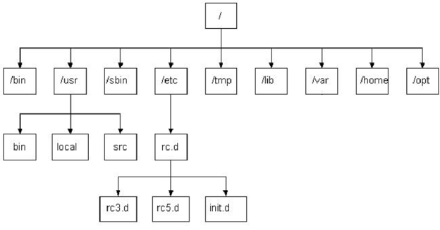
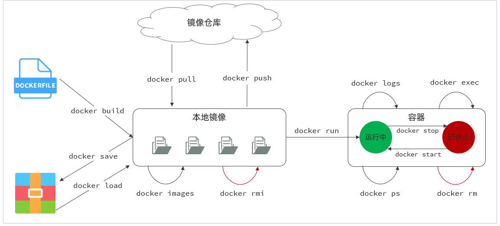

# Linux部署

## 目录结构

| 编号 | 目录  | 含义                                       |
| ---- | ----- | ------------------------------------------ |
| 1    | /bin  | 存放二进制可执行文件                       |
| 2    | /boot | 存放系统引导时使用的各种文件               |
| 3    | /dev  | 存放设备文件                               |
| 4    | /etc  | 存放系统配置文件                           |
| 5    | /home | 存放系统用户的文件                         |
| 6    | /lib  | 存放程序运行所需的共享库和内核模块         |
| 7    | /opt  | 额外安装的可选应用程序包所放置的位置       |
| 8    | /root | 超级用户目录                               |
| 9    | /sbin | 存放二进制可执行文件，只有root用户才能访问 |
| 10   | /tmp  | 存放临时文件                               |
| 11   | /usr  | 存放系统应用程序                           |
| 12   | /var  | 存放运行时需要改变数据的文件，例如日志文件 |



## 安装JDK

- 官方网站下载二进制发布包 .tar.gz

- 解压安装包：`tar -zxvf jdk.xxxx.tar.gz -C /usr/local`

- 配置环境变量，使用vim修改/etc/profile文件，在文末加入：

  ```properties
  export JAVA_HOME=/usr/local/jdk-17.0.10
  export PATH=$JAVA_HOME/bin:$PATH
  ```

- 重新加载profile文件：`source /etc/profile`

- 验证：`java -version`

## 安装MySQL

- 官方网站下载 .tar.xz

- 准备工作：卸载Linux系统自带的mysql/mariadb安装包，否则MySQL将安装失败

  ```shell
  # 查找是否有mariadb安装包
  rpm -qa | grep mariadb
  # 卸载
  rpm -e --nodeps 软件名称
  ```

- 下载并上传安装包

- 解压到/usr/local下，改名为 mysql，`tar -xvf ....tar.xz`

- 配置环境变量

  ```properties
  export MYSQL_HOME=/usr/local/mysql
  export PATH=$MYSQL_HOME/bin:$PATH
  ```

- 注册MySQL为系统服务

  ```shell
  cp /usr/local/mysql/support-files/mysql.server /etc/init.d/mysql
  chkconfig --add mysql
  ```

- 初始化数据库

  ```shell
  #创建一个用户组, 组名就叫mysql
  groupadd mysql
  #创建一个系统用户 mysql, 并归属于用户组 mysql 
  useradd -r -g mysql -s /bin/false mysql
  #初始化mysql
  mysqld --initialize --user=mysql --basedir=/usr/local/mysql --datadir=/usr/local/mysql/data
  ```

- 启动服务登录MySQL

  ```Shell
  systemctl start mysql
  #xxxxx 代表上述生成的root的临时密码
  mysql -uroot -pxxxxx
  ```

- 配置MySQL的root用户的密码，授权远程访问

  ```sql
  ALTER USER 'root'@'localhost' IDENTIFIED WITH mysql_native_password BY '1234';
  # 创建用户，为其分配远程访问的权限
  CREATE USER 'root'@'%' IDENTIFIED BY '1234';
  GRANT ALL PRIVILEGES ON *.* TO 'root'@'%';
  FLUSH PRIVILEGES;
  ```

## 防火墙操作

- 防火墙操作：

| 操作                         | 指令                                                         |
| ---------------------------- | ------------------------------------------------------------ |
| 查看防火墙状态               | systemctl status firewalld / firewall-cmd --state            |
| 暂时关闭防火墙               | systemctl stop firewalld                                     |
| 永久关闭防火墙(禁用开机自启) | systemctl disable firewalld                                  |
| 暂时开启防火墙               | systemctl start firewalld                                    |
| 永久开启防火墙(启用开机自启) | systemctl enable firewalld                                   |
| 开放指定端口                 | firewall-cmd --zone=public --add-port=8080/tcp --permanent   |
| 关闭指定端口                 | firewall-cmd --zone=public --remove-port=8080/tcp --permanent |
| 立即生效(重新加载)           | firewall-cmd --reload                                        |
| 查看开放端口                 | firewall-cmd --zone=public --list-ports                      |

- 远程连接数据库

  - 可以开放指定端口(推荐)

  ```Shell
  #开发防火墙的3306端口号
  firewall-cmd --zone=public --add-port=3306/tcp --permanent
  #重新加载
  firewall-cmd --reload
  #查看开放的端口号
  firewall-cmd --zone=public --list-ports
  ```

  - 可以关闭防火墙

  ```Shell
  systemctl stop firewalld
  ```

## 安装Nginx

- 安装nginx运行时需要的依赖：

  ```Shell
  yum install -y pcre pcre-devel zlib zlib-devel openssl openssl-devel
  yum install gcc-c++
  ```

- 上传源码包

- 解压到当前目录：`tar -zxvf nginx-1.20.2.tar.gz`

- 进入到解压目录，执行命令：`./configure --prefix=/usr/local/nginx`

- 执行编译nginx的指令：`make`

- 执行安装nginx的指令，安装到上述指定的/usr/local/nginx目录：`make install`

- 进入到nginx安装目录，启动nginx服务：`sbin/nginx`

  ## 前端部署

- 将开发好的代码打包，上传到nginx的html目录下

- 在conf/nginx.conf中配置反向代理服务器及路径重写规则

  ```properties
  location ^~ /api/ {
      rewrite ^/api/(.*)$ /$1 break;
      proxy_pass http://localhost:8080;
  }
  ```

- 在nginx的目录中，启动nginx：`sbin/nginx`或`sbin/nginx -s reload`

## 后端部署

- 执行maven父工程中的package，对项目打包（打包前先连接服务器数据库，先测试通过）

- 在linux服务器的/usr/local目录下，创建一个tlias-app，将jar包上传到服务器的目录中

- 启动jar包：`java -jar xxxx.jar`

- 配置阿里云OSS：

  ```shell
  echo "export OSS_ACCESS_KEY_ID=xxx" >> /etc/profile
  echo "export OSS_ACCESS_KEY_SECRET=xxx" >> /etc/profile
  source /etc/profile
  ```

- 后台运行jar包：

  ```shell
  nohup java -jar tlias-web-management-0.0.1-SNAPSHOT.jar &> tlias.log &
  ```

- 停止服务

  ```shell
  #查看服务的进程信息
  ps -ef | grep java
  #杀掉进程
  kill -9 xxxxx
  ```

# Docker部署

利用Docker安装应用时，Docker会自动搜索并下载应用**镜像（image）**。镜像不仅包含应用本身，还包含应用运行时所需要的环境、配置、系统函数库

Docker会在运行镜像时创建一个隔离环境，成为**容器（container）**

**镜像仓库**：存储和管理镜像的平台，Docker官方维护了一个公共仓库： Docker Hub

## 安装docker

- 卸载旧版

  ```Shell
  yum remove docker \
      docker-client \
      docker-client-latest \
      docker-common \
      docker-latest \
      docker-latest-logrotate \
      docker-logrotate \
      docker-engine \
      docker-selinux 
  ```

- 配置docker的yum库

  ```Bash
  sudo yum install -y yum-utils device-mapper-persistent-data lvm2
  # 配置为阿里源
  sudo yum-config-manager --add-repo https://mirrors.aliyun.com/docker-ce/linux/centos/docker-ce.repo
  sudo sed -i 's+download.docker.com+mirrors.aliyun.com/docker-ce+' /etc/yum.repos.d/docker-ce.repo
  # 更新yum，建立缓存
  sudo yum makecache fast
  ```

- 安装docker

  ```Bash
  yum install -y docker-ce docker-ce-cli containerd.io docker-buildx-plugin docker-compose-plugin
  ```

- 启动和校验

  ```Bash
  # 启动Docker
  systemctl start docker
  # 停止Docker
  systemctl stop docker
  # 重启
  systemctl restart docker
  # 设置开机自启
  systemctl enable docker
  # 执行docker ps命令，如果不报错，说明安装启动成功
  docker ps
  ```

- 配置镜像加速

  ```Bash
  # 创建目录
  rm -f /etc/docker/daemon.json
  
  # 复制内容
  tee /etc/docker/daemon.json <<-'EOF'
  {
      "registry-mirrors": [
          "http://hub-mirror.c.163.com",
          "https://mirrors.tuna.tsinghua.edu.cn",
          "http://mirrors.sohu.com",
          "https://ustc-edu-cn.mirror.aliyuncs.com",
          "https://ccr.ccs.tencentyun.com",
          "https://docker.m.daocloud.io",
          "https://docker.awsl9527.cn"
      ]
  }
  EOF
  
  # 重新加载配置
  systemctl daemon-reload
  
  # 重启Docker
  systemctl restart docker
  ```

## Docker常用命令

- 官方文档有详细说明，https://docs.doker.com

- 安装容器，以安装mysql为例

  - -d：让容器在后台运行
  - --name：容器的名字，必须唯一
  - -p 宿主机端口:容器内端口：设置端口映射
  - -e：设置环境变量（docker hub中可以找到环境变量的具体含义）
  - mysql:8 ：指定运行的镜像的名字、版本   [repository]:[tag]

  ```shell
  docker run -d \
    --name mysql \
    -p 3307:3306 \
    -e TZ=Asia/Shanghai \
    -e MYSQL_ROOT_PASSWORD=123 \
    mysql:8
  ```

- 常见命令

  | **命令**       | **说明**                       | **文档地址**                                                 |
  | :------------- | :----------------------------- | :----------------------------------------------------------- |
  | docker pull    | 拉取镜像                       | [docker pull](https://docs.docker.com/engine/reference/commandline/pull/) |
  | docker push    | 推送镜像到DockerRegistry       | [docker push](https://docs.docker.com/engine/reference/commandline/push/) |
  | docker images  | 查看本地镜像                   | [docker images](https://docs.docker.com/engine/reference/commandline/images/) |
  | docker rmi     | 删除本地镜像                   | [docker rmi](https://docs.docker.com/engine/reference/commandline/rmi/) |
  | docker run     | 创建并运行容器（不能重复创建） | [docker run](https://docs.docker.com/engine/reference/commandline/run/) |
  | docker stop    | 停止指定容器                   | [docker stop](https://docs.docker.com/engine/reference/commandline/stop/) |
  | docker start   | 启动指定容器                   | [docker start](https://docs.docker.com/engine/reference/commandline/start/) |
  | docker restart | 重新启动容器                   | [docker restart](https://docs.docker.com/engine/reference/commandline/restart/) |
  | docker rm      | 删除指定容器                   | [docs.docker.com](https://docs.docker.com/engine/reference/commandline/rm/) |
  | docker ps      | 查看容器                       | [docker ps](https://docs.docker.com/engine/reference/commandline/ps/) |
  | docker logs    | 查看容器运行日志               | [docker logs](https://docs.docker.com/engine/reference/commandline/logs/) |
  | docker exec    | 进入容器                       | [docker exec](https://docs.docker.com/engine/reference/commandline/exec/) |
  | docker save    | 保存镜像到本地压缩文件         | [docker save](https://docs.docker.com/engine/reference/commandline/save/) |
  | docker load    | 加载本地压缩文件到镜像         | [docker load](https://docs.docker.com/engine/reference/commandline/load/) |
  | docker inspect | 查看容器详细信息               | [docker inspect](https://docs.docker.com/engine/reference/commandline/inspect/) |

  

## 数据卷

- 数据卷（volume）是一个虚拟目录，是容器内目录与宿主机目录之间映射的桥梁

- 命令

  | **命令**              | **说明**             | **文档地址**                                                 |
  | :-------------------- | :------------------- | :----------------------------------------------------------- |
  | docker volume create  | 创建数据卷           | [docker volume create](https://docs.docker.com/engine/reference/commandline/volume_create/) |
  | docker volume ls      | 查看所有数据卷       | [docs.docker.com](https://docs.docker.com/engine/reference/commandline/volume_ls/) |
  | docker volume rm      | 删除指定数据卷       | [docs.docker.com](https://docs.docker.com/engine/reference/commandline/volume_prune/) |
  | docker volume inspect | 查看某个数据卷的详情 | [docs.docker.com](https://docs.docker.com/engine/reference/commandline/volume_inspect/) |
  | docker volume prune   | 清除数据卷           | [docker volume prune](https://docs.docker.com/engine/reference/commandline/volume_prune/) |

- 如：nginx的html目录挂载

  ```shell
  # 1.首先创建容器并指定数据卷，注意通过 -v 参数来指定数据卷
  docker run -d --name nginx -p 80:80 -v html:/usr/share/nginx/html nginx:1.20.2
  # 2.然后查看数据卷
  docker volume ls
  # 3.查看数据卷详情  Mountpoint
  docker volume inspect html
  # 4.查看/var/lib/docker/volumes/html/_data目录
  ll /var/lib/docker/volumes/html/_data
  # 5.进入该目录，并随意修改index.html内容
  cd /var/lib/docker/volumes/html/_data
  vi index.html
  # 6.打开页面，查看效果
  # 7.进入容器内部，查看/usr/share/nginx/html目录内的文件是否变化
  docker exec -it nginx bash
  ```

- 本地目录挂载（常用）

  - 本地目录或文件必须以 `/` 或 `./`开头，如果直接以名字开头，会被识别为数据卷名而非本地目录名。

  ```shell
  # 挂载本地目录
  -v 本地目录:容器内目录
  
  # 挂载本地文件
  -v 本地文件:容器内文件
  ```

  - 如挂载数据库的初始化脚本的目录、配置文件目录、数据目录：

  ```shell
  docker run -d \
    --name mysql \
    -p 3307:3306 \
    -e MYSQL_ROOT_PASSWORD=123 \
    -e TZ=Asia/Shanghai \
    -v /root/mysql/data:/var/lib/mysql \
    -v /root/mysql/init:/docker-entrypoint-initdb.d \
    -v /root/mysql/conf:/etc/mysql/conf.d \
    mysql:8
  ```

## 自定义镜像

- 镜像包含应用程序、程序运行的系统函数库、运行配置等文件的文件包。构建镜像的过程就是把上述文件打包的过程

- 镜像结构

  - 入口Entrypoint（最高层）：镜像运行入口，一般是程序启动的脚本和参数
  - 层Layer：添加安装包、依赖、配置等，每次操作都形成新的一层 
  - 基础镜像BaseImage（最底层）：应用依赖的系统函数库、环境、配置、文件等

- Dockerfile：一个文本文件，其中包含一个个点指令，用指令来说明要执行什么操作来构建镜像。将来docker可以根据dockerfile帮助构建镜像

  - 常见指令：

  | **指令**       | **说明**                                     | **示例**                     |
  | :------------- | :------------------------------------------- | :--------------------------- |
  | **FROM**       | 指定基础镜像                                 | `FROM centos:7`              |
  | **ENV**        | 设置环境变量，可在后面指令使用               | `ENV key value`              |
  | **COPY**       | 拷贝本地文件到镜像的指定目录                 | `COPY ./xx.jar /tmp/app.jar` |
  | **RUN**        | 执行Linux的shell命令，一般是安装过程的命令   | `RUN yum install gcc`        |
  | **EXPOSE**     | 指定容器运行时监听的端口，是给镜像使用者看的 | EXPOSE 8080                  |
  | **ENTRYPOINT** | 镜像中应用的启动命令，容器运行时调用         | ENTRYPOINT java -jar xx.jar  |

- 如：构建一个Java镜像的步骤

  - 准备一个Linux运行环境
  - 安装JDK并配置环境变量
  - 拷贝Jar包
  - 编写运行脚本，运行Jar包

  ```shell
  # 使用 CentOS 7 作为基础镜像
  FROM centos:7
  
  # 添加 JDK 到镜像中
  COPY jdk17.tar.gz /usr/local/
  RUN tar -xzf /usr/local/jdk17.tar.gz -C /usr/local/ &&  rm /usr/local/jdk17.tar.gz
  
  # 设置环境变量
  ENV JAVA_HOME=/usr/local/jdk-17.0.10
  ENV PATH=$JAVA_HOME/bin:$PATH
  
  # 创建应用目录
  RUN mkdir -p /app
  WORKDIR /app
  
  # 复制应用 JAR 文件到容器
  COPY app.jar app.jar
  
  # 暴露端口
  EXPOSE 8080
  
  # 运行命令
  ENTRYPOINT ["java","-Djava.security.egd=file:/dev/./urandom","-jar","/app/app.jar"]
  ```

  - 编写好Dockerfile之后，可以用以下命令来构建镜像
    - -t ：是给镜像起名，格式依然是repository:tag的格式，不指定tag时，默认为latest
    - .  ：是指定Dockerfile所在目录，如果就在当前目录，则指定为"."

  ```shell
  docker build -t 镜像名 .
  ```

## 网络

- 默认情况下，所有容器都是以bridge方式连接到Docker到一个虚拟网桥上

- 容器的网络IP其实是一个虚拟的IP，其值并不固定与某一个容器绑定，如果我们在开发时写死某个IP，而在部署时很可能MySQL容器的IP会发生变化，连接会失败。

  | **命令**                  | **说明**                 |
  | :------------------------ | :----------------------- |
  | docker network create     | 创建一个网络             |
  | docker network ls         | 查看所有网络             |
  | docker network rm         | 删除指定网络             |
  | docker network prune      | 清除未使用的网络         |
  | docker network connect    | 使指定容器连接加入某网络 |
  | docker network disconnect | 使指定容器连接离开某网络 |
  | docker network inspect    | 查看网络详细信息         |

- 自定义网络

  - 加入自定义网络的容器才可以通过容器名互相访问

  ```shell
  # 1.首先通过命令创建一个网络
  docker network create itheima
  
  # 2.然后查看网络
  docker network ls
  
  # 结果：
  NETWORK ID     NAME      DRIVER    SCOPE
  639bc44d0a87   bridge    bridge    local
  403f16ec62a2   itheima     bridge    local
  0dc0f72a0fbb   host      host      local
  cd8d3e8df47b   none      null      local
  # 其中，除了itheima以外，其它都是默认的网络
  
  
  # 3.让 myapp 和 mysql 都加入该网络
  # 3.1.mysql容器，加入 itheima 网络
  docker network connect itheima mysql
  
  # 3.2.myapp容器，也就是我们的java项目, 加入 itheima 网络
  docker network connect itheima myapp
  
  
  # 4.进入dd容器，尝试利用别名访问db
  # 4.1.进入容器
  docker exec -it myapp bash
  
  # 4.2.用容器名访问
  ping mysql
  
  # 结果：
  PING mysql (172.18.0.2) 56(84) bytes of data.
  64 bytes from mysql.itheima (172.18.0.2): icmp_seq=1 ttl=64 time=0.044 ms
  64 bytes from mysql.itheima (172.18.0.2): icmp_seq=2 ttl=64 time=0.054 ms
  ```

## 服务端部署

- 将开发的项目打包为镜像，并部署

- 准备MySQL容器，并创建表结构

  - 部署mysql，参考本地目录挂载

- 准备Java应用镜像，部署Docker容器

  - 修改配置文件，修改数据库服务地址及logback日志文件存放地址，打为jar包
  - 编写Dockerfile文件

  ```shell
  # 使用 CentOS 7 作为基础镜像
  FROM centos:7
  
  # 添加 JDK 到镜像中
  COPY jdk17.tar.gz /usr/local/
  RUN tar -xzf /usr/local/jdk17.tar.gz -C /usr/local/ &&  rm /usr/local/jdk17.tar.gz
  
  # 设置环境变量
  ENV JAVA_HOME=/usr/local/jdk-17.0.10
  ENV PATH=$JAVA_HOME/bin:$PATH
  
  # 阿里云OSS环境变量
  ENV OSS_ACCESS_KEY_ID=******
  ENV OSS_ACCESS_KEY_SECRET=******
  
  #统一编码
  ENV LANG=en_US.UTF-8
  ENV LANGUAGE=en_US:en
  ENV LC_ALL=en_US.UTF-8
  
  # 创建应用目录
  RUN mkdir -p /tlias
  WORKDIR /tlias
  
  # 复制应用 JAR 文件到容器
  COPY  tlias.jar  tlias.jar
  
  # 暴露端口
  EXPOSE 8080
  
  # 运行命令
  ENTRYPOINT ["java","-jar","/tlias/tlias.jar"]
  ```

  - 构建Docker镜像

  ```shell
  docker build -t tlias:1.0 .
  ```

  - 部署Docker容器

  ```shell
  docker run -d --name tlias-server --network itheima -p 8080:8080  tlias:1.0
  ```

  - 通过 `docker logs -f 容器名`，就可以查看容器的运行日志。

## 前端部署

- 创建一个新的nginx容器，将前端项目的静态资源部署到nginx中

- 部署nginx容器（设置目录映射）

  -   `-v /usr/local/tlias-web/html:/usr/share/nginx/html` 
  -   `-v /usr/local/tlias-web/conf/nginx.conf:/etc/nginx/nginx.conf`

  ```shell
  docker run -d \
  --name nginx-tlias \
  -v /usr/local/tlias-web/html:/usr/share/nginx/html \
  -v /usr/local/tlias-web/conf/nginx.conf:/etc/nginx/nginx.conf \
  --network itheima \
  -p 80:80 \
  nginx:1.20.2
  ```

- 将部署到前端资源文件及配置文件上传至服务器，执行命令创建nginx容器

## DockerCompose

- Docker Compose通过一个单独的 **docker-compose.yml** 模版文件来定义一组相关联的应用容器，帮助实现多个相互关联的Docker容器的快速部署

- docker-compose.yml基本语法

  | **docker run 参数** | **docker compose 指令** | **说明**   |
  | :------------------ | :---------------------- | :--------- |
  | --name              | container_name          | 容器名称   |
  | -p                  | ports                   | 端口映射   |
  | -e                  | environment             | 环境变量   |
  | -v                  | volumes                 | 数据卷配置 |
  | --network           | networks                | 网络       |

- 构建项目语法

  ```shell
  docker compose [OPTIONS] [COMMAND]
  ```

  | 类型     | **参数或指令** | **说明**                                                     |
  | -------- | :------------- | :----------------------------------------------------------- |
  | Options  | -f             | 指定compose文件的路径和名称                                  |
  |          | -p             | 指定project名称。project就是当前compose文件中设置的多个service的集合，是逻辑概念 |
  | Commands | up             | 创建并启动所有service容器                                    |
  |          | down           | 停止并移除所有容器、网络                                     |
  |          | ps             | 列出所有启动的容器                                           |
  |          | logs           | 查看指定容器的日志                                           |
  |          | stop           | 停止容器                                                     |
  |          | start          | 启动容器                                                     |
  |          | restart        | 重启容器                                                     |
  |          | top            | 查看运行的进程                                               |
  |          | exec           | 在指定的运行中容器中执行命令                                 |

- 如：部署该项目，设计mysql、服务端、前端

  - 准备资源（sql，服务端的jdk、jar包、Dockerfile，前端项目的打包文件、nginx.conf）
  - 准备docker-compose.yml配置文件

  ```YAML
  services:
    mysql:
      image: mysql:8
      container_name: mysql
      ports:
        - "3307:3306"
      environment:
        TZ: Asia/Shanghai
        MYSQL_ROOT_PASSWORD: 123
      volumes:
        - "/usr/local/app/mysql/conf:/etc/mysql/conf.d"
        - "/usr/local/app/mysql/data:/var/lib/mysql"
        - "/usr/local/app/mysql/init:/docker-entrypoint-initdb.d"
      networks:
        - tlias-net
    tlias:
      build: 
        context: .
        dockerfile: Dockerfile
      container_name: tlias-server
      ports:
        - "8080:8080"
      networks:
        - tlias-net
      depends_on:
        - mysql
    nginx:
      image: nginx:1.20.2
      container_name: nginx
      ports:
        - "80:80"
      volumes:
        - "/usr/local/app/nginx/conf/nginx.conf:/etc/nginx/nginx.conf"
        - "/usr/local/app/nginx/html:/usr/share/nginx/html"
      depends_on:
        - tlias
      networks:
        - tlias-net
  networks:
    tlias-net:
      name: itheima
  ```

  - 基于DockerCompose快速构建项目

  ```shell
  docker compose up -d
  ```

