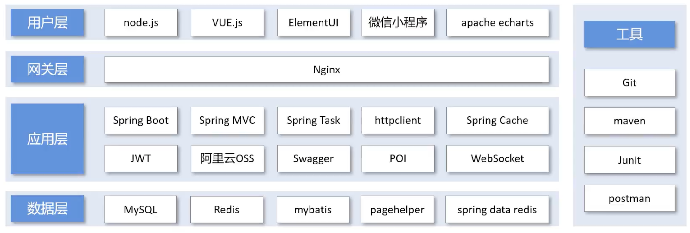
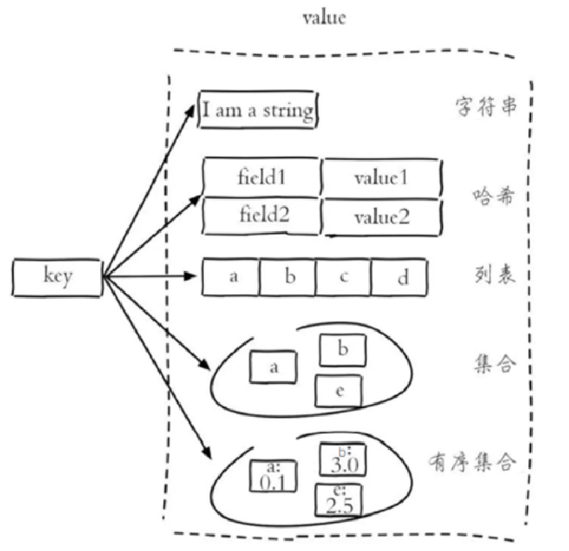
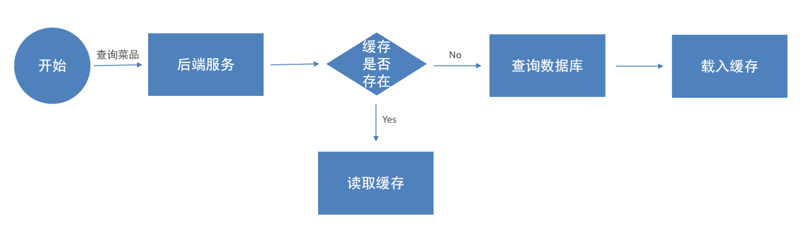
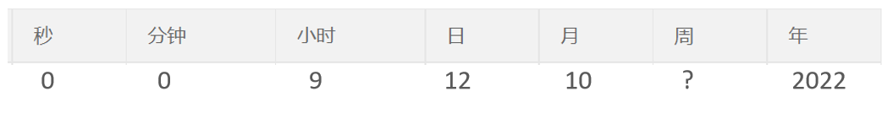
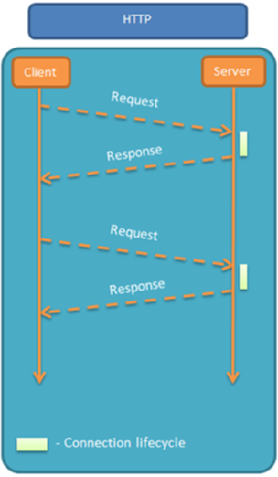
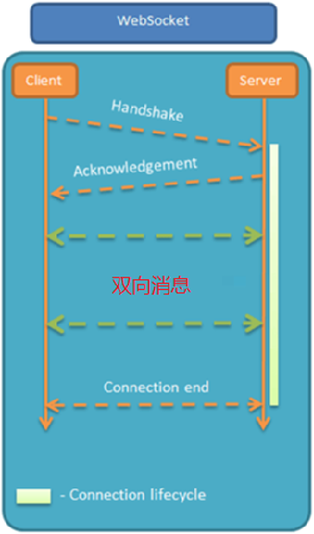
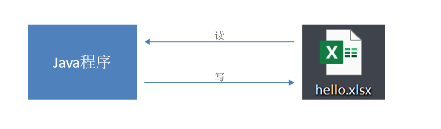

# 软件开发

## 软件开发流程

1. 需求分析
   - 需求规格说明书
   - 产品原型
2. 设计
   - UI设计
   - 数据库设计
   - 接口设计
3. 编码
   - 项目代码
   - 单元测试
4. 测试
   - 测试用例
   - 测试报告
5. 上线运维
   - 软件环境安装、配置

## 角色分工

项目经理，产品经理

UI设计师，架构师

开发工程师

测试工程师

运维工程师

## 软件环境

- 开发环境
- 测试环境
- 生产环境

## 技术选型



## 后端实体类

- Entity：实体，通常和数据库中的表对应
- DTO：数据传输对象，通常用于程序中各层之间传递数据
- VO：视图对象，为前端展示数据提供的对象
- POJO：普通Java对象，只有属性和对应的getter和setter

## Swagger

- 使用Swagger，按照它的规范去定义接口及接口相关信息，就可以做到生成接口文档，以及在线接口调试页面

- Knife4j是Java MVC框架集成Swagger生成Api文档的增强解决方案

- 步骤

  - 倒入依赖

  ```xml
  <dependency>
     <groupId>com.github.xiaoymin</groupId>
     <artifactId>knife4j-spring-boot-starter</artifactId>
  </dependency>
  ```

  - 配置中加入相关配置   WebMvcConfiguration.java

  ```java
  /**
       * 通过knife4j生成接口文档
       * @return
  */
  @Bean
  public Docket docket() {
      ApiInfo apiInfo = new ApiInfoBuilder()
              .title("苍穹外卖项目接口文档")
              .version("2.0")
              .description("苍穹外卖项目接口文档")
              .build();
      Docket docket = new Docket(DocumentationType.SWAGGER_2)
              .apiInfo(apiInfo)
              .select()
        			// 指定生成接口需要扫描的包
              .apis(RequestHandlerSelectors.basePackage("com.sky.controller"))
              .paths(PathSelectors.any())
              .build();
      return docket;
  }
  ```

  - 设置静态资源映射，否则接口文档页面无法访问  WebMvcConfiguration.java

  ```java
  /**
       * 设置静态资源映射
       * @param registry
  */
  protected void addResourceHandlers(ResourceHandlerRegistry registry) {
          registry.addResourceHandler("/doc.html").addResourceLocations("classpath:/META-INF/resources/");
          registry.addResourceHandler("/webjars/**").addResourceLocations("classpath:/META-INF/resources/webjars/");
  }
  ```

- 常用注解

  | **注解**          | **说明**                                                     |
  | ----------------- | ------------------------------------------------------------ |
  | @Api              | 用在类上，例如Controller，表示对类的说明  （tags）           |
  | @ApiModel         | 用在类上，例如entity、DTO、VO   （description）              |
  | @ApiModelProperty | 用在属性上，描述属性信息                                     |
  | @ApiOperation     | 用在方法上，例如Controller的方法，说明方法的用途、作用 （value） |


# 完善功能

## 密码加密存储

- 将密码加密后存储，提高安全性，使用MD5加密方式对明文密码加密

- 修改数据库明文密码，改为加密后的密文

- 修改java代码

  ```java
  // 对前端传过来的密码进行MD5加密处理
  password = DigestUtils.md5DigestAsHex(password.getBytes());
  if (!password.equals(employee.getPassword())) {
      //密码错误
      throw new PasswordErrorException(MessageConstant.PASSWORD_ERROR);
  }
  ```

## 日期格式转换

- 方法一：在属性前使用注解

  ```java
  //@JsonFormat(pattern = "yyyy-MM-dd HH:mm:ss")
  private LocalDateTime createTime;
  ```

- 方法二：扩展SpringMVC的消息转换器

  - JacksonObjectMapper.java 

  ```java
  /**
   * 对象映射器:基于jackson将Java对象转为json，或者将json转为Java对象
   * 将JSON解析为Java对象的过程称为 [从JSON反序列化Java对象]
   * 从Java对象生成JSON的过程称为 [序列化Java对象到JSON]
   */
  public class JacksonObjectMapper extends ObjectMapper {
  
      public static final String DEFAULT_DATE_FORMAT = "yyyy-MM-dd";
      //public static final String DEFAULT_DATE_TIME_FORMAT = "yyyy-MM-dd HH:mm:ss";
      public static final String DEFAULT_DATE_TIME_FORMAT = "yyyy-MM-dd HH:mm";
      public static final String DEFAULT_TIME_FORMAT = "HH:mm:ss";
  
      public JacksonObjectMapper() {
          super();
          //收到未知属性时不报异常
          this.configure(FAIL_ON_UNKNOWN_PROPERTIES, false);
  
          //反序列化时，属性不存在的兼容处理
          this.getDeserializationConfig().withoutFeatures(DeserializationFeature.FAIL_ON_UNKNOWN_PROPERTIES);
  
          SimpleModule simpleModule = new SimpleModule()
                  .addDeserializer(LocalDateTime.class, new LocalDateTimeDeserializer(DateTimeFormatter.ofPattern(DEFAULT_DATE_TIME_FORMAT)))
                  .addDeserializer(LocalDate.class, new LocalDateDeserializer(DateTimeFormatter.ofPattern(DEFAULT_DATE_FORMAT)))
                  .addDeserializer(LocalTime.class, new LocalTimeDeserializer(DateTimeFormatter.ofPattern(DEFAULT_TIME_FORMAT)))
                  .addSerializer(LocalDateTime.class, new LocalDateTimeSerializer(DateTimeFormatter.ofPattern(DEFAULT_DATE_TIME_FORMAT)))
                  .addSerializer(LocalDate.class, new LocalDateSerializer(DateTimeFormatter.ofPattern(DEFAULT_DATE_FORMAT)))
                  .addSerializer(LocalTime.class, new LocalTimeSerializer(DateTimeFormatter.ofPattern(DEFAULT_TIME_FORMAT)));
  
          //注册功能模块 例如，可以添加自定义序列化器和反序列化器
          this.registerModule(simpleModule);
      }
  }
  ```

  - 修改 WebMvcConfiguration.java

  ```java
  protected void extendMessageConverters(List<HttpMessageConverter<?>> converters) {
      log.info("扩展消息转换器...");
      // 创建一个消息转换器对象
      MappingJackson2HttpMessageConverter converter = new MappingJackson2HttpMessageConverter();
      // 需要为消息转换器设置一个对象转换器，可以将Java对象序列化为Json数据
      converter.setObjectMapper(new JacksonObjectMapper());
      // 将自己的消息转换器加入容器中
      converters.add(0, converter);
  }
  ```

## 公共字段自动填充

- 业务表中的公共字段：create_time, create_user, update_time, update_user

- 实现思路

  - 自定义注解AutoFill，用于标识需要进行公共字段自动填充的方法

  ```java
  @Target(ElementType.METHOD)
  @Retention(RetentionPolicy.RUNTIME)
  public @interface AutoFill {
      // 数据库操作类型 update, insert
      OperationType value();
  }
  ```

  - 自定义切面类AutoFillAspect，统一拦截加入了AutoFill注解的方法，通过反射为公共字段赋值
  - 在Mapper的方法上加入AutoFill注解

# Redis

## 简介

- 基于**内存**的key-value结构数据库
- 特点
  - 基于内存存储，读写性能高
  - 适合存储热点数据（热点商品、资讯、新闻）
  - 企业应用广泛

## Redis数据类型

Redis存储的是key-value结构的数据，其中key是字符串类型，value有5种常用的数据类型

- 字符串(string)：普通字符串，Redis中最简单的数据类型
- 哈希(hash)：也叫散列，类似于Java中的HashMap结构，比如可以存储对象
- 列表(list)：按照插入顺序排序，可以有重复元素，类似于Java中的LinkedList，比如可以存储朋友圈点赞数据
- 集合(set)：无序集合，没有重复元素，类似于Java中的HashSet，比如可以运算共同朋友（交集）
- 有序集合(sorted set/zset)：集合中每个元素关联一个分数(score)，根据分数升序排序，没有重复元素，比如可以存储各种排行榜



## Redis常用命令

### 字符串操作命令

Redis 中字符串类型常用命令：

- **SET** key value 			     设置指定key的值
- **GET** key                                        获取指定key的值
- **SETEX** key seconds value         设置指定key的值，并将 key 的过期时间设为 seconds 秒（如保存验证码）
- **SETNX** key value                        只有在 key    不存在时设置 key 的值（如分布式锁）

### 哈希操作命令

Redis hash 是一个string类型的 field 和 value 的映射表，hash特别适合用于存储对象，常用命令：

- **HSET** key field value             将哈希表 key 中的字段 field 的值设为 value
- **HGET** key field                       获取存储在哈希表中指定字段的值
- **HDEL** key field                       删除存储在哈希表中的指定字段
- **HKEYS** key                              获取哈希表中所有字段
- **HVALS** key                              获取哈希表中所有值

### 列表操作命令

Redis 列表是简单的字符串列表，按照插入顺序排序，常用命令：

- **LPUSH** key value1 [value2]         将一个或多个值插入到列表头部
- **LRANGE** key start stop                获取列表指定范围内的元素
- **RPOP** key                                       移除并获取列表最后一个元素
- **LLEN** key                                        获取列表长度
- **BRPOP** key1 [key2 ] timeout       移出并获取列表的最后一个元素， 如果列表没有元素会阻塞列表直到等待超    时或发现可弹出元素为止

### 集合操作命令

Redis set 是string类型的无序集合。集合成员是唯一的，这就意味着集合中不能出现重复的数据，常用命令：

- **SADD** key member1 [member2]            向集合添加一个或多个成员
- **SMEMBERS** key                                         返回集合中的所有成员
- **SCARD** key                                                  获取集合的成员数
- **SINTER** key1 [key2]                                   返回给定所有集合的交集
- **SUNION** key1 [key2]                                 返回所有给定集合的并集
- **SREM** key member1 [member2]            移除集合中一个或多个成员

### 有序集合操作命令

Redis有序集合是string类型元素的集合，且不允许有重复成员。每个元素都会关联一个double类型的分数。常用命令：

常用命令：

- **ZADD** key score1 member1 [score2 member2]     向有序集合添加一个或多个成员
- **ZRANGE** key start stop [WITHSCORES]                     通过索引区间返回有序集合中指定区间内的成员
- **ZINCRBY** key increment member                              有序集合中对指定成员的分数加上增量 increment
- **ZREM** key member [member ...]                                移除有序集合中的一个或多个成员

### 通用命令

Redis的通用命令是不分数据类型的，都可以使用的命令：

- KEYS pattern 		查找所有符合给定模式( pattern)的 key 
- EXISTS key 		    检查给定 key 是否存在
- TYPE key 		       返回 key 所储存的值的类型
- DEL key 		         该命令用于在 key 存在时删除 key

## 在Java中操作Redis

### Redis的Java客户端

Redis 的 Java 客户端很多，常用的几种：

- Jedis
- Lettuce：性能高
- Spring Data Redis：Spring 对 Redis 客户端进行了整合，提供了 Spring Data Redis，在Spring Boot项目中还提供了对应的Starter，即 spring-boot-starter-data-redis。

### Spring Data Redis

- 操作步骤：

  - 导入Spring Data Redis的Maven坐标

  ```xml
  <dependency>
  	<groupId>org.springframework.boot</groupId>
  	<artifactId>spring-boot-starter-data-redis</artifactId>
  </dependency>
  ```

  - 配置Redis数据源 application.yml
    - database:指定使用Redis的哪个数据库，Redis服务启动后默认有16个数据库，编号分别是从0到15。
    - 可以通过修改Redis配置文件来指定数据库的数量

  ```yml
  sky:
    redis:
      host: localhost
      port: 6379
      password: 123456
      database: 1
  ```

  - 在application.yml中添加读取application-dev.yml中的相关Redis配置

  ```yml
  spring:
    profiles:
      active: dev
    redis:
      host: ${sky.redis.host}
      port: ${sky.redis.port}
      password: ${sky.redis.password}
      database: ${sky.redis.database}
  ```

  - 编写配置类，创建RedisTemplate对象
    - 当前配置类不是必须的，因为 Spring Boot 框架会自动装配 RedisTemplate 对象，但是默认的key序列化器为JdkSerializationRedisSerializer，导致我们存到Redis中后的数据和原始数据有差别，故设置为StringRedisSerializer序列化器。


  ```java
  @Configuration
  @Slf4j
  public class RedisConfiguration {
  
      @Bean
      public RedisTemplate redisTemplate(RedisConnectionFactory redisConnectionFactory){
          log.info("开始创建redis模版对象...");
          RedisTemplate redisTemplate = new RedisTemplate();
          // 设置redis的连接工厂对象
          redisTemplate.setConnectionFactory(redisConnectionFactory);
          // 设置redis key的序列化器
          redisTemplate.setKeySerializer(new StringRedisSerializer());
          return redisTemplate;
      }
  }
  ```

  - 通过RedisTemplate对象操作Redis

  ```java
  @SpringBootTest
  public class SpringDataRedisTest {
      @Autowired
      private RedisTemplate redisTemplate;
  
      @Test
      public void testRedisTemplate(){
          System.out.println(redisTemplate);
          //string数据操作
          ValueOperations valueOperations = redisTemplate.opsForValue();
          //hash类型的数据操作
          HashOperations hashOperations = redisTemplate.opsForHash();
          //list类型的数据操作
          ListOperations listOperations = redisTemplate.opsForList();
          //set类型数据操作
          SetOperations setOperations = redisTemplate.opsForSet();
          //zset类型数据操作
          ZSetOperations zSetOperations = redisTemplate.opsForZSet();
      }
  }
  ```

**操作字符串类型数据**

```java
@Test
public void testString(){
    // set get setex setnx
    redisTemplate.opsForValue().set("city", "北京");
    String city = (String) redisTemplate.opsForValue().get("city");
    System.out.println(city);

    redisTemplate.opsForValue().set("code", "12345", 3, TimeUnit.MINUTES);

    redisTemplate.opsForValue().setIfAbsent("lock", "1");
    redisTemplate.opsForValue().setIfAbsent("lock", "2");
}
```

**操作哈希类型数据**

```java
@Test
public void testHash(){
    // hset hget hdel hkeys hvals
    HashOperations hashOperations = redisTemplate.opsForHash();

    hashOperations.put("100", "name", "tom");
    hashOperations.put("100", "age", "20");

    String name = (String) hashOperations.get("100", "name");
    System.out.println(name);

    Set keys = hashOperations.keys("100");
    System.out.println(keys);
    List values = hashOperations.values("100");
    System.out.println(values);

    hashOperations.delete("100", "age");
}
```

**操作列表类型数据**

```java
@Test
public void testList(){
    //lpush lrange rpop llen
    ListOperations listOperations = redisTemplate.opsForList();

    listOperations.leftPushAll("mylist","a","b","c");
    listOperations.leftPush("mylist","d");

    List mylist = listOperations.range("mylist", 0, -1);
    System.out.println(mylist);

    listOperations.rightPop("mylist");

    Long size = listOperations.size("mylist");
    System.out.println(size);
}
```

**操作集合类型数据**

```java
/**
 * 操作集合类型的数据
 */
@Test
public void testSet(){
    //sadd smembers scard sinter sunion srem
    SetOperations setOperations = redisTemplate.opsForSet();

    setOperations.add("set1","a","b","c","d");
    setOperations.add("set2","a","b","x","y");

    Set members = setOperations.members("set1");
    System.out.println(members);

    Long size = setOperations.size("set1");
    System.out.println(size);

    Set intersect = setOperations.intersect("set1", "set2");
    System.out.println(intersect);

    Set union = setOperations.union("set1", "set2");
    System.out.println(union);

    setOperations.remove("set1","a","b");
}
```

**操作有序集合类型数据**

```java
/**
 * 操作有序集合类型的数据
 */
@Test
public void testZset(){
    //zadd zrange zincrby zrem
    ZSetOperations zSetOperations = redisTemplate.opsForZSet();

    zSetOperations.add("zset1","a",10);
    zSetOperations.add("zset1","b",12);
    zSetOperations.add("zset1","c",9);

    Set zset1 = zSetOperations.range("zset1", 0, -1);
    System.out.println(zset1);

    zSetOperations.incrementScore("zset1","c",10);

    zSetOperations.remove("zset1","a","b");
}
```

**通用命令操作**

```java
/**
 * 通用命令操作
 */
@Test
public void testCommon(){
    //keys exists type del
    Set keys = redisTemplate.keys("*");
    System.out.println(keys);

    Boolean name = redisTemplate.hasKey("name");
    Boolean set1 = redisTemplate.hasKey("set1");

    for (Object key : keys) {
        DataType type = redisTemplate.type(key);
        System.out.println(type.name());
    }

    redisTemplate.delete("mylist");
}
```

## 店铺营业状态设置

```java
public class ShopController {

    public static final String KEY = "SHOP_STATUS";

    @Autowired
    private RedisTemplate redisTemplate;

    /**
     * 设置店铺的营业状态
     * @param status
     * @return
     */
    @PutMapping("/{status}")
    @ApiOperation("设置店铺的营业状态")
    public Result setStatus(@PathVariable Integer status){
        log.info("设置店铺的营业状态为: {}", status == 1 ? "营业中" : "打烊中");
        redisTemplate.opsForValue().set(KEY, status);
        return Result.success();
    }

    /**
     * 获取店铺的营业状态
     * @return
     */
    @GetMapping("/status")
    @ApiOperation("获取店铺的营业状态")
    public Result<Integer> getStatus(){
        Integer status = (Integer) redisTemplate.opsForValue().get(KEY);
        log.info("管理端获取店铺的营业状态为: {}", status == 1 ? "营业中" : "打烊中");
        return Result.success(status);
    }
}
```

## 缓存菜品

用户端小程序展示的菜品数据都是通过查询数据库获得，如果用户端访问量比较大，数据库访问压力随之增大。

通过Redis缓存菜品数据，减少数据库查询操作



**缓存逻辑分析：**

- 每个分类下的菜品保存一份缓存数据

```java
public class DishController {

    @Autowired
    private DishService dishService;
    @Autowired
    private RedisTemplate redisTemplate;

    /**
     * 根据分类id查询菜品
     * @param categoryId
     * @return
     */
    @GetMapping("/list")
    @ApiOperation("根据分类id查询菜品")
    public Result<List<DishVO>> list(Long categoryId){

        // 构造redis的key
        String key = "dish_" + categoryId;

        // 查询redis中是否存在菜品数据
        List<DishVO> list = (List<DishVO>) redisTemplate.opsForValue().get(key);

        // 如果存在，直接返回，无需查询数据库
        if (list != null && list.size() > 0){
            return Result.success(list);
        }
        // 如果不存在，查询数据库，将查询到的数据放入redis中
        log.info("根据分类id查询菜品: {}", categoryId);
        Dish dish = new Dish();
        dish.setCategoryId(categoryId);
        dish.setStatus(StatusConstant.ENABLE);
        list = dishService.listWithFlavor(dish);
        // 将查询到的数据放入redis中
        redisTemplate.opsForValue().set(key, list);

        return Result.success(list);
    }
}
```

- 数据库中菜品数据有变更时清理缓存数据（新增、删除、修改、启售/停售）

```java
@PostMapping
@ApiOperation("新增菜品")
public Result save(@RequestBody DishDTO dishDTO){
    log.info("新增菜品: {}", dishDTO);
    dishService.saveWithFlavor(dishDTO);

    // 清理缓存数据
    String key = "dish_" + dishDTO.getCategoryId();
    // redisTemplate.delete(key);
    cleanCache(key);
    return Result.success();
}

@PutMapping
@ApiOperation("修改菜品")
public Result update(@RequestBody DishDTO dishDTO){
    log.info("修改菜品: {}", dishDTO);
    dishService.updateWithFlavor(dishDTO);

    // 将所有菜品缓存数据都清除
    cleanCache("dish_*");
    return Result.success();
}

private void cleanCache(String pattern){
    Set keys = redisTemplate.keys(pattern);
    redisTemplate.delete(keys);
}
```

# SpringCache

## 介绍

Spring Cache 是一个框架，实现了基于注解的缓存功能，只需要简单地加一个注解，就能实现缓存功能。

Spring Cache 提供了一层抽象，底层可以切换不同的缓存实现，例如：

- EHCache
- Caffeine
- Redis(常用)

**起步依赖：**

```xml
<dependency>
	<groupId>org.springframework.boot</groupId>
	<artifactId>spring-boot-starter-cache</artifactId>  		            		       	 <version>2.7.3</version> 
</dependency>
```

## 常用注解

在SpringCache中提供了很多缓存操作的注解，常见的是以下的几个：

| **注解**       | **说明**                                                     |
| -------------- | ------------------------------------------------------------ |
| @EnableCaching | 开启缓存注解功能，通常加在启动类上                           |
| @Cacheable     | 在方法执行前先查询缓存中是否有数据，如果有数据，则直接返回缓存数据；如果没有缓存数据，调用方法并将方法返回值放到缓存中（可放可取） |
| @CachePut      | 将方法的返回值放到缓存中（只能放）                           |
| @CacheEvict    | 将一条或多条数据从缓存中删除                                 |

在spring boot项目中，使用缓存技术只需在项目中导入相关缓存技术的依赖包，并在启动类上使用@EnableCaching开启缓存支持即可。

例如，使用Redis作为缓存技术，只需要导入Spring data Redis的maven坐标即可。

## 案例

**(1) 引导类上加@EnableCaching:**

```java
package com.itheima;

import lombok.extern.slf4j.Slf4j;
import org.springframework.boot.SpringApplication;
import org.springframework.boot.autoconfigure.SpringBootApplication;
import org.springframework.cache.annotation.EnableCaching;

@Slf4j
@SpringBootApplication
@EnableCaching//开启缓存注解功能
public class CacheDemoApplication {
    public static void main(String[] args) {
        SpringApplication.run(CacheDemoApplication.class,args);
        log.info("项目启动成功...");
    }
}
```

**(2) @CachePut注解:**

- 作用: 将方法返回值，放入缓存
- value: 缓存的名称, 每个缓存名称下面可以有很多key
- key: 缓存的key  ----------> 支持Spring的表达式语言SPEL语法

**在save方法上加注解@CachePut**

当前UserController的save方法是用来保存用户信息的，我们希望在该用户信息保存到数据库的同时，也往缓存中缓存一份数据，我们可以在save方法上加上注解 @CachePut，用法如下：

```java
/**
* CachePut：将方法返回值放入缓存
* value：缓存的名称，每个缓存名称下面可以有多个key
* key：缓存的key
*/
@PostMapping
@CachePut(value = "userCache", key = "#user.id")//key的生成：userCache::1
public User save(@RequestBody User user){
    userMapper.insert(user);
    return user;
}
```

**说明：**key的写法如下

#user.id : #user指的是方法形参的名称, id指的是user的id属性 , 也就是使用user的id属性作为key ;

#result.id : #result代表方法返回值，该表达式 代表以返回对象的id属性作为key ；

#p0.id：#p0指的是方法中的第一个参数，id指的是第一个参数的id属性,也就是使用第一个参数的id属性作为key ;

#a0.id：#a0指的是方法中的第一个参数，id指的是第一个参数的id属性,也就是使用第一个参数的id属性作为key ;

#root.args[0].id:#root.args[0]指的是方法中的第一个参数，id指的是第一个参数的id属性,也就是使用第一个参数

的id属性作为key ;

**(3) @Cacheable注解**

**@Cacheable 说明:**

- 作用: 在方法执行前，spring先查看缓存中是否有数据，如果有数据，则直接返回缓存数据；若没有数据，调用方法并将方法返回值放到缓存中
- value: 缓存的名称，每个缓存名称下面可以有多个key
- key: 缓存的key  ----------> 支持Spring的表达式语言SPEL语法

 **在getById上加注解@Cacheable**

```java
/**
* Cacheable：在方法执行前spring先查看缓存中是否有数据，如果有数据，则直接返回缓存数据；若没有数据，	  *调用方法并将方法返回值放到缓存中
* value：缓存的名称，每个缓存名称下面可以有多个key
* key：缓存的key
*/
@GetMapping
@Cacheable(cacheNames = "userCache",key="#id")
public User getById(Long id){
    User user = userMapper.getById(id);
    return user;
}
```

**(4) @CacheEvict注解**

**@CacheEvict 说明：** 

- 作用: 清理指定缓存
- value: 缓存的名称，每个缓存名称下面可以有多个key
- key: 缓存的key  ----------> 支持Spring的表达式语言SPEL语法

**在 delete 方法上加注解@CacheEvict**

```java
@DeleteMapping
@CacheEvict(cacheNames = "userCache",key = "#id")//删除某个key对应的缓存数据
public void deleteById(Long id){
    userMapper.deleteById(id);
}

@DeleteMapping("/delAll")
@CacheEvict(cacheNames = "userCache",allEntries = true)//删除userCache下所有的缓存数据
public void deleteAll(){
    userMapper.deleteAll();
}
```

## 缓存套餐

user/setmealController.java 用户查询时写入缓存

```java
@GetMapping("/list")
@ApiOperation("根据分类id查询套餐")
@Cacheable(cacheNames = "setmealCache", key = "#categoryId") // key: setmealCache::id
public Result<List<Setmeal>> list(Long categoryId){
    log.info("根据分类id查询套餐: {}", categoryId);
    Setmeal setmeal = new Setmeal();
    setmeal.setCategoryId(categoryId);
    setmeal.setStatus(StatusConstant.ENABLE);

    List<Setmeal> setmealList = setmealService.list(setmeal);
    return Result.success(setmealList);
}
```

admin/setmealController.java 更新数据时删除缓存

```java
@PostMapping
@ApiOperation("新增套餐")
@CacheEvict(cacheNames = "setmealCache", key = "#setmealDTO.categoryId")
public Result save(@RequestBody SetmealDTO setmealDTO){
    log.info("新增套餐: {}", setmealDTO);
    setmealService.save(setmealDTO);
    return Result.success();
}

@PutMapping
@ApiOperation("更新套餐")
@CacheEvict(cacheNames = "setmealCache", allEntries = true)
public Result update(@RequestBody SetmealDTO setmealDTO){
    log.info("更新套餐: {}", setmealDTO);
    setmealService.update(setmealDTO);
    return Result.success();
}

@PostMapping("/status/{status}")
@ApiOperation("根据id更新套餐状态")
@CacheEvict(cacheNames = "setmealCache", allEntries = true)
public Result updateStatus(@PathVariable Integer status, Long id){
    log.info("根据id更新套餐状态: {}, {}", id, status);
    setmealService.updateStatus(id, status);
    return Result.success();
}

@DeleteMapping
@ApiOperation("批量删除套餐")
@CacheEvict(cacheNames = "setmealCache", allEntries = true)
public Result delete(@RequestParam List<Long> ids){
    log.info("批量删除套餐: {}", ids);
    setmealService.deleteBatch(ids);
    return Result.success();
}
```

# HttpClient

## 介绍

- HttpClient 是Apache Jakarta Common 下的子项目，可以用来提供高效的、最新的、功能丰富的支持 HTTP 协议的**客户端编程工具包**，并且它支持 HTTP 协议最新的版本和建议。
- **HttpClient作用：**
  - 发送HTTP请求
  - 接收响应数据
- **HttpClient应用场景：**当我们在使用扫描支付、查看地图、获取验证码、查看天气等功能时，其实，应用程序本身并未实现这些功能，都是在应用程序里访问提供这些功能的服务，访问这些服务需要发送HTTP请求，并且接收响应数据，可通过HttpClient来实现。
- **HttpClient的核心API：**
  - HttpClient：Http客户端对象类型，使用该类型对象可发起Http请求。
  - HttpClients：可认为是构建器，可创建HttpClient对象。
  - CloseableHttpClient：实现类，实现了HttpClient接口。
  - HttpGet：Get方式请求类型。
  - HttpPost：Post方式请求类型。
- **HttpClient发送请求步骤：**
  - 创建HttpClient对象
  - 创建Http请求对象
  - 调用HttpClient的execute方法发送请求

## 使用方式

### Maven

HttpClient的maven坐标

```xml
<dependency>
	<groupId>org.apache.httpcomponents</groupId>
	<artifactId>httpclient</artifactId>
	<version>4.5.13</version>
</dependency>
```

但是在项目中，导入的aliyun oss中已经导入了HttpClient，所以不导入也可以使用

```xml
<dependency>
    <groupId>com.aliyun.oss</groupId>
    <artifactId>aliyun-sdk-oss</artifactId>
</dependency>
```

### 发送GET请求

```java
@Test
public void testGET() throws Exception {
    // 创建httpClient对象
    CloseableHttpClient httpClient = HttpClients.createDefault();

    // 创建请求对象
    HttpGet httpGet = new HttpGet("http://localhost:8080/user/shop/status");

    // 发送请求, 接受响应结果
    CloseableHttpResponse response = httpClient.execute(httpGet);

    // 获取服务端返回的状态码
    int statusCode = response.getStatusLine().getStatusCode();
    System.out.println("服务端返回的状态码为：" + statusCode);

    HttpEntity entity = response.getEntity();
    String body = EntityUtils.toString(entity);
    System.out.println("服务端返回的数据为：" + body);

    // 关闭资源
    response.close();
    httpClient.close();
}
```

### 发送POST请求

```java
@Test
public void testPOST() throws Exception {
    // 创建httpClient对象
    CloseableHttpClient httpClient = HttpClients.createDefault();

    // 创建请求对象
    HttpPost httpPost = new HttpPost("http://localhost:8080/admin/employee/login");

    JSONObject jsonObject = new JSONObject();
    jsonObject.put("username", "admin");
    jsonObject.put("password", "123456");

    StringEntity entity = new StringEntity(jsonObject.toString());
    // 指定编码方式
    entity.setContentEncoding("utf-8");
    // 指定数据格式
    entity.setContentType("application/json");
    httpPost.setEntity(entity);

    // 发送请求
    CloseableHttpResponse response = httpClient.execute(httpPost);

    // 解析返回结果
    int statusCode = response.getStatusLine().getStatusCode();
    System.out.println("响应码为：" + statusCode);

    HttpEntity entity1 = response.getEntity();
    String body = EntityUtils.toString(entity1);
    System.out.println("响应数据为：" + body);

    // 关闭资源
    response.close();
    httpClient.close();
}
```

# SpringTask

## 介绍

spring框架提供的任务调度工具，可以按照约定的时间自动执行某个代码逻辑

作用：定时自动执行某段Java代码

应用场景：信用卡每月还款提醒、银行贷款每月还款提醒、火车票售票系统处理未支付订单、入职纪念日为用户发送通知等

## cron表达式

cron表达式就是一个字符串，通过cron表达式可以**定义任务触发的时间**

构成规则：分为6或7个域，由空格分隔开，每个域代表一个含义

每个域的含义分别为：秒、分钟、小时、日、月、周、年（可选）

**举例：**

2022年10月12日上午9点整 对应的cron表达式为：**0 0 9 12 10 ? 2022**

 

**说明：**一般**日**和**周**的值不同时设置，其中一个设置，另一个用？表示。

cron表达式在线生成器：https://cron.qqe2.com/

**通配符：**

\* 表示所有值； 

? 表示未说明的值，即不关心它为何值； 

\- 表示一个指定的范围； 

, 表示附加一个可能值； 

/ 符号前表示开始时间，符号后表示每次递增的值；

**cron表达式案例：**

*/5 * * * * ? 每隔5秒执行一次

0 */1 * * * ? 每隔1分钟执行一次

0 0 5-15 * * ? 每天5-15点整点触发

0 0/3 * * * ? 每三分钟触发一次

0 0-5 14 * * ? 在每天下午2点到下午2:05期间的每1分钟触发 

0 0/5 14 * * ? 在每天下午2点到下午2:55期间的每5分钟触发

0 0/5 14,18 * * ? 在每天下午2点到2:55期间和下午6点到6:55期间的每5分钟触发

0 0/30 9-17 * * ? 朝九晚五工作时间内每半小时

0 0 10,14,16 * * ? 每天上午10点，下午2点，4点 

## 使用方式

步骤：

- 导入maven坐标：spring-context（在spring-boot-starter下，已存在）
- 启动类添加注解 @EnableScheduling 开启任务调度
- 自定义定时任务类

```java
/**
 * 自定义定时任务类
 */
@Component
@Slf4j
public class MyTask {

    /**
     * 定时任务 每隔5秒触发一次
     */
    @Scheduled(cron = "0/5 * * * * ?")
    public void executeTask(){
        log.info("定时任务开始执行：{}", new Date());
    }
}
```

## 订单状态定时处理

两种情况：

- 下单未支付，订单一直处于”待支付“状态
  - 每分钟检查一次，是否存在超时订单，如果存在则修改状态
- 用户收货后管理端未点击完成按钮，订单一直处于”派送中“状态
  - 每天凌晨一点（打烊后）检查一次，是否存在派送中的订单，如果存在则修改订单状态

# WebSocket

## 介绍

WebSocket 是基于 TCP 的一种新的**网络协议**。它实现了浏览器与服务器全双工通信——浏览器和服务器只需要完成一次握手，两者之间就可以创建**持久性**的连接， 并进行**双向**数据传输。

**HTTP协议和WebSocket协议对比：**

- HTTP是**短连接**
- WebSocket是**长连接**
- HTTP通信是**单向**的，基于请求响应模式
- WebSocket支持**双向**通信
- HTTP和WebSocket底层都是TCP连接

             

**WebSocket缺点：**

服务器长期维护长连接需要一定的成本
各个浏览器支持程度不一
WebSocket 是长连接，受网络限制比较大，需要处理好重连

**结论：**WebSocket并不能完全取代HTTP，它只适合在特定的场景下使用

**应用场景：**

- 视频弹幕
- 网页聊天
- 体育实况更新
- 股票基金报价实时更新

## 使用方式

入门案例实现步骤：

- 直接使用websocket.html页面作为WebSocket客户端

- 导入WebSocket的maven坐标

  ```xml
  <dependency>
      <groupId>org.springframework.boot</groupId>
      <artifactId>spring-boot-starter-websocket</artifactId>
  </dependency>
  ```

- 导入WebSocket服务端组建WebSocketServer，用于和客户端通信

  ```java
  @Component
  @ServerEndpoint("/ws/{sid}")
  public class WebSocketServer {
  
      //存放会话对象
      private static Map<String, Session> sessionMap = new HashMap();
  
      /**
       * 连接建立成功调用的方法
       */
      @OnOpen
      public void onOpen(Session session, @PathParam("sid") String sid) {
          System.out.println("客户端：" + sid + "建立连接");
          sessionMap.put(sid, session);
      }
  
      /**
       * 收到客户端消息后调用的方法
       *
       * @param message 客户端发送过来的消息
       */
      @OnMessage
      public void onMessage(String message, @PathParam("sid") String sid) {
          System.out.println("收到来自客户端：" + sid + "的信息:" + message);
      }
  
      /**
       * 连接关闭调用的方法
       *
       * @param sid
       */
      @OnClose
      public void onClose(@PathParam("sid") String sid) {
          System.out.println("连接断开:" + sid);
          sessionMap.remove(sid);
      }
  
      /**
       * 群发
       *
       * @param message
       */
      public void sendToAllClient(String message) {
          Collection<Session> sessions = sessionMap.values();
          for (Session session : sessions) {
              try {
                  //服务器向客户端发送消息
                  session.getBasicRemote().sendText(message);
              } catch (Exception e) {
                  e.printStackTrace();
              }
          }
      }
  
  }
  ```

- 导入配置类WebSocketConfiguration，注册WebSocket的服务端组件

  ```java
  /**
   * WebSocket配置类，用于注册WebSocket的Bean
   */
  @Configuration
  public class WebSocketConfiguration {
  
      @Bean
      public ServerEndpointExporter serverEndpointExporter() {
          return new ServerEndpointExporter();
      }
  
  }
  ```

- 导入定时任务类WebSocketTask，定时向客户端推送数据

## 来单提醒

- 通过WebSocket实现管理端页面和服务端保持长连接状态

- 当客户支付后，调用WebSocket的相关API实现服务端向客户端推送消息

- 客户端浏览器解析服务端推送的消息，判断是来单提醒还是客户催单，进行相应的消息提示和语音播报

- 约定服务端发送给客户端浏览器的数据格式为JSON，字段包括：type，orderId，content

- 来单提醒：

  ```java
  /**
   * 支付成功，修改订单状态
   */
  public void paySuccess(String outTradeNo) {
      // 根据订单号查询订单
      // 根据订单id更新订单的状态、支付方式、支付状态、结账时间
    	......
  
      // 通过WebSocket向客户端浏览器推送消息 type orderId content
      Map map = new HashMap();
      map.put("type", 1);  // 1表示来单提醒，2表示客户催单
      map.put("orderId", ordersDB.getId());
      map.put("content", "订单号："+outTradeNo);
  
      String json = JSON.toJSONString(map);
      webSocketServer.sendToAllClient(json);
  }
  ```

- 客户催单：

  ```java
  /**
   * 客户催单
   * @param id
   */
  @Override
  public void reminder(Long id) {
      Orders ordersDB = orderMapper.getById(id);
      if (ordersDB == null){
          throw new OrderBusinessException(MessageConstant.ORDER_STATUS_ERROR);
      }
      
      Map map = new HashMap<>();
      map.put("type", 2); // 1-来单提醒，2-客户催单
      map.put("orderId", id);
      map.put("content", "订单号："+ordersDB.getNumber());
      String json = JSON.toJSONString(map);
      // WebSocket向客户端推送消息
      webSocketServer.sendToAllClient(json);
  }
  ```

# 微信小程序

## 目录结构

小程序包含一个描述整体程序的 app 和多个描述各自页面的 page。一个小程序主体部分由三个文件组成，必须放在项目的根目录，如下：

- **app.js：**必须存在，主要存放小程序的逻辑代码

- **app.json：**必须存在，小程序配置文件，主要存放小程序的公共配置

- **app.wxss:**  非必须存在，主要存放小程序公共样式表，类似于前端的CSS样式

对小程序主体三个文件了解后，其实一个小程序又有多个页面。这些页面会存放在pages目录：

- **js文件：**必须存在，存放页面业务逻辑代码，编写的js代码。
- **wxml文件：**必须存在，存放页面结构，主要是做页面布局，页面效果展示的，类似于HTML页面。
- **json文件：**非必须，存放页面相关的配置。
- **wxss文件：**非必须，存放页面样式表，相当于CSS文件。

# Apache ECharts

## 介绍

Apache ECharts 是一款基于 Javascript 的数据可视化图表库，提供直观，生动，可交互，可个性化定制的数据可视化图表。
官网地址：https://echarts.apache.org/zh/index.html

# Apache POI

## 介绍

Apache POI 是一个处理Miscrosoft Office各种文件格式的开源项目。简单来说就是，我们可以使用 POI 在 Java 程序中对Miscrosoft Office各种文件进行读写操作。
一般情况下，POI 都是用于操作 Excel 文件。

 

**Apache POI 的应用场景：**

- 银行网银系统导出交易明细
- 各种业务系统导出Excel报表
- 批量导入业务数据

## 使用方式

- 导入maven坐标

  ```xml
  <dependency>
      <groupId>org.apache.poi</groupId>
      <artifactId>poi</artifactId>
      <version>3.16</version>
  </dependency>
  <dependency>
      <groupId>org.apache.poi</groupId>
      <artifactId>poi-ooxml</artifactId>
      <version>3.16</version>
  </dependency>
  ```

- 编写代码

  ```java
  /**
   * 通过POI创建Excel文件并写入内容
   */
  public static void write() throws Exception {
      // 在内存中创建一个Excel文件
      XSSFWorkbook excel = new XSSFWorkbook();
      // 在Excel文件中创建一个Sheet页
      XSSFSheet sheet = excel.createSheet("info");
      // 在sheet页中创建行对象  rownum从0开始
      XSSFRow row = sheet.createRow(1);
      // 在行上创建单元格，并写入数据
      row.createCell(1).setCellValue("姓名");
      row.createCell(2).setCellValue("城市");
  
      // 创建一个新行
      row = sheet.createRow(2);
      row.createCell(1).setCellValue("张三");
      row.createCell(2).setCellValue("北京");
      // 创建一个新行
      row = sheet.createRow(3);
      row.createCell(1).setCellValue("李四");
      row.createCell(2).setCellValue("南京");
  
      // 通过输出流将内存中的Excel文件写入磁盘
      FileOutputStream out = new FileOutputStream(new File("info.xlsx"));
      excel.write(out);
  
      // 关闭资源
      out.close();
      excel.close();
  }
  
  /**
   * 通过POI读取Excel文件中的内容
   * @throws Exception
   */
  public static void read() throws Exception{
      // 读取磁盘上已经存在的Excel文件
      FileInputStream input = new FileInputStream(new File("info.xlsx"));
      XSSFWorkbook excel = new XSSFWorkbook(input);
  
      // 读取Excel文件中的第一个Sheet页
      XSSFSheet sheet = excel.getSheetAt(0);
      // 获得Sheet中最后一行的行号（最后一行有文字的行号）  从0开始
      int lastRowNum = sheet.getLastRowNum();
      // 按行读
      for (int i = 1; i <= lastRowNum; i++) {
          XSSFRow row = sheet.getRow(i);
          String cellValue1 = row.getCell(1).getStringCellValue();
          String cellValue2 = row.getCell(2).getStringCellValue();
          System.out.println(cellValue1 + " " + cellValue2);
      }
  
      // 关闭资源
      input.close();
      excel.close();
  }
  ```

