# 勤commit少push

# Git分布式版本控制工具

## 1.概述

开发中的实际场景：

- 备份、代码还原、协同开发、代码追责

版本控制器的方式：

- 集中式版本控制工具
  - 版本库是集中放在中央服务器的，每个人工作时从中央服务器下载代码，必须联网才能工作，局域网或互联网。个人修改后然后提交到中央版本库
  - 如：SVN和CVS
- 分布式版本控制工具
  - 分布式版本控制系统没有中央服务器，每个人的电脑上都是一个完整的版本库，工作时无需联网。多人协作时只需要各自的修改推送给对方，就能互相看到对方的修改
  - 如：Git

Git

- 特点：速度快，简单的设计，对非线性开发模式的强力支持，完全分布式，有能力高效管理类似Linux内核一样的超大规模项目
- 工作流程图
  - clone（克隆）: 从远程仓库中克隆代码到本地仓库
  - checkout （检出）:从本地仓库中检出一个仓库分支然后进行修订
  - add（添加）: 在提交前先将代码提交到暂存区
  - commit（提交）: 提交到本地仓库。本地仓库中保存修改的各个历史版本
  - fetch (抓取) ： 从远程库，抓取到本地仓库，不进行任何的合并动作，一般操作比较少。
  - pull (拉取) ： 从远程库拉到本地库，自动进行合并(merge)，然后放到到工作区，相当于fetch+merge
  - push（推送） : 修改完成后，需要和团队成员共享代码时，将代码推送到远程仓库

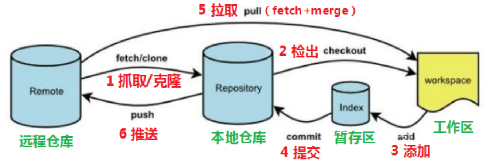

## 2.常用命令

### 2.1 基本配置

1. 打开命令行  Git Bash

2. 设置用户信息

   ```bash
   git config --global user.name "xxx"
   git config --global user.email "xxx@xxx.cn"
   ```

3. 查看配置信息

   ```bash
   git config --global user.name 
   git config --global user.email
   ```

4. 为常用指令配置别名

   - `.zshrc`中输入：

   ```bash
   # 用于输出git提交日志
   alias git-log='git log --pretty=oneline --all --graph --abbrev-commit'
   # 用于输出当前目录及所有文件及基本信息
   alias ll='ls -al'
   ```

   - 执行：`source ~/.zshrc`

5. 解决乱码问题，如果不用中文可以不配置（win的配置方法）

   - 打开GitBash执行：

   ```bash
   git config --global core.quotepath false
   ```

   - 在 ${git_home}/etc/bash.bashrc 文件中最后两行加入：

   ```bash
   export LANG="zh_CN.UTF-8"
   export LC_ALL="zh_CN.UTF-8"
   ```

### 2.2 获取本地仓库

要使用GIt对代码进行版本控制，首先要获得本地仓库：

1. 创建一个目录作为本地Git仓库

2. 进入项目中，打开终端

3. 执行 git init

   ```bash
   (base) jingmo@SilenceMacBook-Air git-test % git init
   Initialized empty Git repository in /Users/jingmo/Desktop/projects/ideaProjects/git-test/.git/
   ```

### 2.3 基础操作指令

Git工作目录下对于文件的修改(增加、删除、更新)会存在几个状态，这些修改的状态会随着我们执行Git

的命令而发生变化。

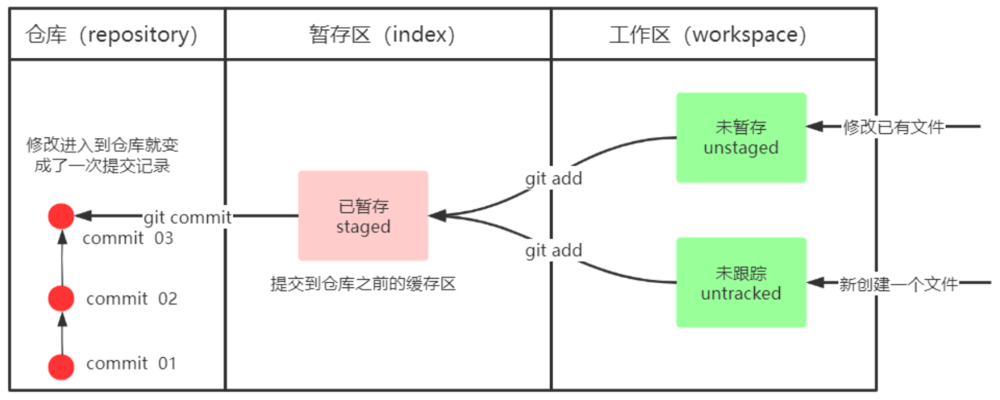

1. git add (工作区 --> 暂存区)
2. git commit (暂存区 --> 本地仓库)

#### 2.3.1 查看修改的状态 status

作用：查看的修改的状态（暂存区、工作区）

命令形式：`git status`

#### 2.3.2 添加工作区到暂存区(add)

作用：添加工作区一个或多个文件的修改到暂存区

命令形式：`git add 单个文件名|通配符`

将所有修改加入暂存区：`git add .`

#### 2.3.3 提交暂存区到本地仓库(commit)

作用：提交暂存区内容到本地仓库的当前分支

命令形式：`git commit -m '注释内容'`

#### 2.3.4 查看提交日志(log)

在2.1中配置的别名 **git**-**log** 就包含了这些参数，所以后续可以直接使用指令 **git**-**log**

作用:查看提交记录

命令形式：`git log [option]`

- options
  - --all 显示所有分支
  - --pretty=oneline 将提交信息显示为一行
  - --abbrev-commit 使得输出的commitId更简短
  - --graph 以图的形式显示

#### 2.3.5 版本回退

作用：版本切换

命令形式：`git reset --hard commitID`

- commitID 可以使用 `git-log`或 `git log`指令查看

如何查看已经删除的记录？

- `git reflog`
- 这个指令可以看到已经删除的提交记录

#### 2.3.6 添加文件至忽略列表

一般我们总会有些文件无需纳入Git 的管理，也不希望它们总出现在未跟踪文件列表。 通常都是些自动

生成的文件，比如日志文件，或者编译过程中创建的临时文件等。 在这种情况下，我们可以在工作目录

中创建一个名为 .gitignore 的文件（文件名称固定），列出要忽略的文件模式。下面是一个示例：

```bash
# no .a files
*
.a
# but do track lib.a, even though you're ignoring .a files above
!lib.a
# only ignore the TODO file in the current directory, not subdir/TODO
/TODO
# ignore all files in the build/ directory
build/
# ignore doc/notes.txt, but not doc/server/arch.txt
doc/*
.txt
# ignore all .pdf files in the doc/ directory
doc/**/*
.pdf
```

### 2.4 分支

几乎所有的版本控制系统都以某种形式支持分支。 使用分支意味着你可以把你的工作从开发主线上分离

开来进行重大的Bug修改、开发新的功能，以免影响开发主线。

Git 的分支也非常轻量。它们只是简单地指向某个提交记录 —— 仅此而已。所以许多 Git 爱好者传颂：

```
早建分支！多用分支！
```

这是因为即使创建再多的分支也不会造成储存或内存上的开销，并且按逻辑分解工作到不同的分支要比维护那些特别臃肿的分支简单多了。

#### checkout与switch

| 功能场景                   | git checkout（老指令）                          | git switch（新指令）                                  |
| :------------------------- | :---------------------------------------------- | :---------------------------------------------------- |
| 切换到已存在的分支         | `git checkout dev`                              | `git switch dev`（语义更清晰）                        |
| 创建并切换新分支           | `git checkout -b new-feature`                   | `git switch -c new-feature`（-c = create）            |
| 恢复工作区文件（核心差异） | `git checkout -- README.md`（易和分支切换混淆） | ❌ 完全不支持，改用 `git restore`（新指令）            |
| 切换到指定提交 / 标签      | `git checkout <commit-hash>`（进入分离头指针）  | `git switch --detach <commit-hash>`（显式声明分离头） |

为什么要新增 git switch？

`git checkout` 是 Git 早期的 “万能指令”，一个指令承担了多个不相关的功能，新手很容易搞混：

- 比如你想切换分支，输入 `git checkout dev`；
- 但如果手滑写成 `git checkout -- dev`（多了 `--`），就会把 `dev` 文件恢复到上一次提交的状态，直接覆盖本地修改，新手很容易误操作。

Git 团队为了 “拆分职责、降低学习成本”，在 2.23 版本拆分出两个新指令：

1. `git switch`：专门负责**分支切换**（包括创建新分支、分离头指针）；
2. `git restore`：专门负责**文件恢复 / 撤销修改**（替代 `git checkout -- 文件`）。

#### 2.4.1 查看本地分支

命令：`git branch`

#### 2.4.2 创建本地分支

命令：`git branch 分支名`

#### 2.4.4 *切换分支(checkout)

命令：`git checkout 分支名`

我们还可以直接切换到一个不存在的分支（创建并切换）

命令：`git checkout -b 分支名`

#### 2.4.6 *合并分支(merge)

一个分支上的提交可以合并到另一个分支

命令：`git merge 分支名称`

#### 2.4.7 删除分支

**不能删除当前分支，只能删除其他分支**

`git branch -d b1` 删除分支时，需要做各种检查

`git branch -D b1` 不做任何检查，强制删除

#### 2.4.8 解决冲突

当两个分支上对文件的修改可能会存在冲突，例如同时修改了同一个文件的同一行，这时就需要手动解

决冲突，解决冲突步骤如下：

1. 处理文件中冲突的地方
2. 将解决完冲突的文件加入暂存区(add)
3. 提交到仓库(commit)

冲突部分的内容处理如下所示：

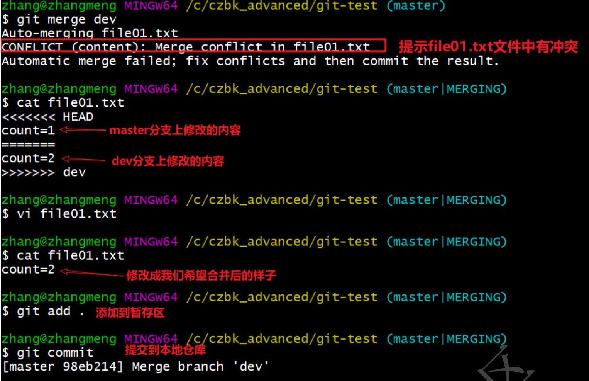

#### 2.4.9 开发中分支使用原则与流程

几乎所有的版本控制系统都以某种形式支持分支。 使用分支意味着你可以把你的工作从开发主线上分离

开来进行重大的Bug修改、开发新的功能，以免影响开发主线。

在开发中，一般有如下分支使用原则与流程：

- master （生产） 分支
  - 线上分支，主分支，中小规模项目作为线上运行的应用对应的分支；
- develop（开发）分支
  - 是从master创建的分支，一般作为开发部门的主要开发分支，如果没有其他并行开发不同期上线要求，都可以在此版本进行开发，阶段开发完成后，需要是合并到master分支,准备上线。
- feature/xxxx分支
  - 从develop创建的分支，一般是同期并行开发，但不同期上线时创建的分支，分支上的研发任务完成后合并到develop分支。
- hotfix/xxxx分支
  - 从master派生的分支，一般作为线上bug修复使用，修复完成后需要合并到master、test、develop分支。
- 还有一些其他分支，在此不再详述，例如test分支（用于代码测试）、pre分支（预上线分支）等等。

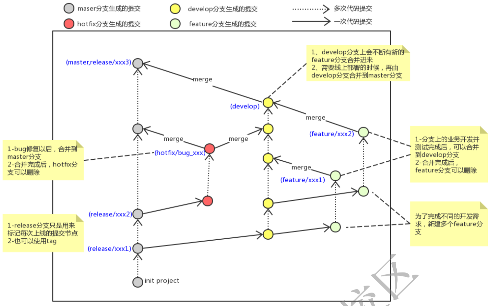

#### 2.4.10 合并分支-rebase

第二种合并分支的方法是 `git rebase`。Rebase 实际上就是取出一系列的提交记录，“复制”它们，然后在另外一个地方逐个的放下去。

Rebase 的优势就是可以创造更线性的提交历史，这听上去有些难以理解。如果只允许使用 Rebase 的话，代码库的提交历史将会变得异常清晰。

- 现在 bugFix 分支上的工作在 main 的最顶端，同时我们也得到了一个更线性的提交序列。
- 注意，提交记录 C3 依然存在（树上那个半透明的节点），而 C3' 是我们 Rebase 到 main 分支上的 C3 的副本。

```shell
# bugFix 分支上的工作在 main 的最顶端，同时我们也得到了一个更线性的提交序列
git checkout bugFix
git rebase main
# 仅将main节点指向c3'
git checkout main
git rebase bugFix
```

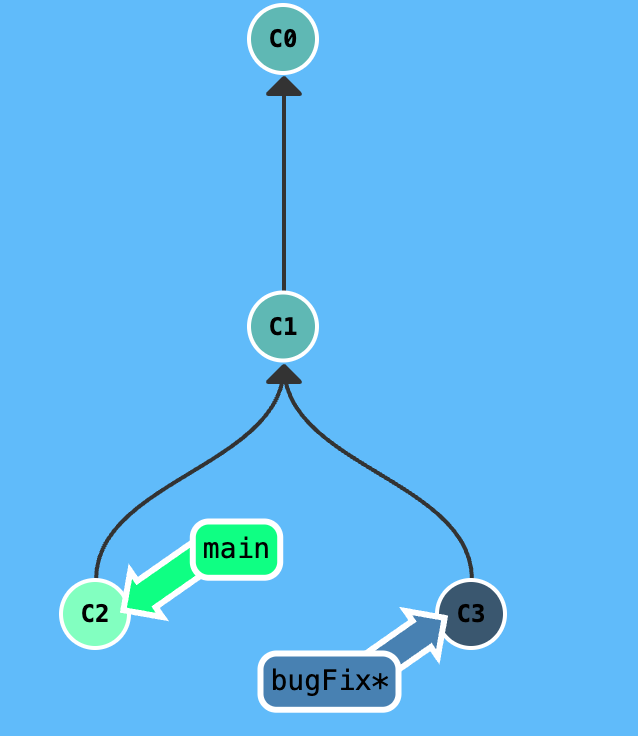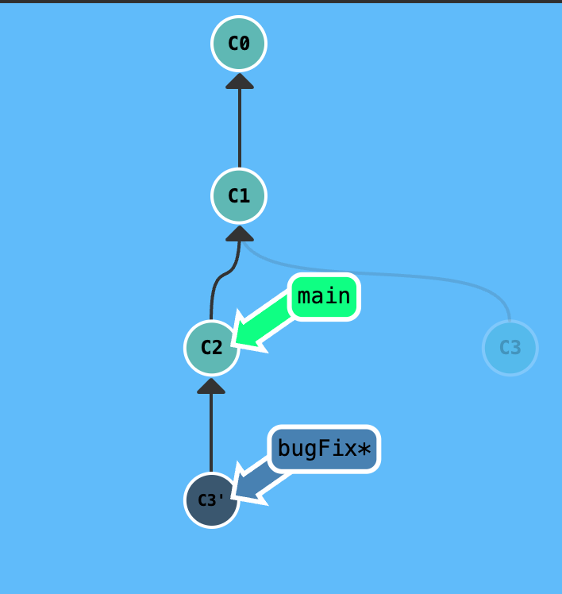

#### 2.4.11 HEAD

HEAD

-  HEAD 是当前所在提交记录的符号名称 —— 它本质上标识着你正在其上工作的那个提交。
- HEAD 总是指向当前分支上最近一次提交记录。大多数修改提交树的 Git 命令都是从改变 HEAD 的指向开始的。
- HEAD 通常情况下是指向分支名的（如 bugFix）。在你提交时，bugFix 的状态会被改变，且这一变化通过 HEAD 可见。
- 如果想看 HEAD 指向，可以通过 `cat .git/HEAD` 查看， 如果 HEAD 指向的是一个符号引用（即分支名而非提交的哈希值），还可以用 `git symbolic-ref HEAD` 查看它的指向。

分离HEAD

- 分离 HEAD 就是让其指向一个具体的提交，而不是某个分支。
  - 分离之前的状态如下所示：HEAD -> main -> C1
  - 执行： `git checkout C1`
  - 现在变成了：HEAD -> C1

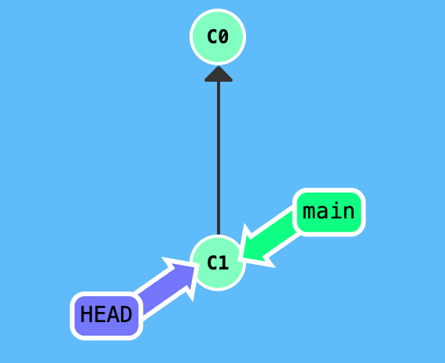

相对引用

- 通过指定提交记录哈希值的方式在 Git 中移动不太方便。在实际应用时，并没有像本程序中这么漂亮的可视化提交树供你参考，所以你得用 `git log` 来查看提交记录的哈希值。
- 并且哈希值在真实的 Git 世界中也会长得多（译者注：基于 SHA-1，共 40 位）。例如，添加上一关的那个提交的哈希值是 `fed2da64c0efc5293610bdd892f82a58e8cbc5d8`。舌头都快打结了吧...
- 好在 Git 对哈希值处理得很聪明。你只需要提供能够唯一标识提交记录的前几个字符即可。因此我可以仅输入 `fed2`，而不是上面的一长串。
- 相对引用有两个简单的用法：
  - 使用 `^` 向上移动 1 个提交记录
    -  首先看看操作符 `^`。把这个符号加在引用名称的后面，表示让 Git 寻找指定提交记录的 parent 提交。如：`git  checkout main^`
    - 所以 `main^` 相当于`main` 的 parent 节点。
    - `main^^` 是 `main` 的第二个 parent 节点
  - 使用 `~<num>` 向上移动多个提交记录，如 `~3`
    - 可以用该指令一次后退四步：`git checkout HEAD~4`
    - 可以直接使用 `-f` 选项让分支指向另一个提交。例如: `git branch -f main HEAD~3`，这条命令会将 main 分支强制指向 HEAD 的第 3 级 parent 提交。

#### 2.4.12 撤销变更

撤销变更也由底层部分（暂存单个文件或代码块）和上层部分（变更实际如何被撤销）组成。我们的应用将聚焦于后者。

主要有两种方法用来撤销变更 —— 一是 `git reset`，还有就是 `git revert`。

- `git reset` 

  - `git reset` 通过将分支引用向后移动至一个更早的提交来撤销变更。从这个意义上说，你可以把它理解为“改写历史”。`git reset` 会把分支向上移动，就好像之前指向的提交从未发生过一样。
  - 如图，执行：`git reset HEAD~1`
  -  Git 把 main 分支移回到了 `C1`；现在我们的本地仓库处于一种仿佛 `C2` 从未发生过的状态。
  - 在reset后， `C2` 所做的变更还在，但是处于未加入暂存区状态。

  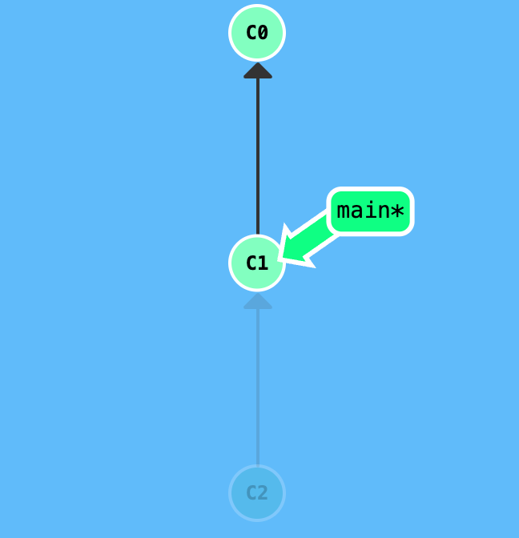

-  `git revert`

  - 虽然在你的本地分支中使用 `git reset` 很方便，但是这种“改写历史”的方法对大家一起使用的远程分支是无效的哦！
  - 为了撤销更改并**分享**给别人，我们需要使用 `git revert`。
  - 如图，执行：`git revert HEAD`
  - 新提交记录 `C2'` 引入了**更改** —— 这些更改能够刚好撤销 `C2` 提交的变更。通过 revert，你可以推送你的更改并与他人分享。

  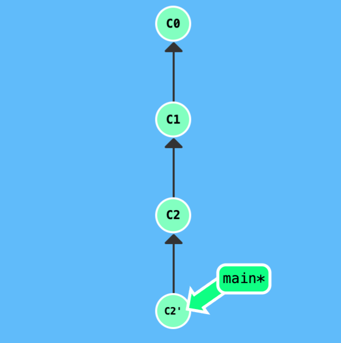

- `reset` 改写历史 → 仅适合**本地未推送的提交**（比如你刚提交但没 push，想撤销）：

  - 因为没人知道这个提交，删了也不会影响别人；如果强行推到远程（`--force`），会让协作同事的本地历史和远程分叉，他们拉取时会出大量冲突，甚至丢失代码。

- `revert` 保留历史 → 适合**已推送到远程的提交**：

  - 新增提交抵消修改，远程历史是 “追加式” 的，所有协作的人拉取后历史一致，不会出冲突，这是团队协作的 “安全撤销方式”。

## 3.Git远程仓库

### 3.1 常用的托管服务

- gitHub（ 地址：https://github.com/ ）是一个面向开源及私有软件项目的托管平台，因为只支持Git 作为唯一的版本库格式进行托管，故名gitHub
- 码云（地址： https://gitee.com/ ）是国内的一个代码托管平台，由于服务器在国内，所以相比于GitHub，码云速度会更快
- GitLab （地址： https://about.gitlab.com/ ）是一个用于仓库管理系统的开源项目，使用Git作为代码管理工具，并在此基础上搭建起来的web服务，一般用于在企业、学校等内部网络搭建git私服。

### 3.2 配置

1. 注册gitee
2. 创建远程仓库
3. 配置ssh公钥
   - 生成SSH公钥
     - `ssh-keygen -t rsa`
     - 不断回车
     - 如果公钥已经存在，则自动覆盖
   - Gitee设置账户共公钥
     - 获取公钥：`cat ~/.ssh/id_rsa.pub`
     - 在gitee设置-安全设置-SSH公钥，将公钥复制上去
   - 验证是否配置成功
     - `ssh -T git@gitee.com`

### 3.3 操作远程仓库

#### 3.3.1 添加远程仓库

- 此操作是先初始化本地库，然后与已创建的远程库进行对接。
- 命令： `git remote add <远端名称> <仓库路径>`
  - 远端名称，默认是origin，取决于远端服务器设置
  - 仓库路径，从远端服务器获取此URL
  - 例如: `git remote add origin git@gitee.com:czbk_zhang_meng/git_test.git`

#### 3.3.2 查看远程仓库

- 命令：`git remote`

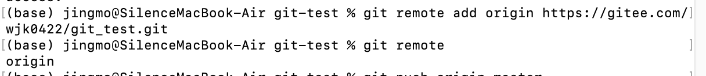

#### 3.3.3 推送到远程仓库

- 命令：`git push [-f] [--set-upstream] [远端名称 [本地分支名][:远端分支名] ]`

- 如果远程分支名和本地分支名称相同，则可以只写本地分支
  - `git push origin master`
- `-f` 表示强制覆盖
- `--set-upstream`推送到远端的同时并且建立起和远端分支的关联关系。
  - `git push --set-upstream origin master`
- 如果当前分支已经和远端分支关联，则可以省略分支名和远端名。
  - `git push` 将master分支推送到已关联的远端分支。

#### 3.3.4 本地分支与远程分支的关联关系

查看关联关系我们可以使用 `git branch -vv`命令

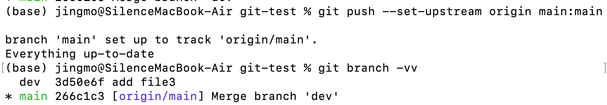

#### 3.3.5 从远程仓库克隆

- 如果已经有一个远端仓库，我们可以直接clone到本地。
- 命令: `git clone <仓库路径> [本地目录]`
  - 本地目录可以省略，会自动生成一个目录

#### 3.3.6 从远程仓库中抓取和拉取

远程分支和本地的分支一样，我们可以进行merge操作，只是需要先把远端仓库里的更新都下载到本

地，再进行操作。

- 抓取 命令：`git fetch [remote name] [branch name]`
  - 抓取指令就是将仓库里的更新都抓取到本地，不会进行合并
  - 如果不指定远端名称和分支名，则抓取所有分支。
- 拉取 命令：`git pull [remote name] [branch name]`
  - 拉取指令就是将远端仓库的修改拉到本地并自动进行合并，等同于`fetch+merge`
  - 如果不指定远端名称和分支名，则抓取所有并更新当前分支。

#### 3.3.7 解决合并冲突

在一段时间，A、B用户修改了同一个文件，且修改了同一行位置的代码，此时会发生合并冲突。

A用户在本地修改代码后优先推送到远程仓库，此时B用户在本地修订代码，提交到本地仓库后，也需要推送到远程仓库，此时B用户晚于A用户，

故需要先拉取远程仓库的提交，经过合并后才能推送到远端分支, 如下图所示。

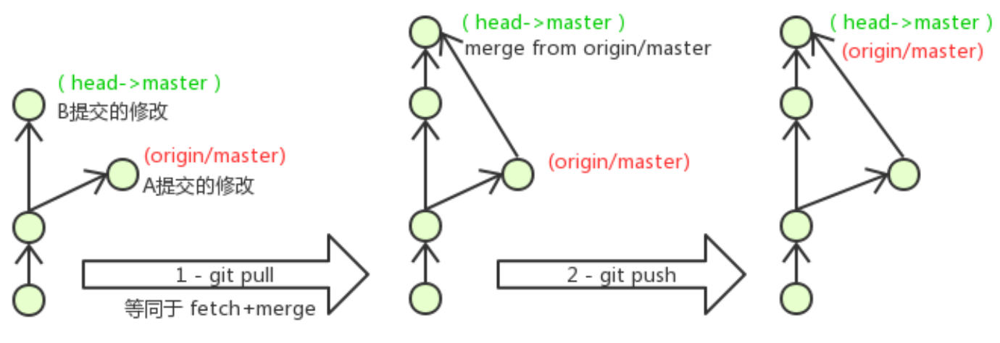

在B用户拉取代码时，因为A、B用户同一段时间修改了同一个文件的相同位置代码，故会发生合并冲突。

远程分支也是分支，所以合并时冲突的解决方式也和解决本地分支冲突相同相同

## 4.在idea中使用Git

掌握提交、查看提交记录、分支

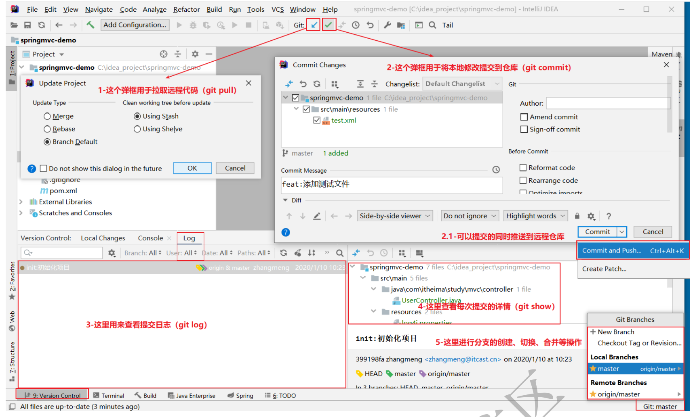

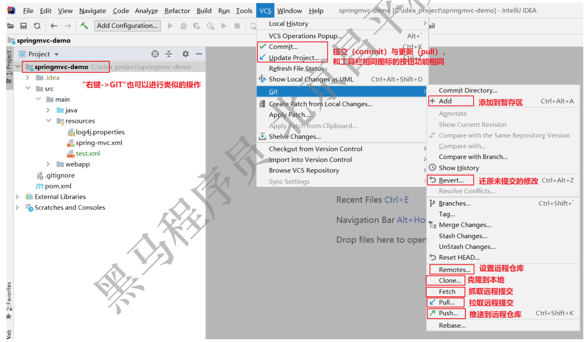

## 附

1. 切换分支前先提交本地的修改
2. 代码及时提交，提交过了就不会丢
3. 遇到任何问题都不要删除文件目录


