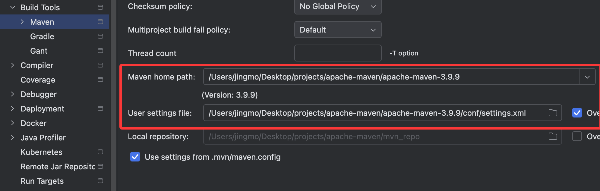
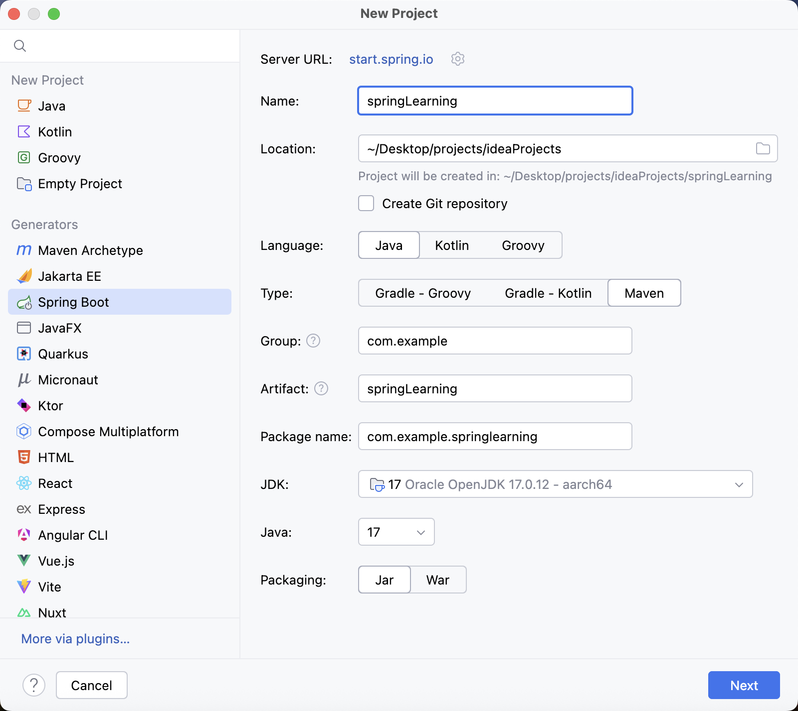
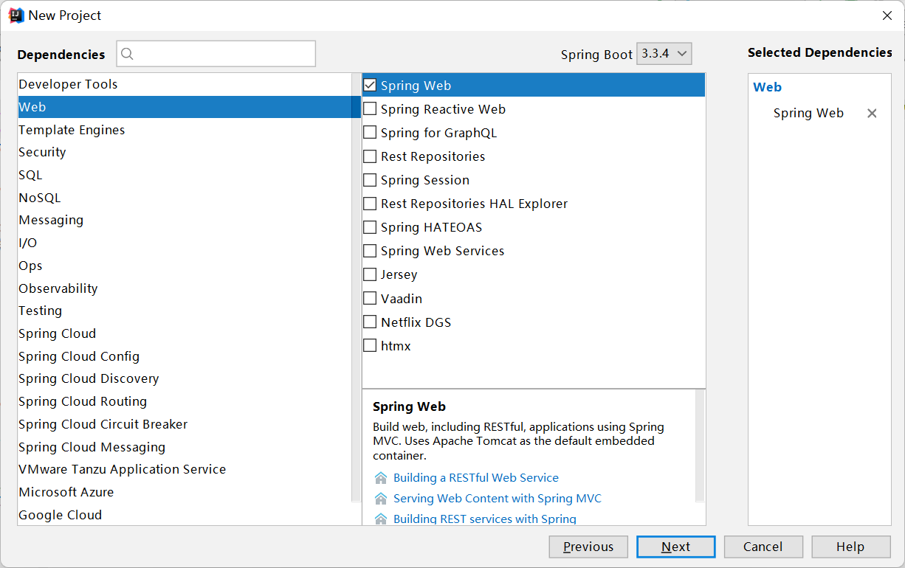
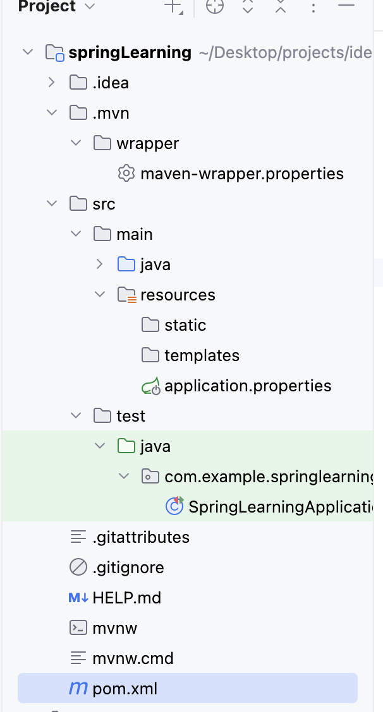
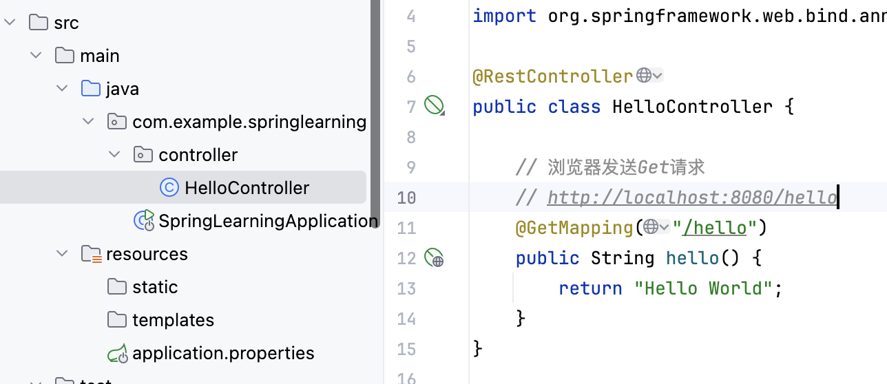
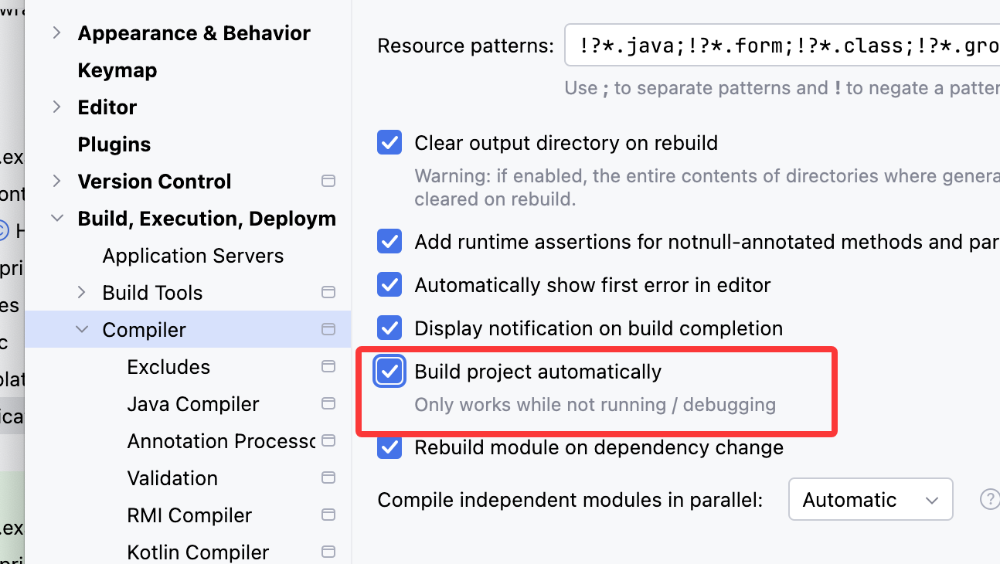
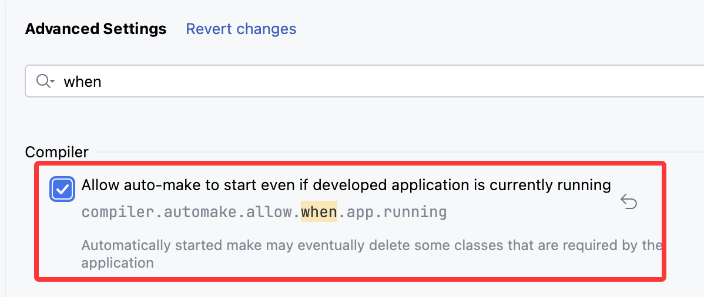

# Web技术基础

- 目前的软件分为两种：

> B/S：分散性高，维护方便，开发简单，共享性高
>
> C/S：交互性强，响应快，网络流量低（胖客户端）。不同操作系统需开发不同版本，不断更新

-  B/S：浏览器 -- WEB服务器 -- 数据库服务器

# 环境配置

- [具体配置见：mac配置]: ../mac配置.md	"mac配置"

- Java  jdk>1.8

- Maven：项目管理工具，可以对Java项目进行自动化的构建和依赖管理

  - 项目构建、依赖管理、统一开发结构
  - Maven>3.6

- 新建Maven项目，然后修改Maven配置



# SpringBoot介绍

1. 介绍
   - 基于Spring的全新框架，旨在简化Spring应用的初始搭建和开发过程
2. 特点
   - 遵循“约定优于配置”的原则，只需要很少的配置或使用默认的配置
   - 能够使用内嵌的Tomcat、Jetty服务器，不需要部署war文件
   - 提供定制化的启动器Starters，简化Maven配置，开箱即用
   - 纯Java配置，没有代码生成，也不需要xml配置
   - 提供了生产级的服务监控方案，如安全监控、应用监控、健康检测等

## 创建应用

- Group：一般写公司域名
- Artifact：项目名称





## 项目结构介绍

> pom - 管理jar包
>
> java
>
> resources
>
> ​	static - 网站相关的静态资源（如：图片、CSS、JS）
>
> ​	templates - html的模板
>
> ​	application.properties - SprinBoot的配置文件
>
> （由于做前后端分离的开发，所以static和templates里不会放资源）
>
> test - 测试文件



## 简单应用

创建一个Controller，运行main主程序



# 开发环境热部署

## 介绍

- 实际项目开发调式过程中，频繁修改后台类文件，导致需要重新编译、启动，十分麻烦，影响开发效率
- SprintBoot提供了`Sprint-boot-devtools`组件，使得无需手动重启SpringBoot应用即可重新编译、启动程序，缩短编译启动的时间
- `devtools`会监听`classpath`下的文件变动，触发`Restart类加载器`重新加载该类，从而实现类文件和属性文件的热部署
- 并不是所有的更改都需要重启应用（如静态资源、视图模板），可以通过设置`spring.devtools.restart.exclude`属性来指定一些文件或目录的修改不用重启应用

## 步骤

1. 在`pom.xml`中添加`dev-tools`依赖

   - 使用`optional=true`表示依赖不会传递，即该项目依赖`devtools`
   - 其他项目如果引入此项目生成的`jar包`，则不会含有`devtools`

   ```xml
   <!--开发环境热部署-->
   <dependency>
     <groupId>org.springframework.boot</groupId>
     <artifactId>spring-boot-devtools</artifactId>
     <optional>true</optional>
   </dependency>
   ```

2. 在`application.properties`中配置`devtools`

   ```properties
   # 开发环境热部署
   # 热部署生效
   spring.devtools.restart.enabled=true
   # 设置重启目录
   spring.devtools.restart.additional-paths=src/main/java
   # 设置classpath目录下的WEB-INF文件夹内容修改不重启
   spring.devtools.restart.exclude=static/**
   ```

3. 打开`Settings`

   - 找到`Build, Execution, Deployment->Compile`, 勾选`Build project automatically`

   

4. 第二个设置

   - 按`Ctrl+Shift+Alt+/ `快捷键调出`Maintenance`页面
   - 选择`Registry`，勾选`complier.automake.allow.when.app.running`
   - （我没找到）（新版本在设置的高级设置`Advanced Settings`里）

   
