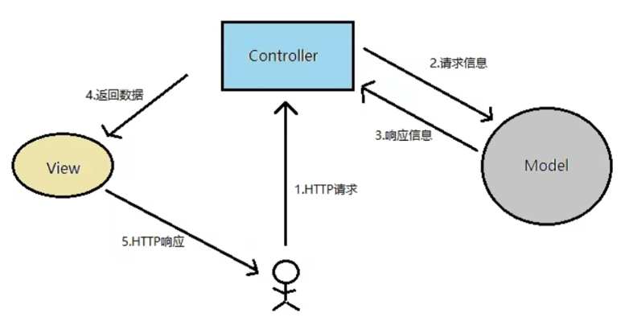
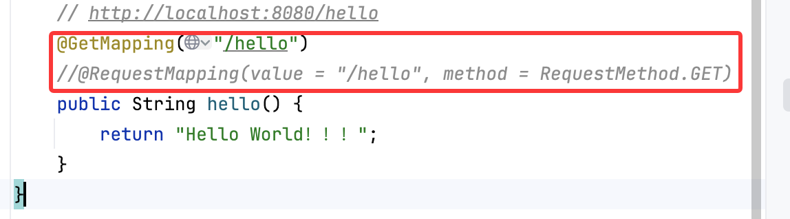
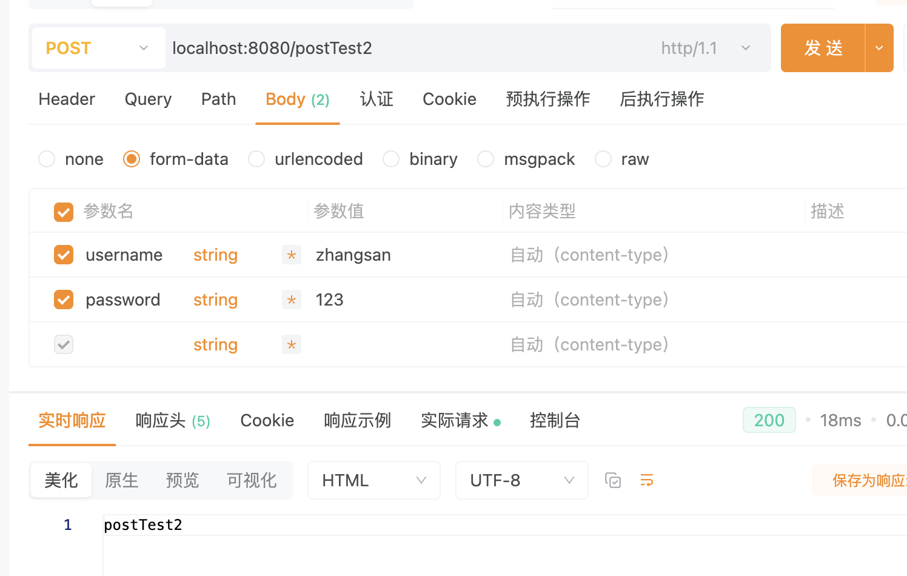

# Web入门

- `Spring Boot`将传统Web开发的`mvc`、`json`、`tomcat`等框架整合，提供了`spring-boot-starter-web`组件，简化了Web应用配置
- `webmvc`为Web开发的基础框架，`json`为JSON数据解析组件，`tomcat`为自带的容器依赖

# Controller控制器

## MVC

- Model：存储/封装数据
- Controller：控制器，用来协调和控制
- View：视图，用来显示数据



## Controller

- `@Controller`和`@RestController`两种注解标识此类负责接受和请求HTTP请求
- 如果请求的是页面和数据，使用`@Controller`，返回一个页面
- 如果只是请求数据，使用`@RestController`即可（前后端分离主要用这个）
- 默认情况下，`@RestController`会将返回的对象数据转换为`JSON`格式

## 路由映射

- `@RequestMapping`负责URL的路由映射，可以添加在`Controller类或具体的方法`上
- 如果添加在`Controller类`上，则对这个`Controller`中的所有路由映射都会加上此路径；如果加载方法上，则只对当前方法生效
- `@RequestMapping`常用属性参数：（一般只用前两个）

| **value**       | 请求URL的路径，支持URL模板、正则表达式           |
| --------------- | ------------------------------------------------ |
| **method**      | HTTP请求方法                                     |
| consumes        | 请求的媒体类型(Content-Type)，如application/json |
| produces        | 相应的媒体类型                                   |
| params, headers | 请求的参数及请求头的值                           |

- value

  - value用于匹配URL映射，支持简单表达式，如：`@RequestMapping("/user")`
  - 支持通配符匹配URL，用于统一映射某些URL规则类似的请求
    - `*`：匹配任意字符
    - `**`：匹配任意路径
    - `?`：匹配单个字符
    - 如：`@RequestMapping("/getJson/*.json")`

- Method匹配

  - HTTP请求Method有`GET/POST/PUT/DELETE`等方式
  - 也可以用注解替代，如`@GetMapping`、`@PostMapping`
  - `@ResquestMapping`和`@GetMapping`二选一(两种写法都可以)

  

## 参数传递

- `@RequestParam`将请求参数绑定到控制器的方法参数上，接收的参数来自HTTP请求体或请求url的`QueryString`，当请求的参数名称与Controller的业务方法参数名称一致时，可以省略

  ```java
  // http://localhost:8080/getTest1
  @RequestMapping(value = "/getTest1", method = RequestMethod.GET)
  public String getTest1() {
      return "getTest1";
  }
  
  // http://localhost:8080/getTest2?nickname=xxx&phone=xxx
  @RequestMapping(value = "/getTest2", method = RequestMethod.GET)
  public String getTest2(String nickname, String phone) {
      System.out.println("nickname: " + nickname);
      System.out.println("phone: " + phone);
      return "getTest2";
  }
  
  // http://localhost:8080/getTest3?nickname=xxx
  @RequestMapping(value = "/getTest3", method = RequestMethod.GET)
  public String getTest3(@RequestParam(value = "nickname", required = false) String name) {
      System.out.println("nickname: " + name);
      return "getTest3";
  }
  ```

- `@PathVariable`：用来处理动态的URL，URL的值可以作为控制器中处理方法的参数

- `@RequestBody`接收的参数来自`requestBody`中，即请求体。一般用于处理非`Content-Type:application/x-www-form-urlencoded`编码格式的数据，比如`application/json`、`application/xml`等类型的数据

- 可以用apipost发送前端请求进行测试

  ```java
     // http://localhost:8080/getTest3?nickname=xxx
      @RequestMapping(value = "/getTest3", method = RequestMethod.GET)
      public String getTest3(@RequestParam(value = "nickname", required = false) String name) {
          System.out.println("nickname: " + name);
          return "getTest3";
      }
  
      @RequestMapping(value = "/postTest1", method = RequestMethod.POST)
      public String postTest1() {
          return "postTest1";
      }
  
      @RequestMapping(value = "/postTest2", method = RequestMethod.POST)
      public String postTest2(String username, String password) {
          System.out.println("username: " + username);
          System.out.println("password: " + password);
          return "postTest2";
      }
  
      @RequestMapping(value = "/postTest3", method = RequestMethod.POST)
      public String postTest3(User user) {
          System.out.println("user: " + user);
          return "postTest3";
      }
  
      @RequestMapping(value = "/postTest4", method = RequestMethod.POST)
      public String postTest4(@RequestBody User user) {
          System.out.println("user: " + user);
          return "postTest4";
      }
  ```

  
