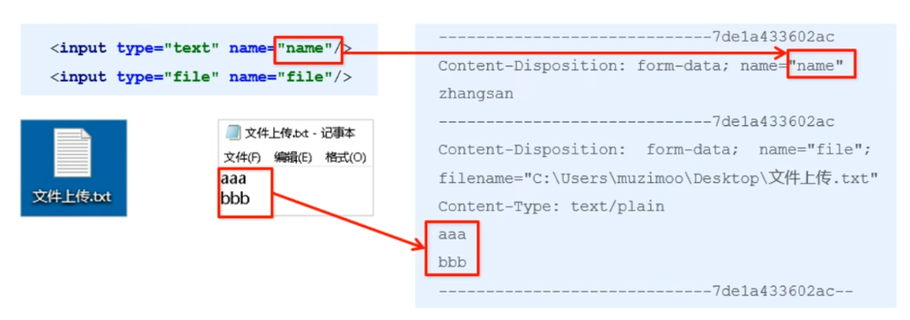
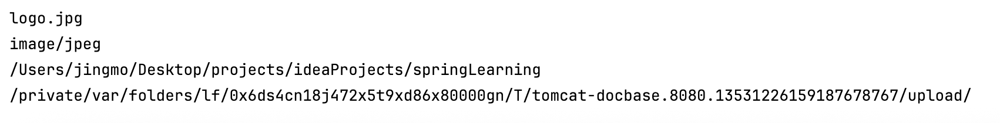
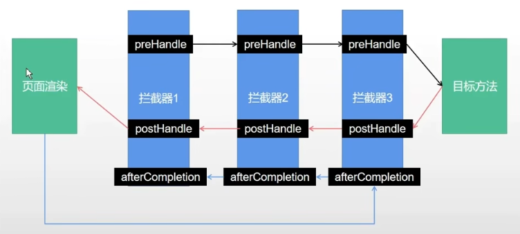

# 静态资源访问

- 使用IDEA创建SpringBoot 项目，会默认创建`classpath:/static/` 目录，存放静态资源

- 前后端分离项目，这个目录不放东西

- 如果默认的静态资源过滤策略不能满足开发需求，可以自定义静态资源过滤策略

- 在`application.properties`中定义过滤规则和静态资源位置

  - static目录下的可以直接访问到
  - 修改过滤规则后，需要加上规则的路径才能访问
  - 如果自己创建目录，可以在静态资源位置中增加一个路径

  ```properties
  # 过滤规则为 /static/**， 静态资源位置为 classpath:/static/
  spring.mvc.static-path-pattern=/static/**
  spring.web.resources.static-locations=classpath:/static/ 
  ```

# 文件上传

1. 表单的`enctype属性`规定在发送服务器前该如何对表单数据进行编码

   - 当表单的`enctype="application/x-www-form-urlencoded"`(默认)时，form表单中的数据格式为： `key=value&key=value`
   - 当表单的 `enctype="multipart/form-data"`时：
     - 普通字段还是 `key=value`
     - 文件：包含文件名、文件类型、文件内容；如果图片等则直接是二进制流
     - **上传文件要修改为该形式**

   

2. SpringBoot实现文件上传

   - `SpringBoot`嵌入的`tomcat`限制了请求的文件大小，每个文件的配置最大为1Mb，单次请求的文件的总数不能大于10Mb
   - 要更改需要在`application.properties`中加入两个配置

   ```properties
   # 文件上传限制
   # 单个文件大小
   spring.servlet.multipart.max-file-size=10MB
   # 单次请求文件总数大小
   spring.servlet.multipart.max-request-size=10MB
   ```

   - 表单的`enctype="multipart/form-data"`时，可以使用`MultipartFile`获取上传的文件数据，再通过`transfeoTo`方法将其写入到磁盘中
   - 参数名称一定要和表单中的name一致

   ```java
   @RestController
   public class FileUploadController {
   
       @PostMapping("/upload")
       public String upload(String nickname, MultipartFile photo, HttpServletRequest request) throws IOException {
           System.out.println(nickname);
           // 获取图片的原始名称
           System.out.println(photo.getOriginalFilename());
           // 获取文件类型
           System.out.println(photo.getContentType());
           System.out.println(System.getProperty("user.dir"));
   
           String path = request.getServletContext().getRealPath("/upload/");
           System.out.println(path);
           saveFile(photo, path);
           return "success upload";
       }
   
       public void saveFile(MultipartFile photo, String path) throws IOException {
           // 判断存储的目录是否存在，若不存在则创建
           File dir = new File(path);
           if (!dir.exists()) {
               dir.mkdirs();
           }
   
           File file = new File(path + photo.getOriginalFilename());
           photo.transferTo(file);
       }
   }
   ```

   控制台输出：

   

# 拦截器

1. 对于某些全局统一的操作，可以提取到拦截器实现，拦截请求
2. 大致的使用场景：
   - 权限检查：如登陆检测，进入处理程序检测是否登录，如果没有，则直接返回登录页面
   - 性能监控：有时系统在某段时间莫名其妙很慢，可以通过拦截器在进入处理程序之前记录开始时间，在处理完后记录结束时间，从而得到该请求的处理时间
   - 通用行为：读取cookie得到用户信息并将用户对象放入请求，从而方便后续流程使用，还有提取Locale、Theme信息等，只要是多个处理程序都需要的，即可使用拦截器实现
3. HandlerInterceptor接口实现自定义拦截功能
   - 通过重写 preHandle、postHandle、afterCompletion三种方法实现请求前后操作
   - preHandle方法重写最多



## 拦截器定义

- request：前端发送的请求
- response：可以给前端返回对应信息

```java
public class LoginInterceptor implements HandlerInterceptor {
		
  	// 在请求处理之前进行调用（Controller方法调用之前）
    @Override
    public boolean preHandle(HttpServletRequest request, HttpServletResponse response, Object handler) throws Exception {

        if(条件){
            System.out.println("通过");
            return true;
        }else {
            System.out.println("不通过");
            return false;
        }
    }
}
```

## 拦截器注册

- 创建一个java类，实现`WebMvcConfigurer`接口
- `addPathPatterns`方法定义拦截的地址
- `excludePathPatterns`定义排除某些地址不被拦截
- 添加的一个拦截器没有`addPathPatterns`任何一个url则默认拦截所有请求
- 如没有`excludePathPatterns`任何一个请求，则默认不放过任何一个请求

```java
@Configuration
public class WebConfig implements WebMvcConfigurer {

    @Override
    public void addInterceptors(InterceptorRegistry registry) {
        registry.addInterceptor(new LoginInterceptor()).addPathPatterns("/user/**");
    }
}
```

# 构建RESTful服务

## RESTful介绍

- 是目前流行的互联网软件服务架构设计风格
- REST（Representational State Transfer，表述性状态转移）
- 不是一个标准，更像客户端和服务端交互时的架构理念和设计原则，基于该原则设计的Web API更简洁、更有层次

 ## 特点

- 每一个URL代表一种资源
- 客户端使用`GET、POST、PUT、DELETE`四种表示操作方式的动词对服务端资源进行操作
  - GET：获取资源
  - POST：新建资源(也可更新资源)
  - PUT：更新资源
  - DELETE：删除资源
- 通过操作资源的表现形式来实现服务端请求操作
- 资源的表现形式是`JSON`或`HTML`
- 客户端与服务端之间的交互在请求之间是无状态的，从客户端到服务端的每个请求都包含必须的信息

 ## 关键特性

符合RESTful规范的Web API具备的两个关键特性：

- 安全性：
  - 安全的方法被期望不会产生任何副作用
  - 当我们使用GET获取资源时，不会引起资源本身的改变，也不会引起服务器状态的改变
- 幂等性：
  - 幂等的方法保证了重复进行一个请求和一次请求的效果相同（并不是指响应总是相同的，而是指服务器上资源的状态从第一次请求后就不在改变了）
  - 在数学上幂等性是指N次变换和一次变换相同

## HTTP Method

- HTTP提供了POST、GET、PUT、DELETE等操作类型对某个Web资源进行Create、Read、Update和Delete操作
- 一个HTTP请求除了利用URI标志目标资源外，还需要通过HTTP Method指定针对该资源的操作类型，一些常见的HTTP方法及其在RESTful风格下的使用如下：

| HTTP 方法 | 操作   | 返回值                                                  | 特定返回值                                                   |
| --------- | ------ | ------------------------------------------------------- | ------------------------------------------------------------ |
| POST      | Create | 201（Created），提交或保存资源                          | 404 (Not Found)，409（Conflict）资源已存在                   |
| GET       | Read   | 200（OK），获取资源或数据列表，支持分页、排序和条件查询 | 200（OK）返回资源，404（Not Found）资源不存在                |
| PUT       | Update | 200（OK）或 204（No Content），修改资源                 | 404（Not Found）资源不存在，405（Method Not Allowed）禁止使用改方法调用 |
| PATCH     | Update | 200（OK）or 204（No Content），部分修改                 | 404（Not Found）资源不存在                                   |
| DELETE    | Delete | 200（OK），资源删除成功                                 | 404（Not Found）资源不存在，405（Method Not Allowed）禁止使用改方法调用 |

## HTTP状态码

服务向用户返回的状态码和提示信息，客户端的每一次请求，服务必须给出回应，回应包括HTTP状态码和数据

状态码主要分为：

- 1xx：信息，通信传输协议级信息
- 2xx：成功，表示客户端的请求已成功接受
- 3xx：重定向，表示客户端必须执行一些其他操作才能完成其请求
- 4xx：客户端错误，此类错误状态码指向客户端

- 5xx：服务器错误，服务器负责这些错误状态码

## SpringBoot实现RESTful API

1. 通过注解实现：
   - @GetMapping
   - @PostMapping
   - @PutMapping：Put请求，更新全部资源
   - @DeleteMapping
   - @PatchMapping：Patch请求，部分更新资源
2. 每个网址代表一种资源，URI中建议**不包含动词**，只包含名词即可，且所用名词往往与数据库的表格名对应，
   - 如删除用户
     - 传统：get http://localhost/del?id=10
     - RESTful：delete http: //localhost/user/10

| HTTP Method | 接口地址 | 接口说明               |
| ----------- | -------- | ---------------------- |
| POST        | /user    | 创建用户               |
| GET         | /user/id | 根据 id 获取用户信息   |
| PUT         | /user    | 更新用户               |
| DELETE      | /user/id | 根据 id 删除对应的用户 |

3. 示例
   - 加了`@PathVariable`，id才能加到路径中

```java
@RestController
public class UserController {
    
    @GetMapping("/user/{id}")
    public String getUserById(@PathVariable int id) {
        return "getUserById";
    }
    
    @PostMapping("/user")
    public String save(User user) {
        return "add user";
    }
    
    @PutMapping("/user")
    public String update(User user) {
        return "update user";
    }
    
    @DeleteMapping("/user/{id}")
    public String delete(@PathVariable int id) {
        return "delete user";
    }
    
}

```

# Swagger

- Swagger是一个规范和完整的框架，用于生成、描述、调用和可视化RESTful风格的Web服务，是非常流行的API表达工具
- Swagger能自动生成完善的RESTful API文档，同时根据后台代码的修改同步更新，同时提供完整的测试页面来调试API

## 步骤

1. 添加依赖

```xml
<!-- Swagger -->
<dependency>
  <groupId>io.springfox</groupId>
  <artifactId>springfox-swagger2</artifactId>
  <version>3.0.0</version>
</dependency>
<dependency>
  <groupId>io.springfox</groupId>
  <artifactId>springfox-swagger-ui</artifactId>
  <version>3.0.0</version>
</dependency>
```

2. 添加配置文件 

```java
@Configuration  //告诉Spring容器，这是一个配置类
@EnableSwagger2 //启用Swagger2容器
public class SwaggerConfig {

    // 配置Swagger2相关的bean
    @Bean
    public Docket createRestApi() {
        return new Docket(DocumentationType.SWAGGER_2)
                .apiInfo(apiInfo())
                .select()
                .apis(RequestHandlerSelectors.basePackage("com"))  //com包下所有API都交给Swagger2管理
                .paths(PathSelectors.any()).build();
    }

    // API文档页面显示信息
    private ApiInfo apiInfo() {
        return new ApiInfoBuilder()
                .title("演示项目API") // 标题
                .description("学习Swagger2的演示项目") // 描述
                .version("1.0") //版本
                .build();
    }

}
```

3. 使用Swagger2进行接口测试

   - 启动项目访问 `http://localhost:8080/swagger-ui.html`， 即可打开自动生成的可视化测试页面

   - 注释信息

     ```java
     @ApiOperation("获取用户")
     @GetMapping("/user/{id}")
     public String getUserById(@PathVariable int id) {
         System.out.println(id);
         return "getUserById";
     }
     ```

     

## 注意

Swagger2一直报错（应该主要原因是和springboot的版本不兼容）

解决办法，使用Swagger3

1. pom.xml

   ```xml
   <dependency>
       <groupId>org.springdoc</groupId>
       <artifactId>springdoc-openapi-starter-webmvc-ui</artifactId>
       <version>2.2.0</version>
   </dependency>
   ```

2. SwaggerConfig.java

   ```java
   package com.example.springlearning.config;
   
   import io.swagger.v3.oas.models.ExternalDocumentation;
   import io.swagger.v3.oas.models.OpenAPI;
   import io.swagger.v3.oas.models.info.Contact;
   import io.swagger.v3.oas.models.info.Info;
   import io.swagger.v3.oas.models.info.License;
   import org.springframework.context.annotation.Bean;
   import org.springframework.context.annotation.Configuration;
   
   @Configuration  //告诉Spring容器，这是一个配置类
   public class SwaggerConfig {
   
       @Bean
       public OpenAPI springShopOpenAPI() {
           return new OpenAPI()
                   .info(new Info().title("标题")
                           .contact(new Contact())
                           .description("我的API文档")
                           .version("v1")
                           /*.license(new License().name("Apache 2.0").url("http://springdoc.org")))
                   .externalDocs(new ExternalDocumentation()
                           .description("外部文档")
                           .url("https://springshop.wiki.github.org/docs")*/);
       }
   }
   ```

3. api中的注释

   ```java
   @Operation(summary = "获取用户")
   @GetMapping("/user/{id}")
   public String getUserById(@PathVariable int id) {
       System.out.println(id);
       return "getUserById";
   }
   ```

   
