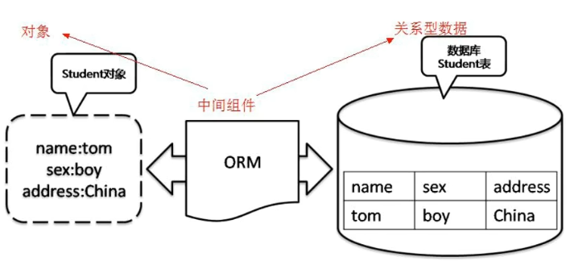

# ORM介绍

- ORM-对象关系映射 Object Relational Mapping，为了解决面向对象与关系数据库存在的互不匹配现象的一种技术
- ORM通过使用描述对象和数据库之间映射的元数据将程序中的对象自动持久化到关系数据库中
- 本质是简化编程中操作数据库的编码



# Mybatis-Plus

- Mybatis是一款优秀的数据持久层ORM框架，被广泛应用于应用系统
- MyBatis能灵活地实现动态SQL，可以使用XML或注解来配置和映射原生信息，能够轻松地将Java的POJO(Plain Ordinary Java Object，普通的Java对象)与数据库中的表和字段进行映射关联
- Mybatis-Plus在MyBatis基础上做了增强，简化了开发

## 依赖

```xml
<!-- MyBatisPlus依赖 -->
<dependency>
  <groupId>com.baomidou</groupId>
  <artifactId>mybatis-plus-boot-starter</artifactId>
  <version>3.5.9</version>
</dependency>
<!-- mysql驱动依赖 -->
<dependency>
  <groupId>mysql</groupId>
  <artifactId>mysql-connector-java</artifactId>
  <version>8.0.33</version>
</dependency>
<!-- 数据连接池druid-->
<dependency>
  <groupId>com.alibaba</groupId>
  <artifactId>druid-spring-boot-starter</artifactId>
  <version>1.2.23</version>
</dependency>
```

注意：版本问题很影响，我最后选择的版本：

```xml
<!-- SpringBoot -->
<parent>
    <groupId>org.springframework.boot</groupId>
    <artifactId>spring-boot-starter-parent</artifactId>
    <version>3.3.3</version>
    <relativePath/> <!-- lookup parent from repository -->
</parent>

<!-- MyBatisPlus依赖 -->
<dependency>
    <groupId>com.baomidou</groupId>
    <artifactId>mybatis-plus-spring-boot3-starter</artifactId>
    <version>3.5.7</version>
</dependency>
```

## 全局配置

在`application.properties`中配置数据库相关信息

```properties
# 数据库相关配置
# 数据池
spring.datasource.type=com.alibaba.druid.pool.DruidDataSource
# 驱动-连接数据库
spring.datasource.driver-class-name=com.mysql.jdbc.Driver
# 数据库名字-mydb
spring.datasource.url=jdbc:mysql://localhost:3306/test?useSSL=false&useUnicode=true&characterEncoding=utf8
spring.datasource.username=root
spring.datasource.password=wjk1225949963
# 预输出格式
mybatis-plus.configuration.log-impl=org.apache.ibatis.logging.stdout.StdOutImpl
```

在启动器的java类中添加`@MapperScan`注解，告诉mapper包在哪儿

```java
@SpringBootApplication
@MapperScan("com.example.springlearning.mapper")
public class SpringLearningApplication {

    public static void main(String[] args) {
        SpringApplication.run(SpringLearningApplication.class, args);
    }

}
```

## MyBatis CUDA 注解

| 注解     | 功能                                   |
| -------- | -------------------------------------- |
| @Insert  | 实现插入                               |
| @Update  | 实现更新                               |
| @Delete  | 实现删除                               |
| @Select  | 实现查询                               |
| @Result  | 实现结果集封装                         |
| @Results | 可以与@Result 一起使用，封装多个结果集 |
| @One     | 实现一对一结果集封装                   |
| @Many    | 实现一对多结果集封装                   |

## mybatis-CUDA 操作示例

UserMapper.java

```java
@Mapper
public interface UserMapper {
    @Select("select * from user")
    public List<User> getAll();

    @Select("select * from user where id={id}")
    public User findById(int id);

    @Insert("insert into user values(#{id}, #{username}, #{password}, #{birthday})")
    public int add(User user);

    @Update("update user set username=#{username}, password=#{password}, birthday=#{birthday} where id=#{id}")
    public int update(User user);

    @Delete("delete from user where id=#{id}")
    public int delete(int id);
}

```

UserController.java

```java
@RestController
public class UserController {

    @Autowired
    private UserMapper userMapper;

    @GetMapping("/user")
    public List query() {
        List<User> users = userMapper.findAll();
        System.out.println(users);
        return users;
    }
  
  	@PostMapping("/user")
    public String save(User user) {
        //最好对数据做个校验，再插入数据库中
        int i = userMapper.insert(user);
        if (i > 0) {
            return "insert success";
        }else {
            return "insert fail";
        }
    }
}
```

## Mybatis-Plus 操作示例

UserMapper.java

```java
@Mapper
public interface UserMapper extends BaseMapper<User> {
    //BaseMapper中已经有很多方法了，只需要把对应的Entity表加在继承的类中即可
  	//其他都不需要再写了
}
```

UserController.java

```java
@GetMapping("/user")
    public List query() {
      	//selectList(条件)
        List<User> users = userMapper.selectList(null);
        System.out.println(users);
        return users;
    }

    @PostMapping("/user")
    public String save(User user) {
        //最好对数据做个校验，再插入数据库中
        int i = userMapper.insert(user);
        if (i > 0) {
            return "insert success";
        }else {
            return "insert fail";
        }
    }
```

### 注意

- 在`UserMapper`中继承`BaseMapper<>类 `(<>中放与实体类)
  - 实体类的名字必须和表名一致（如果不一致，可以加注解 `@TableName`）
  - 就不需要再写Sql语句，直接调用BaseMapper中的方法
- 这个新增，我User的ID用Integer的时候，自己写的方法传的是null，但是BaseMapper传的是一个特别大的数字，所以用的时候整型还是最好改成int吧。
  - 但是，可以在id前加个注解 `@TableId(type = IdType.AUTO)` 表示这个属性是自增的，且加入之后，在Controller执行完insert后，该User对象会把其id值也改为数据库中id的值
- 其他注解可以看官网学 baomidou.com/223848

# 多表查询

- 实现复杂关系查询，可以使用`@Results注解、@Result注解、@One注解、@Many注解`组合完成复杂关系的配置
- Mybatis提供的，Mybatis-Plus只对单表做了增强，多表查询还是需要自己写

| 注解     | 说明                                                         |
| -------- | ------------------------------------------------------------ |
| @Results | 代替 `<resultMap>` 标签，该注解中可以加入单个或多个 @Result 注解 |
| @Result  | 代替 `<id>` 标签和 `<Result>` 标签，@Result 中可以使用以下属性： |
|          | - column：数据库的字段名称                                   |
|          | - property：类中对应的属性名                                 |
|          | - one：与 @One 注解配合，进行一对一的映射                    |
|          | - many：与 @Many 注解配合，进行一对多的映射                  |
| @One     | 代替 `<association>` 标签，用于指定查询中返回的单一对象      |
|          | 通过 select 属性指定用于多表查询的方法                       |
|          | 使用格式：`@Result(column="", property="", one=@One(select=""))` |
| @Many    | 代替 `<collection>` 标签，用于指定查询中返回的集合对象       |
|          | 使用格式：`@Result(column="", property="", many=@Many(select=""))` |

## 示例

- User.java

```java
package com.example.springlearning.entity;

import com.baomidou.mybatisplus.annotation.IdType;
import com.baomidou.mybatisplus.annotation.TableField;
import com.baomidou.mybatisplus.annotation.TableId;
import com.baomidou.mybatisplus.annotation.TableName;

import java.util.List;

// @TableName("user")
public class User {
    @TableId(type = IdType.AUTO)
    private Integer id;
    private String username;
    private String password;
    private String birthday;

    //描述用户的所有订单
    // exist=false表示它不是表里的字段
    @TableField (exist = false)
    private List<Order> orders;

    public User() {
    }
		......
    ......
}

```

- UserMapper.java

```java
package com.example.springlearning.mapper;

import com.baomidou.mybatisplus.core.mapper.BaseMapper;
import com.example.springlearning.entity.User;
import org.apache.ibatis.annotations.*;

import java.util.List;

@Mapper
public interface UserMapper extends BaseMapper<User> {

    @Select("select * from user where id=#{id}")
    public User selectById(int id);

    // 查询用户及其所有订单
    @Select("select * from user;")
    // @Results-结果集的映射
    @Results({
            // @Result-给每个字段进行赋值，column-表里的字段，property-类里的字段
            @Result(column = "id", property = "id"),
            @Result(column = "username", property = "username"),
            @Result(column = "password", property = "password"),
            @Result(column = "birthday", property = "birthday"),
            @Result(column = "id", property = "orders", javaType = List.class,
                    many = @Many(select = "com.example.springlearning.mapper.OrderMapper.selectByUid"))
    })
    List<User> selectAllUserAndOrders();
}
```

- OrderMapper.java

```java
package com.example.springlearning.mapper;

import com.baomidou.mybatisplus.core.mapper.BaseMapper;
import com.example.springlearning.entity.Order;
import com.example.springlearning.entity.User;
import org.apache.ibatis.annotations.*;

import java.util.List;

@Mapper
public interface OrderMapper extends BaseMapper<Order> {

    // order是mysql的保留关键字，需要用反括号括起来才能用，怪不得老师写的是t_order
    @Select("select * from `order` where uid = #{uid}")
    public List<Order> selectByUid(int uid);

    // 查询所有的订单，同时查询订单的用户
    @Select("select * from `order`")
    @Results({
            @Result(column = "id", property = "id"),
            @Result(column = "order_time", property = "ordertime"),
            @Result(column = "total", property = "total"),
            @Result(column = "uid", property = "user", javaType = User.class,
                    one = @One(select = "com.example.springlearning.mapper.UserMapper.selectById"))
    })
    List<Order> selectAllOrdersAndUser();
}
```

- OrderController.java

```java
@RestController
public class OrderController {

    @Autowired
    private OrderMapper orderMapper;

    @GetMapping("/order/findAll")
    public List<Order> findAll(){
        List orders = orderMapper.selectAllOrdersAndUser();
        return orders;
    }
}
```

# 条件查询

使用QueryWrapper类

UserController.java

```java
// 条件查询
@GetMapping("/user/find")
public List<User> queryUserByCond() {
    QueryWrapper<User> queryWrapper = new QueryWrapper<>();
    queryWrapper.eq("username", "zhangsan");
    return userMapper.selectList(queryWrapper);
}
```

# 分页查询

1. 编写配置类

```java
@Configuration
public class MybatisPlusConfig {
    
    @Bean
    public MybatisPlusInterceptor paginationInterceptor() {
        MybatisPlusInterceptor interceptor = new MybatisPlusInterceptor();
        PaginationInnerInterceptor paginationInnerInterceptor = new PaginationInnerInterceptor(DbType.MYSQL);
        interceptor.addInnerInterceptor(paginationInnerInterceptor);
        return interceptor;
    }
}
```

2. 测试 Controller

```java
// 分页查询
@GetMapping("/user/findByPage")
public IPage findByPage() {
    //设置起始值和每页条数
    Page<User> page = new Page<>(0, 2);
    IPage iPage = userMapper.selectPage(page, null);
    return iPage;
}
```

