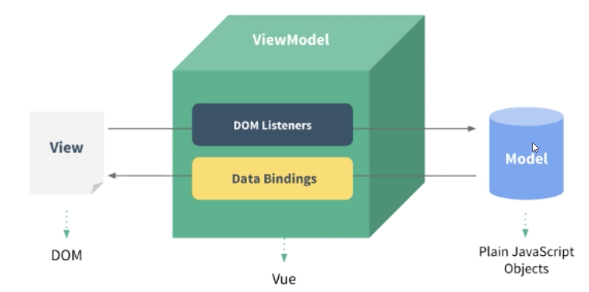
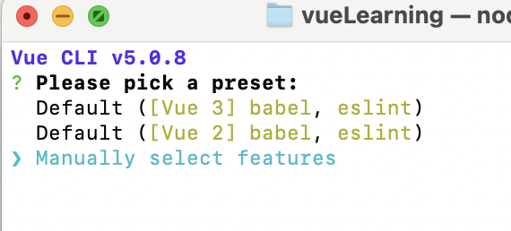
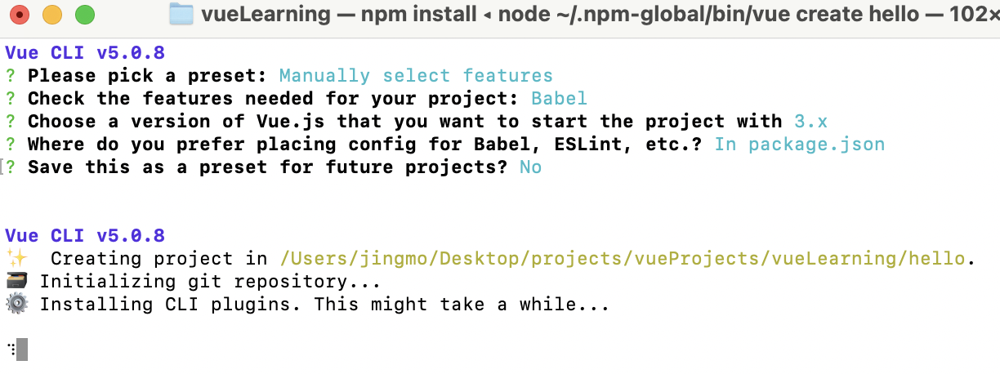

# Vue框架

- Vue是一套用于构建用户界面的渐进式框架
- Vue.js提供了MVVM数据绑定和一个可组合的组件系统，具有简单、灵活的API
- 其目标是通过尽可能简单的API实现响应式的数据绑定和可组合的视图组件

## MVVM模式

- MVVM：Model-View-ViewModel的缩写，是一种基于前端开发的架构模式，其核心是提供对View和ViewModel的双向数据绑定
- Vue提供了MVVM风格的双向数据绑定，核心是MVVM的VM，也就是ViewModel，ViewModel负责连接Model和View，保证数据和视图的一致性



## Vue的简单示例

- 导入Vue.js的script脚本文件

  ```html
  <script src="https://unpkg.com/vue@3/dist/vue.esm-browser.js" ></script>
  ```

- 在页面中声明一个将要被 vue所控制的DOM区域，即MVVM中的View

  ```html
  <body>
      <div id="app">
          {{message}}
      </div>
  </body>
  ```

- 创建vm实例对象（vue实例对象）

  ```html
  <body>
      <div id="app">
          {{message}}
      </div>
      <script>
          const { createApp } = Vue
      
          createApp({
              data() {
              return {
                  message: 'Hello Vue!'
              }
              }
          }).mount('#app')
      </script>
  </body>
  ```

- vscode中安装`open in browser`，右键就可直接在浏览器中打开

# 基础语法

## 内容渲染指令

-  `{{data}}`，用两个中括号括起来

```html
<body>
    <div id="app">
        <p> 姓名：{{username}} </p>
        <p> 性别：{{gender}} </p>
        
        <p> {{desc}} </p>
        <p v-html="desc"></p>
    </div>

    <script>
        const vm={
            data: function(){
                return{
                    username: 'zhangsan',
                    gender: '男',
                    desc: '<a href="https://www.baidu.com>百度</a>'
                }
            }
        }
        const app = Vue.createApp(vm)
        app.mount('#app')
    </script>
</body>
```

## 属性绑定指令

- `:property="data"`，用冒号

```html
<body>
    <div id="app">
        <a :href="link">百度</a>
        <input type="text" :placeholder="inputValue">
        
    </div>

    <script>
        const vm = {
            data: function(){
                return{
                    link: "http://www.baidu.com",
                    inputValue: '请输入内容',
                    imgSrc: './images/demo.jpg',
                    w: '500px'
                }
            }
        }
        const app = Vue.createApp(vm)
        app.mount('#app')
    </script>
</body>
```

## 使用JavaScript表达式

- 渲染内容/绑定属性时，可以使用JavaSript表达式，但是不能放语句，只能是表达式

```html
<body>
    <div id="app">
        <p> {{number+1}} </p>
        <p> {{ok ? 'True' : 'False'}} </p>
        <p> {{message.split('').reverse().join('')}} </p>
        <p :id=" 'list-'+id "> xxx </p>
        <p> {{user.name}} </p>
    </div>

    <script>
        const vm = {
            data: function(){
                return{
                    number: 9,
                    ok: false,
                    message: 'ABC',
                    id: 3,
                    user: {
                        name: 'zs'
                    }
                }
            }
        }
        const app = Vue.createApp(vm)
        app.mount('#app')
    </script>
</body>
```

## 事件绑定指令

- 可以绑定事件
- `v-on:` 等价于 `@`

```html
<body>
    <div id="app">
        <h3> count的值为：{{count}} </h3>
        <button v-on:click="addCount">+1</button>
        <button @click="count+=1">+1</button>
    </div>

    <script>
        const vm = {
            data: function(){
                return{
                    count: 0
                }
            },
            method:{
                //点击按钮，让count自增1
                addCount(){
                    this.count += 1
                }
            }
        }
        const app = Vue.createApp(vm)
        app.mount('#app')
    </script>
</body>
```

## 条件渲染

- `v-if`和`v-show`
- 区别是，如果是`false`的话
  - `v-if`标签就没创建
  - `v-show`创建了标签，但是是隐藏样式(display=false)
- 如果标签要被频繁切换的话，使用`v-show`性能较好

```html
<body>
    <div id="app">
        <button @click="flag = !flag">Toggle Flag</button>
        <p v-if="flag">请求成功，被v-if控制</p>
        <p v-show="flag">请求成功，被v-show控制</p>
    </div>

    <script>
        const vm = {
            data: function(){
                return{
                    flag: false
                }
            }
        }
        const app = Vue.createApp(vm)
        app.mount('#app')
    </script>
</body>
```

- `v-else`和`v-else-if`

```html
<body>
    <div id="app">
        <p v-if="num > 0.5"> 随机数 > 0.5</p>
        <p v-else> 随机数 小于等于 0.5 </p>
        <hr/>
        <p v-if="type === 'A'">优秀</p>
        <p v-else-if="type === 'B'">良好</p>
        <p v-else-if="type === 'C'">中等</p>
        <p v-else>差</p>

        <div v-show="a">
            测试
        </div>
        <button @click="a = !a">点击</button>
    </div>

    <script>
        const vm = {
            data: function(){
                return{
                    //生成1以内的随机数
                    num: Math.random,
                    a: false,
                    type: 'B'
                }
            }
        }
        const app = Vue.createApp(vm)
        app.mount('#app')
    </script>
</body>
```

## 列表渲染指令

- 使用`<ul>`、` <li>`：`v-for`

```html
<body>
    <div id="app">
        <ul>
            <li v-for="(user, i) in userList">索引是：{{i}}, 姓名是：{{user.name}}</li>
        </ul>
    </div>

    <script>
        const vm = {
            data: function(){
                return{
                    userList:[
                        { id: 1, name: 'zhangsan'},
                        { id: 2, name: 'lisi'},
                        { id: 3, name: 'wangwu'}
                    ]
                }
            }
        }
        const app = Vue.createApp(vm)
        app.mount('#app')
    </script>
</body>
```

- v-for中的key
- 在组件化开发中key是必须要加的，否则会报错
- key应该唯一
- key最好别用index，因为index也会变化，一般用数据库中的主键

```html
<body>
    <div id="app">
        <!-- 添加用户的区域 -->
        <div>
          	// v-model：双向绑定，页面变变量也变，变量变页面也变
            <input type="text" v-model="name">
            <button @click="addNewUser">添加</button>
        </div>

        <!-- 用户列表区域 -->
        <ul>
            <li v-for="(user, index) in userList" :key="user.id">
                <input type="checkbox" />
                姓名：{{user.name}}
            </li>
        </ul>
    </div>

    <script>
        const vm = {
            data: function(){
                return{
                    //用户列表
                    userList:[
                        { id: 1, name: 'zhangsan'},
                        { id: 2, name: 'lisi'},
                        { id: 3, name: 'wangwu'}
                    ],
                    //输入的用户名
                    name: '',
                    //下一个可用的id值
                    nextId: 4
                }
            },
            methods: {
                //添加按钮
                addNewUser(){
                    this.userList.unshift({ id: this.nextId, name: this.name})
                    this.name = '',
                    this.nextId++
                }
            }
        }
        const app = Vue.createApp(vm)
        app.mount('#app')
    </script>
</body>
```

# 组件化开发

## NPM的使用

- NPM是一个NodeJS包管理和分发工具
- NPM最常见的用法就是用于安装和更新依赖，使用NPM要先安装Node工具

| 命令                                | 说明                                                         |
| ----------------------------------- | ------------------------------------------------------------ |
| npm init [-y\|--yes]                | 初始化目录，生成package.json，-y和-yes参数表示所有的选项均选yes |
| npm install                         | 安装 package.json 中的所有依赖                               |
| npm install --production            | 安装 package.json 中 dependencies 下的依赖                   |
| npm install <package>               | 安装指定依赖                                                 |
| npm install <package> [-g]          | 全局安装指定依赖                                             |
| npm install <package> [--save-dev]  | 安装指定依赖，并将其记录在 devDependencies 中                |
| npm install <package> [--no-save]   | 安装指定依赖，依赖不需要记录到 package.json 中               |
| npm uninstall <package>             | 移除指定依赖                                                 |
| npm prune                           | 移除不在 package.json 却在 node_modules 中的依赖             |
| npm update                          | 升级全部依赖的版本                                           |
| npm update <package>                | 升级指定依赖的版本                                           |
| npm outdated                        | 查看过期依赖                                                 |
| npm list <package>                  | 查看依赖的当前版本                                           |
| npm search <string>                 | 搜索包含关键字的依赖                                         |
| npm ls [-g][--depth=0]              | 查看项目中或全部的依赖包，可指定层级为 0                     |
| npm view <package> [field] [--json] | 查看依赖信息，包括历史版本；可指定 field 来查看某个键值；可添加 --json 参数以 json 格式显示结果 |
| npm home <package>                  | 在浏览器端打开依赖的主页                                     |
| npm repo <package>                  | 在浏览器端打开依赖的 GitHub 地址                             |
| npm docs <package>                  | 查看依赖的文档                                               |
| npm bugs <package>                  | 查看依赖的 bug                                               |

## Vue CLI使用

- Vue CLI是Vue官方提供的构建工具，通常称为脚手架
- 用于快速搭建一个带有热重载（在代码修改后不必刷新页面即可呈现修改后的效果）及构建生产版本等功能等单页面应用
- Vue CLI基于webpack构建，也可以通过项目内的配置文件进行配置
- 安装：`npm install -g @vue/cli`

## 创建vue项目

```bash
vue create projectName
```

- 学基础语法时，vue2和3区别不大
- eslint是用来检查语法风格的，学习初期建议不使用
- package.json类似于java的pom.xml，记录依赖信息





- package.json：管理依赖
- main.js：入口文件
- 运行：

```bash
cd hello
npm run serve
```

## 组件化开发

- 组件Component是Vue.js最强大的功能之一，组件可扩展HTML元素，封装可重用的代码
- Vue的组件系统允许我们使用小型、独立和通常可复用的组件构建大型应用

## 组件的构成

- Vue中规定组件的后缀名的 .vue
- 每个 .vue组件由三部分构成
  - template：组件的模版结构，可以包含HTML标签及其他的组件
  - script：组件的JavaScript代码
  - style：组件的样式

## 组件的使用

```vue
<template>
  
  <HelloWorld msg="Welcome to Your Vue.js App"/>
</template>

<script>
// 在script中导入组件
import HelloWorld from './components/HelloWorld.vue'

export default {
  name: 'App',
  components: {
    // 在script中注册组件，template就可以使用该组件了
    HelloWorld
  }
}
</script>
```

