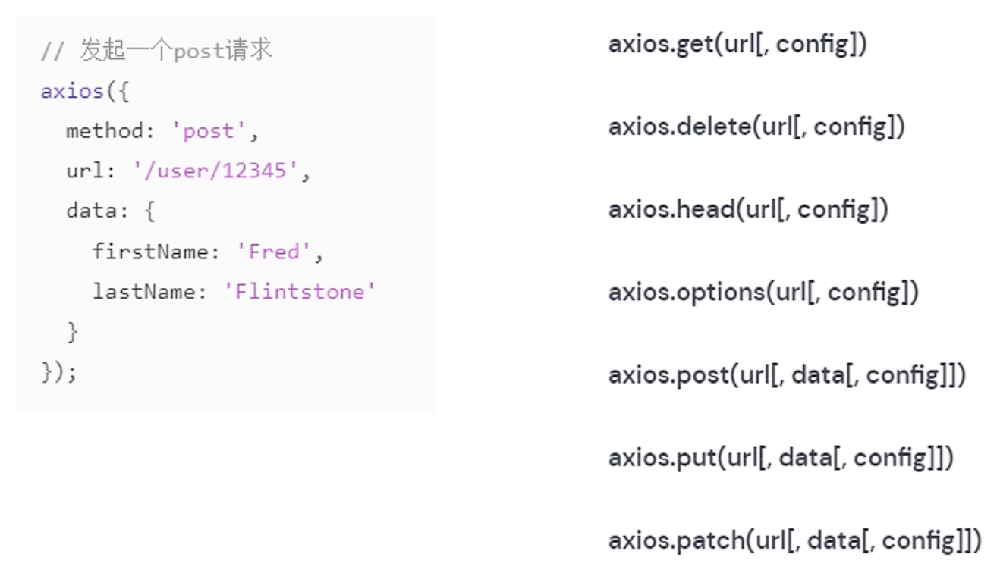

# Axios简介

- 在实际项目开发中，前端页面所需要的数据往往需要从服务器端获取，涉及与服务器的通信
- Axios是一个基于promise网络请求库，作用于node.js和浏览器中
- Axios在浏览器端使用XMLHttpRequests发送网络请求，并能自动完成JSON数据的转换
- 安装：`npm insatll axios`
- 地址：https://www.axios-http.cn/

# 发送网络请求

## 发送GET请求

```js
const axios = require('axios');

// 向给定ID的用户发起请求
axios.get('/user?ID=12345')
  .then(function (response) {
    // 处理成功情况
    console.log(response);
  })
  .catch(function (error) {
    // 处理错误情况
    console.log(error);
  })
  .finally(function () {
    // 总是会执行
  });

// 上述请求也可以按以下方式完成（可选）
axios.get('/user', {
    params: {
      ID: 12345
    }
  })
  .then(function (response) {
    console.log(response);
  })
  .catch(function (error) {
    console.log(error);
  })
  .finally(function () {
    // 总是会执行
  });  
```

## 发送POST请求

- 发送一个POST请求，后端收到的是JSON的格式

```js
axios.post('/user', {
    firstName: 'Fred',
    lastName: 'Flintstone'
  })
  .then(function (response) {
    console.log(response);
  })
  .catch(function (error) {
    console.log(error);
  });
```

## 异步回调问题

- async/await，以同步形式替代异步的请求

```js
// 支持async/await用法
async function getUser() {
  try {
    const response = await axios.get('/user?ID=12345');
    console.log(response);
  } catch (error) {
    console.error(error);
  }
}
```

## 其他请求方式

- 参考：https://www.axios-http.cn/docs/req_config



# 跨域

- 为保证浏览器安全，不同源的客户端脚本在没有明确授权的情况下，不能读写对方资源，称为同源策略，同源策略是浏览器安全的基石
- 同源策略是一种约定，是浏览器最核心也是最基本的安全功能
- 所谓同源（即指在同一个域）就是在两个页面具有相同的协议protocol、主机host和端口号port
- 当一个请求的url的协议、域名、端口三者之间任意一个与当前页面url不同即为跨域，此时无法读取非同源网页的Cookie，无法向非同源地址发送AJAX请求

## 跨域问题解决

- CORS（Cross-Origin Resource Sharing）是由W3C制定的一种跨域资源共享技术标准，其目的是为了解决前端的跨域请求
- CORS可以在不破坏既有规则的情况下，通过后端服务器实现CORS接口，从而实现跨域通信
- CORS将请求分为两类：简单请求和非简单请求，分别对跨域通信提供了支持

### 简单请求

满足以下条件的请求即为简单请求：

- 请求方法：GET、POST、HEAD
- 除了以下的请求头字段外，没有自定义的请求头：
  - Accept、Accept-Language、Content-Language、Last-Event-ID、Content-Type
- Content-Type的值只有以下三种：
  - text/plain、multipart/form-data、application/x-www-form-urlencoded

处理：

- 对于简单请求，CORS的策略是请求时在请求头增加一个Origin字段

  > 例如：
  >
  > Host: localhost:8080
  >
  > Origin: http: //localhost:8081
  >
  > Referer: http: //localhost:8081/index.html

- 服务器收到请求后，根据该字段判断是否允许该请求访问，如果允许，则在HTTP头信息中添加Access-Control-Allow-Origin字段

  > 例如：
  >
  > Access-Control-Allow-Origin: http: //localhost:8081
  >
  > Content-Length: 20
  >
  > Content-Type: text/plain;charset=UTF-8
  >
  > Data: Thu, 12 Jul 2018 12:51:14 GMT

### 非简单请求

- 对于非简单请求的跨域请求，浏览器会在真实请求发出前增加一次OPTION请求，称为预检请求

- 预检请求将真实请求的信息，包括请求方法、自定义头字段、源信息添加到HTTP头信息字段中，询问服务器是否允许这样的操作

- 例如一个GET请求：

  > OPTIONS /test HTTP/1.1
  >
  > Origin: http: //www .test.com
  >
  > Access-Control-Request-Method: GET
  >
  > Access-Control-Request-Headers: X-Custom-Header
  >
  > Host: www. test.com

- Access-Control-Request-Method表示请求使用的HTTTP方法，Access-Control-Request-Headers包含请求的自定义头字段

- 服务器收到请求时，需要分别对Origin、Access-Control-Request-Method、Access-Control-Request-Headers进行验证，验证通过后，会在返回的HTTP头信息中添加：

  > Access-Control-Allow-Origin: http:// www. test.com
  >
  > Access-Control-Allow-Methods: GET, POST, PUT, DELETE
  >
  > Access-Control-Allow-Headers: X-Custom-Header
  >
  > Access-Control-Allow-Credentials: true
  >
  > Access-Control-Max-Age: 172800

- Access-Control-Allow-Methods、Access-Control-Allow-Headers：真实请求允许的方法、允许使用的字段

- Access-Control-Allow-Credentials：是否允许用户发送、处理cookie

- Access-Control-Max-Age：预检请求的有效期，单位为秒，有效期内不会重新发送预检请求

- 当预检请求通过后，浏览器才会发送真实请求到服务器，就实现了跨域资源的请求访问

## SpringBoot中配置CORS

- 在传统的Java EE开发中，可以通过过滤器统一配置，而SpringBoot中对此则提供了更简洁的解决方案：

### 全局配置

- 通过创建一个配置类，来进行精细化配置

```java
@Configuration
public class CorsConfig implements WebMvcConfigurer {

    @Override
    public void addCorsMappings(CorsRegistry registry) {
        registry.addMapping("/**")  // 允许跨域访问的路径
            .allowedOrigins("*")  // 允许跨域访问的源
            .allowedMethods("POST", "GET", "PUT", "OPTIONS", "DELETE")  // 允许请求方法
            .maxAge(168000)  // 预检间隔时间
            .allowedHeaders("*")  // 允许头部设置
            .allowCredentials(true);  // 是否发送 cookie
    }
}
```

### 控制器局部注解配置

- 只需要在控制器中加入一个`@CrossOrigin`注解即可，这个控制器的所有方法即可跨域

# 发送网络请求例子

- script中导入axios：`import axios from 'axios';`
- 在created中发送网络请求
  - 注意：这里需要使用箭头的回调函数，this才是和created同级的this，才能把值赋给tableData；如果是function的回调函数，两个this作用域不同，就不能够正确赋值
- template中直接使用值即可

```vue
<template>
  <div>
    <el-table
        :data="tableData"
        style="width: 100%"
        :row-class-name="tableRowClassName">
        <el-table-column
        prop="id"
        label="编号"
        width="180">
        </el-table-column>
        <el-table-column
        prop="username"
        label="姓名"
        width="180">
        </el-table-column>
        <el-table-column
        prop="birthday"
        label="生日">
        </el-table-column>
    </el-table>
  </div>
</template>

<style>
  .el-table .warning-row {
    background: oldlace;
  }

  .el-table .success-row {
    background: #f0f9eb;
  }
</style>

<script>
  import axios from 'axios';

  export default {
    methods: {
      tableRowClassName({row, rowIndex}) {
        if (rowIndex === 1) {
          return 'warning-row';
        } else if (rowIndex === 3) {
          return 'success-row';
        }
        return '';
      }
    },
    created: function(){
        // console.log("组件被创建了")
        // 这里需要使用箭头的回调函数，this才是和created同级的this，才能把值赋给tableData
        // 如果是function的回调函数，两个this作用域不同，就不能够正确赋值
        axios.get("http://localhost:8080/user/findAll").then((response)=>{
            //console.log(response.data)
            this.tableData = response.data
        })
    },
    data() {
      return {
        tableData: [],
      }
    }
  }
</script>
```

# 与Vue整合

- 在实际项目开发中，几乎每个组件都会用到axios发起数据请求，此时遇到两个问题：
  - 每个组件都要导入axios
  - 每次发送请求都要填写完整的请求路径
- 可以通过全局配置来解决该问题
- main.js中：

```js
import axios from 'axios';

// 配置请求根路径
axios.defaults.baseURL = 'http://api.com'

// 将axios作为全局的自定义属性，每个组件可以在内部直接访问（Vue3）
app.config.globalProperties.$http = axios

// 将axios作为全局的自定义属性，每个组件可以在内部直接访问（Vue2）
Vue.prototype.$http = axios
```

- 此时，之前的请求即可修改：

```js
// 之前
created: function(){
        // console.log("组件被创建了")
        axios.get("http://localhost:8080/user/findAll").then((response)=>{
            //console.log(response.data)
            this.tableData = response.data
        })
    },
// 之后
created: function(){
        this.$http.get("/user/findAll").then((response)=>{
            this.tableData = response.data
        })
    },
```

