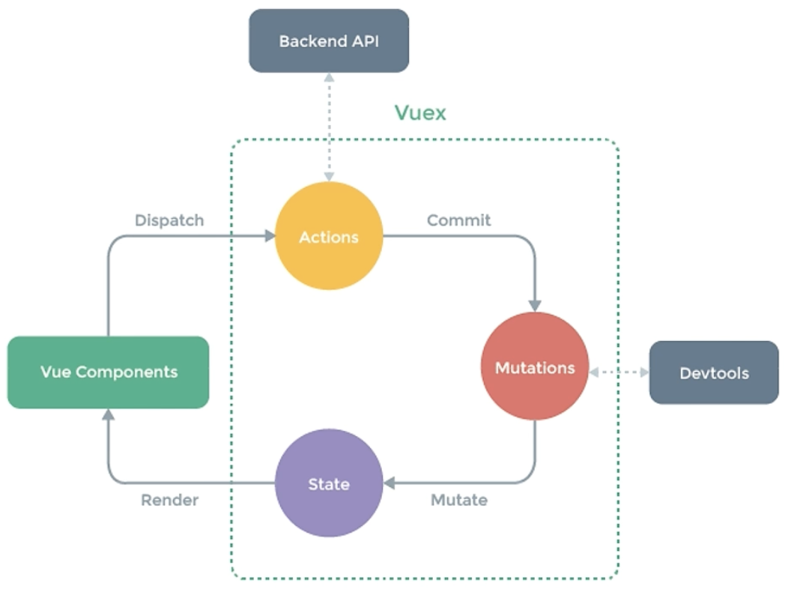

# Vuex介绍

- 对于组件化开发来说，大型应用的状态往往跨越多个组件。在多层嵌套的父子组件之间传递状态已经十分麻烦，而Vue更是没有为兄弟组件提供直接共享数据的方法
- 基于这个问题，许多框架提供了解决方案——使用全局的状态管理器，将所有分散的共享数据交由状态管理器保管
- Vuex时一个专为Vue.js应用程序开发的状态管理库，采用集中式存储管理应用的所有组件的状态
- 简单来说，Vuex用于管理分散在Vue各个组件中的数据
- 安装：`npm install vuex@next`

# 状态管理

- 每一个Vuex应用的核心都是一个store，与普通的全局对象不同的是，具有基于Vue数据与视图绑定的特点，当store中的状态发生变化时，与之绑定的视图也会被重新渲染
- store中的状态不允许被直接修改，改变store中的状态的唯一途径就是显式地提交(commit) mutation，这可以让我们方便地跟踪每一个状态的变化
- 在大型复杂应用中，如果无法有效地跟踪到状态的变化，将会对理解和维护代码带来极大困扰
- Vuex中有5个重要的概念：State、Getter、Mutation、Action、Module



## State

- 用于维护所有应用层的状态，并确保应用中只有唯一的数据源
- /store/index.js

```js
import Vue from "vue"
import Vuex from 'vuex'

Vue.use(Vuex)

const store = new Vuex.Store({
  state: {
    count: 0
  },
  mutations: {
    increment (state) {
      state.count++
    }
  }
})
```

- main.js中注册：

```js
import Vue from 'vue'
import App from './App.vue'
import store from './store'

Vue.config.productionTip = false

new Vue({
  render: h => h(App),
  store: store
}).$mount('#app')
```

- 在组件中，可以直接使用`this.$store.state.count`访问数据，也可以先用mapState辅助函数将其映射下来

```js
// 在单独构建的版本中辅助函数为 Vuex.mapState
import { mapState } from 'vuex'

export default {
  // ...
  computed: mapState({
    // 箭头函数可使代码更简练
    count: state => state.count,

    // 传字符串参数 'count' 等同于 `state => state.count`
    countAlias: 'count',

    // 为了能够使用 `this` 获取局部状态，必须使用常规函数
    countPlusLocalState (state) {
      return state.count + this.localCount
    }
  })
}
```

## Getter

- Getter维护由State派生的一些状态，这些状态随着State状态的变化而变化

```js
const store = new Vuex.Store({
  state: {
    todos: [
      { id: 1, text: '...', done: true },
      { id: 2, text: '...', done: false }
    ]
  },
  getters: {
    doneTodos: state => {
      return state.todos.filter(todo => todo.done)
    }
  }
})
```

- 在组件中，可以直接使用`this.$store.getters.doneTodos`，也可以先用mapGetters辅助函数将其映射下来：

```js
import { mapGetters } from 'vuex'

export default {
  // ...
  computed: {
  // 使用对象展开运算符将 getter 混入 computed 对象中
    ...mapGetters([
      'doneTodosCount',
      'anotherGetter',
      // ...
    ])
  }
}
```

## Mutation

- Mutation提供修改State状态的方法

```js
const store = new Vuex.Store({
  state: {
    count: 1
  },
  mutations: {
    increment (state) {
      // 变更状态
      state.count++
    }
  }
})
```

- 在组件中，可以直接使用`store.commit('xxx')`来提交mutation

```js
methods: {
	increment(){
		this.$store.commit('increment')
		console.log(this.$store.state.count)
	}
}
```

- 也可以先用mapMutation辅助函数将其映射下来

```js
methods: {
	...mapMutations([
			'increment', //将 this.increment() 映射为 this.$store.commit('increament')
			
			// mapMutation 也支持载荷
			'increamentBy' //将 this.incrementBy(amount) 映射为 this.$store.commit('increamentBy', amount)
	])
}
```

## Action

- Action类似于Mutation，不同在于：
  - Action不能直接修改状态，只能通过提交mutation来修改
  - Action可以包含异步操作

```js
const store = new Vuex.Store({
  state: {
    count: 0
  },
  mutations: {
    increment (state) {
      state.count++
    }
  },
  actions: {
    increment (context) {
      context.commit('increment')
    }
  }
})
```

- 在组件中，可以使用`this.$store.dispatch('xxx')`分发action，或者使用mapActions辅助函数先将其映射下来

```js
// ...
methods: {
	...mapActions([
			'increment', //将 this.increment() 映射为 this.$store.commit('increament')
			
			// mapActions 也支持载荷
			'increamentBy' //将 this.incrementBy(amount) 映射为 this.$store.commit('increamentBy', amount)
	])
}
```

## Module

- 由于使用单一状态树，应用的所有状态会集中到一个比较大的对象。当应用变得非常复杂时，store 对象就有可能变得相当臃肿。
- 为了解决以上问题，Vuex 允许我们将 store 分割成**模块（module）**。每个模块拥有自己的 state、mutation、action、getter、甚至是嵌套子模块——从上至下进行同样方式的分割
- 对于模块内部的 mutation 和 getter，接收的第一个参数是**模块的局部状态对象**。