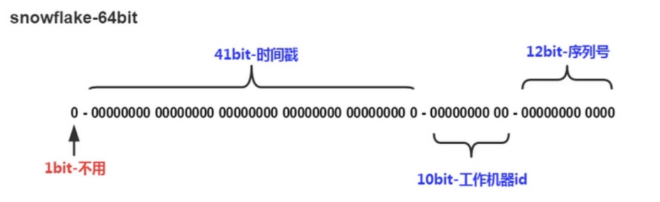
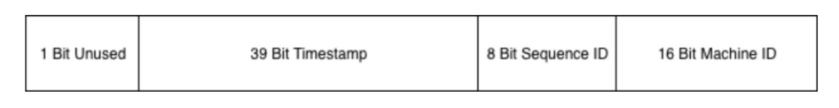
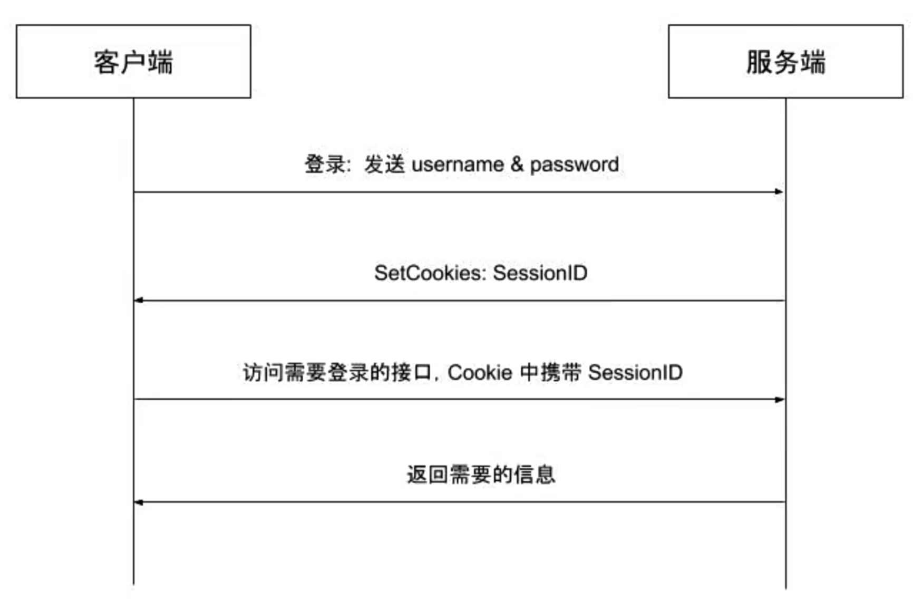
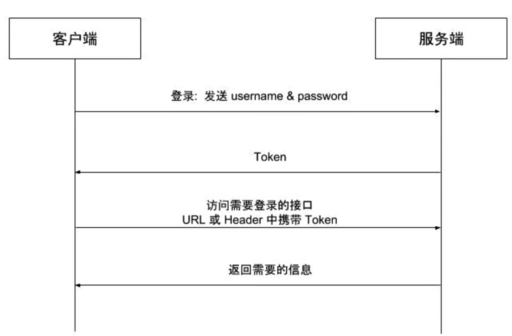
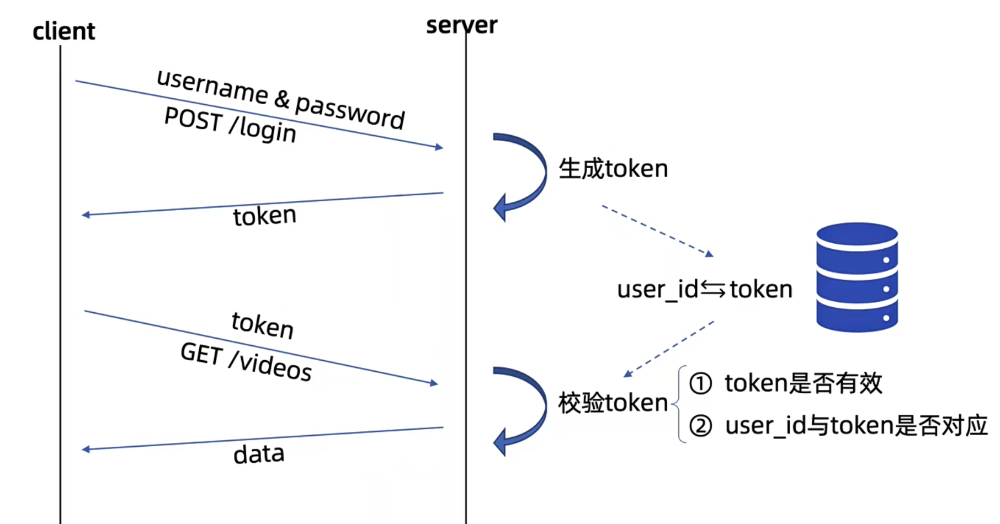
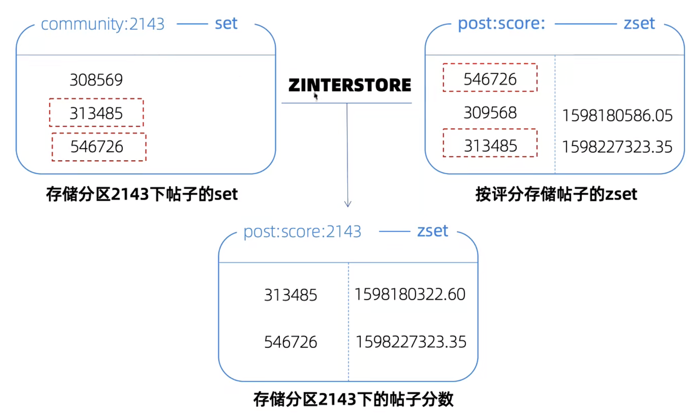

# 数据库的建立

## 建表语句

建表语句：

- **bigint(20)**：长整型，占 8 字节，能存极大数字（20 只是显示宽度，不影响存储）
- **utf8mb4_general_ci**：
  - `utf8mb4`：支持表情符号的完整 UTF-8
  - `ci`：**不区分大小写**
- **DEFAULT CURRENT_TIMESTAMP**：
  - **插入数据时自动记录当前时间**，不用手动赋值
- **ON UPDATE CURRENT_TIMESTAMP**：
  - **这条记录被修改时，自动更新为当前时间**
- **UNIQUE KEY**：**唯一索引**
- USING BTREE：使用 B+ 树索引（MySQL 默认高效索引）
- **ENGINE=InnoDB**：MySQL 最常用、支持事务、外键、行锁的存储引擎
- **DEFAULT CHARSET=utf8mb4**：默认字符集，支持表情
- **collate=utf8mb4_general_ci**：排序规则，不区分大小写

```sql
DROP TABLE IF EXISTS `user`;
CREATE TABLE `user` (
                        `id` bigint(20) NOT NULL AUTO_INCREMENT,
                        `user_id` bigint(20) NOT NULL,
                        `username` varchar(64) COLLATE utf8mb4_general_ci NOT NULL,
                        `password` varchar(64) COLLATE utf8mb4_general_ci NOT NULL,
                        `email` varchar(64) COLLATE utf8mb4_general_ci,
                        `gender` tinyint(4) NOT NULL DEFAULT '0',
                        `create_time` timestamp NULL DEFAULT CURRENT_TIMESTAMP,
                        `update_time` timestamp NULL DEFAULT CURRENT_TIMESTAMP ON UPDATE
CURRENT_TIMESTAMP,
                        PRIMARY KEY (`id`),
                        UNIQUE KEY `idx_username` (`username`) USING BTREE,
                        UNIQUE KEY `idx_user_id` (`user_id`) USING BTREE
) ENGINE=InnoDB DEFAULT CHARSET=utf8mb4 COLLATE=utf8mb4_general_ci;
```

## 分布式ID生成器

使用单独的user id：

- 防止暴露用户总量
- 方便分库分表（全局唯一）
- 数字类型的id方便检索
- 自增的id作为主键，性能高于随机id
  - InnoDB 主键是**聚簇索引**
  - **连续自增 id** → 写入顺序存储，**速度极快、碎片少**
  - **随机 user_id** → 写入随机位置，**页分裂、性能差**
  - 所以：
    - **主键 = 自增 id（连续、写入快）**
    - **业务标识 = user_id（随机、安全）**

使用分布式生成器

### 分布式ID的特点

- 全局唯一性：不能出现有重复的ID标识，这是基本要求。
- 递增性：确保生成ID对于用户或业务是递增的。
- 高可用性：确保任何时候都能生成正确的ID。
- 高性能性：在高并发的环境下依然表现良好。

不仅仅是用于用户ID，实际互联网中有很多场景需要能够生成类似MySQL自增ID这样不断增大，同时又不会重复的id。以支持业务中的高并发场景。

比较典型的场景有：电商促销时短时间内会有大量的订单涌入到系统，比如每秒10w+；明星出轨时微博短时间内会产生大量的相关微博转发和评论消息。在这些业务场景下将数据插入数据库之前，我们需要给这些订单和消息先分配一个唯一ID，然后再保存到数据库中。对这个id的要求是希望其中能带有一些时间信息，这样即使我们后端的系统对消息进行了分库分表，也能够以时间顺序对这些消息进行排序。

### snowflake算法介绍

雪花算法，它是Twitter开源的由64位整数组成分布式ID，性能较高，并且在单机上递增。

 

**1.第一位**：占用1bit，其值始终是0，没有实际作用。

**2.时间戳**：占用41bit，单位为毫秒，总共可以容纳约69年的时间。当然，我们的时间毫秒计数不会真的从1970年开始记，那样我们的系统跑到 2039/9/7 23:47:35 就不能用了，所以这里的时间戳只是相对于某个时间的增量，比如我们的系统上线是2020-07-01，那么我们完全可以把这个timestamp当作是从 2020-07-01 00:00:00.000 的偏移量。

**3.工作机器id**：占用10bit，其中高位5bit是数据中心ID，低位5bit是工作节点ID，最多可以容纳1024个节点。

**4.序列号**：占用12bit，用来记录同毫秒内产生的不同id。每个节点每毫秒0开始不断累加，最多可以累加到4095，同一毫秒一共可以产生4096个ID。

SnowFlake算法在同一毫秒内最多可以生成多少个全局唯一ID呢？

**同一毫秒的ID数量 = 1024 X 4096 = 4194304**

### snowflake的Go实现

1. https://github.com/bwmarrin/snowflake

   - [github.com/bwmarrin/snowfiake](https://github.com/bwmarrin/snowflake)是一个相当轻量化的snowfiake的Go实现。

   

   ```go
   package main
   
   import (
   	"fmt"
   	"github.com/bwmarrin/snowflake"
   	"time"
   )
   
   var node *snowflake.Node
   
   func Init(startTime string, machineID int64) (err error) {
   	var st time.Time
   	st, err = time.Parse("2006-01-02", startTime)
   	if err != nil {
   		return
   	}
   	snowflake.Epoch = st.UnixNano() / 1000000
   	node, err = snowflake.NewNode(machineID)
   	return
   }
   
   func GenID() int64 {
   	return node.Generate().Int64()
   }
   func main() {
   	if err := Init("2026-04-01", 1); err != nil {
   		fmt.Printf("init failed, err:%v\n", err)
   		return
   	}
   	id := GenID()
   	fmt.Println(id)
   }
   ```

2. https://github.com/sony/sonyflake

   - sonyflake是Sony公司的一个开源项目，基本思路和snowflake差不多，不过位分配上稍有不同:

   

   - 这里的时间只用了39个bit，但时间的单位变成了10ms，所以理论上比41位表示的时间还要久(174年)。 `Sequence ID` 和之前的定义一致，` Machine ID` 其实就是节点id。sonyflake 库有以下配置参数：

   ```go
   type Settings struct {
     StartTime      time.Time
     MachineID      func() (uint16, error)
     CheckMachineID func(uint16) bool
   }
   ```

   - 其中：
     - `StartTime` 选项和我们之前的` Epoch` 差不多，如果不设置的话，默认是从 `2014-09-01 00:00:00 +0000 UTC`开始。
     - ` MachineID`可以由用户自定义的函数，如果用户不定义的话，会默认将本机IP的低16位作为 `machine id` 。
     - `CheckMachineID` 是由用户提供的检查 `MachineID` 是否冲突的函数。

   ```go
   package main
   
   import (
   	"fmt"
   	"time"
   
   	"github.com/sony/sonyflake"
   )
   
   var (
   	sonyFlake     *sonyflake.Sonyflake
   	sonyMachineID uint16
   )
   
   func getMachineID() (uint16, error) {
   	return sonyMachineID, nil
   }
   
   // 需传入当前的机器ID
   func Init(startTime string, machineId uint16) (err error) {
   	sonyMachineID = machineId
   	var st time.Time
   	st, err = time.Parse("2006-01-02", startTime)
   	if err != nil {
   		return err
   	}
   	settings := sonyflake.Settings{
   		StartTime: st,
   		MachineID: getMachineID,
   	}
   	sonyFlake = sonyflake.NewSonyflake(settings)
   	return
   }
   
   // GenID 生成id
   func GenID() (id uint64, err error) {
   	if sonyFlake == nil {
   		err = fmt.Errorf("snoy flake not inited")
   		return
   	}
   
   	id, err = sonyFlake.NextID()
   	return
   }
   
   func main() {
   	if err := Init("2020-07-01", 1); err != nil {
   		fmt.Printf("Init failed, err:%v\n", err)
   		return
   	}
   	id, _ := GenID()
   	fmt.Println(id)
   }
   ```

# 功能编写


功能编写的顺序：路由Router -->  controller --> logic --> DAO 

## 注册功能

### 注意点

-  `var p models.ParamSignUp`和 `p := new(models.ParamSignUp)`
  -  `var p models.ParamSignUp`
    - 创建的是**结构体本身（值类型）**
    - `p` 直接存**整个结构体数据**
    - 内存在**栈**上（速度快，小数据推荐）
  -  `p := new(models.ParamSignUp)`
    - 创建的是**结构体指针**
    - `p` 存的是**结构体的地址**
    - 内存在**堆**上（适合大结构体、需要传递、需要 nil）

###  路由

```go
// 注册业务路由
r.POST("/signup", controller.SignUpHandler)
```

### 请求参数结构体

```go
// 定义请求的参数结构体

type ParamSignUp struct {
    Username   string `json:"username" binding:"required"`
    Password   string `json:"password" binding:"required"`
    RePassword string `json:"re_password" binding:"required,eqfield=Password"`
}
```

### Controller

接受参数并校验，业务处理，返回响应

```go
// SignUpHandler 处理注册请求的函数
func SignUpHandler(c *gin.Context) {

    // 1. 获取参数和参数校验
    p := new(models.ParamSignUp)
    if err := c.ShouldBindJSON(p); err != nil {
       // 请求参数有误，直接返回响应
       zap.L().Error("SignUp with invalid param", zap.Error(err))
       // 判断err是不是validator.ValidationErrors类型
       errs, ok := err.(validator.ValidationErrors)
       if !ok {
          c.JSON(http.StatusOK, gin.H{
             "msg": err.Error(),
          })
          return
       }
       c.JSON(http.StatusOK, gin.H{
          "msg": removeTopStruct(errs.Translate(trans)), // 翻译错误
       })
       return
    }
    // 对请求参数进行详细的业务规则校验
    /*if len(p.Username) == 0 || len(p.Password) == 0 || len(p.RePassword) == 0 || p.RePassword != p.Password {
       zap.L().Error("SignUp with invalid param")
       c.JSON(http.StatusOK, gin.H{
          "msg": "请求参数有误",
       })
       return
    }*/

    //fmt.Println(p)
    // 2. 业务处理
    if err := logic.SignUp(p); err != nil {
      c.JSON(http.StatusOK, gin.H{
        "msg": "注册失败",
      })
      return
    }
    // 3. 返回响应
    c.JSON(http.StatusOK, gin.H{
      "msg": "success",
    })
}
```

参数校验：使用Gin的 Validator库

- 请求参数的结构体中加binding
- 注册validator

```go
import (
    "bluebell/models"
    "fmt"
    "reflect"
    "strings"

    "github.com/gin-gonic/gin/binding"
    "github.com/go-playground/locales/en"
    "github.com/go-playground/locales/zh"
    ut "github.com/go-playground/universal-translator"
    "github.com/go-playground/validator/v10"
    enTranslations "github.com/go-playground/validator/v10/translations/en"
    zhTranslations "github.com/go-playground/validator/v10/translations/zh"
)

// 定义一个全局翻译器T
var trans ut.Translator

// InitTrans 初始化翻译器
func InitTrans(locale string) (err error) {
    // 修改gin框架中的Validator引擎属性，实现自定制
    if v, ok := binding.Validator.Engine().(*validator.Validate); ok {

       // 注册一个获取json tag 的自定义方法
       v.RegisterTagNameFunc(func(flg reflect.StructField) string {
          name := strings.SplitN(flg.Tag.Get("json"), ",", 2)[0]
          if name == "-" {
             return ""
          }
          return name
       })

       // 为SignUpParam注册自定义校验方法
       v.RegisterStructValidation(SignUpParamStructLevelValidation, models.ParamSignUp{})

       zhT := zh.New() // 中文翻译器
       enT := en.New() // 英文翻译器

       // 第一个参数是备用（fallback）的语言环境
       // 后面的参数是应该支持的语言环境（支持多个）
       // uni := ut.New(zhT, zhT) 也是可以的
       uni := ut.New(enT, zhT, enT)

       // locale 通常取决于 http 请求头的 'Accept-Language'
       var ok bool
       // 也可以使用 uni.FindTranslator(...) 传入多个locale进行查找
       trans, ok = uni.GetTranslator(locale)
       if !ok {
          return fmt.Errorf("uni.GetTranslator(%s) failed", locale)
       }

       // 注册翻译器
       switch locale {
       case "en":
          err = enTranslations.RegisterDefaultTranslations(v, trans)
       case "zh":
          err = zhTranslations.RegisterDefaultTranslations(v, trans)
       default:
          err = enTranslations.RegisterDefaultTranslations(v, trans)
       }
       return
    }
    return
}

// removeTopStruct 去除提示信息中的结构体名称
func removeTopStruct(fields map[string]string) map[string]string {
    res := map[string]string{}
    for field, err := range fields {
       res[field[strings.Index(field, ".")+1:]] = err
    }
    return res
}

// SignUpParamStructLevelValidation 自定义SignUpParam结构体校验函数
func SignUpParamStructLevelValidation(sl validator.StructLevel) {
    su := sl.Current().Interface().(models.ParamSignUp)

    if su.Password != su.RePassword {
       // 输出错误提示信息，最后一个参数就是传递的param
       sl.ReportError(su.RePassword, "re_password", "RePassword", "eqfield", "password")
    }
}
```

main

```go
// 初始化gin框架内置的校验器使用的翻译器
if err := controller.InitTrans("zh"); err != nil {
    fmt.Printf("inti validator trans failed, err: %v\n", err)
    return
}
```

### logic/service

存放业务逻辑

```go
func SignUp(p *models.ParamSignUp) (err error) {
    // 1. 判断用户存不存在
    if err := mysql.CheckUserExist(p.Username); err != nil {
       return err
    }
    // 2. 生成UID
    userID := snowflake.GenID()
    // 构造一个用户实例
    user := &models.User{
       UserID:   userID,
       Username: p.Username,
       Password: p.Password,
    }
    // 3. 密码加密
    // 4. 保存到数据库
    return mysql.InsertUser(user)
}
```

### dao

```go
const secret = "wjk"

// CheckUserExist 检查指定用户名的用户是否存在
func CheckUserExist(username string) (err error) {
    sqlStr := `select count(user_id) from user where username = ?`
    var count int
    if err := db.Get(&count, sqlStr, username); err != nil {
       return err
    }
    if count > 0 {
       return errors.New("用户已存在")
    }
    return
}

// InsertUser 向数据库中插入一条新的用户记录
func InsertUser(user *models.User) (err error) {
    // 对密码加密
    user.Password = encryptPassword(user.Password)
    // 执行SQL语句入库
    sqlStr := `insert into user(user_id, username, password) values (?, ? , ?)`
    _, err = db.Exec(sqlStr, user.UserID, user.Username, user.Password)
    return
}

func encryptPassword(oPassword string) string {
    h := md5.New()
    h.Write([]byte(secret))
    return hex.EncodeToString(h.Sum([]byte(oPassword)))
}
```

## Validator参数校验库

见8.常用Web开发组件

可以参数校验、翻译校验错误的提示信息、自定义错误提示信息的字段名、自定义结构体校验方法、自定义字段校验方法、自定义翻译方法

## 日志输出到终端

修改初始化代码，添加mode参数，如果是dev就输出到终端+存文件，如果不是就只存log文件

```go
// Init 初始化Logger
func Init(cfg *settings.LogConfig, mode string) (err error) {
    writeSyncer := getLogWriter(
       cfg.Filename,
       cfg.MaxSize,
       cfg.MaxBackups,
       cfg.MaxAge)
    encoder := getEncoder()
    var l = new(zapcore.Level)
    err = l.UnmarshalText([]byte(cfg.Level))
    if err != nil {
       return
    }

    var core zapcore.Core
    if mode == "dev" {
       // 开发模式，日志输出到终端
       consoleEncoder := zapcore.NewConsoleEncoder(zap.NewDevelopmentEncoderConfig())
       core = zapcore.NewTee(
          zapcore.NewCore(encoder, writeSyncer, l),
          zapcore.NewCore(consoleEncoder, zapcore.Lock(os.Stdout), zap.DebugLevel),
       )
    } else {
       core = zapcore.NewCore(encoder, writeSyncer, l)
    }

    lg = zap.New(core, zap.AddCaller())
    zap.ReplaceGlobals(lg) // 替换zap包中全局的logger实例，后续在其他包中只需使用zap.L()调用即可
    return
}
```

main中初始化

```go
if err := logger.Init(settings.Conf.LogConfig, settings.Conf.Mode); err != nil {
    fmt.Printf("Init logger failed, err: %v\n", err)
    return
}
```

route也可以添加模式

改为发布者模式就不会有gin的debug输出

```go
func Setup(mode string) *gin.Engine {
    //gin.SetMode(gin.ReleaseMode) // gin设置为发布模式
    if mode == gin.ReleaseMode {
       gin.SetMode(gin.ReleaseMode)
    }

    r := gin.New()
    r.Use(logger.GinLogger(), logger.GinRecovery(true))

    // 注册业务路由
    r.POST("/signup", controller.SignUpHandler)

    r.GET("/", func(c *gin.Context) {
       c.String(http.StatusOK, settings.Conf.Version)
    })
    r.NoRoute(func(c *gin.Context) {
       c.JSON(http.StatusOK, gin.H{
          "msg": "404",
       })
    })

    return r
}
```

## 响应结构化

创建一个response结构体以及对应方法

controller/response（其实我都觉得这个不应该放在controller下吧）

```go
/*
{
    "code" : 1001, // 程序中的错误码
    "msg": xxx,       // 提示信息
    "data": {},    // 数据
}
*/

type ResponseData struct {
    Code ResCode
    Msg  interface{}
    Data interface{}
}

func ResponseError(c *gin.Context, code ResCode) {
    c.JSON(http.StatusOK, &ResponseData{
       Code: code,
       Msg:  code.Msg(),
       Data: nil,
    })
}

func ResponseErrorWithMsg(c *gin.Context, code ResCode, msg interface{}) {
    c.JSON(http.StatusOK, &ResponseData{
       Code: code,
       Msg:  msg,
       Data: nil,
    })
}

func ResponseSuccess(c *gin.Context, data interface{}) {
    c.JSON(http.StatusOK, &ResponseData{
       Code: CodeSuccess,
       Msg:  CodeSuccess.Msg(),
       Data: data,
    })
}
```

controller/code

```go
type ResCode int64

const (
    CodeSuccess ResCode = 1000 + iota
    CodeInvalidParam
    CodeUserExist
    CodeUserNotExist
    CodeInvalidPassword
    CodeServerBusy
)

var codeMsgMap = map[ResCode]string{
    CodeSuccess:         "success",
    CodeInvalidParam:    "请求参数错误",
    CodeUserExist:       "用户名已存在",
    CodeUserNotExist:    "用户名不存在",
    CodeInvalidPassword: "用户名或密码错误",
    CodeServerBusy:      "服务繁忙",
}

func (c ResCode) Msg() string {
    msg, ok := codeMsgMap[c]
    if !ok {
       msg = codeMsgMap[CodeServerBusy]
    }
    return msg
}
```

controller中的使用，如登录中：

```go
// LoginHandler 处理登录请求的函数
func LoginHandler(c *gin.Context) {
    // 1.获取请求参数及参数校验
    p := new(models.ParamLogin)
    if err := c.ShouldBindJSON(p); err != nil {
       // 请求参数有误，直接返回响应
       zap.L().Error("Login with invalid param", zap.Error(err))
       // 判断err是不是validator.ValidationErrors类型
       errs, ok := err.(validator.ValidationErrors)
       if !ok {
          ResponseError(c, CodeInvalidParam)
          return
       }
       //c.JSON(http.StatusOK, gin.H{
       // "msg": removeTopStruct(errs.Translate(trans)), // 翻译错误
       //})
       ResponseErrorWithMsg(c, CodeInvalidParam, removeTopStruct(errs.Translate(trans)))
       return
    }
    // 2.业务逻辑处理
    if err := logic.Login(p); err != nil {
       zap.L().Error("logic.Login failed", zap.String("username", p.Username), zap.Error(err))
       if errors.Is(err, mysql.ErrorUserNotExist) {
          ResponseError(c, CodeUserNotExist)
       }
       ResponseError(c, CodeInvalidPassword)
       return
    }
    // 3.返回响应
    /*c.JSON(http.StatusOK, gin.H{
       "msg": "登录成功",
    })*/
    ResponseSuccess(c, nil)
}
```

## 用户认证

HTTP是一个无状态的协议

### Cookie-Session认证模式



存在的问题：

- 服务端需要存储Session，且需要快速查找，会占用大量服务器资源

- 创建session的服务器可能不是验证session 的服务器，所以需要将所有session单独存储并共享

- 由于客户端使用cookie存储session id，在跨域场景下需要兼容性处理吗，同时这种方式也难防范CSRF攻击

  - CSFR：利用你已经登录的身份，在别的网站偷偷以你的名义发请求、干坏事。

    - 你登录了 **银行网站 A**，浏览器存了你的登录 Cookie（SessionId）

    - 你没关浏览器，点开了一个 **恶意网站 B**

    - 恶意网站 B 里藏了一个隐藏请求：

      ```
      http://银行A.com/transfer?money=1000&to=坏人账号
      ```

    - **浏览器会自动带上你银行的 Cookie** 发请求

    - 银行服务器看到 Cookie 合法，以为是你本人操作，直接转账了

  - **XSS**：注入脚本，**偷你 Cookie、偷你数据**

  - **CSRF**：不用偷 Cookie，**直接借用你身份发请求**

  - 预防CSRF：

    - **CSRF Token（最主流）**
      - 每次表单 / 接口请求，带一个随机 Token，后端校验；
      - 恶意网站拿不到你的 Token，就伪造不了请求。
    - **SameSite Cookie 属性**
      - 设置 Cookie `SameSite=Strict/Lax`，**跨域请求不自动带 Cookie**，直接从底层堵死 CSRF。
    - **验证 Referer/Origin 请求头**
      - 后端判断请求来源域名，非信任域名直接拒绝。

  - 使用JWT，如果存在cookie里同样需要CSRF token，如果存在了localstorage里就不需要

### Token认证模式



可以解决session的部分问题：

- 服务端不需要存储和用户鉴权的相关信息，鉴权信息加密到token中，服务端只需要读取token中包含的鉴权信息即可
- 避免了共享session导致的不易扩展问题
- 不需要依赖cookie，有效避免了CSRF攻击问题
- 使用CORS可以快速解决跨域问题

### JWT

JSON Web Token

`头部.负载.签名`

优缺点：

- 优点基本和token一致

- 最大的优势是服务端不需要再存储session，鉴权可以扩展，避免存储session所需要引入的redis等组件，降低了系统架构复杂度。但也是最大的劣势，由于有效期存储在token中，jwt token一旦签发，就会在有效期内一直可用，无法在服务端废止，当用户进行登出操作，只能依赖客户端删除掉本地存储等jwt token，如果需要禁用用户，单纯使用jwt就无法做到了

  - 方案 1：黑名单机制（最常用、最简单）

    - 原理

      - 不改变 JWT 本身
      - **服务端维护一个「黑名单」**，存放**需要作废的 Token**
      - 每次鉴权时：
        - 先查 Token 是否在黑名单
        - 在 → 拒绝
        - 不在 → 正常解析

    - 实现

      - 登出时，把 Token 加入黑名单

      - 封号时，把 Token 加入黑名单

      - 黑名单存在 **Redis** 中，设置过期时间 = Token 剩余有效期

      - 自动过期，不用清理

    - 优点

      - 简单、立刻生效

      - 不破坏 JWT 无状态优势

    - 缺点

      - **还是需要 Redis**

      - 但比存所有 Session 轻量太多（只存作废 Token）

  - 方案 2：用户版本号机制（企业级最推荐）

    - 原理

      - 给每个用户加一个 `version` 字段：

      - 用户表：`id | username | password | version`

      - JWT 里携带 `version`

      - 每次鉴权比较 JWT 里的 version 和数据库 version

      - **不一致 → Token 失效**

    - 触发作废的操作

      - 用户登出 → version +1

      - 用户改密 → version +1

      - 管理员封号 → version +1

    - 优点

      - **完美解决 JWT 无法作废问题**

      - 一个版本号作废**该用户所有 Token**

      - 比黑名单更干净、更省空间

      - 支持：单点登录、强制下线、改密下线、封号

    - 缺点

      - 每次请求需要查一次 DB（可放 Redis 缓存）

  - 方案 3：短有效期 + 刷新令牌（Refresh Token）

    - 原理

      - **Access Token 有效期很短（5 分钟）**
      - **Refresh Token 有效期长（7 天）**
      - 前端用 Refresh Token 去换新的 Access Token

    - 禁用用户

      - 直接把 Refresh Token 作废即可。

    - 优点

      - 风险窗口极小

      - 适合安全要求高的系统

    - 缺点

      - 架构复杂

      - 前端逻辑多

### JWT在Gin中的实现

/pkg/jwt/jwt.go

```go
package jwt

import (
    "errors"
    "time"

    "github.com/dgrijalva/jwt-go"
)

const TokenExpireDuration = time.Hour * 2

var mySecret = []byte("wjk")

// MyClaims 自定义声明结构体并内嵌 jwt.StandardClaims
type MyClaims struct {
    UserID   int64  `json:"user_id"`
    Username string `json:"username"`
    jwt.StandardClaims
}

// GenToken 生成token
func GenToken(userID int64, username string) (string, error) {
    c := MyClaims{
       userID,
       username,
       jwt.StandardClaims{
          ExpiresAt: time.Now().Add(TokenExpireDuration).Unix(), //过期时间
          Issuer:    "bluebell",                                 // 签发人
       },
    }

    // 使用指定的签名方法创建签名对象
    token := jwt.NewWithClaims(jwt.SigningMethodHS256, c)
    // 使用指定的secret签名并获得完整的编码后的字符串token
    return token.SignedString(mySecret)
}

// ParseToekn 解析JWT
func ParseToken(tokenString string) (*MyClaims, error) {
    var mc = new(MyClaims)
    token, err := jwt.ParseWithClaims(tokenString, mc, func(token *jwt.Token) (i interface{}, err error) {
       return mySecret, nil
    })
    if err != nil {
       return nil, err
    }
    if token.Valid {
       return mc, nil
    }
    return nil, errors.New("invalid token")
}
```

/middlewares/Auth.go

```go
package middlewares

import (
    "bluebell/controller"
    "bluebell/pkg/jwt"
    "strings"

    "github.com/gin-gonic/gin"
)

// JWTAuthMiddleware 基于JWT的认证中间件
func JWTAuthMiddleware() func(c *gin.Context) {
    return func(c *gin.Context) {
       // 客户端携带Token有三种方式 1.放在请求头 2.放在请求体 3.放在URI
       // 这里假设Token放在Header的Authorization中，并使用Bearer开头
       // Authorization: Bearer xxxxxx.xxx.xxx
       // 这里的具体实现方式要依据你的实际业务情况决定
       authHeader := c.Request.Header.Get("Authorization")
       if authHeader == "" {
          controller.ResponseError(c, controller.CodeNeedLogin)
          /*c.JSON(http.StatusOK, gin.H{
             "code": 2003,
             "msg":  "请求头中auth为空",
          })*/
          c.Abort()
          return
       }
       // 按空格分割
       parts := strings.SplitN(authHeader, " ", 2)
       if !(len(parts) == 2 && parts[0] == "Bearer") {
          /*c.JSON(http.StatusOK, gin.H{
             "code": 2004,
             "msg":  "请求头中auth格式有误",
          })*/
          controller.ResponseError(c, controller.CodeInvalidToken)
          c.Abort()
          return
       }
       // parts[1]是获取到的tokenString，我们使用之前定义好的解析JWT的函数来解析它
       mc, err := jwt.ParseToken(parts[1])
       if err != nil {
          /*c.JSON(http.StatusOK, gin.H{
             "code": 2005,
             "msg":  "无效的Token",
          })*/
          controller.ResponseError(c, controller.CodeInvalidToken)
          c.Abort()
          return
       }
       // 将当前请求的userID信息保存到请求的上下文c上
       c.Set(controller.CtxUserIDKey, mc.UserID)
       c.Next() // 后续的处理函数可以用过c.Get("userID")来获取当前请求的用户信息
    }
}
```

要注意循环引用的问题

controller/request.go

```go
package controller

import (
    "errors"

    "github.com/gin-gonic/gin"
)

const CtxUserIDKey = "userID"

var ErrorUserNotLogin = errors.New("用户未登录")

// GetCurrentUser 获取当前登录的用户ID
func GetCurrentUser(c *gin.Context) (userID int64, err error) {
    uid, ok := c.Get(CtxUserIDKey)
    if !ok {
       err = ErrorUserNotLogin
       return
    }
    userID, ok = uid.(int64)
    if !ok {
       err = ErrorUserNotLogin
       return
    }
    return
}
```

### 实践：引入Refresh Token

前⾯讲的 Token，都是 Access Token，也就是访问资源接口时所需要的 Token，还有另外⼀种 Token：Refresh Token，通常情况下，Refresh Token 的有效期会比较长，而 Access Token 的有效期⽐较短，当 Access Token 由于过期⽽失效时，可以使用 Refresh Token 就可以获取到新的 Access Token，如果 Refresh Token 也失效了，⽤户就只能重新登录了。

在 JWT 的实践中，引入 Refresh Token 后的会话管理的流程改进如下。

- 客户端使⽤用户名、密码进⾏认证
- 服务端⽣成有效时间较短的 Access Token（例如 10 分钟）和有效时间较长的 Refresh Token（例如7天）
- 客户端访问需要认证的接⼝时，携带 Access Token
- 如果 Access Token 没有过期，服务端鉴权通过后返回给客户端需要的数据
- 如果携带 Access Token 访问需要认证的接⼝时，返回鉴权失败（例如返回 401 错误），则客户端使用 Refresh Token 向刷新接口申请新的 Access Token
- 如果 Refresh Token 没有过期，服务端向客户端下发新的 Access Token，客户端使⽤新的 Access Token 访问需要认证的接⼝


后端需要对外提供⼀个刷新 Token 的接口，前端需要实现⼀个当 Access Token 过期时⾃动请求刷新 Token 接口获取新 Access Token的拦截器。

鉴权中间件：

```go
const (
    ContextUserIDKey = "userID"
)

var (
    ErrorUserNotLogin = errors.New("当前⽤用户未登录")
)

// JWTAuthMiddleware 基于JWT的认证中间件
func JWTAuthMiddleware() func(c *gin.Context) {
    return func(c *gin.Context) {
       // 客户端携带Token有三种⽅方式 1.放在请求头 2.放在请求体 3.放在URI
       // 这⾥里里假设Token放在Header的中
       // 这⾥里里的具体实现⽅方式要依据你的实际业务情况决定
       authHeader := c.Request.Header.Get("Auth")
       if authHeader == "" {
          ResponseErrorWithMsg(c, CodeInvalidToken, "请求头缺少Auth Token")
          c.Abort()
          return
       }
       mc, err := utils.ParseToken(authHeader)
       if err != nil {
          ResponseError(c, CodeInvalidToken)
          c.Abort()
          return
       }
       // 将当前请求的username信息保存到请求的上下⽂文c上
       c.Set(ContextUserIDKey, mc.UserID)
       c.Next() // 后续的处理理函数可以⽤用过c.Get("userID")来获取当前请求的⽤用户信息
    }
}
```

生成access token和refresh token

```go
// GenToken ⽣生成access token 和 refresh token
func GenToken(userID int64) (aToken, rToken string, err error) {
    // 创建⼀一个我们⾃自⼰己的声明
    c := MyClaims{
       userID, // ⾃自定义字段
       jwt.StandardClaims{
          ExpiresAt: time.Now().Add(TokenExpireDuration).Unix(), // 过期时间
          Issuer:    "bluebell",                                 // 签发⼈人
       },
    }
    // 加密并获得完整的编码后的字符串串token
    aToken, err = jwt.NewWithClaims(jwt.SigningMethodHS256,
       c).SignedString(mySecret)
    // refresh token 不不需要存任何⾃自定义数据
    rToken, err = jwt.NewWithClaims(jwt.SigningMethodHS256, jwt.StandardClaims{
       ExpiresAt: time.Now().Add(time.Second * 30).Unix(), // 过期时间
       Issuer:    "bluebell",                              // 签发⼈人
    }).SignedString(mySecret)
    // 使⽤用指定的secret签名并获得完整的编码后的字符串串token
    return
}
```

解析access token

```go
// ParseToken 解析JWT
func ParseToken(tokenString string) (claims *MyClaims, err error) {
    // 解析token
    var token *jwt.Token
    claims = new(MyClaims) // 必须要new，否则会报错， 不new不会自动分配内存
    token, err = jwt.ParseWithClaims(tokenString, claims, keyFunc)
    if err != nil {
       return
    }

    if !token.Valid { // 校验token
       err = errors.New("invalid token")
    }
    return
}
```

refresh token

```go
// RefreshToken 刷新AccessToken
func RefreshToken(aToken, rToken string) (newAToken, newRToken string, err error) {
    // refresh token⽆无效直接返回
    if _, err = jwt.Parse(rToken, keyFunc); err != nil {
       return
    }
    // 从旧access token中解析出claims数据
    var claims MyClaims
    _, err = jwt.ParseWithClaims(aToken, &claims, keyFunc)
    v, _ := err.(*jwt.ValidationError)

    // 当access token是过期错误 并且 refresh token没有过期时就创建⼀一个新的access token
    if v.Errors == jwt.ValidationErrorExpired {
       return GenToken(claims.UserID)
    }
    return
}
```

### 同一时间只能有一个用户登录

比如，可以在redis中存储user id和token的对应关系

在处理请求的时候，不仅校验token是否有效吗，而且要校验user id与token是否对应

登录的时候，用户第二次登录时，服务端会用新的token覆盖redis中对应的旧token；

当旧token发起业务请求时，redis中user id对应的token已经是最新的了，校验不通过，请求被拒绝



## 为Go项目编写Makefile

借助`Makefile`我们在编译过程中不再需要每次手动输入编译的命令和编译的参数，可以极大简化项目编译过程。

### make介绍 

`make`是一个构建自动化工具，会在当前目录下寻找`Makefile`或`makefile`文件。如果存在相应的文件，它就会依据其中定义好的规则完成构建任务。

### Makefile介绍 

我们可以把`Makefile`简单理解为它定义了一个项目文件的编译规则。借助`Makefile`我们在编译过程中不再需要每次手动输入编译的命令和编译的参数，可以极大简化项目编译过程。同时使用`Makefile`也可以在项目中确定具体的编译规则和流程，很多开源项目中都会定义`Makefile`文件。

本文不会详细介绍`Makefile`的各种规则，只会给出Go项目中常用的`Makefile`示例。关于`Makefile`的详细内容推荐阅读[Makefile教程](http://c.biancheng.net/view/7097.html)。

#### 规则概述 

`Makefile`由多条规则组成，每条规则主要由两个部分组成，分别是依赖的关系和执行的命令。

其结构如下所示：

```makefile
[target] ... : [prerequisites] ...
<tab>[command]
    ...
    ...
```

其中：

- targets：规则的目标
- prerequisites：可选的要生成 targets 需要的文件或者是目标。
- command：make 需要执行的命令（任意的 shell 命令）。可以有多条命令，每一条命令占一行。

举个例子：

```makefile
build:
	CGO_ENABLED=0 GOOS=linux GOARCH=amd64 go build -o xx
```

### 示例 

```makefile
.PHONY: all build run gotool clean help

BINARY="bluebell"

all: gotool build

build:
	CGO_ENABLED=0 GOOS=linux GOARCH=amd64 go build -o ${BINARY}

run:
	@go run ./

gotool:
	go fmt ./
	go vet ./

clean:
	@if [ -f ${BINARY} ] ; then rm ${BINARY} ; fi

help:
	@echo "make - 格式化 Go 代码, 并编译生成二进制文件"
	@echo "make build - 编译 Go 代码, 生成二进制文件"
	@echo "make run - 直接运行 Go 代码"
	@echo "make clean - 移除二进制文件和 vim swap files"
	@echo "make gotool - 运行 Go 工具 'fmt' and 'vet'"
```

其中：

- `BINARY="bluebell" `是定义变量。
- `.PHONY`用来定义伪目标。不创建目标文件，而是去执行这个目标下面的命令。

## 使用Air实现gin框架实时重新加载

今天我们要介绍一个神器——Air能够实时监听项目的代码文件，在代码发生变更之后自动重新编译并执行，大大提高gin框架项目的开发效率。

### 为什么需要实时加载？ 

之前使用Python编写Web项目的时候，常见的Flask或Django框架都是支持实时加载的，你修改了项目代码之后，程序能够自动重新加载并执行（live-reload），这在日常的开发阶段是十分方便的。

在使用Go语言的gin框架在本地做开发调试的时候，经常需要在变更代码之后频繁的按下`Ctrl+C`停止程序并重新编译再执行，这样就不是很方便。

### Air介绍 

怎样才能在基于gin框架开发时实现实时加载功能呢？像这种烦恼肯定不会只是你一个人的烦恼，所以我抱着肯定有现成轮子的心态开始了全网大搜索。果不其然就在Github上找到了一个工具：[Air](https://github.com/air-verse/air)。它支持以下特性：

1. 彩色日志输出
2. 自定义构建或二进制命令
3. 支持忽略子目录
4. 启动后支持监听新目录
5. 更好的构建过程

### 安装Air 

#### Go 

这也是最经典的安装方式：

```bash
go install github.com/air-verse/air@latest
```

#### MacOS 

```bash
brew install go-air
```

#### Linux 

```bash
go install github.com/air-verse/air@latest
```

#### Windows 

```bash
go install github.com/air-verse/air@latest
```

#### Docker 

```bash
docker run -it --rm \
    -w "<PROJECT>" \
    -e "air_wd=<PROJECT>" \
    -v $(pwd):<PROJECT> \
    -p <PORT>:<APP SERVER PORT> \
    cosmtrek/air
    -c <CONF>
```

然后按照下面的方式在docker中运行你的项目：

```bash
docker run -it --rm \
    -w "/go/src/github.com/cosmtrek/hub" \
    -v $(pwd):/go/src/github.com/cosmtrek/hub \
    -p 9090:9090 \
    cosmtrek/air
```

### 使用Air 

安装完成后，请先确认`air`所在目录已经加入系统的`PATH`（例如`$(go env GOPATH)/bin`或你自定义的`GOBIN`目录），这样后续才能直接执行`air`命令。

首先进入你的项目目录：

```bash
cd /path/to/your_project
```

最简单的用法就是直接执行下面的命令：

```bash
# Air 会优先读取当前目录下的 `.air.toml` 配置文件，如果找不到就使用默认配置
air
```

推荐的使用方法是：

```bash
# 1. 在当前目录初始化一份默认配置文件 .air.toml
air init

# 2. 根据项目需要修改 .air.toml

# 3. 使用你的配置运行 air
air
```

#### air_example.toml示例 

完整的`air_example.toml`示例配置如下，可以根据自己的需要修改。

```toml
# [Air](https://github.com/air-verse/air) TOML 格式的配置文件

# 工作目录
# 使用 . 或绝对路径，请注意 `tmp_dir` 目录必须在 `root` 目录下
root = "."
tmp_dir = "tmp"

[build]
# 只需要写你平常编译使用的shell命令。你也可以使用 `make`
# Windows平台示例: cmd = "go build -o tmp\main.exe ."
cmd = "go build -o ./tmp/main ."
# 由`cmd`命令得到的二进制文件名
# Windows平台示例：bin = "tmp\main.exe"
bin = "tmp/main"
# 自定义执行程序的命令，可以添加额外的编译标识例如添加 GIN_MODE=release
# Windows平台示例：full_bin = "tmp\main.exe"
full_bin = "APP_ENV=dev APP_USER=air ./tmp/main"
# 监听以下文件扩展名的文件.
include_ext = ["go", "tpl", "tmpl", "html"]
# 忽略这些文件扩展名或目录
exclude_dir = ["assets", "tmp", "vendor", "frontend/node_modules"]
# 监听以下指定目录的文件
include_dir = []
# 排除以下文件
exclude_file = []
# 如果文件更改过于频繁，则没有必要在每次更改时都触发构建。可以设置触发构建的延迟时间
delay = 1000 # ms
# 发生构建错误时，停止运行旧的二进制文件。
stop_on_error = true
# air的日志文件名，该日志文件放置在你的`tmp_dir`中
log = "air_errors.log"

[log]
# 显示日志时间
time = true

[color]
# 自定义每个部分显示的颜色。如果找不到颜色，使用原始的应用程序日志。
main = "magenta"
watcher = "cyan"
build = "yellow"
runner = "green"

[misc]
# 退出时删除tmp目录
clean_on_exit = true
```

 ## 解决给前端传递id失真的问题

前端 number 数字范围： -2^53  ~  2^53 - 1

后端int64数字范围：-2^63  ~  2^63 - 1

如果传递的值大于 2^53 - 1，那么就会失真

解决：将后端的int64序列化为string返回给前端

- 在模型里：使用json:"id,string"

```go
type Post struct {
    ID          int64     `json:"post_id,string" db:"post_id"`
    AuthorID    int64     `json:"author_id" db:"author_id"`
    CommunityID int64     `json:"community_id" db:"community_id" binding:"required"`
    Status      int32     `json:"status" db:"status"`
    Title       string    `json:"title" db:"title" binding:"required"`
    Content     string    `json:"content" db:"content" binding:"required"`
    CreateTime  time.Time `json:"create_time" db:"create_time"`
}
```

- 返回的时候修改

```go
ResponseSuccess(c, gin.H{
    "user_id":  fmt.Sprintf("%s", user.UserID), // id > 1<<54-1(前端number max)   int64 max 1<<64-1
    "username": user.Username,
    "token":    user.Token,
})
```

## 投票功能

说实话，他写的我真的感觉很迷惑，我觉得我得重新写一遍

set和zset联合：



## swagger生成接口文档

想要使用`gin-swagger`为你的代码自动生成接口文档，一般需要下面三个步骤：

1. 按照swagger要求给接口代码添加声明式注释，具体参照[声明式注释格式](https://swaggo.github.io/swaggo.io/declarative_comments_format/)。
2. 使用swag工具扫描代码自动生成API接口文档数据
3. 使用gin-swagger渲染在线接口文档页面

### 第一步：添加注释 

在程序入口main函数上以注释的方式写下项目相关介绍信息。

```go
package main

// @title 这里写标题
// @version 1.0
// @description 这里写描述信息
// @termsOfService http://swagger.io/terms/

// @contact.name 这里写联系人信息
// @contact.url http://www.swagger.io/support
// @contact.email support@swagger.io

// @license.name Apache 2.0
// @license.url http://www.apache.org/licenses/LICENSE-2.0.html

// @host 这里写接口服务的host
// @BasePath 这里写base path
func main() {
	r := gin.New()

	// liwenzhou.com ...

	r.Run()
}
```

在你代码中处理请求的接口函数（通常位于controller层）按如下方式写上注释：

```go
// GetPostListHandler2 升级版帖子列表接口
// @Summary 升级版帖子列表接口
// @Description 可按社区按时间或分数排序查询帖子列表接口
// @Tags 帖子相关接口
// @Accept application/json
// @Produce application/json
// @Param Authorization header string false "Bearer 用户令牌"
// @Param object query models.ParamPostList false "查询参数"
// @Security ApiKeyAuth
// @Success 200 {object} _ResponsePostList
// @Router /posts2 [get]
func GetPostListHandler2(c *gin.Context) {
	// GET请求参数(query string)：/api/v1/posts2?page=1&size=10&order=time
	// 初始化结构体时指定初始参数
	p := &models.ParamPostList{
		Page:  1,
		Size:  10,
		Order: models.OrderTime,
	}

	if err := c.ShouldBindQuery(p); err != nil {
		zap.L().Error("GetPostListHandler2 with invalid params", zap.Error(err))
		ResponseError(c, CodeInvalidParam)
		return
	}
	data, err := logic.GetPostListNew(p)
	// 获取数据
	if err != nil {
		zap.L().Error("logic.GetPostList() failed", zap.Error(err))
		ResponseError(c, CodeServerBusy)
		return
	}
	ResponseSuccess(c, data)
	// 返回响应
}
```

上面注释中参数类型使用了`object`，`models.ParamPostList`具体定义如下：

```go
// bluebell/models/params.go

// ParamPostList 获取帖子列表query string参数
type ParamPostList struct {
	CommunityID int64  `json:"community_id" form:"community_id"`   // 可以为空
	Page        int64  `json:"page" form:"page" example:"1"`       // 页码
	Size        int64  `json:"size" form:"size" example:"10"`      // 每页数据量
	Order       string `json:"order" form:"order" example:"score"` // 排序依据
}
```

响应数据类型也使用的`object`，我个人习惯在controller层专门定义一个`docs_models.go`文件来存储文档中使用的响应数据model。

```go
// bluebell/controller/docs_models.go

// _ResponsePostList 帖子列表接口响应数据
type _ResponsePostList struct {
	Code    ResCode                 `json:"code"`    // 业务响应状态码
	Message string                  `json:"message"` // 提示信息
	Data    []*models.ApiPostDetail `json:"data"`    // 数据
}
```

### 第二步：生成接口文档数据 

编写完注释后，使用以下命令安装swag工具：

```bash
go install github.com/swaggo/swag/cmd/swag@latest
```

在项目根目录执行以下命令，使用swag工具生成接口文档数据。

```bash
swag init
```

执行完上述命令后，如果你写的注释格式没问题，此时你的项目根目录下会多出一个`docs`文件夹。

```bash
./docs
├── docs.go
├── swagger.json
└── swagger.yaml
```

### 第三步：引入gin-swagger渲染文档数据 

然后在项目代码中注册路由的地方按如下方式引入`gin-swagger`相关内容：

```go
import (
	// liwenzhou.com ...

	_ "bluebell/docs"  // 千万不要忘了导入把你上一步生成的docs

	files "github.com/swaggo/files"
	gs "github.com/swaggo/gin-swagger"

	"github.com/gin-gonic/gin"
)
```

注册swagger api相关路由

```go
r.GET("/swagger/*any", gs.WrapHandler(files.Handler))
```

把你的项目程序运行起来，打开浏览器访问http://localhost:8080/swagger/index.html就能看到Swagger 2.0 Api文档了。

`gin-swagger`同时还提供了`DisablingWrapHandler`函数，方便我们通过设置某些环境变量来禁用Swagger。例如：

```go
r.GET("/swagger/*any", gs.DisablingWrapHandler(files.Handler, "NAME_OF_ENV_VARIABLE"))
```

此时如果将环境变量`NAME_OF_ENV_VARIABLE`设置为任意值，则`/swagger/*any`将返回404响应，就像未指定路由时一样。

## 单元测试

controller层的单元测试示例：

/controller/post_test.go

```go
package controller

import (
    "bytes"
    "encoding/json"
    "net/http"
    "net/http/httptest"
    "testing"

    "github.com/gin-gonic/gin"
    "github.com/stretchr/testify/assert"
)

func TestCreatePostHandler(t *testing.T) {

    gin.SetMode(gin.TestMode)
    r := gin.Default()
    url := "/api/v1/post"
    r.POST(url, CreatePostHandler)

    body := `{
       "1":1,
       "community_id": 1,
       "title": "test",
       "content": "just a test"
    }`

    req, _ := http.NewRequest(http.MethodPost, url, bytes.NewReader([]byte(body)))

    w := httptest.NewRecorder()
    r.ServeHTTP(w, req)

    assert.Equal(t, 200, w.Code)
    // 响应的内容是不是按预期返回了需要登录错误

    // 方法一：判断响应内容是不是包含指定字符串
    //assert.Contains(t, w.Body.String(), "需要登录")

    // 方法二：将响应的内容反序列化到ResponseData，然后判断字段与预期是否一致
    res := new(ResponseData)
    if err := json.Unmarshal(w.Body.Bytes(), res); err != nil {
       t.Fatalf("json.Unmarshal w.Body failed, err: %v\n", err)
    }
    assert.Equal(t, res.Code, CodeNeedLogin)
}
```

dao层的单元测试示例

dao/mysql/post_test.go

```go
package mysql

import (
    "bluebell/models"
    "bluebell/settings"
    "testing"
)

func init() {
    dbCfg := settings.MySQLConfig{
       Host:         "127.0.0.1",
       User:         "root",
       Password:     "123456",
       DbName:       "bluebell",
       Port:         3306,
       MaxIdleConns: 10,
       MaxOpenConns: 10,
    }
    err := Init(&dbCfg)
    if err != nil {
       panic(err)
    }
}

func TestCreatePost(t *testing.T) {
    post := models.Post{
       ID:          100,
       AuthorID:    123,
       CommunityID: 1,
       Title:       "test",
       Content:     "just a test",
    }
    err := CreatePost(&post)
    if err != nil {
       t.Fatalf("CreatePost insert record into mysql failed, err: %v\n", err)
    }
    t.Logf("CreatePost insert record into mysql success")
}
```

# HTTP服务压力测试工具

在项目正式上线之前，我们通常需要通过压测来评估当前系统能够支撑的请求量、排查可能存在的隐藏bug，同时了解了程序的实际处理能力能够帮我们更好的匹配项目的实际需求，节约资源成本。

## 压测相关术语 

- 响应时间(RT) ：指系统对请求作出响应的时间.
- 吞吐量(Throughput) ：指系统在单位时间内处理请求的数量
- QPS每秒查询率(Query Per Second) ：“每秒查询率”，是一台服务器每秒能够响应的查询次数，是对一个特定的查询服务器在规定时间内所处理流量多少的衡量标准。
- TPS(TransactionPerSecond)：每秒钟系统能够处理的交易或事务的数量
- 并发连接数：某个时刻服务器所接受的请求总数

## 压力测试工具 

### wrk 

[wrk](https://github.com/wg/wrk)是一款开源的HTTP性能测试工具，它和上面提到的`ab`同属于HTTP性能测试工具，它比`ab`功能更加强大，可以通过编写lua脚本来支持更加复杂的测试场景。

Mac下安装：

```bash
brew install wrk
```

常用命令参数：

```bash
-c --conections：保持的连接数
-d --duration：压测持续时间(s)
-t --threads：使用的线程总数
-s --script：加载lua脚本
-H --header：在请求头部添加一些参数
--latency 打印详细的延迟统计信息
--timeout 请求的最大超时时间(s)
```

使用示例：

```bash
wrk -t8 -c100 -d30s --latency http://127.0.0.1:8080/api/v1/posts?size=10
```

输出结果：

```bash
Running 30s test @ http://127.0.0.1:8080/api/v1/posts?size=10
  8 threads and 100 connections
  Thread Stats   Avg      Stdev     Max   +/- Stdev
    Latency    14.55ms    2.02ms  31.59ms   76.70%
    Req/Sec   828.16     85.69     0.97k    60.46%
  Latency Distribution
     50%   14.44ms
     75%   15.76ms
     90%   16.63ms
     99%   21.07ms
  198091 requests in 30.05s, 29.66MB read
Requests/sec:   6592.29
Transfer/sec:      0.99MB
```

### go-wrk 

[go-wrk](https://github.com/adjust/go-wrk)是Go语言版本的`wrk`，Windows同学可以使用它来测试，使用如下命令来安装`go-wrk`：

```bash
go get github.com/adeven/go-wrk
```

使用方法同`wrk`类似，基本格式如下：

```bash
go-wrk [flags] url
```

常用的参数：

```bash
-H="User-Agent: go-wrk 0.1 bechmark\nContent-Type: text/html;": 由'\n'分隔的请求头
-c=100: 使用的最大连接数
-k=true: 是否禁用keep-alives
-i=false: if TLS security checks are disabled
-m="GET": HTTP请求方法
-n=1000: 请求总数
-t=1: 使用的线程数
-b="" HTTP请求体
-s="" 如果指定，它将计算响应中包含搜索到的字符串s的频率
```

执行测试：

```bash
go-wrk -t=8 -c=100 -n=10000 "http://127.0.0.1:8080/api/v1/posts?size=10"
```

输出结果：

```bash
==========================BENCHMARK==========================
URL:                            http://127.0.0.1:8080/api/v1/posts?size=10

Used Connections:               100
Used Threads:                   8
Total number of calls:          10000

===========================TIMINGS===========================
Total time passed:              2.74s
Avg time per request:           27.11ms
Requests per second:            3644.53
Median time per request:        26.88ms
99th percentile time:           39.16ms
Slowest time for request:       45.00ms

=============================DATA=============================
Total response body sizes:              340000
Avg response body per request:          34.00 Byte
Transfer rate per second:               123914.11 Byte/s (0.12 MByte/s)
==========================RESPONSES==========================
20X Responses:          10000   (100.00%)
30X Responses:          0       (0.00%)
40X Responses:          0       (0.00%)
50X Responses:          0       (0.00%)
Errors:                 0       (0.00%)
```

# 限流策略

漏桶和令牌桶

漏桶法的关键点在于漏桶始终按照固定的速率运行，但是它并不能很好的处理有大量突发请求的场景，毕竟在某些场景下我们可能需要提高系统的处理效率，而不是一味的按照固定速率处理请求

令牌桶其实和漏桶的原理类似，令牌桶按固定的速率往桶里放入令牌，并且只要能从桶里取出令牌就能通过，令牌桶支持突发流量的快速处理。

在gin中增加中间件使用令牌桶：

```go
package middlewares

import (
    "net/http"
    "time"

    "github.com/gin-gonic/gin"
    "github.com/juju/ratelimit"
)

func RateLimitMiddleware(fillInterval time.Duration, cap int64) func(c *gin.Context) {
    bucket := ratelimit.NewBucket(fillInterval, cap)
    return func(c *gin.Context) {
       // 如果取不到令牌就中断本次请求返回 rate limit...
       if bucket.TakeAvailable(1) < 1 {
          c.String(http.StatusOK, "rate limit...")
          c.Abort()
          return
       }
       c.Next()
    }
}
```
