# 介绍

## 介绍

React由Meta公司开发，是一个用于 构建Web和原生交互界面的库

React的优势：

- 相较于传统基于DOM开发的优势

  1. 组件化的开发方式
  2. 不错的性能

- 相较于其它前端框架的优势
  1. 丰富的生态
  2. 跨平台支持

## 开发环境搭建

create-react-app是一个快速创建React开发环境的工具，底层由Webpack构件，封装了配置细节，开箱即用

执行命令：

```bash
npx create-react-app react-basic
```

- npx：Node.js工具命令，查找并执行后续的包命令
- create-react-app：核心包（固定写法），用于创建React项目
- react-basic：React项目的名称（可自定义）

# JSX

## 介绍

> 概念：JSX是JavaScript和XMl(HTML)的缩写，表示在JS代码中编写HTML模版结构，它是React中构建UI的方式

```jsx
const message = 'this is message'

function App(){
  return (
    <div>
      <h1>this is title</h1>
      {message}
    </div>
  )
}
```

优势：

1. HTML的声明式模版写法
2. JavaScript的可编程能力

## JSX的本质

> JSX并不是标准的JS语法，它是 JS的语法扩展，浏览器本身不能识别，需要通过解析工具做解析之后才能在浏览器中使用

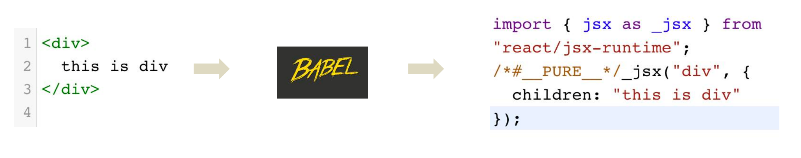

## JSX高频场景

### JS表达式

> 在JSX中可以通过 `大括号语法{}` 识别JavaScript中的表达式，比如常见的变量、函数调用、方法调用等等

1. 使用引号传递字符串
2. 使用JS变量
3. 函数调用和方法调用
4. 使用JavaScript对象

**注意**：if语句、switch语句、变量声明不属于表达式，不能出现在{}中

```jsx
const message = 'this is message'

function getAge(){
  return 18
}

function App(){
  return (
    <div>
      <h1>this is title</h1>
      {/* 字符串识别 */}
      {'this is str'}
      {/* 变量识别 */}
      {message}
      {/* 变量识别 */}
      {message}
      {/* 函数调用 渲染为函数的返回值 */}
      {getAge()}
    </div>
  )
}
```

### 列表渲染

> 在JSX中可以使用原生js中的`map方法` 实现列表渲染
>
> map 循环哪个结构 return 结构
>
> 注意：加上一个独一无二的key  需要是字符串/number类型
>
> key的作用：React框架内部使用 提升更新性能的

```jsx
const list = [
  {id:1001, name:'Vue'},
  {id:1002, name: 'React'},
  {id:1003, name: 'Angular'}
]

function App(){
  return (
    <ul>
      {list.map(item=><li key={item.id}>{item}</li>)}
    </ul>
  )
}
```

### 条件渲染

> 在React中，可以通过**逻辑与运算符&&**、**三元表达式(?:)** 实现基础的条件渲染

```jsx
const flag = true
const loading = false

function App(){
  return (
    <>
      {flag && <span>this is span</span>}
      {loading ? <span>loading...</span>:<span>this is span</span>}
    </>
  )
}
```

### 复杂条件渲染

> 需求：列表中需要根据文章的状态适配
> 解决方案：自定义函数 + 判断语句

```jsx
const type = 1  // 0|1|3

function getArticleJSX(){
  if(type === 0){
    return <div>无图模式模版</div>
  }else if(type === 1){
    return <div>单图模式模版</div>
  }else(type === 3){
    return <div>三图模式模版</div>
  }
}

function App(){
  return (
    <>
      { getArticleJSX() }
    </>
  )
}
```

# React的事件绑定

## 基础实现

> React中的事件绑定，通过语法 `on + 事件名称 = { 事件处理程序 }`，整体上遵循驼峰命名法

```jsx
function App(){
  const clickHandler = ()=>{
    console.log('button按钮点击了')
  }
  return (
    <button onClick={clickHandler}>click me</button>
  )
}
```

## 使用事件参数

> 在事件回调函数中设置形参e即可

```jsx
function App(){
  const clickHandler = (e)=>{
    console.log('button按钮点击了', e)
  }
  return (
    <button onClick={clickHandler}>click me</button>
  )
}
```

## 传递自定义参数

> 语法：事件绑定的位置改造成箭头函数的写法，在执行clickHandler实际处理业务函数的时候传递实参

```jsx
function App(){
  const clickHandler = (name)=>{
    console.log('button按钮点击了', name)
  }
  return (
    <button onClick={()=>clickHandler('jack')}>click me</button>
  )
}
```

:::warning
**注意**：不能直接写函数调用，这里事件绑定需要一个函数引用
:::

## 同时传递事件对象和自定义参数

> 语法：在事件绑定的位置传递事件实参e和自定义参数，clickHandler中声明形参，注意顺序对应

```jsx
function App(){
  const clickHandler = (name,e)=>{
    console.log('button按钮点击了', name,e)
  }
  return (
    <button onClick={(e)=>clickHandler('jack',e)}>click me</button>
  )
}
```

# React组件基础使用

概念：一个组件就是一个用户界面的一部分，它可以有自己的逻辑和外观，组件之间可以互相嵌套，也可以服用多次
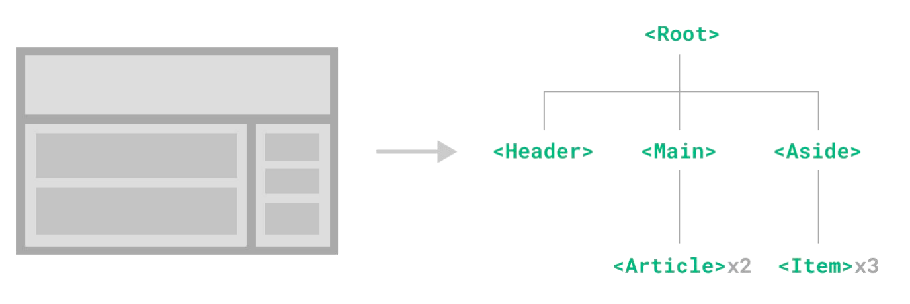

# 组件状态管理-useState

## 基础使用

> useState 是一个 React Hook（函数），它允许我们向组件添加一个`状态变量`, 从而控制影响组件的渲染结果
> 和普通JS变量不同的是，状态变量一旦发生变化组件的视图UI也会跟着变化（数据驱动视图）

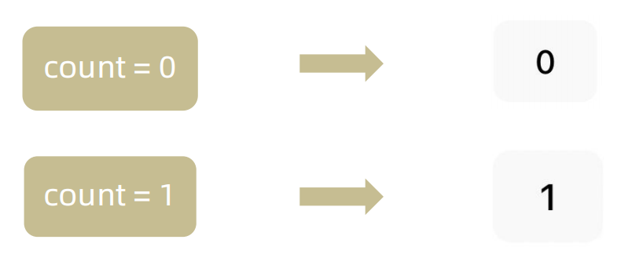

```jsx
function App(){
  const [ count, setCount ] = React.useState(0)
  return (
    <div>
      <button onClick={()=>setCount(count+1)}>{ count }</button>
    </div>
  )
}
```

## 状态的修改规则

> 在React中状态被认为是只读的，我们应该始终`替换它而不是修改它`, 直接修改状态不能引发视图更新

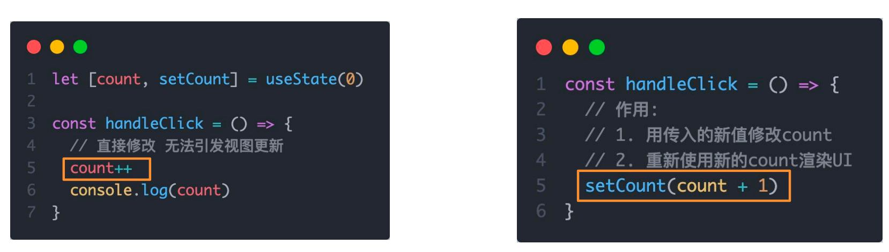

## 修改对象状态

> 对于对象类型的状态变量，应该始终给set方法一个`全新的对象` 来进行修改

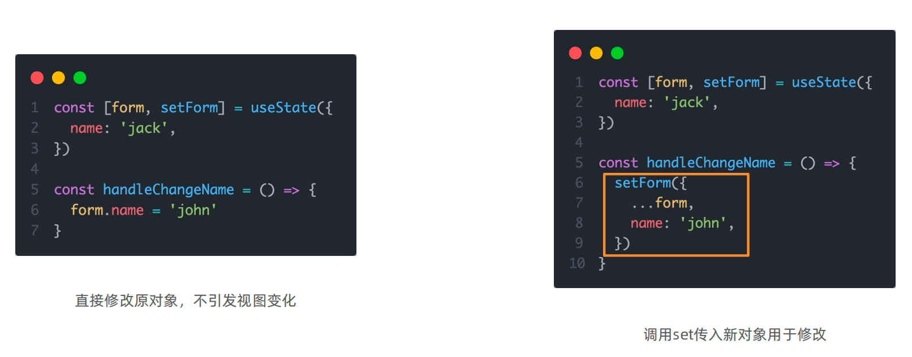

# 组件的基础样式处理

> React组件基础的样式控制有俩种方式，行内样式和class类名控制

- 行内样式：

```jsx
<div style={{ color:'red'}}>this is div</div>
```

- class类名控制：

index.css:

```css
.foo{
  color: red;
}
```

App.js:

```jsx
import './index.css'

function App(){
  return (
    <div>
      <span className="foo">this is span</span>
    </div>
  )
}
```

- classnames优化类名控制

  - classnames是一个简单的JS库，可以非常方便的通过条件动态控制class类名的显示
  - 使用之前：

  ```html
  {tabs.map(item => 
    <span 
      key={item.type} 
      onClick={() => {handleTabChange(item.type)}} 
      className={`nav-item ${type === item.type && 'active'}`}>
      {item.text}
    </span> 
  )}  
  ```

  - 使用之后：

  ```js
  // className={`nav-item ${type === item.type && 'active'}`}
  className={classNames('nav-item', {active: type === item.type})}
  ```

# React表单控制

## 受控绑定

> 概念：使用React组件的状态（useState）控制表单的状态

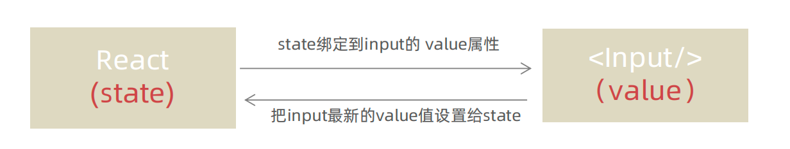

```jsx
function App(){
  /**
   * 1.声明一个react状态 - useState
   * 2.核心绑定流程
   * （1）通过value属性
   * （2）绑定onChange事件，通过事件参数e拿到输入框最新的值，反向修改到react状态
   *  */ 
  const [value, setValue] = useState('')
  return (
    <input 
      type="text" 
      value={value} 
      onChange={e => setValue(e.target.value)}
    />
  )
}
```

## 非受控绑定

> 概念：通过获取DOM的方式获取表单的输入数据
>
> 在React中获取/操作DOM，需要使用useRef钩子函数

```jsx
function App(){
  // React中获取DOM
  /**
   * 1. userRef生成ref对象，绑定到DOM标签身上
   * 2. dom可用时，ref.current获取dom
   * 渲染完毕之后dom生成之后才可用
   */
  const inputRef = useRef(null)

  const onChange = ()=>{
    console.log(inputRef.current.value)
  }
  
  return (
    <input 
      type="text" 
      ref={inputRef}
      onChange={onChange}
    />
  )
}
```

# React组件通信

> 概念：组件通信就是`组件之间的数据传递`, 根据组件嵌套关系的不同，有不同的通信手段和方法

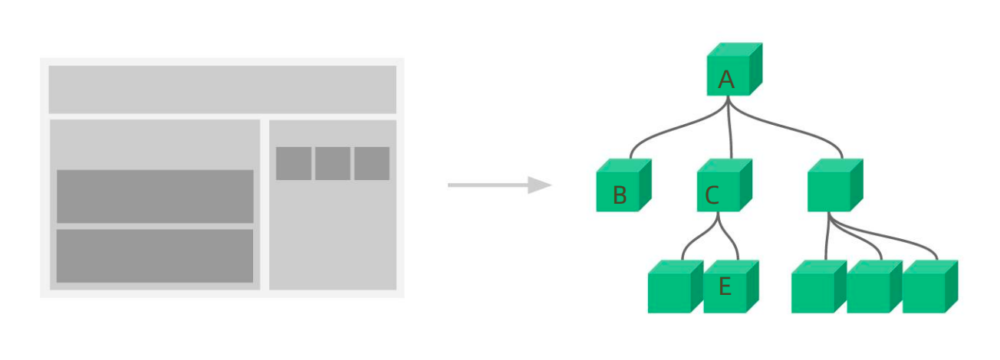

1. A-B 父子通信
2. B-C 兄弟通信
3. A-E 跨层通信

## 父子通信-父传子

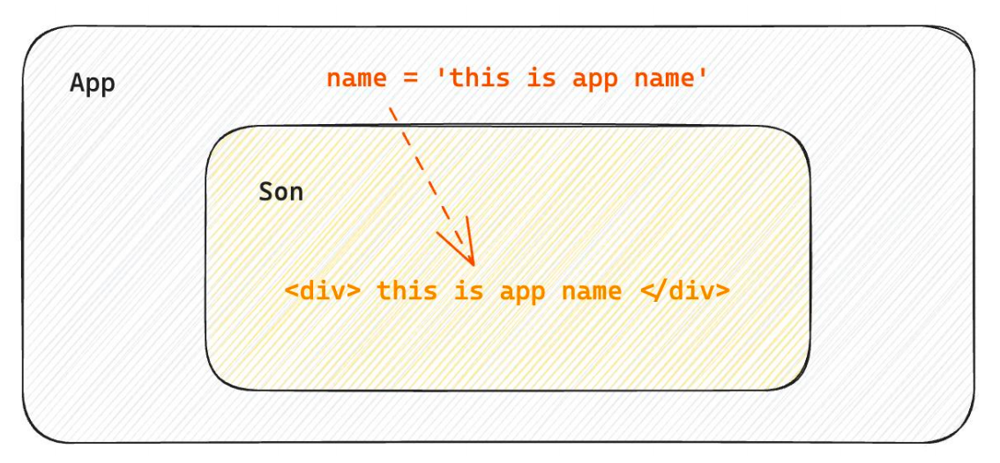

### 基础实现

**实现步骤 **

1. 父组件传递数据 - 在子组件标签上绑定属性 
2. 子组件接收数据 - 子组件通过props参数接收数据

```jsx
// 父传子
/**
 * 1. 父组件传递数据 子组件标签身上绑定属性
 * 2. 子组件接收数据 props的参数
 * props: 是对象，包含了父组件传递过来的所有数据
 */
function Son(props){
  return <div>{ props.name }</div>
}


function App(){
  const name = 'this is app name'
  return (
    <div>
       <Son name={name}/>
    </div>
  )
}
```

### props说明

**props可以传递任意的合法数据**，比如数字、字符串、布尔值、数组、对象、函数、JSX
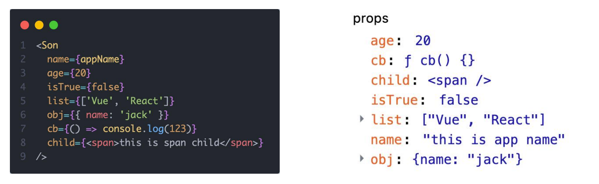
**props是只读对象**
子组件只能读取props中的数据，不能直接进行修改, 父组件的数据只能由父组件修改 

### 特殊的prop-children

> 场景：当我们把内容嵌套在组件的标签内部时，组件会自动在名为children的prop属性中接收该内容

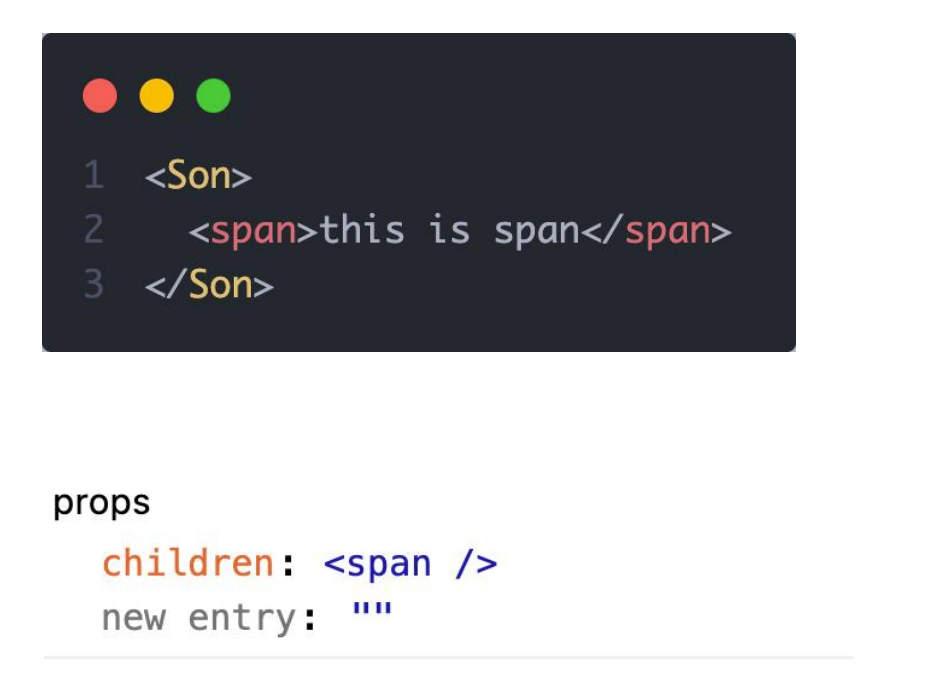

## 父子通信-子传父

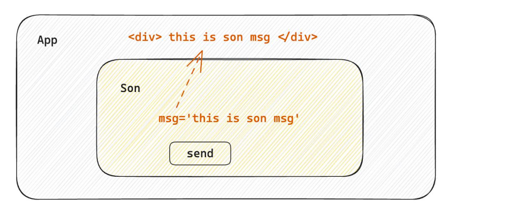

> 核心思路：在子组件中调用父组件中的函数并传递参数

```tsx
// 在子组件中调用父组件的函数并传入实参
function Son({ onGetMsg }){
  const sonMsg = 'this is son msg'
  return (
    <div>
      {/* 在子组件中执行父组件传递过来的函数 */}
      <button onClick={()=>onGetMsg(sonMsg)}>send</button>
    </div>
  )
}


function App(){
  const getMsg = (msg)=>console.log(msg)
  
  return (
    <div>
      {/* 传递父组件中的函数到子组件 */}
       <Son onGetMsg={ getMsg }/>
    </div>
  )
}
```

## 兄弟组件通信

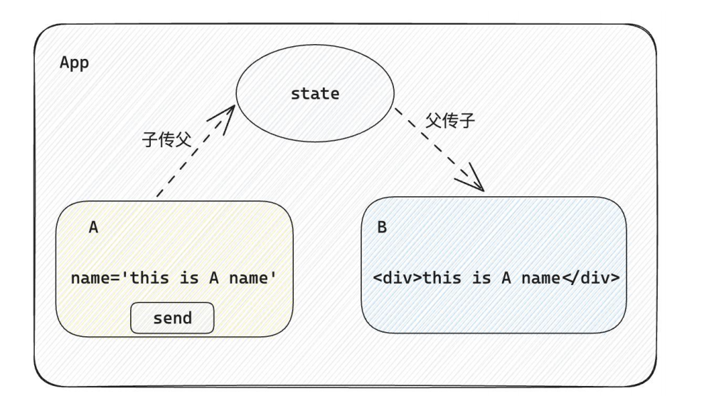

> 实现思路: 借助 **状态提升** 机制，通过共同的父组件进行兄弟之间的数据传递
>
> 1. A组件先通过子传父的方式把数据传递给父组件App
> 2. App拿到数据之后通过父传子的方式再传递给B组件

```jsx
// 1. 通过子传父 A -> App
// 2. 通过父传子 App -> B

import { useState } from "react"

function A ({ onGetAName }) {
  // Son组件中的数据
  const name = 'this is A name'
  return (
    <div>
      this is A compnent,
      <button onClick={() => onGetAName(name)}>send</button>
    </div>
  )
}

function B ({ name }) {
  return (
    <div>
      this is B compnent,
      {name}
    </div>
  )
}

function App () {
  const [name, setName] = useState('')
  const getAName = (name) => {
    setName(name)
  }
  return (
    <div>
      this is App
      <A onGetAName={getAName} />
      <B name={name} />
    </div>
  )
}

export default App
```

## 跨层组件通信

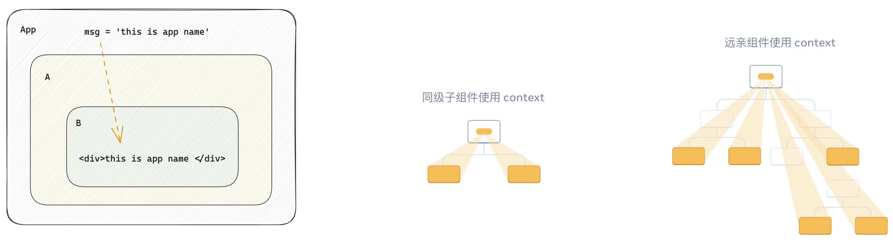
**实现步骤：**

1. 使用 `createContext`方法创建一个上下文对象Ctx 
2. 在顶层组件（App）中通过 `Ctx.Provider` 组件提供数据 
3. 在底层组件（B）中通过 `useContext` 钩子函数获取消费数据

```jsx
// App -> A -> B

import { createContext, useContext } from "react"

// 1. createContext方法创建一个上下文对象

const MsgContext = createContext()

function A () {
  return (
    <div>
      this is A component
      <B />
    </div>
  )
}

function B () {
  // 3. 在底层组件 通过useContext钩子函数使用数据
  const msg = useContext(MsgContext)
  return (
    <div>
      this is B compnent,{msg}
    </div>
  )
}

function App () {
  const msg = 'this is app msg'
  return (
    <div>
      {/* 2. 在顶层组件 通过Provider组件提供数据 */}
      <MsgContext.Provider value={msg}>
        this is App
        <A />
      </MsgContext.Provider>
    </div>
  )
}

export default App
```

