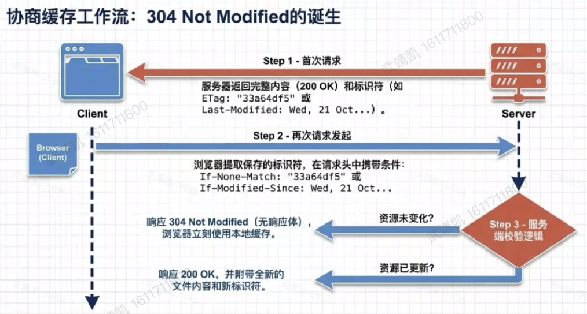
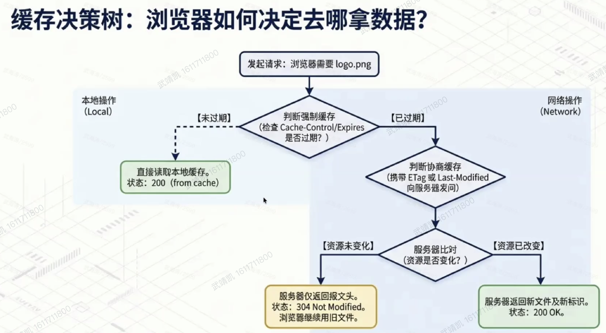
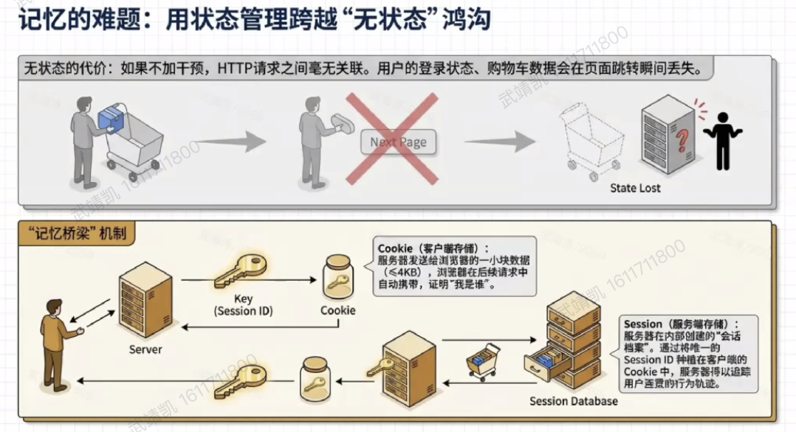
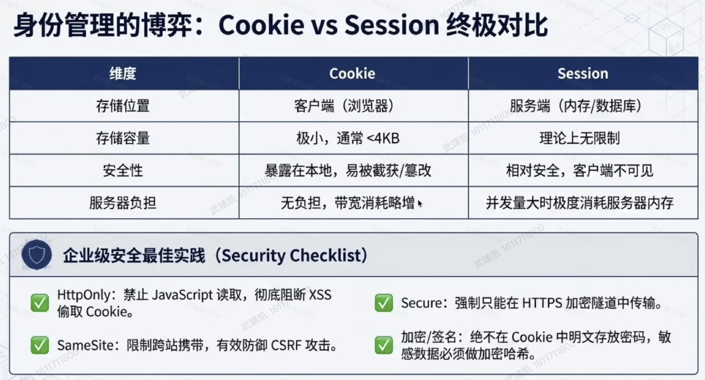
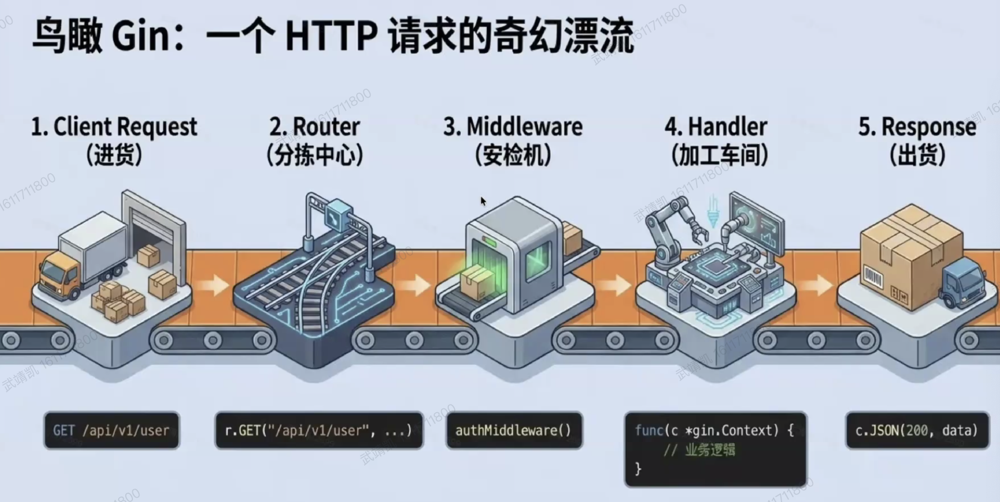
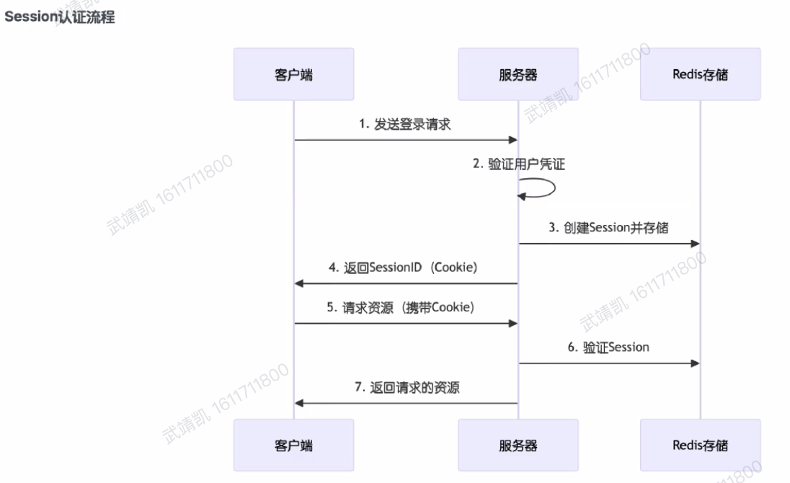
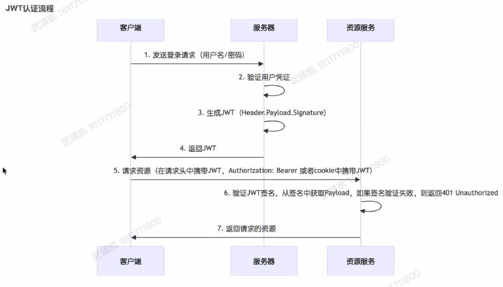
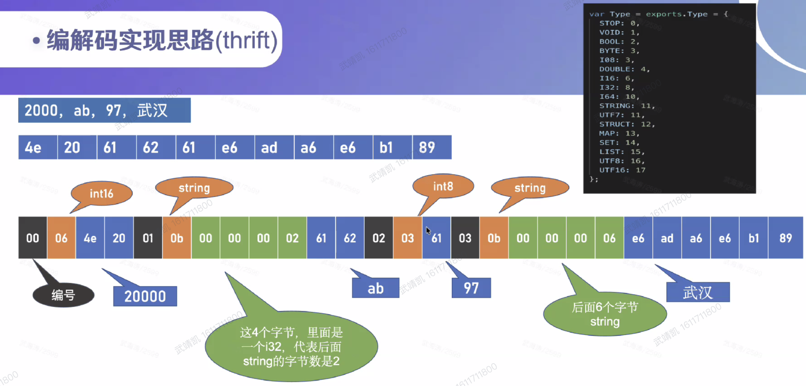
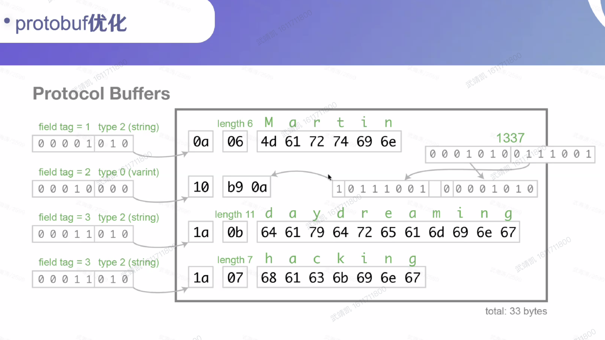
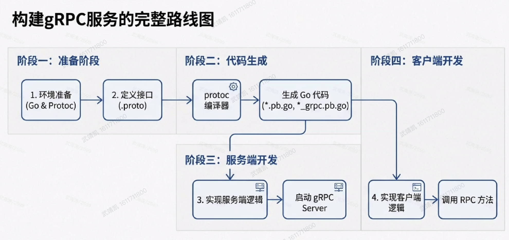

https://campus.wps.cn/contentpreview/7e5a0755-818b-46a6-ba23-8071e3a634a6

# 第四次上课

go.sixue.work

roadmap.sh/golang

code，mate

npm repo，npm docs 

## 安装

GOROOT-Go语言的安装目录，

GOPATH-工作区目录，用于存放源代码、依赖包和编译后的文件，

- bin-编译后的可执行文件
- mod-下载的依赖包

GOPROXY

## Go mod 模块管理

模块，包

标识符可见性：首字母大写

**internal 目录**：Go 强制规则

- 只能被**当前目录的父级及子级**包导入
- **外部项目绝对无法导入**（编译报错）

初始化：go mod init

添加依赖：go get  xxx

更新：go get -u

## Go语言基础

并发--goroutine轻量协程宇channel通道

变量声明

流程控制

- if
- switch -- fallthrough穿透能力

- for
- goto

函数

- 闭包
- defer
- panic，recover

基本数据类型

vitepress  cloudflare vercel

# 第五次上课

## 复合数据类型

- 指针
  - 存储变量的内存地址
  - &，*
  - new
- 数组与切片
- 值类型和引用类型
  - 值类型：基本数据类型、数组、结构体
  - 引用类型：
- 结构体
- 接口
  - 类型断言

godotenv/autoload，获取env环境变量

viper

## 并发编程

作业

cli

json配置（json转字符串）

监控这些服务是否可正常访问

配可选字段（重试次数）

-v，打印报表

高并发


问题：i++是不是原子性

**但在 CPU 执行时，会分成 3 步：**

1. **读取** i 的值
2. **计算** i + 1
3. **写回** 新值到 i

Go 里真正的原子操作：

必须用 **`sync/atomic`** 包里的函数：

```go
atomic.AddInt32(&i, 1)  // ✅ 原子 +1
atomic.AddInt64(&i, 1) // ✅ 原子 +1
```

atomic

# 第六次上课

### HTTP协议核心技术

应用层协议，无状态性（docker也是）

协议、域名、端口、路径、查询参数、锚点（哈希？**仅浏览器本地解析，不参与 HTTP 请求，后端获取不到**。用途：页面内滚动定位、前端 Hash 路由）

快参数：协议域名端口？


请求消息（请求行method/url/协议版本，一个换行`\r\n`，请求头-body之外的是文本？，两个换行，后面的body是二进制）

解析body：

- 根据content-type判断，
- 比如说json，先把二进制转化为字符串，然后再转为json。
- 如果是form-data，有文本有文件，根据boundary分割
- utf-8是unicode的一种实现

响应消息：响应行/状态码，一个换行，头部，两个换行，body

（whistle必须带账号密码）


性能提速：使用缓存

- 协商缓存
  - ETag资源的唯一哈希值，Last-Modified-资源最后修改时间
  - If-Non-Match与Etag成对出现，If-Modified-Since与Last-Modified成对出现。Etag优先
  - 假如博客网站，首页有文章列表，用户第一次是200，第二次是304，数据库有没有搜 --> 还是会搜，只是省掉了网络
    - 后端**必须先知道当前最新的 ETag / 最后修改时间**
    - 这个最新值存在数据库里
      - 比如文章列表的 `max(updated_at)`
      - 或者文章内容的哈希
    - 所以**必须查一次数据库**才能拿到最新值
    - 拿到后和前端传过来的对比
      - 没变 → 返回 **304 无 body**
      - 变了 → 返回 **200 新 body**



- 强制缓存
  - cache-control
  - 前端静态资源一般使用强制缓存



强刷：跳过强制缓存（Cache-Control/Expires），跳过协商缓存（ETag/Last-Modified），强制下载完整响应体，附带额外的缓存控制头

普通刷新：跳过强制缓存，直接进入协商缓存流程


直接复制url，可能泄露登录态？

无状态：

使用cookie实现（key-value）

session（响应头，set-cookie）



存储数据

要后端校验的登录态 → **Cookie（HttpOnly）**

非敏感用户配置 → **localStorage**

临时会话数据 → **sessionStorage**

大量结构化数据 / 离线应用 → **IndexedDB**

PWA 静态资源缓存 → **Cache API + Service Worker**


用XSS攻击可以获取cookie，普通 Cookie（没加 HttpOnly）**前端 JS 可以直接读取、劫持、偷走**，后面出现了httpOnly，**设置 HttpOnly 后**，禁止 JS 操作 Cookie，完美防御 XSS 盗取 Cookie。

cookie不能存明文东西，并且是可以改的

session放在数据库，一般放在redis



开全局代理可以抓包PC微信中开发的网站，chrome中可以用whistle

手机抓包：可以同网代理+装证书，USB调试

## Gin

https://campus.wps.cn/contentpreview/7567c757-0a98-45db-9346-692f90728355



数据：

- 来自路径参数Path、查询参数Query、请求体Body

- 路径参数用于资源定位，不可缺失
- 查询参数用于条件筛选，支持默认值
- Gin通过结构体标签，可以进行数据映射与规则校验
- 数据绑定函数BindJSON、Bind、ShouldBindJSON、ShouldBind（优先使用其系列，不要让框架剥夺你处理业务异常的控制权）
  - shouldBind：


c *gin.Context - 请求和响应

中间件

- 自定义中间件
- 数据传递：c.Set，c.Get
- 洋葱模型

请求数据处理

响应数据处理


## 服务端鉴权

session

依赖服务端存储



JWT

https://campus.wps.cn/contentpreview/f37201f3-39db-4d3c-8c3d-fb31e7f87222

不依赖服务端存储

登录成功，生成JWT（Header.Payload.Signature）



优点

缺点：

- 无法撤销：JWT一旦生成无法撤销，之前的JWT仍然有效可能被其他设备使用（引入redis？黑名单？等等看怎么搞）
  - **缩短过期时间**（降低风险）
  - **Refresh Token 机制**（推荐，企业标准）
  - **黑名单（Redis）**（强制撤销）
  - **双 Token + 黑名单**（最安全）
- 无法存储敏感信息

使用cookie存的好处，网页里检查的时候，双击网络请求，可以直接看，但是localStorage不行


密码存储：**绝对不能用 MD5、SHA1、SHA256。这些是哈希算法，**不是密码加密算法，能被暴力破解、彩虹表破解。

**bcrypt**（最主流、最推荐、Gin/Golang 默认首选）

- 自动加盐
- 慢哈希算法，暴力破解极难
- 安全性极高
- Go 官方标准库 /gin 项目都用它


下来多了解SSE吧（管道/流）


前后端开发：

1. 前端：包的版本问题，传lock
   - lock上传，定时执行 npm update
   - 读package.json，看命令
2. 前端5173，后端8080
   - 前端应该往5173发请求，比如带/api的，在vite做配置，转发到8080

3. CSR，HTML
   - Hash路由不存在兼容性问题，History路由需要服务端做支持
   - CSR适合Hash。
   - CSR 客户端渲染项目，推荐使用 Hash 路由模式，因为 Hash 路由不会向后端发送路径请求，刷新不会 404，无需服务端额外配置；History 模式路径优雅，但刷新会 404，依赖 Nginx 重定向配置，更适合有运维配合的线上项目。
   - try_files：如果找不到就返回index.html？

# 第七次上课

## Docker

https://go.sixue.work/golang/c07/c07_09.html

重启

**利用缓存**（面试老问）

多阶段构建

## Nginx

正向代理与反向代理

配置，主要配server 

http2解决了什么问题，http3

spa history路由 解决

## sqlite

go-sqlite3

逻辑删除

## mysql

索引，where

存一千万个数据怎么存，横着切竖着切？

一对一、一对多、多对多

比如，标签，题目，看标签被多少题目引用，看题目中有哪些标签：一个标签表，一个题目表，增加一个中间表：题目id，标签id

约束

ACID与InnoDB

## GORM

gorm，prisma

ORM

mysql，sqlite异同

## Redis

context 跨协程通信

缓存穿透、击穿、雪崩（面试爱问）

分布式系统—CAP

# 第八次上课

https://campus.wps.cn/contentpreview/07fa7fb8-df64-4306-addc-ffd305b968db

## 微服务

https://365.kdocs.cn/l/clsv0pHRAafO

https://365.kdocs.cn/view/l/cc9s86YRcDmb（他不给看，可恶）

RPC-远程过程调用

（与http的对比，不能比？两个层面的东西）

微服务的好处（服务解耦，故障隔离，灵活部署，可扩展性强，服务可公用，定位问题方便，技术异构）

拆分的粒度（看业务情况）

原理：

- 如何找到对方：服务注册与发现
- 

object->binary，为什么不用json，编解码

编解码实现思路：使用协议，thrift



protobuf



## GRPC

https://365.kdocs.cn/l/clsv0pHRAafO

protoc 简化编解码的过程



先生成proto，服务端客户端实现

##  云服务

http://365.kdocs.cn/l/cg4eYWvWeHcf

OSS

存储空间（Bucket，设置私有），对象（Object）

上传：

- 服务端转发上传：带宽瓶颈，资源枯竭，可扩展性差

- 改进：服务端签名（鉴权），客户端直传
  - 服务端生成签名url，前端使用签名url直接上传/下载

CDN

进一步减负：OSS处理图片缩放与格式转换


随便说了点儿别的：

SRE

网关（KLB，负载均衡），写代码，流水线KCICD，push，发布

错误查询

## AI Agent

agent，skill，mcp

规划、记忆、工具、行动


eino：

github.com/vfan/eino-examples

核心组件：Loader文档加载器（不要把隐私数据给大模型，本地解析文档）、等等

AI Agent与Tool自动路由：选择工具调用，意图分发


大作业：

不做大文件上传

注册功能分两个


AI对话入库


游客，投递要登录

简历随时编辑

简历的某些字段结构化存到mysql里（ai自动填也行，会加分）

直传


微服务 grpc

解析意图

markdown可以加流程图什么的

skill
