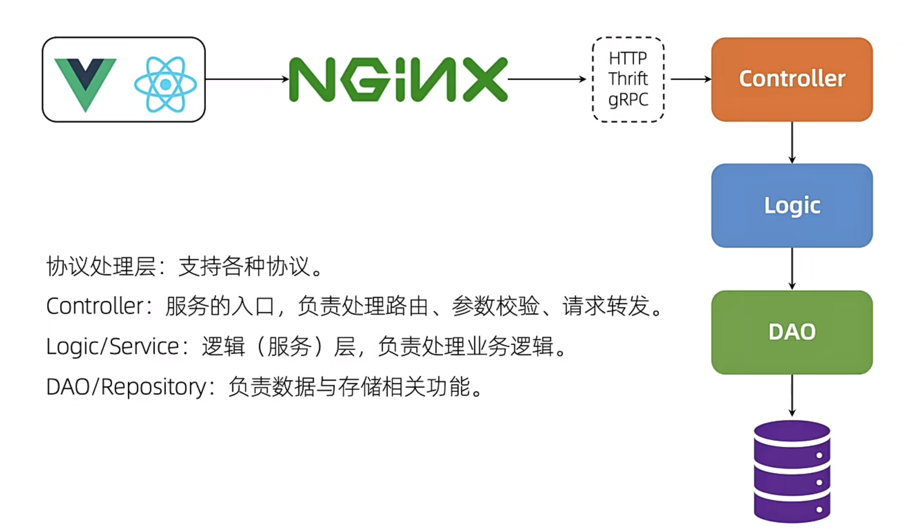

# Zap日志库

https://liwenzhou.com/posts/go/zap

## 注意点

- 开发阶段，记录debug（调试的信息）、info（想要被记录的关键信息）、warning、error

## 介绍 

在许多Go语言项目中，我们需要一个好的日志记录器能够提供下面这些功能：

- 能够将事件记录到文件中，而不是应用程序控制台。
- 日志切割-能够根据文件大小、时间或间隔等来切割日志文件。
- 支持不同的日志级别。例如INFO，DEBUG，ERROR等。
- 能够打印基本信息，如调用文件/函数名和行号，日志时间等。

## 默认的Go Logger 

在介绍Uber-go的zap包之前，让我们先看看Go语言提供的基本日志功能。Go语言提供的默认日志包是https://golang.org/pkg/log/。

### 实现Go Logger 

实现一个Go语言中的日志记录器非常简单——创建一个新的日志文件，然后设置它为日志的输出位置。

#### 设置Logger 

我们可以像下面的代码一样设置日志记录器

```go
func SetupLogger() {
	logFileLocation, _ := os.OpenFile("/Users/q1mi/test.log", os.O_CREATE|os.O_APPEND|os.O_RDWR, 0744)
	log.SetOutput(logFileLocation)
}
```

#### 使用Logger 

让我们来写一些虚拟的代码来使用这个日志记录器。

在当前的示例中，我们将建立一个到URL的HTTP连接，并将状态代码/错误记录到日志文件中。

```go
func simpleHttpGet(url string) {
	resp, err := http.Get(url)
	if err != nil {
		log.Printf("Error fetching url %s : %s", url, err.Error())
	} else {
		log.Printf("Status Code for %s : %s", url, resp.Status)
		resp.Body.Close()
	}
}
```

#### Logger的运行 

现在让我们执行上面的代码并查看日志记录器的运行情况。

```go
func main() {
	SetupLogger()
	simpleHttpGet("www.google.com")
	simpleHttpGet("http://www.google.com")
}
```

当我们执行上面的代码，我们能看到一个`test.log`文件被创建，下面的内容会被添加到这个日志文件中。

```bash
2019/05/24 01:14:13 Error fetching url www.google.com : Get www.google.com: unsupported protocol scheme ""
2019/05/24 01:14:14 Status Code for http://www.google.com : 200 OK
```

### Go Logger的优势和劣势 

#### 优势 

它最大的优点是使用非常简单。我们可以设置任何`io.Writer`作为日志记录输出并向其发送要写入的日志。

#### 劣势 

- 仅限基本的日志级别

  - 只有一个`Print`选项。不支持`INFO`/`DEBUG`等多个级别。

- 对于错误日志，它有

  ```
  Fatal
  ```

  和

  ```
  Panic
  ```

  - Fatal日志通过调用`os.Exit(1)`来结束程序
  - Panic日志在写入日志消息之后抛出一个panic
  - 但是它缺少一个ERROR日志级别，这个级别可以在不抛出panic或退出程序的情况下记录错误

- 缺乏日志格式化的能力——例如记录调用者的函数名和行号，格式化日期和时间格式。等等。

- 不提供日志切割的能力。

## Uber-go Zap 

[Zap](https://github.com/uber-go/zap)是非常快的、结构化的，分日志级别的Go日志库。

### 为什么选择Uber-go zap 

- 它同时提供了结构化日志记录和printf风格的日志记录
- 它非常的快

根据Uber-go Zap的文档，它的性能比类似的结构化日志包更好——也比标准库更快。 以下是Zap发布的基准测试信息

记录一条消息和10个字段:

| Package         | Time        | Time % to zap | Objects Allocated |
| --------------- | ----------- | ------------- | ----------------- |
| ⚡️ zap           | 862 ns/op   | +0%           | 5 allocs/op       |
| ⚡️ zap (sugared) | 1250 ns/op  | +45%          | 11 allocs/op      |
| zerolog         | 4021 ns/op  | +366%         | 76 allocs/op      |
| go-kit          | 4542 ns/op  | +427%         | 105 allocs/op     |
| apex/log        | 26785 ns/op | +3007%        | 115 allocs/op     |
| logrus          | 29501 ns/op | +3322%        | 125 allocs/op     |
| log15           | 29906 ns/op | +3369%        | 122 allocs/op     |

记录一个静态字符串，没有任何上下文或printf风格的模板：

| Package          | Time       | Time % to zap | Objects Allocated |
| ---------------- | ---------- | ------------- | ----------------- |
| ⚡️ zap            | 118 ns/op  | +0%           | 0 allocs/op       |
| ⚡️ zap (sugared)  | 191 ns/op  | +62%          | 2 allocs/op       |
| zerolog          | 93 ns/op   | -21%          | 0 allocs/op       |
| go-kit           | 280 ns/op  | +137%         | 11 allocs/op      |
| standard library | 499 ns/op  | +323%         | 2 allocs/op       |
| apex/log         | 1990 ns/op | +1586%        | 10 allocs/op      |
| logrus           | 3129 ns/op | +2552%        | 24 allocs/op      |
| log15            | 3887 ns/op | +3194%        | 23 allocs/op      |

### 安装 

运行下面的命令安装zap

```bash
go get -u go.uber.org/zap
```

### 配置Zap Logger 

Zap提供了两种类型的日志记录器—`Sugared Logger`和`Logger`。

在性能很好但不是很关键的上下文中，使用`SugaredLogger`。它比其他结构化日志记录包快4-10倍，并且支持结构化和printf风格的日志记录。

在每一微秒和每一次内存分配都很重要的上下文中，使用`Logger`。它甚至比`SugaredLogger`更快，内存分配次数也更少，但它只支持强类型的结构化日志记录。

#### Logger 

- 通过调用`zap.NewProduction()`/`zap.NewDevelopment()`或者`zap.Example()`创建一个Logger。
- 上面的每一个函数都将创建一个logger。唯一的区别在于它将记录的信息不同。例如production logger默认记录调用函数信息、日期和时间等。
- 通过Logger调用Info/Error等。
- 默认情况下日志都会打印到应用程序的console界面。

```go
var logger *zap.Logger

func main() {
	InitLogger()
  defer logger.Sync()
	simpleHttpGet("www.google.com")
	simpleHttpGet("http://www.google.com")
}

func InitLogger() {
	logger, _ = zap.NewProduction()
}

func simpleHttpGet(url string) {
	resp, err := http.Get(url)
	if err != nil {
		logger.Error(
			"Error fetching url..",
			zap.String("url", url),
			zap.Error(err))
	} else {
		logger.Info("Success..",
			zap.String("statusCode", resp.Status),
			zap.String("url", url))
		resp.Body.Close()
	}
}
```

在上面的代码中，我们首先创建了一个Logger，然后使用Info/ Error等Logger方法记录消息。

日志记录器方法的语法是这样的：

```go
func (log *Logger) MethodXXX(msg string, fields ...Field) 
```

其中`MethodXXX`是一个可变参数函数，可以是Info / Error/ Debug / Panic等。每个方法都接受一个消息字符串和任意数量的`zapcore.Field`场参数。

每个`zapcore.Field`其实就是一组键值对参数。

我们执行上面的代码会得到如下输出结果：

```bash
{"level":"error","ts":1572159218.912792,"caller":"zap_demo/temp.go:25","msg":"Error fetching url..","url":"www.sogo.com","error":"Get www.sogo.com: unsupported protocol scheme \"\"","stacktrace":"main.simpleHttpGet\n\t/Users/q1mi/zap_demo/temp.go:25\nmain.main\n\t/Users/q1mi/zap_demo/temp.go:14\nruntime.main\n\t/usr/local/go/src/runtime/proc.go:203"}
{"level":"info","ts":1572159219.1227388,"caller":"zap_demo/temp.go:30","msg":"Success..","statusCode":"200 OK","url":"http://www.sogo.com"}
```

#### Sugared Logger 

现在让我们使用Sugared Logger来实现相同的功能。

- 大部分的实现基本都相同。
- 惟一的区别是，我们通过调用主logger的`. Sugar()`方法来获取一个`SugaredLogger`。
- 然后使用`SugaredLogger`以`printf`格式记录语句

下面是修改过后使用`SugaredLogger`代替`Logger`的代码：

```go
var sugarLogger *zap.SugaredLogger

func main() {
	InitLogger()
	defer sugarLogger.Sync()
	simpleHttpGet("www.google.com")
	simpleHttpGet("http://www.google.com")
}

func InitLogger() {
  logger, _ := zap.NewProduction()
	sugarLogger = logger.Sugar()
}

func simpleHttpGet(url string) {
	sugarLogger.Debugf("Trying to hit GET request for %s", url)
	resp, err := http.Get(url)
	if err != nil {
		sugarLogger.Errorf("Error fetching URL %s : Error = %s", url, err)
	} else {
		sugarLogger.Infof("Success! statusCode = %s for URL %s", resp.Status, url)
		resp.Body.Close()
	}
}
```

当你执行上面的代码会得到如下输出：

```bash
{"level":"error","ts":1572159149.923002,"caller":"logic/temp2.go:27","msg":"Error fetching URL www.sogo.com : Error = Get www.sogo.com: unsupported protocol scheme \"\"","stacktrace":"main.simpleHttpGet\n\t/Users/q1mi/zap_demo/logic/temp2.go:27\nmain.main\n\t/Users/q1mi/zap_demo/logic/temp2.go:14\nruntime.main\n\t/usr/local/go/src/runtime/proc.go:203"}
{"level":"info","ts":1572159150.192585,"caller":"logic/temp2.go:29","msg":"Success! statusCode = 200 OK for URL http://www.sogo.com"}
```

你应该注意到的了，到目前为止这两个logger都打印输出JSON结构格式。

在本博客的后面部分，我们将更详细地讨论SugaredLogger，并了解如何进一步配置它。

### 定制logger 

#### 将日志写入文件而不是终端 

我们要做的第一个更改是把日志写入文件，而不是打印到应用程序控制台。

- 我们将使用`zap.New(…)`方法来手动传递所有配置，而不是使用像`zap.NewProduction()`这样的预置方法来创建logger。

```go
func New(core zapcore.Core, options ...Option) *Logger
```

`zapcore.Core`需要三个配置——`Encoder`，`WriteSyncer`，`LogLevel`。

1.**Encoder**:编码器(如何写入日志)。我们将使用开箱即用的`NewJSONEncoder()`，并使用预先设置的`ProductionEncoderConfig()`。

```go
zapcore.NewJSONEncoder(zap.NewProductionEncoderConfig())
```

2.**WriterSyncer** ：指定日志将写到哪里去。我们使用`zapcore.AddSync()`函数并且将打开的文件句柄传进去。

```go
file, _ := os.Create("./test.log")
writeSyncer := zapcore.AddSync(file)
```

3.**Log Level**：哪种级别的日志将被写入。

我们将修改上述部分中的Logger代码，并重写`InitLogger()`方法。其余方法—`main()` /`SimpleHttpGet()`保持不变。

```go
func InitLogger() {
	writeSyncer := getLogWriter()
	encoder := getEncoder()
	core := zapcore.NewCore(encoder, writeSyncer, zapcore.DebugLevel)

	logger := zap.New(core)
	sugarLogger = logger.Sugar()
}

func getEncoder() zapcore.Encoder {
	return zapcore.NewJSONEncoder(zap.NewProductionEncoderConfig())
}

func getLogWriter() zapcore.WriteSyncer {
	file, _ := os.Create("./test.log")
	return zapcore.AddSync(file)
}
```

当使用这些修改过的logger配置调用上述部分的`main()`函数时，以下输出将打印在文件——`test.log`中。

```bash
{"level":"debug","ts":1572160754.994731,"msg":"Trying to hit GET request for www.sogo.com"}
{"level":"error","ts":1572160754.994982,"msg":"Error fetching URL www.sogo.com : Error = Get www.sogo.com: unsupported protocol scheme \"\""}
{"level":"debug","ts":1572160754.994996,"msg":"Trying to hit GET request for http://www.sogo.com"}
{"level":"info","ts":1572160757.3755069,"msg":"Success! statusCode = 200 OK for URL http://www.sogo.com"}
```

#### 将JSON Encoder更改为普通的Log Encoder 

现在，我们希望将编码器从JSON Encoder更改为普通Encoder。为此，我们需要将`NewJSONEncoder()`更改为`NewConsoleEncoder()`。

```go
return zapcore.NewConsoleEncoder(zap.NewProductionEncoderConfig())
```

当使用这些修改过的logger配置调用上述部分的`main()`函数时，以下输出将打印在文件——`test.log`中。

```bash
1.572161051846623e+09	debug	Trying to hit GET request for www.sogo.com
1.572161051846828e+09	error	Error fetching URL www.sogo.com : Error = Get www.sogo.com: unsupported protocol scheme ""
1.5721610518468401e+09	debug	Trying to hit GET request for http://www.sogo.com
1.572161052068744e+09	info	Success! statusCode = 200 OK for URL http://www.sogo.com
```

#### 更改时间编码并添加调用者详细信息 

鉴于我们对配置所做的更改，有下面两个问题：

- 时间是以非人类可读的方式展示，例如1.572161051846623e+09
- 调用方函数的详细信息没有显示在日志中

我们要做的第一件事是覆盖默认的`ProductionConfig()`，并进行以下更改:

- 修改时间编码器
- 在日志文件中使用大写字母记录日志级别

```go
func getEncoder() zapcore.Encoder {
	encoderConfig := zap.NewProductionEncoderConfig()
	encoderConfig.EncodeTime = zapcore.ISO8601TimeEncoder
	encoderConfig.EncodeLevel = zapcore.CapitalLevelEncoder
	return zapcore.NewConsoleEncoder(encoderConfig)
}
```

接下来，我们将修改zap logger代码，添加将调用函数信息记录到日志中的功能。为此，我们将在`zap.New(..)`函数中添加一个`Option`。

```go
logger := zap.New(core, zap.AddCaller())
```

当使用这些修改过的logger配置调用上述部分的`main()`函数时，以下输出将打印在文件——`test.log`中。

```bash
2019-10-27T15:33:29.855+0800	DEBUG	logic/temp2.go:47	Trying to hit GET request for www.sogo.com
2019-10-27T15:33:29.855+0800	ERROR	logic/temp2.go:50	Error fetching URL www.sogo.com : Error = Get www.sogo.com: unsupported protocol scheme ""
2019-10-27T15:33:29.856+0800	DEBUG	logic/temp2.go:47	Trying to hit GET request for http://www.sogo.com
2019-10-27T15:33:30.125+0800	INFO	logic/temp2.go:52	Success! statusCode = 200 OK for URL http://www.sogo.com
```

#### AddCallerSkip 

当我们不是直接使用初始化好的logger实例记录日志，而是将其包装成一个函数等，此时日录日志的函数调用链会增加，想要获得准确的调用信息就需要通过`AddCallerSkip`函数来跳过。

```go
logger := zap.New(core, zap.AddCaller(), zap.AddCallerSkip(1))
```

#### 将日志输出到多个位置 

我们可以将日志同时输出到文件和终端。

```go
func getLogWriter() zapcore.WriteSyncer {
	file, _ := os.Create("./test.log")
	// 利用io.MultiWriter支持文件和终端两个输出目标
	ws := io.MultiWriter(file, os.Stdout)
	return zapcore.AddSync(ws)
}
```

#### 将err日志单独输出到文件 

有时候我们除了将全量日志输出到`xx.log`文件中之外，还希望将`ERROR`级别的日志单独输出到一个名为`xx.err.log`的日志文件中。我们可以通过以下方式实现。

```go
func InitLogger() {
	encoder := getEncoder()
	// test.log记录全量日志
	logF, _ := os.Create("./test.log")
	c1 := zapcore.NewCore(encoder, zapcore.AddSync(logF), zapcore.DebugLevel)
	// test.err.log记录ERROR级别的日志
	errF, _ := os.Create("./test.err.log")
	c2 := zapcore.NewCore(encoder, zapcore.AddSync(errF), zap.ErrorLevel)
	// 使用NewTee将c1和c2合并到core
	core := zapcore.NewTee(c1, c2)
	logger = zap.New(core, zap.AddCaller())
}
```

## 使用Lumberjack进行日志切割归档 

这个日志程序中唯一缺少的就是日志切割归档功能。

> *Zap本身不支持切割归档日志文件*

官方的说法是为了添加日志切割归档功能，我们将使用第三方库[Lumberjack](https://github.com/natefinch/lumberjack)来实现。

目前只支持按文件大小切割，原因是按时间切割效率低且不能保证日志数据不被破坏。详情戳https://github.com/natefinch/lumberjack/issues/54。

想按日期切割可以使用[github.com/lestrrat-go/file-rotatelogs](https://github.com/lestrrat-go/file-rotatelogs)这个库，虽然目前不维护了，但也够用了。

```go
// 使用file-rotatelogs按天切割日志

import rotatelogs "github.com/lestrrat-go/file-rotatelogs"

l, _ := rotatelogs.New(
	filename+".%Y%m%d%H%M",
	rotatelogs.WithMaxAge(30*24*time.Hour),    // 最长保存30天
	rotatelogs.WithRotationTime(time.Hour*24), // 24小时切割一次
)
zapcore.AddSync(l)
```

### 安装 

执行下面的命令安装 Lumberjack v2 版本。

```bash
go get gopkg.in/natefinch/lumberjack.v2
```

### zap logger中加入Lumberjack 

要在zap中加入Lumberjack支持，我们需要修改`WriteSyncer`代码。我们将按照下面的代码修改`getLogWriter()`函数：

```go
func getLogWriter() zapcore.WriteSyncer {
	lumberJackLogger := &lumberjack.Logger{
		Filename:   "./test.log",
		MaxSize:    10,
		MaxBackups: 5,
		MaxAge:     30,
		Compress:   false,
	}
	return zapcore.AddSync(lumberJackLogger)
}
```

Lumberjack Logger采用以下属性作为输入:

- Filename: 日志文件的位置
- MaxSize：在进行切割之前，日志文件的最大大小（以MB为单位）
- MaxBackups：保留旧文件的最大个数
- MaxAges：保留旧文件的最大天数
- Compress：是否压缩/归档旧文件

### 测试所有功能 

最终，使用Zap/Lumberjack logger的完整示例代码如下：

```go
package main

import (
	"net/http"

	"gopkg.in/natefinch/lumberjack.v2"
	"go.uber.org/zap"
	"go.uber.org/zap/zapcore"
)

var sugarLogger *zap.SugaredLogger

func main() {
	InitLogger()
	defer sugarLogger.Sync()
	simpleHttpGet("www.sogo.com")
	simpleHttpGet("http://www.sogo.com")
}

func InitLogger() {
	writeSyncer := getLogWriter()
	encoder := getEncoder()
	core := zapcore.NewCore(encoder, writeSyncer, zapcore.DebugLevel)

	logger := zap.New(core, zap.AddCaller())
	sugarLogger = logger.Sugar()
}

func getEncoder() zapcore.Encoder {
	encoderConfig := zap.NewProductionEncoderConfig()
	encoderConfig.EncodeTime = zapcore.ISO8601TimeEncoder
	encoderConfig.EncodeLevel = zapcore.CapitalLevelEncoder
	return zapcore.NewConsoleEncoder(encoderConfig)
}

func getLogWriter() zapcore.WriteSyncer {
	lumberJackLogger := &lumberjack.Logger{
		Filename:   "./test.log",
		MaxSize:    1,
		MaxBackups: 5,
		MaxAge:     30,
		Compress:   false,
	}
	return zapcore.AddSync(lumberJackLogger)
}

func simpleHttpGet(url string) {
	sugarLogger.Debugf("Trying to hit GET request for %s", url)
	resp, err := http.Get(url)
	if err != nil {
		sugarLogger.Errorf("Error fetching URL %s : Error = %s", url, err)
	} else {
		sugarLogger.Infof("Success! statusCode = %s for URL %s", resp.Status, url)
		resp.Body.Close()
	}
}
```

执行上述代码，下面的内容会输出到文件——test.log中。

```go
2019-10-27T15:50:32.944+0800	DEBUG	logic/temp2.go:48	Trying to hit GET request for www.sogo.com
2019-10-27T15:50:32.944+0800	ERROR	logic/temp2.go:51	Error fetching URL www.sogo.com : Error = Get www.sogo.com: unsupported protocol scheme ""
2019-10-27T15:50:32.944+0800	DEBUG	logic/temp2.go:48	Trying to hit GET request for http://www.sogo.com
2019-10-27T15:50:33.165+0800	INFO	logic/temp2.go:53	Success! statusCode = 200 OK for URL http://www.sogo.com
```

同时，可以在`main`函数中循环记录日志，测试日志文件是否会自动切割和归档（日志文件每1MB会切割并且在当前目录下最多保存5个备份）。

至此，我们总结了如何将Zap日志程序集成到Go应用程序项目中。

## 使用zap接收gin框架默认的日志并配置日志归档

https://liwenzhou.com/posts/go/zap-in-gin/

### gin默认的中间件 

首先我们来看一个最简单的gin项目：

```go
func main() {
	r := gin.Default()
	r.GET("/hello", func(c *gin.Context) {
		c.String("hello liwenzhou.com!")
	})
	r.Run(
}
```

接下来我们看一下`gin.Default()`的源码：

```go
func Default() *Engine {
	debugPrintWARNINGDefault()
	engine := New()
	engine.Use(Logger(), Recovery())
	return engine
}
```

也就是我们在使用`gin.Default()`的同时是用到了gin框架内的两个默认中间件`Logger()`和`Recovery()`。

其中`Logger()`是把gin框架本身的日志输出到标准输出（我们本地开发调试时在终端输出的那些日志就是它的功劳），而`Recovery()`是在程序出现panic的时候恢复现场并写入500响应的。

### 基于zap的中间件 

我们可以模仿`Logger()`和`Recovery()`的实现，使用我们的日志库来接收gin框架默认输出的日志。

这里以zap为例，我们实现两个中间件如下：

```go
// GinLogger 接收gin框架默认的日志
func GinLogger(logger *zap.Logger) gin.HandlerFunc {
	return func(c *gin.Context) {
		start := time.Now()
		path := c.Request.URL.Path
		query := c.Request.URL.RawQuery
		c.Next()

		cost := time.Since(start)
		logger.Info(path,
			zap.Int("status", c.Writer.Status()),
			zap.String("method", c.Request.Method),
			zap.String("path", path),
			zap.String("query", query),
			zap.String("ip", c.ClientIP()),
			zap.String("user-agent", c.Request.UserAgent()),
			zap.String("errors", c.Errors.ByType(gin.ErrorTypePrivate).String()),
			zap.Duration("cost", cost),
		)
	}
}

// GinRecovery recover掉项目可能出现的panic
func GinRecovery(logger *zap.Logger, stack bool) gin.HandlerFunc {
	return func(c *gin.Context) {
		defer func() {
			if err := recover(); err != nil {
				// Check for a broken connection, as it is not really a
				// condition that warrants a panic stack trace.
				var brokenPipe bool
				if ne, ok := err.(*net.OpError); ok {
					if se, ok := ne.Err.(*os.SyscallError); ok {
						if strings.Contains(strings.ToLower(se.Error()), "broken pipe") || strings.Contains(strings.ToLower(se.Error()), "connection reset by peer") {
							brokenPipe = true
						}
					}
				}

				httpRequest, _ := httputil.DumpRequest(c.Request, false)
				if brokenPipe {
					logger.Error(c.Request.URL.Path,
						zap.Any("error", err),
						zap.String("request", string(httpRequest)),
					)
					// If the connection is dead, we can't write a status to it.
					c.Error(err.(error)) // nolint: errcheck
					c.Abort()
					return
				}

				if stack {
					logger.Error("[Recovery from panic]",
						zap.Any("error", err),
						zap.String("request", string(httpRequest)),
						zap.String("stack", string(debug.Stack())),
					)
				} else {
					logger.Error("[Recovery from panic]",
						zap.Any("error", err),
						zap.String("request", string(httpRequest)),
					)
				}
				c.AbortWithStatus(http.StatusInternalServerError)
			}
		}()
		c.Next()
	}
}
```

*如果不想自己实现，可以使用github上有别人封装好的https://github.com/gin-contrib/zap。*

这样我们就可以在gin框架中使用我们上面定义好的两个中间件来代替gin框架默认的`Logger()`和`Recovery()`了。

```go
r := gin.New()
r.Use(GinLogger(), GinRecovery())
```

### 在gin项目中使用zap 

最后我们再加入我们项目中常用的日志切割，完整版的`logger.go`代码如下：

```go
package logger

import (
	"gin_zap_demo/config"
	"net"
	"net/http"
	"net/http/httputil"
	"os"
	"runtime/debug"
	"strings"
	"time"

	"github.com/gin-gonic/gin"
	"github.com/natefinch/lumberjack"
	"go.uber.org/zap"
	"go.uber.org/zap/zapcore"
)

var lg *zap.Logger

// InitLogger 初始化Logger
func InitLogger(cfg *config.LogConfig) (err error) {
	writeSyncer := getLogWriter(cfg.Filename, cfg.MaxSize, cfg.MaxBackups, cfg.MaxAge)
	encoder := getEncoder()
	var l = new(zapcore.Level)
	err = l.UnmarshalText([]byte(cfg.Level))
	if err != nil {
		return
	}
	core := zapcore.NewCore(encoder, writeSyncer, l)

	lg = zap.New(core, zap.AddCaller())
	zap.ReplaceGlobals(lg) // 替换zap包中全局的logger实例，后续在其他包中只需使用zap.L()调用即可
	return
}

func getEncoder() zapcore.Encoder {
	encoderConfig := zap.NewProductionEncoderConfig()
	encoderConfig.EncodeTime = zapcore.ISO8601TimeEncoder
	encoderConfig.TimeKey = "time"
	encoderConfig.EncodeLevel = zapcore.CapitalLevelEncoder
	encoderConfig.EncodeDuration = zapcore.SecondsDurationEncoder
	encoderConfig.EncodeCaller = zapcore.ShortCallerEncoder
	return zapcore.NewJSONEncoder(encoderConfig)
}

func getLogWriter(filename string, maxSize, maxBackup, maxAge int) zapcore.WriteSyncer {
	lumberJackLogger := &lumberjack.Logger{
		Filename:   filename,
		MaxSize:    maxSize,
		MaxBackups: maxBackup,
		MaxAge:     maxAge,
	}
	return zapcore.AddSync(lumberJackLogger)
}

// GinLogger 接收gin框架默认的日志
func GinLogger() gin.HandlerFunc {
	return func(c *gin.Context) {
		start := time.Now()
		path := c.Request.URL.Path
		query := c.Request.URL.RawQuery
		c.Next()

		cost := time.Since(start)
		lg.Info(path,
			zap.Int("status", c.Writer.Status()),
			zap.String("method", c.Request.Method),
			zap.String("path", path),
			zap.String("query", query),
			zap.String("ip", c.ClientIP()),
			zap.String("user-agent", c.Request.UserAgent()),
			zap.String("errors", c.Errors.ByType(gin.ErrorTypePrivate).String()),
			zap.Duration("cost", cost),
		)
	}
}

// GinRecovery recover掉项目可能出现的panic，并使用zap记录相关日志
func GinRecovery(stack bool) gin.HandlerFunc {
	return func(c *gin.Context) {
		defer func() {
			if err := recover(); err != nil {
				// Check for a broken connection, as it is not really a
				// condition that warrants a panic stack trace.
				var brokenPipe bool
				if ne, ok := err.(*net.OpError); ok {
					if se, ok := ne.Err.(*os.SyscallError); ok {
						if strings.Contains(strings.ToLower(se.Error()), "broken pipe") || strings.Contains(strings.ToLower(se.Error()), "connection reset by peer") {
							brokenPipe = true
						}
					}
				}

				httpRequest, _ := httputil.DumpRequest(c.Request, false)
				if brokenPipe {
					lg.Error(c.Request.URL.Path,
						zap.Any("error", err),
						zap.String("request", string(httpRequest)),
					)
					// If the connection is dead, we can't write a status to it.
					c.Error(err.(error)) // nolint: errcheck
					c.Abort()
					return
				}

				if stack {
					lg.Error("[Recovery from panic]",
						zap.Any("error", err),
						zap.String("request", string(httpRequest)),
						zap.String("stack", string(debug.Stack())),
					)
				} else {
					lg.Error("[Recovery from panic]",
						zap.Any("error", err),
						zap.String("request", string(httpRequest)),
					)
				}
				c.AbortWithStatus(http.StatusInternalServerError)
			}
		}()
		c.Next()
	}
}
```

然后定义日志相关配置：

```go
type LogConfig struct {
	Level string `json:"level"`
	Filename string `json:"filename"`
	MaxSize int `json:"maxsize"`
	MaxAge int `json:"max_age"`
	MaxBackups int `json:"max_backups"`
}
```

在项目中先从配置文件加载配置信息，再调用`logger.InitLogger(config.Conf.LogConfig)`即可完成logger实例的初识化。其中，通过`r.Use(logger.GinLogger(), logger.GinRecovery(true))`注册我们的中间件来使用zap接收gin框架自身的日志，在项目中需要的地方通过使用`zap.L().Xxx()`方法来记录自定义日志信息。

```go
package main

import (
	"fmt"
	"gin_zap_demo/config"
	"gin_zap_demo/logger"
	"net/http"
	"os"

	"go.uber.org/zap"

	"github.com/gin-gonic/gin"
)

func main() {
	// load config from config.json
	if len(os.Args) < 1 {
		return
	}

	if err := config.Init(os.Args[1]); err != nil {
		panic(err)
	}
	// init logger
	if err := logger.InitLogger(config.Conf.LogConfig); err != nil {
		fmt.Printf("init logger failed, err:%v\n", err)
		return
	}

	gin.SetMode(config.Conf.Mode)

	r := gin.Default()
	// 注册zap相关中间件
	r.Use(logger.GinLogger(), logger.GinRecovery(true))

	r.GET("/hello", func(c *gin.Context) {
		// 假设你有一些数据需要记录到日志中
		var (
			name = "q1mi"
			age  = 18
		)
		// 记录日志并使用zap.Xxx(key, val)记录相关字段
		zap.L().Debug("this is hello func", zap.String("user", name), zap.Int("age", age))

		c.String(http.StatusOK, "hello liwenzhou.com!")
	})

	addr := fmt.Sprintf(":%v", config.Conf.Port)
	r.Run(addr)
}
```

# Viper—Go语言配置管理神器

[Viper](https://github.com/spf13/viper)是适用于Go应用程序的完整配置解决方案。它被设计用于在应用程序中工作，并且可以处理所有类型的配置需求和格式。

## Viper

[Viper](https://github.com/spf13/viper)是适用于Go应用程序的完整配置解决方案。它被设计用于在应用程序中工作，并且可以处理所有类型的配置需求和格式。

鉴于`viper`库本身的README已经写得十分详细，这里就将其翻译成中文，并在最后附上两个项目中使用`viper`的示例代码以供参考。

## 安装 

```bash
go get github.com/spf13/viper
```

## 什么是Viper？ 

Viper是适用于Go应用程序（包括`Twelve-Factor App`）的完整配置解决方案。它被设计用于在应用程序中工作，并且可以处理所有类型的配置需求和格式。它支持以下特性：

- 设置默认值
- 从`JSON`、`TOML`、`YAML`、`HCL`、`envfile`和`Java properties`格式的配置文件读取配置信息
- 实时监控和重新读取配置文件（可选）
- 从环境变量中读取
- 从远程配置系统（etcd或Consul）读取并监控配置变化
- 从命令行参数读取配置
- 从buffer读取配置
- 显式配置值

## 为什么选择Viper? 

在构建现代应用程序时，你无需担心配置文件格式；你想要专注于构建出色的软件。Viper的出现就是为了在这方面帮助你的。

Viper能够为你执行下列操作：

1. 查找、加载和反序列化`JSON`、`TOML`、`YAML`、`HCL`、`INI`、`envfile`和`Java properties`格式的配置文件。
2. 提供一种机制为你的不同配置选项设置默认值。
3. 提供一种机制来通过命令行参数覆盖指定选项的值。
4. 提供别名系统，以便在不破坏现有代码的情况下轻松重命名参数。
5. 当用户提供了与默认值相同的命令行或配置文件时，可以很容易地分辨出它们之间的区别。

Viper会按照下面的优先级。每个项目的优先级都高于它下面的项目:

- 显示调用`Set`设置值
- 命令行参数（flag）
- 环境变量
- 配置文件
- key/value存储
- 默认值

**重要：** 目前Viper配置的键（Key）是大小写不敏感的。目前正在讨论是否将这一选项设为可选。

## 把值存入Viper 

### 建立默认值 

一个好的配置系统应该支持默认值。键不需要默认值，但如果没有通过配置文件、环境变量、远程配置或命令行标志（flag）设置键，则默认值非常有用。

例如：

```go
viper.SetDefault("ContentDir", "content")
viper.SetDefault("LayoutDir", "layouts")
viper.SetDefault("Taxonomies", map[string]string{"tag": "tags", "category": "categories"})
```

### 读取配置文件 

Viper需要最少知道在哪里查找配置文件的配置。Viper支持`JSON`、`TOML`、`YAML`、`HCL`、`envfile`和`Java properties`格式的配置文件。Viper可以搜索多个路径，但目前单个Viper实例只支持单个配置文件。Viper不默认任何配置搜索路径，将默认决策留给应用程序。

下面是一个如何使用Viper搜索和读取配置文件的示例。不需要任何特定的路径，但是至少应该提供一个配置文件预期出现的路径。

```go
viper.SetConfigFile("./config.yaml") // 指定配置文件路径
viper.SetConfigName("config") // 配置文件名称(无扩展名)
viper.SetConfigType("yaml") // 如果配置文件的名称中没有扩展名，则需要配置此项
viper.AddConfigPath("/etc/appname/")   // 查找配置文件所在的路径
viper.AddConfigPath("$HOME/.appname")  // 多次调用以添加多个搜索路径
viper.AddConfigPath(".")               // 还可以在工作目录中查找配置
err := viper.ReadInConfig() // 查找并读取配置文件
if err != nil { // 处理读取配置文件的错误
	panic(fmt.Errorf("Fatal error config file: %s \n", err))
}
```

在加载配置文件出错时，你可以像下面这样处理找不到配置文件的特定情况：

```go
if err := viper.ReadInConfig(); err != nil {
    if _, ok := err.(viper.ConfigFileNotFoundError); ok {
        // 配置文件未找到错误；如果需要可以忽略
    } else {
        // 配置文件被找到，但产生了另外的错误
    }
}

// 配置文件找到并成功解析
```

*注意[自1.6起]：* 你也可以有不带扩展名的文件，并以编程方式指定其格式。对于位于用户`$HOME`目录中的配置文件没有任何扩展名，如`.bashrc`。

**这里补充两个问题供读者解答并自行验证**

当你使用如下方式读取配置时，viper会从`./conf`目录下查找任何以`config`为文件名的配置文件，如果同时存在`./conf/config.json`和`./conf/config.yaml`两个配置文件的话，`viper`会从哪个配置文件加载配置呢？

```go
viper.SetConfigName("config")
viper.AddConfigPath("./conf")
```

在上面两个语句下搭配使用`viper.SetConfigType("yaml")`指定配置文件类型可以实现预期的效果吗？

### 写入配置文件 

从配置文件中读取配置文件是有用的，但是有时你想要存储在运行时所做的所有修改。为此，可以使用下面一组命令，每个命令都有自己的用途:

- WriteConfig - 将当前的`viper`配置写入预定义的路径并覆盖（如果存在的话）。如果没有预定义的路径，则报错。
- SafeWriteConfig - 将当前的`viper`配置写入预定义的路径。如果没有预定义的路径，则报错。如果存在，将不会覆盖当前的配置文件。
- WriteConfigAs - 将当前的`viper`配置写入给定的文件路径。将覆盖给定的文件(如果它存在的话)。
- SafeWriteConfigAs - 将当前的`viper`配置写入给定的文件路径。不会覆盖给定的文件(如果它存在的话)。

根据经验，标记为`safe`的所有方法都不会覆盖任何文件，而是直接创建（如果不存在），而默认行为是创建或截断。

一个小示例：

```go
viper.WriteConfig() // 将当前配置写入“viper.AddConfigPath()”和“viper.SetConfigName”设置的预定义路径
viper.SafeWriteConfig()
viper.WriteConfigAs("/path/to/my/.config")
viper.SafeWriteConfigAs("/path/to/my/.config") // 因为该配置文件写入过，所以会报错
viper.SafeWriteConfigAs("/path/to/my/.other_config")
```

### 监控并重新读取配置文件 

Viper支持在运行时实时读取配置文件的功能。

需要重新启动服务器以使配置生效的日子已经一去不复返了，viper驱动的应用程序可以在运行时读取配置文件的更新，而不会错过任何消息。

只需告诉viper实例watchConfig。可选地，你可以为Viper提供一个回调函数，以便在每次发生更改时运行。

**确保在调用`WatchConfig()`之前添加了所有的配置路径。**

```go
viper.WatchConfig()
viper.OnConfigChange(func(e fsnotify.Event) {
  // 配置文件发生变更之后会调用的回调函数
	fmt.Println("Config file changed:", e.Name)
})
```

### 从io.Reader读取配置 

Viper预先定义了许多配置源，如文件、环境变量、标志和远程K/V存储，但你不受其约束。你还可以实现自己所需的配置源并将其提供给viper。

```go
viper.SetConfigType("yaml") // 或者 viper.SetConfigType("YAML")

// 任何需要将此配置添加到程序中的方法。
var yamlExample = []byte(`
Hacker: true
name: steve
hobbies:
- skateboarding
- snowboarding
- go
clothing:
  jacket: leather
  trousers: denim
age: 35
eyes : brown
beard: true
`)

viper.ReadConfig(bytes.NewBuffer(yamlExample))

viper.Get("name") // 这里会得到 "steve"
```

### 覆盖设置 

这些可能来自命令行标志，也可能来自你自己的应用程序逻辑。

```go
viper.Set("Verbose", true)
viper.Set("LogFile", LogFile)
```

### 注册和使用别名 

别名允许多个键引用单个值

```go
viper.RegisterAlias("loud", "Verbose")  // 注册别名（此处loud和Verbose建立了别名）

viper.Set("verbose", true) // 结果与下一行相同
viper.Set("loud", true)   // 结果与前一行相同

viper.GetBool("loud") // true
viper.GetBool("verbose") // true
```

### 使用环境变量 

Viper完全支持环境变量。这使`Twelve-Factor App`开箱即用。有五种方法可以帮助与ENV协作:

- `AutomaticEnv()`
- `BindEnv(string...) : error`
- `SetEnvPrefix(string)`
- `SetEnvKeyReplacer(string...) *strings.Replacer`
- `AllowEmptyEnv(bool)`

*使用ENV变量时，务必要意识到Viper将ENV变量视为区分大小写。*

Viper提供了一种机制来确保ENV变量是惟一的。通过使用`SetEnvPrefix`，你可以告诉Viper在读取环境变量时使用前缀。`BindEnv`和`AutomaticEnv`都将使用这个前缀。

`BindEnv`使用一个或两个参数。第一个参数是键名称，第二个是环境变量的名称。环境变量的名称区分大小写。如果没有提供ENV变量名，那么Viper将自动假设ENV变量与以下格式匹配：前缀+ “_” +键名全部大写。当你显式提供ENV变量名（第二个参数）时，它 **不会** 自动添加前缀。例如，如果第二个参数是“id”，Viper将查找环境变量“ID”。

在使用ENV变量时，需要注意的一件重要事情是，每次访问该值时都将读取它。Viper在调用`BindEnv`时不固定该值。

`AutomaticEnv`是一个强大的助手，尤其是与`SetEnvPrefix`结合使用时。调用时，Viper会在发出`viper.Get`请求时随时检查环境变量。它将应用以下规则。它将检查环境变量的名称是否与键匹配（如果设置了`EnvPrefix`）。

`SetEnvKeyReplacer`允许你使用`strings.Replacer`对象在一定程度上重写 Env 键。如果你希望在`Get()`调用中使用`-`或者其他什么符号，但是环境变量里使用`_`分隔符，那么这个功能是非常有用的。可以在`viper_test.go`中找到它的使用示例。

或者，你可以使用带有`NewWithOptions`工厂函数的`EnvKeyReplacer`。与`SetEnvKeyReplacer`不同，它接受`StringReplacer`接口，允许你编写自定义字符串替换逻辑。

默认情况下，空环境变量被认为是未设置的，并将返回到下一个配置源。若要将空环境变量视为已设置，请使用`AllowEmptyEnv`方法。

#### Env 示例： 

```go
SetEnvPrefix("spf") // 将自动转为大写
BindEnv("id")

os.Setenv("SPF_ID", "13") // 通常是在应用程序之外完成的

id := Get("id") // 13
```

### 使用Flags 

Viper 具有绑定到标志的能力。具体来说，Viper支持[Cobra](https://github.com/spf13/cobra)库中使用的`Pflag`。

与`BindEnv`类似，该值不是在调用绑定方法时设置的，而是在访问该方法时设置的。这意味着你可以根据需要尽早进行绑定，即使在`init()`函数中也是如此。

对于单个标志，`BindPFlag()`方法提供此功能。

例如：

```go
serverCmd.Flags().Int("port", 1138, "Port to run Application server on")
viper.BindPFlag("port", serverCmd.Flags().Lookup("port"))
```

你还可以绑定一组现有的pflags （pflag.FlagSet）：

举个例子：

```go
pflag.Int("flagname", 1234, "help message for flagname")

pflag.Parse()
viper.BindPFlags(pflag.CommandLine)

i := viper.GetInt("flagname") // 从viper而不是从pflag检索值
```

在 Viper 中使用 pflag 并不阻碍其他包中使用标准库中的 flag 包。pflag 包可以通过导入这些 flags 来处理flag包定义的flags。这是通过调用pflag包提供的便利函数`AddGoFlagSet()`来实现的。

例如：

```go
package main

import (
	"flag"
	"github.com/spf13/pflag"
)

func main() {

	// 使用标准库 "flag" 包
	flag.Int("flagname", 1234, "help message for flagname")

	pflag.CommandLine.AddGoFlagSet(flag.CommandLine)
	pflag.Parse()
	viper.BindPFlags(pflag.CommandLine)

	i := viper.GetInt("flagname") // 从 viper 检索值

	...
}
```

#### flag接口 

如果你不使用`Pflag`，Viper 提供了两个Go接口来绑定其他 flag 系统。

`FlagValue`表示单个flag。这是一个关于如何实现这个接口的非常简单的例子：

```go
type myFlag struct {}
func (f myFlag) HasChanged() bool { return false }
func (f myFlag) Name() string { return "my-flag-name" }
func (f myFlag) ValueString() string { return "my-flag-value" }
func (f myFlag) ValueType() string { return "string" }
```

一旦你的 flag 实现了这个接口，你可以很方便地告诉Viper绑定它：

```go
viper.BindFlagValue("my-flag-name", myFlag{})
```

`FlagValueSet`代表一组 flags 。这是一个关于如何实现这个接口的非常简单的例子:

```go
type myFlagSet struct {
	flags []myFlag
}

func (f myFlagSet) VisitAll(fn func(FlagValue)) {
	for _, flag := range flags {
		fn(flag)
	}
}
```

一旦你的flag set实现了这个接口，你就可以很方便地告诉Viper绑定它：

```go
fSet := myFlagSet{
	flags: []myFlag{myFlag{}, myFlag{}},
}
viper.BindFlagValues("my-flags", fSet)
```

### 远程Key/Value存储支持 

在Viper中启用远程支持，需要在代码中匿名导入`viper/remote`这个包。

```
import _ "github.com/spf13/viper/remote"
```

Viper将读取从Key/Value存储（例如etcd或Consul）中的路径检索到的配置字符串（如`JSON`、`TOML`、`YAML`、`HCL`、`envfile`和`Java properties`格式）。这些值的优先级高于默认值，但是会被从磁盘、flag或环境变量检索到的配置值覆盖。（译注：也就是说Viper加载配置值的优先级为：磁盘上的配置文件>命令行标志位>环境变量>远程Key/Value存储>默认值。）

Viper使用[crypt](https://github.com/bketelsen/crypt)从K/V存储中检索配置，这意味着如果你有正确的gpg密匙，你可以将配置值加密存储并自动解密。加密是可选的。

你可以将远程配置与本地配置结合使用，也可以独立使用。

`crypt`有一个命令行助手，你可以使用它将配置放入K/V存储中。`crypt`默认使用在[http://127.0.0.1:4001](http://127.0.0.1:4001/)的etcd。

```bash
$ go get github.com/bketelsen/crypt/bin/crypt
$ crypt set -plaintext /config/hugo.json /Users/hugo/settings/config.json
```

确认值已经设置：

```bash
$ crypt get -plaintext /config/hugo.json
```

有关如何设置加密值或如何使用Consul的示例，请参见`crypt`文档。

### 远程Key/Value存储示例-未加密 

#### etcd 

```go
viper.AddRemoteProvider("etcd", "http://127.0.0.1:4001","/config/hugo.json")
viper.SetConfigType("json") // 因为在字节流中没有文件扩展名，所以这里需要设置下类型。支持的扩展名有 "json", "toml", "yaml", "yml", "properties", "props", "prop", "env", "dotenv"
err := viper.ReadRemoteConfig()
```

#### Consul 

你需要 Consul Key/Value存储中设置一个Key保存包含所需配置的JSON值。例如，创建一个key`MY_CONSUL_KEY`将下面的值存入Consul key/value 存储：

```json
{
    "port": 8080,
    "hostname": "liwenzhou.com"
}
viper.AddRemoteProvider("consul", "localhost:8500", "MY_CONSUL_KEY")
viper.SetConfigType("json") // 需要显示设置成json
err := viper.ReadRemoteConfig()

fmt.Println(viper.Get("port")) // 8080
fmt.Println(viper.Get("hostname")) // liwenzhou.com
```

#### Firestore 

```go
viper.AddRemoteProvider("firestore", "google-cloud-project-id", "collection/document")
viper.SetConfigType("json") // 配置的格式: "json", "toml", "yaml", "yml"
err := viper.ReadRemoteConfig()
```

当然，你也可以使用`SecureRemoteProvider`。

### 远程Key/Value存储示例-加密 

```go
viper.AddSecureRemoteProvider("etcd","http://127.0.0.1:4001","/config/hugo.json","/etc/secrets/mykeyring.gpg")
viper.SetConfigType("json") // 因为在字节流中没有文件扩展名，所以这里需要设置下类型。支持的扩展名有 "json", "toml", "yaml", "yml", "properties", "props", "prop", "env", "dotenv"
err := viper.ReadRemoteConfig()
```

### 监控etcd中的更改-未加密 

```go
// 或者你可以创建一个新的viper实例
var runtime_viper = viper.New()

runtime_viper.AddRemoteProvider("etcd", "http://127.0.0.1:4001", "/config/hugo.yml")
runtime_viper.SetConfigType("yaml") // 因为在字节流中没有文件扩展名，所以这里需要设置下类型。支持的扩展名有 "json", "toml", "yaml", "yml", "properties", "props", "prop", "env", "dotenv"

// 第一次从远程读取配置
err := runtime_viper.ReadRemoteConfig()

// 反序列化
runtime_viper.Unmarshal(&runtime_conf)

// 开启一个单独的goroutine一直监控远端的变更
go func(){
	for {
	    time.Sleep(time.Second * 5) // 每次请求后延迟一下

	    // 目前只测试了etcd支持
	    err := runtime_viper.WatchRemoteConfig()
	    if err != nil {
	        log.Errorf("unable to read remote config: %v", err)
	        continue
	    }

	    // 将新配置反序列化到我们运行时的配置结构体中。你还可以借助channel实现一个通知系统更改的信号
	    runtime_viper.Unmarshal(&runtime_conf)
	}
}()
```

## 从Viper获取值 

在Viper中，有几种方法可以根据值的类型获取值。存在以下功能和方法:

- `Get(key string) : interface{}`
- `GetBool(key string) : bool`
- `GetFloat64(key string) : float64`
- `GetInt(key string) : int`
- `GetIntSlice(key string) : []int`
- `GetString(key string) : string`
- `GetStringMap(key string) : map[string]interface{}`
- `GetStringMapString(key string) : map[string]string`
- `GetStringSlice(key string) : []string`
- `GetTime(key string) : time.Time`
- `GetDuration(key string) : time.Duration`
- `IsSet(key string) : bool`
- `AllSettings() : map[string]interface{}`

需要认识到的一件重要事情是，每一个Get方法在找不到值的时候都会返回零值。为了检查给定的键是否存在，提供了`IsSet()`方法。

例如：

```go
viper.GetString("logfile") // 不区分大小写的设置和获取
if viper.GetBool("verbose") {
    fmt.Println("verbose enabled")
}
```

### 访问嵌套的键 

访问器方法也接受深度嵌套键的格式化路径。例如，如果加载下面的JSON文件：

```json
{
    "host": {
        "address": "localhost",
        "port": 5799
    },
    "datastore": {
        "metric": {
            "host": "127.0.0.1",
            "port": 3099
        },
        "warehouse": {
            "host": "198.0.0.1",
            "port": 2112
        }
    }
}
```

Viper可以通过传入`.`分隔的路径来访问嵌套字段：

```go
GetString("datastore.metric.host") // (返回 "127.0.0.1")
```

这遵守上面建立的优先规则；搜索路径将遍历其余配置注册表，直到找到为止。(译注：因为Viper支持从多种配置来源，例如磁盘上的配置文件>命令行标志位>环境变量>远程Key/Value存储>默认值，我们在查找一个配置的时候如果在当前配置源中没找到，就会继续从后续的配置源查找，直到找到为止。)

例如，在给定此配置文件的情况下，`datastore.metric.host`和`datastore.metric.port`均已定义（并且可以被覆盖）。如果另外在默认值中定义了`datastore.metric.protocol`，Viper也会找到它。

然而，如果`datastore.metric`被直接赋值覆盖（被flag，环境变量，`set()`方法等等…），那么`datastore.metric`的所有子键都将变为未定义状态，它们被高优先级配置级别“遮蔽”（shadowed）了。

最后，如果存在与分隔的键路径匹配的键，则返回其值。例如：

```go
{
    "datastore.metric.host": "0.0.0.0",
    "host": {
        "address": "localhost",
        "port": 5799
    },
    "datastore": {
        "metric": {
            "host": "127.0.0.1",
            "port": 3099
        },
        "warehouse": {
            "host": "198.0.0.1",
            "port": 2112
        }
    }
}

GetString("datastore.metric.host") // 返回 "0.0.0.0"
```

### 提取子树 

从Viper中提取子树。

例如，`viper`实例现在代表了以下配置：

```yaml
app:
  cache1:
    max-items: 100
    item-size: 64
  cache2:
    max-items: 200
    item-size: 80
```

执行后：

```go
subv := viper.Sub("app.cache1")
```

`subv`现在就代表：

```yaml
max-items: 100
item-size: 64
```

假设我们现在有这么一个函数：

```go
func NewCache(cfg *Viper) *Cache {...}
```

它基于`subv`格式的配置信息创建缓存。现在，可以轻松地分别创建这两个缓存，如下所示：

```go
cfg1 := viper.Sub("app.cache1")
cache1 := NewCache(cfg1)

cfg2 := viper.Sub("app.cache2")
cache2 := NewCache(cfg2)
```

### 反序列化 

你还可以选择将所有或特定的值解析到结构体、map等。

有两种方法可以做到这一点：

- `Unmarshal(rawVal interface{}) : error`
- `UnmarshalKey(key string, rawVal interface{}) : error`

举个例子：

```go
type config struct {
	Port int
	Name string
	PathMap string `mapstructure:"path_map"`
}

var C config

err := viper.Unmarshal(&C)
if err != nil {
	t.Fatalf("unable to decode into struct, %v", err)
}
```

如果你想要解析那些键本身就包含`.`(默认的键分隔符）的配置，你需要修改分隔符：

```go
v := viper.NewWithOptions(viper.KeyDelimiter("::"))

v.SetDefault("chart::values", map[string]interface{}{
    "ingress": map[string]interface{}{
        "annotations": map[string]interface{}{
            "traefik.frontend.rule.type":                 "PathPrefix",
            "traefik.ingress.kubernetes.io/ssl-redirect": "true",
        },
    },
})

type config struct {
	Chart struct{
        Values map[string]interface{}
    }
}

var C config

v.Unmarshal(&C)
```

Viper还支持解析到嵌入的结构体：

```go
/*
Example config:

module:
    enabled: true
    token: 89h3f98hbwf987h3f98wenf89ehf
*/
type config struct {
	Module struct {
		Enabled bool

		moduleConfig `mapstructure:",squash"`
	}
}

// moduleConfig could be in a module specific package
type moduleConfig struct {
	Token string
}

var C config

err := viper.Unmarshal(&C)
if err != nil {
	t.Fatalf("unable to decode into struct, %v", err)
}
```

Viper在后台使用[github.com/mitchellh/mapstructure](https://github.com/mitchellh/mapstructure)来解析值，其默认情况下使用`mapstructure`tag。

**注意** 当我们需要将viper读取的配置反序列到我们定义的结构体变量中时，一定要使用`mapstructure`tag哦！

### 序列化成字符串 

你可能需要将viper中保存的所有设置序列化到一个字符串中，而不是将它们写入到一个文件中。你可以将自己喜欢的格式的序列化器与`AllSettings()`返回的配置一起使用。

```go
import (
    yaml "gopkg.in/yaml.v2"
    // ...
)

func yamlStringSettings() string {
    c := viper.AllSettings()
    bs, err := yaml.Marshal(c)
    if err != nil {
        log.Fatalf("unable to marshal config to YAML: %v", err)
    }
    return string(bs)
}
```

## 使用单个还是多个Viper实例? 

Viper是开箱即用的。你不需要配置或初始化即可开始使用Viper。由于大多数应用程序都希望使用单个中央存储库管理它们的配置信息，所以viper包提供了这个功能。它类似于单例模式。

在上面的所有示例中，它们都以其单例风格的方法演示了如何使用viper。

### 使用多个viper实例 

你还可以在应用程序中创建许多不同的viper实例。每个都有自己独特的一组配置和值。每个人都可以从不同的配置文件，key value存储区等读取数据。每个都可以从不同的配置文件、键值存储等中读取。viper包支持的所有功能都被镜像为viper实例的方法。

例如：

```go
x := viper.New()
y := viper.New()

x.SetDefault("ContentDir", "content")
y.SetDefault("ContentDir", "foobar")

//...
```

当使用多个viper实例时，由用户来管理不同的viper实例。

## 使用Viper示例 

假设我们的项目现在有一个`./conf/config.yaml`配置文件，内容如下：

```yaml
port: 8123
version: "v1.2.3"
```

接下来通过示例代码演示两种在项目中使用`viper`管理项目配置信息的方式。

### 直接使用viper管理配置 

这里用一个demo演示如何在gin框架搭建的web项目中使用`viper`，使用viper加载配置文件中的信息，并在代码中直接使用`viper.GetXXX()`方法获取对应的配置值。

```go
package main

import (
	"fmt"
	"net/http"

	"github.com/gin-gonic/gin"
	"github.com/spf13/viper"
)

func main() {
	viper.SetConfigFile("./conf/config.yaml") // 指定配置文件路径
	err := viper.ReadInConfig()        // 读取配置信息
	if err != nil {                    // 读取配置信息失败
		panic(fmt.Errorf("Fatal error config file: %s \n", err))
	}

	// 监控配置文件变化
	viper.WatchConfig()

	r := gin.Default()
	// 访问/version的返回值会随配置文件的变化而变化
	r.GET("/version", func(c *gin.Context) {
		c.String(http.StatusOK, viper.GetString("version"))
	})

	if err := r.Run(
		fmt.Sprintf(":%d", viper.GetInt("port"))); err != nil {
		panic(err)
	}
}
```

### 使用结构体变量保存配置信息 

除了上面的用法外，我们还可以在项目中定义与配置文件对应的结构体，`viper`加载完配置信息后使用结构体变量保存配置信息。

```go
package main

import (
	"fmt"
	"net/http"

	"github.com/fsnotify/fsnotify"

	"github.com/gin-gonic/gin"
	"github.com/spf13/viper"
)

type Config struct {
	Port    int    `mapstructure:"port"`
	Version string `mapstructure:"version"`
}

var Conf = new(Config)

func main() {
	viper.SetConfigFile("./conf/config.yaml") // 指定配置文件路径
	err := viper.ReadInConfig()               // 读取配置信息
	if err != nil {                           // 读取配置信息失败
		panic(fmt.Errorf("Fatal error config file: %s \n", err))
	}
	// 将读取的配置信息保存至全局变量Conf
	if err := viper.Unmarshal(Conf); err != nil {
		panic(fmt.Errorf("unmarshal conf failed, err:%s \n", err))
	}
	// 监控配置文件变化
	viper.WatchConfig()
	// 注意！！！配置文件发生变化后要同步到全局变量Conf
	viper.OnConfigChange(func(in fsnotify.Event) {
		fmt.Println("夭寿啦~配置文件被人修改啦...")
		if err := viper.Unmarshal(Conf); err != nil {
			panic(fmt.Errorf("unmarshal conf failed, err:%s \n", err))
		}
	})

	r := gin.Default()
	// 访问/version的返回值会随配置文件的变化而变化
	r.GET("/version", func(c *gin.Context) {
		c.String(http.StatusOK, Conf.Version)
	})

	if err := r.Run(fmt.Sprintf(":%d", Conf.Port)); err != nil {
		panic(err)
	}
}
```

# 优雅地关机或重启

我们编写的Web项目部署之后，经常会因为需要进行配置变更或功能迭代而重启服务，单纯的`kill -9 pid`的方式会强制关闭进程，这样就会导致服务端当前正在处理的请求失败，那有没有更优雅的方式来实现关机或重启呢？

用的更多的是关机

## 优雅地关机 

### 什么是优雅关机？ 

优雅关机就是服务端关机命令发出后不是立即关机，而是等待当前还在处理的请求全部处理完毕后再退出程序，是一种对客户端友好的关机方式。而执行`Ctrl+C`关闭服务端时，会强制结束进程导致正在访问的请求出现问题。

### 如何实现优雅关机？ 

Go 1.8版本之后， http.Server 内置的 [Shutdown()](https://golang.org/pkg/net/http/#Server.Shutdown) 方法就支持优雅地关机，具体示例如下：

```go
// +build go1.8

package main

import (
	"context"
	"log"
	"net/http"
	"os"
	"os/signal"
	"syscall"
	"time"

	"github.com/gin-gonic/gin"
)

func main() {
	router := gin.Default()
	router.GET("/", func(c *gin.Context) {
		time.Sleep(5 * time.Second)
		c.String(http.StatusOK, "Welcome Gin Server")
	})

	srv := &http.Server{
		Addr:    ":8080",
		Handler: router,
	}

	go func() {
		// 开启一个goroutine启动服务
		if err := srv.ListenAndServe(); err != nil && err != http.ErrServerClosed {
			log.Fatalf("listen: %s\n", err)
		}
	}()

	// 等待中断信号来优雅地关闭服务器，为关闭服务器操作设置一个5秒的超时
	quit := make(chan os.Signal, 1) // 创建一个接收信号的通道
	// kill 默认会发送 syscall.SIGTERM 信号
	// kill -2 发送 syscall.SIGINT 信号，我们常用的Ctrl+C就是触发系统SIGINT信号
	// kill -9 发送 syscall.SIGKILL 信号，但是不能被捕获，所以不需要添加它
	// signal.Notify把收到的 syscall.SIGINT或syscall.SIGTERM 信号转发给quit
	signal.Notify(quit, syscall.SIGINT, syscall.SIGTERM)  // 此处不会阻塞
	<-quit  // 阻塞在此，当接收到上述两种信号时才会往下执行
	log.Println("Shutdown Server ...")
	// 创建一个5秒超时的context
	ctx, cancel := context.WithTimeout(context.Background(), 5*time.Second)
	defer cancel()
	// 5秒内优雅关闭服务（将未处理完的请求处理完再关闭服务），超过5秒就超时退出
	if err := srv.Shutdown(ctx); err != nil {
		log.Fatal("Server Shutdown: ", err)
	}

	log.Println("Server exiting")
}
```

如何验证优雅关机的效果呢？

上面的代码运行后会在本地的`8080`端口开启一个web服务，它只注册了一条路由`/`，后端服务会先sleep 5秒钟然后才返回响应信息。

我们按下`Ctrl+C`时会发送`syscall.SIGINT`来通知程序优雅关机，具体做法如下：

1. 打开终端，编译并执行上面的代码
2. 打开一个浏览器，访问`127.0.0.1:8080/`，此时浏览器白屏等待服务端返回响应。
3. 在终端**迅速**执行`Ctrl+C`命令给程序发送`syscall.SIGINT`信号
4. 此时程序并不立即退出而是等我们第2步的响应返回之后再退出，从而实现优雅关机。

### 优雅地重启 

优雅关机实现了，那么该如何实现优雅重启呢？

我们可以使用 [fvbock/endless](https://github.com/fvbock/endless) 来替换默认的 `ListenAndServe`启动服务来实现， 示例代码如下：

```go
package main

import (
	"log"
	"net/http"
	"time"

	"github.com/fvbock/endless"
	"github.com/gin-gonic/gin"
)

func main() {
	router := gin.Default()
	router.GET("/", func(c *gin.Context) {
		time.Sleep(5 * time.Second)
		c.String(http.StatusOK, "hello gin!")
	})
	// 默认endless服务器会监听下列信号：
	// syscall.SIGHUP，syscall.SIGUSR1，syscall.SIGUSR2，syscall.SIGINT，syscall.SIGTERM和syscall.SIGTSTP
	// 接收到 SIGHUP 信号将触发`fork/restart` 实现优雅重启（kill -1 pid会发送SIGHUP信号）
	// 接收到 syscall.SIGINT或syscall.SIGTERM 信号将触发优雅关机
	// 接收到 SIGUSR2 信号将触发HammerTime
	// SIGUSR1 和 SIGTSTP 被用来触发一些用户自定义的hook函数
	if err := endless.ListenAndServe(":8080", router); err!=nil{
		log.Fatalf("listen: %s\n", err)
	}

	log.Println("Server exiting")
}
```

如何验证优雅重启的效果呢？

我们通过执行`kill -1 pid`命令发送`syscall.SIGINT`来通知程序优雅重启，具体做法如下：

1. 打开终端，`go build -o graceful_restart`编译并执行`./graceful_restart`,终端输出当前pid(假设为43682)
2. 将代码中处理请求函数返回的`hello gin!`修改为`hello q1mi!`，再次编译`go build -o graceful_restart`
3. 打开一个浏览器，访问`127.0.0.1:8080/`，此时浏览器白屏等待服务端返回响应。
4. 在终端**迅速**执行`kill -1 43682`命令给程序发送`syscall.SIGHUP`信号
5. 等第3步浏览器收到响应信息`hello gin!`后再次访问`127.0.0.1:8080/`会收到`hello q1mi!`的响应。
6. 在不影响当前未处理完请求的同时完成了程序代码的替换，实现了优雅重启。

但是需要注意的是，此时程序的PID变化了，因为`endless` 是通过`fork`子进程处理新请求，待原进程处理完当前请求后再退出的方式实现优雅重启的。所以当你的项目是使用类似`supervisor`的软件管理进程时就**不适用**这种方式了。

## 总结 

无论是优雅关机还是优雅重启归根结底都是通过监听特定系统信号，然后执行一定的逻辑处理保障当前系统正在处理的请求被正常处理后再关闭当前进程。使用优雅关机还是使用优雅重启以及怎么实现，这就需要根据项目实际情况来决定了。

# 大型Web项目CLD分层理念



# Go语言标准库flag基本使用

2017-06-19

Go语言内置的`flag`包实现了命令行参数的解析，`flag`包使得开发命令行工具更为简单。

## os.Args

如果你只是简单的想要获取命令行参数，可以像下面的代码示例一样使用`os.Args`来获取命令行参数。

```go
package main

import (
	"fmt"
	"os"
)

//os.Args demo
func main() {
	//os.Args是一个[]string
	if len(os.Args) > 0 {
		for index, arg := range os.Args {
			fmt.Printf("args[%d]=%v\n", index, arg)
		}
	}
}
```

将上面的代码执行`go build -o "args_demo"`编译之后，执行：

```bash
$ ./args_demo a b c d
args[0]=./args_demo
args[1]=a
args[2]=b
args[3]=c
args[4]=d
```

`os.Args`是一个存储命令行参数的字符串切片，它的第一个元素是执行文件的名称。

## flag包基本使用

本文介绍了flag包的常用函数和基本用法，更详细的内容请查看[官方文档](https://studygolang.com/pkgdoc)。

### 导入flag包 

```go
import flag
```

### flag参数类型 

flag包支持的命令行参数类型有`bool`、`int`、`int64`、`uint`、`uint64`、`float` `float64`、`string`、`duration`。

| flag参数     | 有效值                                                       |
| ------------ | ------------------------------------------------------------ |
| 字符串flag   | 合法字符串                                                   |
| 整数flag     | 1234、0664、0x1234等类型，也可以是负数。                     |
| 浮点数flag   | 合法浮点数                                                   |
| bool类型flag | 1, 0, t, f, T, F, true, false, TRUE, FALSE, True, False。    |
| 时间段flag   | 任何合法的时间段字符串。如"300ms"、"-1.5h"、“2h45m”。合法的单位有"ns"、“us” /“µs”、“ms”、“s”、“m”、“h”。 |

### 定义命令行flag参数 

有以下两种常用的定义命令行`flag`参数的方法。

#### flag.Type() 

基本格式如下：

`flag.Type(flag名, 默认值, 帮助信息)*Type` 例如我们要定义姓名、年龄、婚否三个命令行参数，我们可以按如下方式定义：

```go
name := flag.String("name", "张三", "姓名")
age := flag.Int("age", 18, "年龄")
married := flag.Bool("married", false, "婚否")
delay := flag.Duration("d", 0, "时间间隔")
```

需要注意的是，此时`name`、`age`、`married`、`delay`均为对应类型的指针。

#### flag.TypeVar() 

基本格式如下： `flag.TypeVar(Type指针, flag名, 默认值, 帮助信息)` 例如我们要定义姓名、年龄、婚否三个命令行参数，我们可以按如下方式定义：

```go
var name string
var age int
var married bool
var delay time.Duration
flag.StringVar(&name, "name", "张三", "姓名")
flag.IntVar(&age, "age", 18, "年龄")
flag.BoolVar(&married, "married", false, "婚否")
flag.DurationVar(&delay, "d", 0, "时间间隔")
```

### flag.Parse() 

通过以上两种方法定义好命令行flag参数后，需要通过调用`flag.Parse()`来对命令行参数进行解析。

支持的命令行参数格式有以下几种：

- `-flag xxx` （使用空格，一个`-`符号）
- `--flag xxx` （使用空格，两个`-`符号）
- `-flag=xxx` （使用等号，一个`-`符号）
- `--flag=xxx` （使用等号，两个`-`符号）

其中，布尔类型的参数必须使用等号的方式指定。

Flag解析在第一个非flag参数（单个"-“不是flag参数）之前停止，或者在终止符”–“之后停止。

### flag其他函数 

```go
flag.Args()  ////返回命令行参数后的其他参数，以[]string类型
flag.NArg()  //返回命令行参数后的其他参数个数
flag.NFlag() //返回使用的命令行参数个数
```

### 完整示例 

#### 定义 

```go
func main() {
	//定义命令行参数方式1
	var name string
	var age int
	var married bool
	var delay time.Duration
	flag.StringVar(&name, "name", "张三", "姓名")
	flag.IntVar(&age, "age", 18, "年龄")
	flag.BoolVar(&married, "married", false, "婚否")
	flag.DurationVar(&delay, "d", 0, "延迟的时间间隔")

	//解析命令行参数
	flag.Parse()
	fmt.Println(name, age, married, delay)
	//返回命令行参数后的其他参数
	fmt.Println(flag.Args())
	//返回命令行参数后的其他参数个数
	fmt.Println(flag.NArg())
	//返回使用的命令行参数个数
	fmt.Println(flag.NFlag())
}
```

#### 使用 

命令行参数使用提示：

```bash
$ ./flag_demo -help
Usage of ./flag_demo:
  -age int
        年龄 (default 18)
  -d duration
        时间间隔
  -married
        婚否
  -name string
        姓名 (default "张三")
```

正常使用命令行flag参数：

```bash
$ ./flag_demo -name 沙河娜扎 --age 28 -married=false -d=1h30m
沙河娜扎 28 false 1h30m0s
[]
0
4
```

使用非flag命令行参数：

```bash
$ ./flag_demo a b c
张三 18 false 0s
[a b c]
3
0
```

# Validator参数校验库

https://liwenzhou.com/posts/go/validator-usages/

在web开发中一个不可避免的环节就是对请求参数进行校验，通常我们会在代码中定义与请求参数相对应的模型（结构体），借助模型绑定快捷地解析请求中的参数，例如 gin 框架中的`Bind`和`ShouldBind`系列方法。本文就以 gin 框架的请求参数校验为例，介绍一些`validator`库的实用技巧。

gin框架使用[github.com/go-playground/validator](https://github.com/go-playground/validator)进行参数校验，目前已经支持`github.com/go-playground/validator/v10`了，我们需要在定义结构体时使用 `binding` tag标识相关校验规则，可以查看[validator文档](https://godoc.org/github.com/go-playground/validator#hdr-Baked_In_Validators_and_Tags)查看支持的所有 tag。

### 基本示例 

首先来看gin框架内置使用`validator`做参数校验的基本示例。

```go
package main

import (
	"net/http"

	"github.com/gin-gonic/gin"
)

type SignUpParam struct {
	Age        uint8  `json:"age" binding:"gte=1,lte=130"`
	Name       string `json:"name" binding:"required"`
	Email      string `json:"email" binding:"required,email"`
	Password   string `json:"password" binding:"required"`
	RePassword string `json:"re_password" binding:"required,eqfield=Password"`
}

func main() {
	r := gin.Default()

	r.POST("/signup", func(c *gin.Context) {
		var u SignUpParam
		if err := c.ShouldBind(&u); err != nil {
			c.JSON(http.StatusOK, gin.H{
				"msg": err.Error(),
			})
			return
		}
		// 保存入库等业务逻辑代码...

		c.JSON(http.StatusOK, "success")
	})

	_ = r.Run(":8999")
}
```

我们使用curl发送一个POST请求测试下：

```bash
curl -H "Content-type: application/json" -X POST -d '{"name":"q1mi","age":18,"email":"123.com"}' http://127.0.0.1:8999/signup
```

输出结果：

```bash
{"msg":"Key: 'SignUpParam.Email' Error:Field validation for 'Email' failed on the 'email' tag\nKey: 'SignUpParam.Password' Error:Field validation for 'Password' failed on the 'required' tag\nKey: 'SignUpParam.RePassword' Error:Field validation for 'RePassword' failed on the 'required' tag"}
```

从最终的输出结果可以看到 `validator` 的检验生效了，但是错误提示的字段不是特别友好，我们可能需要将它翻译成中文。

### 翻译校验错误提示信息 

`validator`库本身是支持国际化的，借助相应的语言包可以实现校验错误提示信息的自动翻译。下面的示例代码演示了如何将错误提示信息翻译成中文，翻译成其他语言的方法类似。

```go
package main

import (
	"fmt"
	"net/http"

	"github.com/gin-gonic/gin"
	"github.com/gin-gonic/gin/binding"
	"github.com/go-playground/locales/en"
	"github.com/go-playground/locales/zh"
	ut "github.com/go-playground/universal-translator"
	"github.com/go-playground/validator/v10"
	enTranslations "github.com/go-playground/validator/v10/translations/en"
	zhTranslations "github.com/go-playground/validator/v10/translations/zh"
)

// 定义一个全局翻译器T
var trans ut.Translator

// InitTrans 初始化翻译器
func InitTrans(locale string) (err error) {
	// 修改gin框架中的Validator引擎属性，实现自定制
	if v, ok := binding.Validator.Engine().(*validator.Validate); ok {

		zhT := zh.New() // 中文翻译器
		enT := en.New() // 英文翻译器

		// 第一个参数是备用（fallback）的语言环境
		// 后面的参数是应该支持的语言环境（支持多个）
		// uni := ut.New(zhT, zhT) 也是可以的
		uni := ut.New(enT, zhT, enT)

		// locale 通常取决于 http 请求头的 'Accept-Language'
		var ok bool
		// 也可以使用 uni.FindTranslator(...) 传入多个locale进行查找
		trans, ok = uni.GetTranslator(locale)
		if !ok {
			return fmt.Errorf("uni.GetTranslator(%s) failed", locale)
		}

		// 注册翻译器
		switch locale {
		case "en":
			err = enTranslations.RegisterDefaultTranslations(v, trans)
		case "zh":
			err = zhTranslations.RegisterDefaultTranslations(v, trans)
		default:
			err = enTranslations.RegisterDefaultTranslations(v, trans)
		}
		return
	}
	return
}

type SignUpParam struct {
	Age        uint8  `json:"age" binding:"gte=1,lte=130"`
	Name       string `json:"name" binding:"required"`
	Email      string `json:"email" binding:"required,email"`
	Password   string `json:"password" binding:"required"`
	RePassword string `json:"re_password" binding:"required,eqfield=Password"`
}

func main() {
	if err := InitTrans("zh"); err != nil {
		fmt.Printf("init trans failed, err:%v\n", err)
		return
	}

	r := gin.Default()

	r.POST("/signup", func(c *gin.Context) {
		var u SignUpParam
		if err := c.ShouldBind(&u); err != nil {
			// 获取validator.ValidationErrors类型的errors
			errs, ok := err.(validator.ValidationErrors)
			if !ok {
				// 非validator.ValidationErrors类型错误直接返回
				c.JSON(http.StatusOK, gin.H{
					"msg": err.Error(),
				})
				return
			}
			// validator.ValidationErrors类型错误则进行翻译
			c.JSON(http.StatusOK, gin.H{
				"msg":errs.Translate(trans),
			})
			return
		}
		// 保存入库等具体业务逻辑代码...

		c.JSON(http.StatusOK, "success")
	})

	_ = r.Run(":8999")
}
```

同样的请求再来一次：

```bash
curl -H "Content-type: application/json" -X POST -d '{"name":"q1mi","age":18,"email":"123.com"}' http://127.0.0.1:8999/signup
```

这一次的输出结果如下：

```bash
{"msg":{"SignUpParam.Email":"Email必须是一个有效的邮箱","SignUpParam.Password":"Password为必填字段","SignUpParam.RePassword":"RePassword为必填字段"}}
```

### 自定义错误提示信息的字段名 

上面的错误提示看起来是可以了，但是还是差点意思，首先是错误提示中的字段并不是请求中使用的字段，例如：`RePassword`是我们后端定义的结构体中的字段名，而请求中使用的是`re_password`字段。如何是错误提示中的字段使用自定义的名称，例如`json`tag指定的值呢？

只需要在初始化翻译器的时候像下面一样添加一个获取`json` tag的自定义方法即可。

```go
// InitTrans 初始化翻译器
func InitTrans(locale string) (err error) {
	// 修改gin框架中的Validator引擎属性，实现自定制
	if v, ok := binding.Validator.Engine().(*validator.Validate); ok {

		// 注册一个获取json tag的自定义方法
		v.RegisterTagNameFunc(func(fld reflect.StructField) string {
			name := strings.SplitN(fld.Tag.Get("json"), ",", 2)[0]
			if name == "-" {
				return ""
			}
			return name
		})

		zhT := zh.New() // 中文翻译器
		enT := en.New() // 英文翻译器

		// 第一个参数是备用（fallback）的语言环境
		// 后面的参数是应该支持的语言环境（支持多个）
		// uni := ut.New(zhT, zhT) 也是可以的
		uni := ut.New(enT, zhT, enT)

		// ... liwenzhou.com ...
}
```

再尝试发请求，看一下效果：

```bash
{"msg":{"SignUpParam.email":"email必须是一个有效的邮箱","SignUpParam.password":"password为必填字段","SignUpParam.re_password":"re_password为必填字段"}}
```

可以看到现在错误提示信息中使用的就是我们结构体中`json`tag设置的名称了。

但是还是有点瑕疵，那就是最终的错误提示信息中心还是有我们后端定义的结构体名称——`SignUpParam`，这个名称其实是不需要随错误提示返回给前端的，前端并不需要这个值。我们需要想办法把它去掉。

这里参考https://github.com/go-playground/validator/issues/633#issuecomment-654382345提供的方法，定义一个去掉结构体名称前缀的自定义方法：

```go
func removeTopStruct(fields map[string]string) map[string]string {
	res := map[string]string{}
	for field, err := range fields {
		res[field[strings.Index(field, ".")+1:]] = err
	}
	return res
}
```

我们在代码中使用上述函数将翻译后的`errors`做一下处理即可：

```go
if err := c.ShouldBind(&u); err != nil {
	// 获取validator.ValidationErrors类型的errors
	errs, ok := err.(validator.ValidationErrors)
	if !ok {
		// 非validator.ValidationErrors类型错误直接返回
		c.JSON(http.StatusOK, gin.H{
			"msg": err.Error(),
		})
		return
	}
	// validator.ValidationErrors类型错误则进行翻译
	// 并使用removeTopStruct函数去除字段名中的结构体名称标识
	c.JSON(http.StatusOK, gin.H{
		"msg": removeTopStruct(errs.Translate(trans)),
	})
	return
}
```

看一下最终的效果：

```bash
{"msg":{"email":"email必须是一个有效的邮箱","password":"password为必填字段","re_password":"re_password为必填字段"}}
```

这一次看起来就比较符合我们预期的标准了。

### 自定义结构体校验方法 

上面的校验还是有点小问题，就是当涉及到一些复杂的校验规则，比如`re_password`字段需要与`password`字段的值相等这样的校验规则，我们的自定义错误提示字段名称方法就不能很好解决错误提示信息中的其他字段名称了。

```bash
curl -H "Content-type: application/json" -X POST -d '{"name":"q1mi","age":18,"email":"123.com","password":"123","re_password":"321"}' http://127.0.0.1:8999/signup
```

最后输出的错误提示信息如下：

```bash
{"msg":{"email":"email必须是一个有效的邮箱","re_password":"re_password必须等于Password"}}
```

可以看到`re_password`字段的提示信息中还是出现了`Password`这个结构体字段名称。这有点小小的遗憾，毕竟自定义字段名称的方法不能影响被当成param传入的值。

此时如果想要追求更好的提示效果，将上面的Password字段也改为和`json` tag一致的名称，就需要我们自定义结构体校验的方法。

例如，我们为`SignUpParam`自定义一个校验方法如下：

```go
// SignUpParamStructLevelValidation 自定义SignUpParam结构体校验函数
func SignUpParamStructLevelValidation(sl validator.StructLevel) {
	su := sl.Current().Interface().(SignUpParam)

	if su.Password != su.RePassword {
		// 输出错误提示信息，最后一个参数就是传递的param
		sl.ReportError(su.RePassword, "re_password", "RePassword", "eqfield", "password")
	}
}
```

然后在初始化校验器的函数中注册该自定义校验方法即可：

```go
func InitTrans(locale string) (err error) {
	// 修改gin框架中的Validator引擎属性，实现自定制
	if v, ok := binding.Validator.Engine().(*validator.Validate); ok {

		// ... liwenzhou.com ...
    
		// 为SignUpParam注册自定义校验方法
		v.RegisterStructValidation(SignUpParamStructLevelValidation, SignUpParam{})

		zhT := zh.New() // 中文翻译器
		enT := en.New() // 英文翻译器

		// ... liwenzhou.com ...
}
```

最终再请求一次，看一下效果：

```bash
{"msg":{"email":"email必须是一个有效的邮箱","re_password":"re_password必须等于password"}}
```

这一次`re_password`字段的错误提示信息就符合我们预期了。

### 自定义字段校验方法 

除了上面介绍到的自定义结构体校验方法，`validator`还支持为某个字段自定义校验方法，并使用`RegisterValidation()`注册到校验器实例中。

接下来我们来为`SignUpParam`添加一个需要使用自定义校验方法`checkDate`做参数校验的字段`Date`。

```go
type SignUpParam struct {
	Age        uint8  `json:"age" binding:"gte=1,lte=130"`
	Name       string `json:"name" binding:"required"`
	Email      string `json:"email" binding:"required,email"`
	Password   string `json:"password" binding:"required"`
	RePassword string `json:"re_password" binding:"required,eqfield=Password"`
	// 需要使用自定义校验方法checkDate做参数校验的字段Date
	Date       string `json:"date" binding:"required,datetime=2006-01-02,checkDate"`
}
```

其中`datetime=2006-01-02`是内置的用于校验日期类参数是否满足指定格式要求的tag。 如果传入的`date`参数不满足`2006-01-02`这种格式就会提示如下错误：

```bash
{"msg":{"date":"date的格式必须是2006-01-02"}}
```

针对date字段除了内置的`datetime=2006-01-02`提供的格式要求外，假设我们还要求该字段的时间必须是一个未来的时间（晚于当前时间），像这样针对某个字段的特殊校验需求就需要我们使用自定义字段校验方法了。

首先我们要在需要执行自定义校验的字段后面添加自定义tag，这里使用的是`checkDate`，注意使用英文分号分隔开。

```go
// customFunc 自定义字段级别校验方法
func customFunc(fl validator.FieldLevel) bool {
	date, err := time.Parse("2006-01-02", fl.Field().String())
	if err != nil {
		return false
	}
	if date.Before(time.Now()) {
		return false
	}
	return true
}
```

定义好了字段及其自定义校验方法后，就需要将它们联系起来并注册到我们的校验器实例中。

```go
// 在校验器注册自定义的校验方法
if err := v.RegisterValidation("checkDate", customFunc); err != nil {
	return err
}
```

这样，我们就可以对请求参数中`date`字段执行自定义的`checkDate`进行校验了。 我们发送如下请求测试一下：

```bash
curl -H "Content-type: application/json" -X POST -d '{"name":"q1mi","age":18,"email":"123@qq.com","password":"123", "re_password": "123", "date":"2020-01-02"}' http://127.0.0.1:8999/signup
```

此时得到的响应结果是：

```bash
{"msg":{"date":"Key: 'SignUpParam.date' Error:Field validation for 'date' failed on the 'checkDate' tag"}}
```

这…自定义字段级别的校验方法的错误提示信息很“简单粗暴”，和我们上面的中文提示风格有出入，必须想办法搞定它呀！

### 自定义翻译方法 

我们现在需要为自定义字段校验方法提供一个自定义的翻译方法，从而实现该字段错误提示信息的自定义显示。

```go
// registerTranslator 为自定义字段添加翻译功能
func registerTranslator(tag string, msg string) validator.RegisterTranslationsFunc {
	return func(trans ut.Translator) error {
		if err := trans.Add(tag, msg, false); err != nil {
			return err
		}
		return nil
	}
}

// translate 自定义字段的翻译方法
func translate(trans ut.Translator, fe validator.FieldError) string {
	msg, err := trans.T(fe.Tag(), fe.Field())
	if err != nil {
		panic(fe.(error).Error())
	}
	return msg
}
```

定义好了相关翻译方法之后，我们在`InitTrans`函数中通过调用`RegisterTranslation()`方法来注册我们自定义的翻译方法。

```go
// InitTrans 初始化翻译器
func InitTrans(locale string) (err error) {
	// ...liwenzhou.com...
	
		// 注册翻译器
		switch locale {
		case "en":
			err = enTranslations.RegisterDefaultTranslations(v, trans)
		case "zh":
			err = zhTranslations.RegisterDefaultTranslations(v, trans)
		default:
			err = enTranslations.RegisterDefaultTranslations(v, trans)
		}
		if err != nil {
			return err
		}
		// 注意！因为这里会使用到trans实例
		// 所以这一步注册要放到trans初始化的后面
		if err := v.RegisterTranslation(
			"checkDate",
			trans,
			registerTranslator("checkDate", "{0}必须要晚于当前日期"),
			translate,
		); err != nil {
			return err
		}
		return
	}
	return
}
```

这样再次尝试发送请求，就能得到想要的错误提示信息了。

```bash
{"msg":{"date":"date必须要晚于当前日期"}}
```

# 使用Air实现gin框架实时重新加载

今天我们要介绍一个神器——Air能够实时监听项目的代码文件，在代码发生变更之后自动重新编译并执行，大大提高gin框架项目的开发效率。

## 为什么需要实时加载？ 

之前使用Python编写Web项目的时候，常见的Flask或Django框架都是支持实时加载的，你修改了项目代码之后，程序能够自动重新加载并执行（live-reload），这在日常的开发阶段是十分方便的。

在使用Go语言的gin框架在本地做开发调试的时候，经常需要在变更代码之后频繁的按下`Ctrl+C`停止程序并重新编译再执行，这样就不是很方便。

## Air介绍 

怎样才能在基于gin框架开发时实现实时加载功能呢？像这种烦恼肯定不会只是你一个人的烦恼，所以我抱着肯定有现成轮子的心态开始了全网大搜索。果不其然就在Github上找到了一个工具：[Air](https://github.com/air-verse/air)。它支持以下特性：

1. 彩色日志输出
2. 自定义构建或二进制命令
3. 支持忽略子目录
4. 启动后支持监听新目录
5. 更好的构建过程

### 安装Air 

#### Go 

这也是最经典的安装方式：

```bash
go install github.com/air-verse/air@latest
```

#### MacOS 

```bash
brew install go-air
```

#### Linux 

```bash
go install github.com/air-verse/air@latest
```

#### Windows 

```bash
go install github.com/air-verse/air@latest
```

#### Docker 

```bash
docker run -it --rm \
    -w "<PROJECT>" \
    -e "air_wd=<PROJECT>" \
    -v $(pwd):<PROJECT> \
    -p <PORT>:<APP SERVER PORT> \
    cosmtrek/air
    -c <CONF>
```

然后按照下面的方式在docker中运行你的项目：

```bash
docker run -it --rm \
    -w "/go/src/github.com/cosmtrek/hub" \
    -v $(pwd):/go/src/github.com/cosmtrek/hub \
    -p 9090:9090 \
    cosmtrek/air
```

### 使用Air 

安装完成后，请先确认`air`所在目录已经加入系统的`PATH`（例如`$(go env GOPATH)/bin`或你自定义的`GOBIN`目录），这样后续才能直接执行`air`命令。

首先进入你的项目目录：

```bash
cd /path/to/your_project
```

最简单的用法就是直接执行下面的命令：

```bash
# Air 会优先读取当前目录下的 `.air.toml` 配置文件，如果找不到就使用默认配置
air
```

推荐的使用方法是：

```bash
# 1. 在当前目录初始化一份默认配置文件 .air.toml
air init

# 2. 根据项目需要修改 .air.toml

# 3. 使用你的配置运行 air
air
```

#### air_example.toml示例 

完整的`air_example.toml`示例配置如下，可以根据自己的需要修改。

```toml
# [Air](https://github.com/air-verse/air) TOML 格式的配置文件

# 工作目录
# 使用 . 或绝对路径，请注意 `tmp_dir` 目录必须在 `root` 目录下
root = "."
tmp_dir = "tmp"

[build]
# 只需要写你平常编译使用的shell命令。你也可以使用 `make`
# Windows平台示例: cmd = "go build -o tmp\main.exe ."
cmd = "go build -o ./tmp/main ."
# 由`cmd`命令得到的二进制文件名
# Windows平台示例：bin = "tmp\main.exe"
bin = "tmp/main"
# 自定义执行程序的命令，可以添加额外的编译标识例如添加 GIN_MODE=release
# Windows平台示例：full_bin = "tmp\main.exe"
full_bin = "APP_ENV=dev APP_USER=air ./tmp/main"
# 监听以下文件扩展名的文件.
include_ext = ["go", "tpl", "tmpl", "html"]
# 忽略这些文件扩展名或目录
exclude_dir = ["assets", "tmp", "vendor", "frontend/node_modules"]
# 监听以下指定目录的文件
include_dir = []
# 排除以下文件
exclude_file = []
# 如果文件更改过于频繁，则没有必要在每次更改时都触发构建。可以设置触发构建的延迟时间
delay = 1000 # ms
# 发生构建错误时，停止运行旧的二进制文件。
stop_on_error = true
# air的日志文件名，该日志文件放置在你的`tmp_dir`中
log = "air_errors.log"

[log]
# 显示日志时间
time = true

[color]
# 自定义每个部分显示的颜色。如果找不到颜色，使用原始的应用程序日志。
main = "magenta"
watcher = "cyan"
build = "yellow"
runner = "green"

[misc]
# 退出时删除tmp目录
clean_on_exit = true
```

# swagger生成接口文档

## swagger介绍 

Swagger本质上是一种用于描述使用JSON表示的RESTful API的接口描述语言。Swagger与一组开源软件工具一起使用，以设计、构建、记录和使用RESTful Web服务。Swagger包括自动文档，代码生成和测试用例生成。

在前后端分离的项目开发过程中，如果后端同学能够提供一份清晰明了的接口文档，那么就能极大地提高大家的沟通效率和开发效率。可是编写接口文档历来都是令人头痛的，而且后续接口文档的维护也十分耗费精力。

最好是有一种方案能够既满足我们输出文档的需要又能随代码的变更自动更新，而Swagger正是那种能帮我们解决接口文档问题的工具。

这里以gin框架为例，使用[gin-swagger](https://github.com/swaggo/gin-swagger)库以使用Swagger 2.0自动生成RESTful API文档。

## gin-swagger实战 

想要使用`gin-swagger`为你的代码自动生成接口文档，一般需要下面三个步骤：

1. 按照swagger要求给接口代码添加声明式注释，具体参照[声明式注释格式](https://swaggo.github.io/swaggo.io/declarative_comments_format/)。
2. 使用swag工具扫描代码自动生成API接口文档数据
3. 使用gin-swagger渲染在线接口文档页面

### 第一步：添加注释 

在程序入口main函数上以注释的方式写下项目相关介绍信息。

```go
package main

// @title 这里写标题
// @version 1.0
// @description 这里写描述信息
// @termsOfService http://swagger.io/terms/

// @contact.name 这里写联系人信息
// @contact.url http://www.swagger.io/support
// @contact.email support@swagger.io

// @license.name Apache 2.0
// @license.url http://www.apache.org/licenses/LICENSE-2.0.html

// @host 这里写接口服务的host
// @BasePath 这里写base path
func main() {
	r := gin.New()

	// liwenzhou.com ...

	r.Run()
}
```

在你代码中处理请求的接口函数（通常位于controller层）按如下方式写上注释：

```go
// GetPostListHandler2 升级版帖子列表接口
// @Summary 升级版帖子列表接口
// @Description 可按社区按时间或分数排序查询帖子列表接口
// @Tags 帖子相关接口
// @Accept application/json
// @Produce application/json
// @Param Authorization header string false "Bearer 用户令牌"
// @Param object query models.ParamPostList false "查询参数"
// @Security ApiKeyAuth
// @Success 200 {object} _ResponsePostList
// @Router /posts2 [get]
func GetPostListHandler2(c *gin.Context) {
	// GET请求参数(query string)：/api/v1/posts2?page=1&size=10&order=time
	// 初始化结构体时指定初始参数
	p := &models.ParamPostList{
		Page:  1,
		Size:  10,
		Order: models.OrderTime,
	}

	if err := c.ShouldBindQuery(p); err != nil {
		zap.L().Error("GetPostListHandler2 with invalid params", zap.Error(err))
		ResponseError(c, CodeInvalidParam)
		return
	}
	data, err := logic.GetPostListNew(p)
	// 获取数据
	if err != nil {
		zap.L().Error("logic.GetPostList() failed", zap.Error(err))
		ResponseError(c, CodeServerBusy)
		return
	}
	ResponseSuccess(c, data)
	// 返回响应
}
```

上面注释中参数类型使用了`object`，`models.ParamPostList`具体定义如下：

```go
// bluebell/models/params.go

// ParamPostList 获取帖子列表query string参数
type ParamPostList struct {
	CommunityID int64  `json:"community_id" form:"community_id"`   // 可以为空
	Page        int64  `json:"page" form:"page" example:"1"`       // 页码
	Size        int64  `json:"size" form:"size" example:"10"`      // 每页数据量
	Order       string `json:"order" form:"order" example:"score"` // 排序依据
}
```

响应数据类型也使用的`object`，我个人习惯在controller层专门定义一个`docs_models.go`文件来存储文档中使用的响应数据model。

```go
// bluebell/controller/docs_models.go

// _ResponsePostList 帖子列表接口响应数据
type _ResponsePostList struct {
	Code    ResCode                 `json:"code"`    // 业务响应状态码
	Message string                  `json:"message"` // 提示信息
	Data    []*models.ApiPostDetail `json:"data"`    // 数据
}
```

### 第二步：生成接口文档数据 

编写完注释后，使用以下命令安装swag工具：

```bash
go install github.com/swaggo/swag/cmd/swag@latest
```

在项目根目录执行以下命令，使用swag工具生成接口文档数据。

```bash
swag init
```

执行完上述命令后，如果你写的注释格式没问题，此时你的项目根目录下会多出一个`docs`文件夹。

```bash
./docs
├── docs.go
├── swagger.json
└── swagger.yaml
```

### 第三步：引入gin-swagger渲染文档数据 

然后在项目代码中注册路由的地方按如下方式引入`gin-swagger`相关内容：

```go
import (
	// liwenzhou.com ...

	_ "bluebell/docs"  // 千万不要忘了导入把你上一步生成的docs

	files "github.com/swaggo/files"
	gs "github.com/swaggo/gin-swagger"

	"github.com/gin-gonic/gin"
)
```

注册swagger api相关路由

```go
r.GET("/swagger/*any", gs.WrapHandler(files.Handler))
```

把你的项目程序运行起来，打开浏览器访问http://localhost:8080/swagger/index.html就能看到Swagger 2.0 Api文档了。

`gin-swagger`同时还提供了`DisablingWrapHandler`函数，方便我们通过设置某些环境变量来禁用Swagger。例如：

```go
r.GET("/swagger/*any", gs.DisablingWrapHandler(files.Handler, "NAME_OF_ENV_VARIABLE"))
```

此时如果将环境变量`NAME_OF_ENV_VARIABLE`设置为任意值，则`/swagger/*any`将返回404响应，就像未指定路由时一样。

# HTTP服务压力测试工具

在项目正式上线之前，我们通常需要通过压测来评估当前系统能够支撑的请求量、排查可能存在的隐藏bug，同时了解了程序的实际处理能力能够帮我们更好的匹配项目的实际需求，节约资源成本。

## 压测相关术语 

- 响应时间(RT) ：指系统对请求作出响应的时间.
- 吞吐量(Throughput) ：指系统在单位时间内处理请求的数量
- QPS每秒查询率(Query Per Second) ：“每秒查询率”，是一台服务器每秒能够响应的查询次数，是对一个特定的查询服务器在规定时间内所处理流量多少的衡量标准。
- TPS(TransactionPerSecond)：每秒钟系统能够处理的交易或事务的数量
- 并发连接数：某个时刻服务器所接受的请求总数

## 压力测试工具 

### ab 

ab全称Apache Bench，是Apache自带的性能测试工具。使用这个工具，只须指定同时连接数、请求数以及URL，即可测试网站或网站程序的性能。

通过ab发送请求模拟多个访问者同时对某一URL地址进行访问,可以得到每秒传送字节数、每秒处理请求数、每请求处理时间等统计数据。

命令格式：

```bash
ab [options] [http://]hostname[:port]/path
```

常用参数如下：

```bash
-n requests 总请求数
-c concurrency 一次产生的请求数，可以理解为并发数
-t timelimit 测试所进行的最大秒数, 可以当做请求的超时时间
-p postfile 包含了需要POST的数据的文件
-T content-type POST数据所使用的Content-type头信息
```

更多参数请查看[官方文档](http://httpd.apache.org/docs/2.2/programs/ab.html)。

例如测试某个GET请求接口：

```bash
ab -n 10000 -c 100 -t 10 "http://127.0.0.1:8080/api/v1/posts?size=10"
```

测试POST请求接口：

```bash
ab -n 10000 -c 100 -t 10 -p post.json -T "application/json" "http://127.0.0.1:8080/api/v1/post"
```

### wrk 

[wrk](https://github.com/wg/wrk)是一款开源的HTTP性能测试工具，它和上面提到的`ab`同属于HTTP性能测试工具，它比`ab`功能更加强大，可以通过编写lua脚本来支持更加复杂的测试场景。

Mac下安装：

```bash
brew install wrk
```

常用命令参数：

```bash
-c --conections：保持的连接数
-d --duration：压测持续时间(s)
-t --threads：使用的线程总数
-s --script：加载lua脚本
-H --header：在请求头部添加一些参数
--latency 打印详细的延迟统计信息
--timeout 请求的最大超时时间(s)
```

使用示例：

```bash
wrk -t8 -c100 -d30s --latency http://127.0.0.1:8080/api/v1/posts?size=10
```

输出结果：

```bash
Running 30s test @ http://127.0.0.1:8080/api/v1/posts?size=10
  8 threads and 100 connections
  Thread Stats   Avg      Stdev     Max   +/- Stdev
    Latency    14.55ms    2.02ms  31.59ms   76.70%
    Req/Sec   828.16     85.69     0.97k    60.46%
  Latency Distribution
     50%   14.44ms
     75%   15.76ms
     90%   16.63ms
     99%   21.07ms
  198091 requests in 30.05s, 29.66MB read
Requests/sec:   6592.29
Transfer/sec:      0.99MB
```

### go-wrk 

[go-wrk](https://github.com/adjust/go-wrk)是Go语言版本的`wrk`，Windows同学可以使用它来测试，使用如下命令来安装`go-wrk`：

```bash
go get github.com/adeven/go-wrk
```

使用方法同`wrk`类似，基本格式如下：

```bash
go-wrk [flags] url
```

常用的参数：

```bash
-H="User-Agent: go-wrk 0.1 bechmark\nContent-Type: text/html;": 由'\n'分隔的请求头
-c=100: 使用的最大连接数
-k=true: 是否禁用keep-alives
-i=false: if TLS security checks are disabled
-m="GET": HTTP请求方法
-n=1000: 请求总数
-t=1: 使用的线程数
-b="" HTTP请求体
-s="" 如果指定，它将计算响应中包含搜索到的字符串s的频率
```

执行测试：

```bash
go-wrk -t=8 -c=100 -n=10000 "http://127.0.0.1:8080/api/v1/posts?size=10"
```

输出结果：

```bash
==========================BENCHMARK==========================
URL:                            http://127.0.0.1:8080/api/v1/posts?size=10

Used Connections:               100
Used Threads:                   8
Total number of calls:          10000

===========================TIMINGS===========================
Total time passed:              2.74s
Avg time per request:           27.11ms
Requests per second:            3644.53
Median time per request:        26.88ms
99th percentile time:           39.16ms
Slowest time for request:       45.00ms

=============================DATA=============================
Total response body sizes:              340000
Avg response body per request:          34.00 Byte
Transfer rate per second:               123914.11 Byte/s (0.12 MByte/s)
==========================RESPONSES==========================
20X Responses:          10000   (100.00%)
30X Responses:          0       (0.00%)
40X Responses:          0       (0.00%)
50X Responses:          0       (0.00%)
Errors:                 0       (0.00%)
```

# 常用限流策略

限流又称为流量控制（流控），通常是指限制到达系统的并发请求数，本文列举了常见的限流策略，并以gin框架为例演示了如何为项目添加限流组件。

## 限流 

限流又称为流量控制（流控），通常是指限制到达系统的并发请求数。

我们生活中也会经常遇到限流的场景，比如：某景区限制每日进入景区的游客数量为8万人；沙河地铁站早高峰通过站外排队逐一放行的方式限制同一时间进入车站的旅客数量等。

限流虽然会影响部分用户的使用体验，但是却能在一定程度上报障系统的稳定性，不至于崩溃（大家都没了用户体验）。

而互联网上类似需要限流的业务场景也有很多，比如电商系统的秒杀、微博上突发热点新闻、双十一购物节、12306抢票等等。这些场景下的用户请求量通常会激增，远远超过平时正常的请求量，此时如果不加任何限制很容易就会将后端服务打垮，影响服务的稳定性。

此外，一些厂商公开的API服务通常也会限制用户的请求次数，比如百度地图开放平台等会根据用户的付费情况来限制用户的请求数等。

## 常用的限流策略 

### 漏桶 

漏桶法限流很好理解，假设我们有一个水桶按固定的速率向下方滴落一滴水，无论有多少请求，请求的速率有多大，都按照固定的速率流出，对应到系统中就是按照固定的速率处理请求。


漏桶法的关键点在于漏桶始终按照固定的速率运行，但是它并不能很好的处理有大量突发请求的场景，毕竟在某些场景下我们可能需要提高系统的处理效率，而不是一味的按照固定速率处理请求。

关于漏桶的实现，uber团队有一个开源的[github.com/uber-go/ratelimit](https://github.com/uber-go/ratelimit)库。 这个库的使用方法比较简单，`Take()` 方法会返回漏桶下一次滴水的时间。

```go
import (
	"fmt"
	"time"

	"go.uber.org/ratelimit"
)

func main() {
    rl := ratelimit.New(100) // per second

    prev := time.Now()
    for i := 0; i < 10; i++ {
        now := rl.Take()
        fmt.Println(i, now.Sub(prev))
        prev = now
    }

    // Output:
    // 0 0
    // 1 10ms
    // 2 10ms
    // 3 10ms
    // 4 10ms
    // 5 10ms
    // 6 10ms
    // 7 10ms
    // 8 10ms
    // 9 10ms
}
```

它的源码实现也比较简单，这里大致说一下关键的地方，有兴趣的同学可以自己去看一下完整的源码。

限制器是一个接口类型，其要求实现一个`Take()`方法：

```go
type Limiter interface {
	// Take方法应该阻塞已确保满足 RPS
	Take() time.Time
}
```

实现限制器接口的结构体定义如下，这里可以重点留意下`maxSlack`字段，它在后面的`Take()`方法中的处理。

```go
type limiter struct {
	sync.Mutex                // 锁
	last       time.Time      // 上一次的时刻
	sleepFor   time.Duration  // 需要等待的时间
	perRequest time.Duration  // 每次的时间间隔
	maxSlack   time.Duration  // 最大的富余量
	clock      Clock          // 时钟
}
```

`limiter`结构体实现`Limiter`接口的`Take()`方法内容如下：

```go
// Take 会阻塞确保两次请求之间的时间走完
// Take 调用平均数为 time.Second/rate.
func (t *limiter) Take() time.Time {
	t.Lock()
	defer t.Unlock()

	now := t.clock.Now()

	// 如果是第一次请求就直接放行
	if t.last.IsZero() {
		t.last = now
		return t.last
	}

	// sleepFor 根据 perRequest 和上一次请求的时刻计算应该sleep的时间
	// 由于每次请求间隔的时间可能会超过perRequest, 所以这个数字可能为负数，并在多个请求之间累加
	t.sleepFor += t.perRequest - now.Sub(t.last)

	// 我们不应该让sleepFor负的太多，因为这意味着一个服务在短时间内慢了很多随后会得到更高的RPS。
	if t.sleepFor < t.maxSlack {
		t.sleepFor = t.maxSlack
	}

	// 如果 sleepFor 是正值那么就 sleep
	if t.sleepFor > 0 {
		t.clock.Sleep(t.sleepFor)
		t.last = now.Add(t.sleepFor)
		t.sleepFor = 0
	} else {
		t.last = now
	}

	return t.last
}
```

上面的代码根据记录每次请求的间隔时间和上一次请求的时刻来计算当次请求需要阻塞的时间——`sleepFor`，这里需要留意的是`sleepFor`的值可能为负，在经过间隔时间长的两次访问之后会导致随后大量的请求被放行，所以代码中针对这个场景有专门的优化处理。创建限制器的`New()`函数中会为`maxSlack`设置初始值，也可以通过`WithoutSlack`这个Option取消这个默认值。

```go
func New(rate int, opts ...Option) Limiter {
	l := &limiter{
		perRequest: time.Second / time.Duration(rate),
		maxSlack:   -10 * time.Second / time.Duration(rate),
	}
	for _, opt := range opts {
		opt(l)
	}
	if l.clock == nil {
		l.clock = clock.New()
	}
	return l
}
```

### 令牌桶 

令牌桶其实和漏桶的原理类似，令牌桶按固定的速率往桶里放入令牌，并且只要能从桶里取出令牌就能通过，令牌桶支持突发流量的快速处理。


对于从桶里取不到令牌的场景，我们可以选择等待也可以直接拒绝并返回。

对于令牌桶的Go语言实现，大家可以参照[github.com/juju/ratelimit](https://github.com/juju/ratelimit)库。这个库支持多种令牌桶模式，并且使用起来也比较简单。

创建令牌桶的方法：

```go
// 创建指定填充速率和容量大小的令牌桶
func NewBucket(fillInterval time.Duration, capacity int64) *Bucket
// 创建指定填充速率、容量大小和每次填充的令牌数的令牌桶
func NewBucketWithQuantum(fillInterval time.Duration, capacity, quantum int64) *Bucket
// 创建填充速度为指定速率和容量大小的令牌桶
// NewBucketWithRate(0.1, 200) 表示每秒填充20个令牌
func NewBucketWithRate(rate float64, capacity int64) *Bucket
```

取出令牌的方法如下：

```go
// 取token（非阻塞）
func (tb *Bucket) Take(count int64) time.Duration
func (tb *Bucket) TakeAvailable(count int64) int64

// 最多等maxWait时间取token
func (tb *Bucket) TakeMaxDuration(count int64, maxWait time.Duration) (time.Duration, bool)

// 取token（阻塞）
func (tb *Bucket) Wait(count int64)
func (tb *Bucket) WaitMaxDuration(count int64, maxWait time.Duration) bool
```

虽说是令牌桶，但是我们没有必要真的去生成令牌放到桶里，我们只需要每次来取令牌的时候计算一下，当前是否有足够的令牌就可以了，具体的计算方式可以总结为下面的公式：

```bash
当前令牌数 = 上一次剩余的令牌数 + (本次取令牌的时刻-上一次取令牌的时刻)/放置令牌的时间间隔 * 每次放置的令牌数
```

[github.com/juju/ratelimit](https://github.com/juju/ratelimit)这个库中关于令牌数计算的源代码如下：

```go
func (tb *Bucket) currentTick(now time.Time) int64 {
	return int64(now.Sub(tb.startTime) / tb.fillInterval)
}
func (tb *Bucket) adjustavailableTokens(tick int64) {
	if tb.availableTokens >= tb.capacity {
		return
	}
	tb.availableTokens += (tick - tb.latestTick) * tb.quantum
	if tb.availableTokens > tb.capacity {
		tb.availableTokens = tb.capacity
	}
	tb.latestTick = tick
	return
}
```

获取令牌的`TakeAvailable()`函数关键部分的源代码如下：

```go
func (tb *Bucket) takeAvailable(now time.Time, count int64) int64 {
	if count <= 0 {
		return 0
	}
	tb.adjustavailableTokens(tb.currentTick(now))
	if tb.availableTokens <= 0 {
		return 0
	}
	if count > tb.availableTokens {
		count = tb.availableTokens
	}
	tb.availableTokens -= count
	return count
}
```

大家从代码中也可以看到其实令牌桶的实现并没有很复杂。

## gin框架中使用限流中间件 

在gin框架构建的项目中，我们可以将限流组件定义成中间件。

这里使用令牌桶作为限流策略，编写一个限流中间件如下：

```go
func RateLimitMiddleware(fillInterval time.Duration, cap int64) func(c *gin.Context) {
	bucket := ratelimit.NewBucket(fillInterval, cap)
	return func(c *gin.Context) {
		// 如果取不到令牌就中断本次请求返回 rate limit...
		if bucket.TakeAvailable(1) < 1 {
			c.String(http.StatusOK, "rate limit...")
			c.Abort()
			return
		}
		c.Next()
	}
}
```

对于该限流中间件的注册位置，我们可以按照不同的限流策略将其注册到不同的位置，例如：

1. 如果要对全站限流就可以注册成全局的中间件。
2. 如果是某一组路由需要限流，那么就只需将该限流中间件注册到对应的路由组即可。
