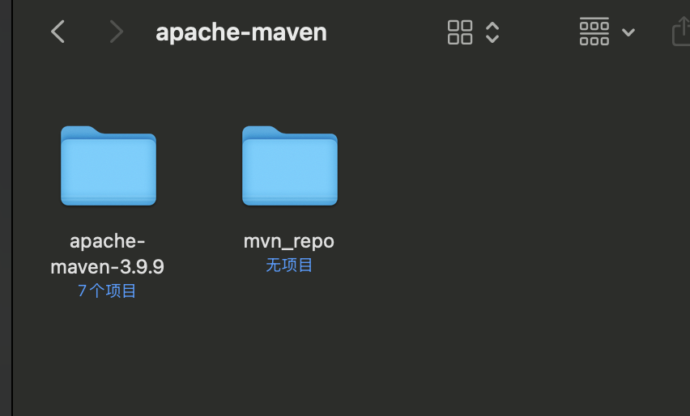
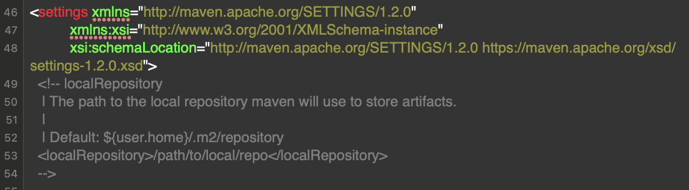
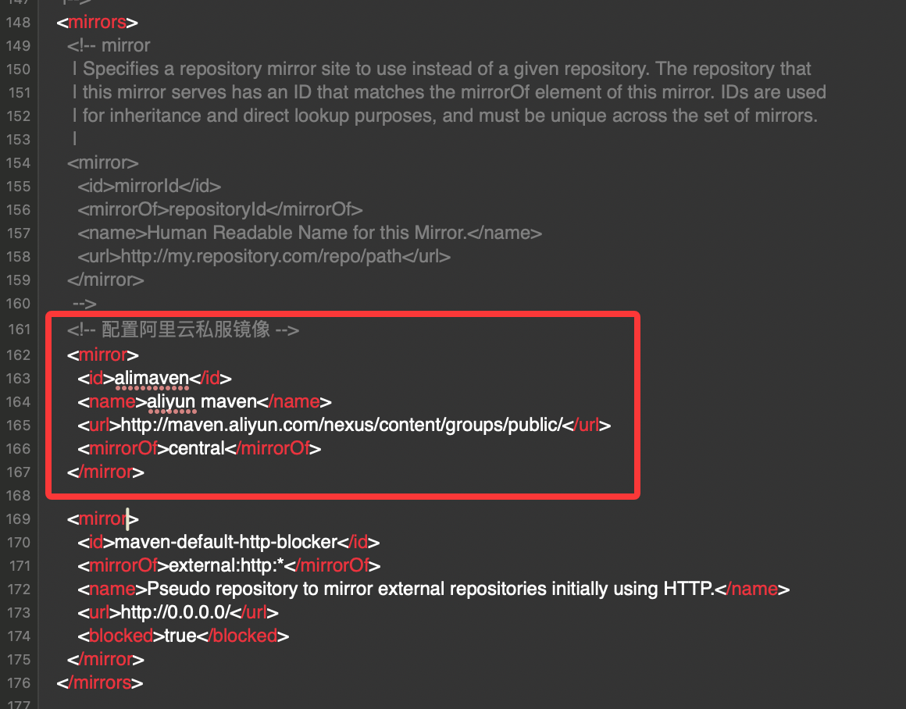
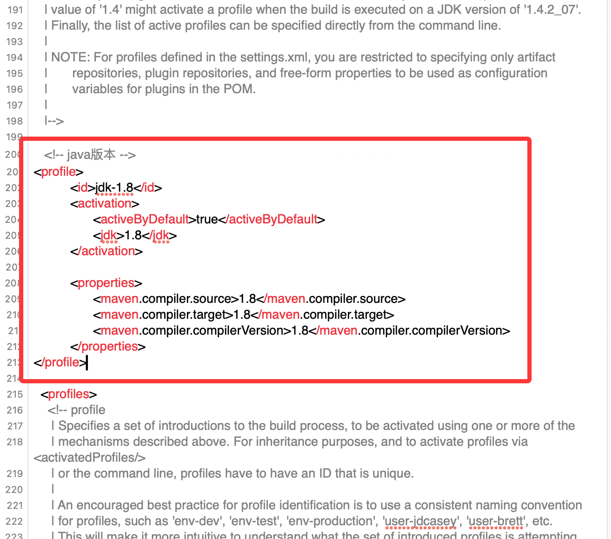
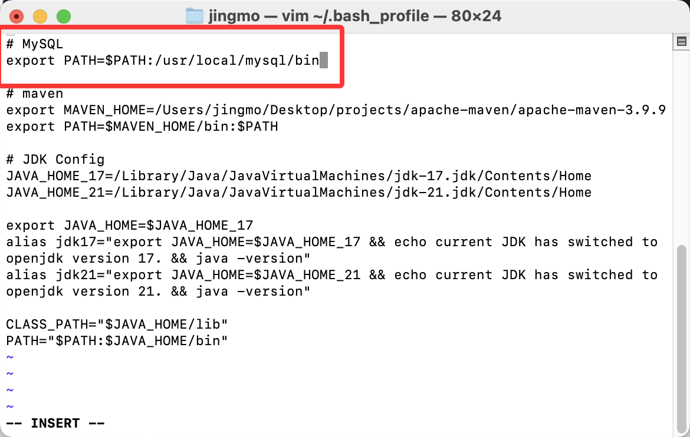

# JDK安装

## 安装JDK

在Oracle官网下载安装即可

> jdk17我放在了网盘，下载需要登录，好麻烦，其余的官网应该都可以直接下
>
> Jdk17下载网址：https://www.oracle.com/java/technologies/javase/jdk17-archive-downloads.html
>
> 百度网盘地址：: https://pan.baidu.com/s/1uOviDjf8a9E-oy7yV_rF3g 提取码: iyhi

## 配置环境变量

Mac中安装了多个版本的jdk时可以快速切换

（虽然我目前还不知道切换默认运行的jdk有什么用，毕竟idea中可以自己选择）

（Kimi说：系统默认的jdk主要用于命令行操作和那些没有明确指定 JDK 版本的外部工具或脚本）

（来源：https://blog.csdn.net/Lwehne/article/details/135867512）

1. 查看jdk安装目录

   - 注：`➜`后为执行命令后可能会返回的结果

   ```bash
   # 进入 JDK 安装目录
   cd /Library/Java/JavaVirtualMachines
    
   # 查看文件
   ls
   ➜  jdk-17.jdk	jdk-21.jdk
    
   # 查看路径
   pwd
   ➜  /Library/Java/JavaVirtualMachines
   
   ```

2. 配置环境变量文件

   ```bash
   # 进入当前用户的 home 目录
   cd /Users/xxx    xxx改为自己的电脑用户名称
   cd ~
    
   # 打开环境变量配置文件
   # 或者直接open也可以，更方便修改
   vi ～/.bash_profile
   ```

3. 修改配置文件

   - 配置文件中的`alias`定义的别名`jdk17`、`jdk21`是用来切换jdk版本的
   - 输入完之后按下`ESC`，然后输入`:wq`，保存退出

   ```bash
   # JDK Config
   JAVA_HOME_17=/Library/Java/JavaVirtualMachines/jdk-17.jdk/Contents/Home
   JAVA_HOME_21=/Library/Java/JavaVirtualMachines/jdk-21.jdk/Contents/Home
    
   export JAVA_HOME=$JAVA_HOME_17
   alias jdk17="export JAVA_HOME=$JAVA_HOME_17 && echo current JDK has switched to oracle jdk version 17. && java -version"
   alias jdk21="export JAVA_HOME=$JAVA_HOME_21 && echo current JDK has switched to openjdk version 21. && java -version"
    
   CLASS_PATH="$JAVA_HOME/lib"
   PATH="$PATH:$JAVA_HOME/bin"
   ```

4. 保存好之后执行生效命令

   ```bash
   # 配置文件立即生效
   source ~/.bash_profile
    
   # 生效之后即可查看是否配置成功
   # 验证：查看 JAVA_HOME 目录
   echo $JAVA_HOME
   ➜  /Library/Java/JavaVirtualMachines/jdk-17.jdk/Contents/Home
   
   
   # 查看 JDK 版本信息
   java -version
   ➜  Java(TM) SE Runtime Environment (build 17.0.12+8-LTS-286)
   Java HotSpot(TM) 64-Bit Server VM (build 17.0.12+8-LTS-286, mixed mode, sharing)
   ```

5. 快速切换jdk版本

   ```bash
   # 直接输入刚刚alias后的别名即可
   # 切换jdk21
   jdk21
   ➜		current JDK has switched to openjdk version 21.
       java version "21.0.7" 2025-04-15 LTS
       Java(TM) SE Runtime Environment (build 21.0.7+8-LTS-245)
       Java HotSpot(TM) 64-Bit Server VM (build 21.0.7+8-LTS-245, mixed mode, sharing)
   
   # 切换jdk17
   jdk17
   ➜ 	current JDK has switched to openjdk version 17.
       java version "17.0.12" 2024-07-16 LTS
       Java(TM) SE Runtime Environment (build 17.0.12+8-LTS-286)
       Java HotSpot(TM) 64-Bit Server VM (build 17.0.12+8-LTS-286, mixed mode, sharing)
   ```


# Maven安装

## 安装maven

直接在官网下载即可：https://maven.apache.org/download.cgi

## 配置环境变量

1. 打开环境变量文档

   ```bash
   # 像配置jdk时一样用vi也行
   open ～/.bash_profile
   ```

2. 在文档中加入配置

   ```bash
   # maven
   export MAVEN_HOME=/Users/jingmo/Desktop/projects/apache-maven-3.9.9
   export PATH=$MAVEN_HOME/bin:$PATH
   ```

3. 保存配置

   ```bash
   # 保存配置
   source ~/.bash_profile
    
   # 验证
   mvn -version
   ```

## 配置本地仓库

Maven 本地仓库充当了一个本地缓存的角色，它可以帮助你管理项目的依赖库，并确保构建过程的可靠性和高效性

1. 修改本地仓库

   - 我这里创建了一个名为`mvn_repo`的文件夹作为本地仓库

   

2. 修改设置

   - 路径为：`/apache-maven-3.9.9/conf/setting.xml`
   - 找到如图这一行，然后修改`localRepository`

   

   - 在54行后新增一行，路径修改为本地仓库的路径：

   ```xml
   <localRepository>/Users/xx/apache-maven/mvn_repo</localRepository>
   ```

## 配置镜像资源

不使用镜像资源下载包时会很慢，所以通常会使用如阿里的私服来下载包。

Maven 阿里云私服是用于在团队或组织内部管理和托管项目依赖库的工具，它可以提高构建速度、加强依赖管理、增强安全性和控制，并支持定制化配置和管理。

1. 打开`setting.xml`

2. 找到`<mirrors>`

3. 在mirror中加入如下代码，保存即可

   ```xml
   <!-- 配置阿里云私服镜像 -->
   <mirror>
     <id>alimaven</id>
     <name>aliyun maven</name>
     <url>http://maven.aliyun.com/nexus/content/groups/public/</url>
     <mirrorOf>central</mirrorOf>
   </mirror>
   ```

   

4. 可以通过`mvn help:system`命令查看是否配置成功

5. 如果你想配置jdk版本也可以再加一个

   (我没有加，我用的jdk17)

   ```xml
   <!-- java版本 --> 
   <profile>
   	  <id>jdk-1.8</id>
   	  <activation>
   		<activeByDefault>true</activeByDefault>
   		<jdk>1.8</jdk>
   	  </activation>
    
   	  <properties>
   		<maven.compiler.source>1.8</maven.compiler.source>
   		<maven.compiler.target>1.8</maven.compiler.target>
   		<maven.compiler.compilerVersion>1.8</maven.compiler.compilerVersion>
   	  </properties>
   </profile>
   ```

   

# MySQL安装

## 下载MySQL

官网下载对应版本即可

## 修改bash文件

```bash
# 打开
vim ~/.bash_profile

#修改完后运行
source ~/.bash_profile
# 查看版本
mysql --version
```


